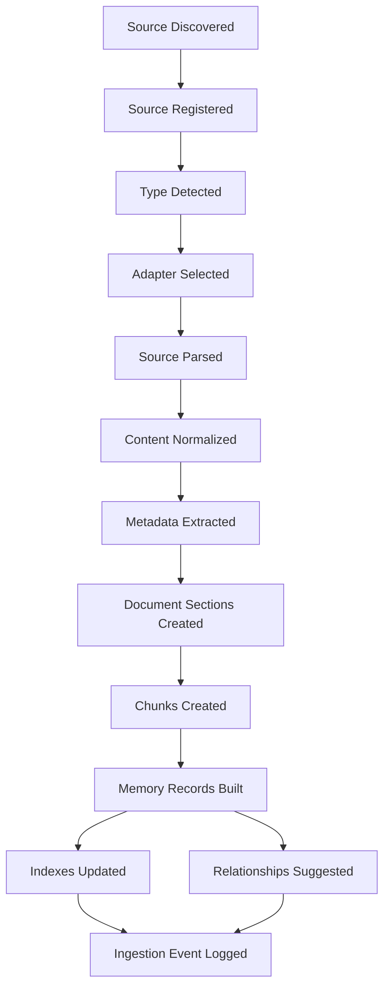
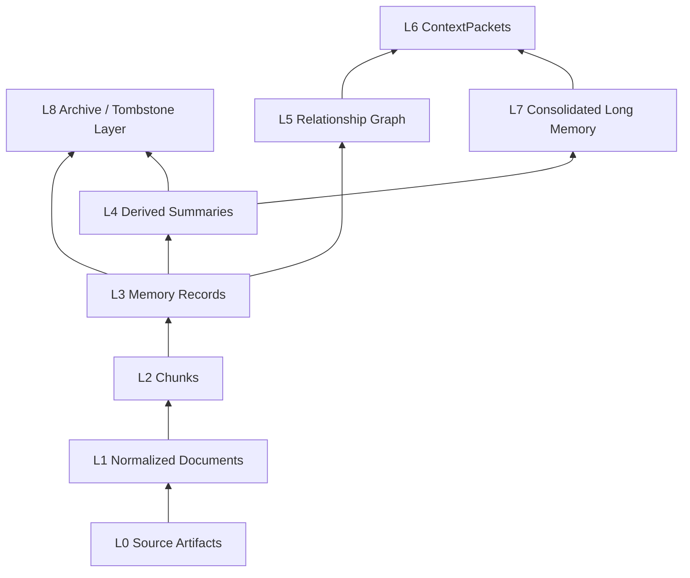
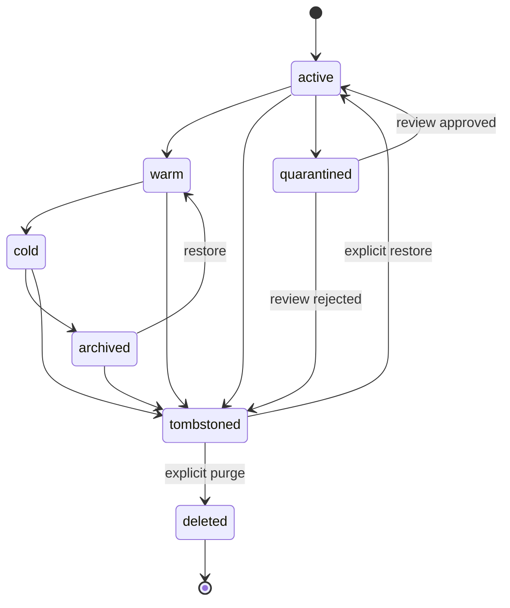
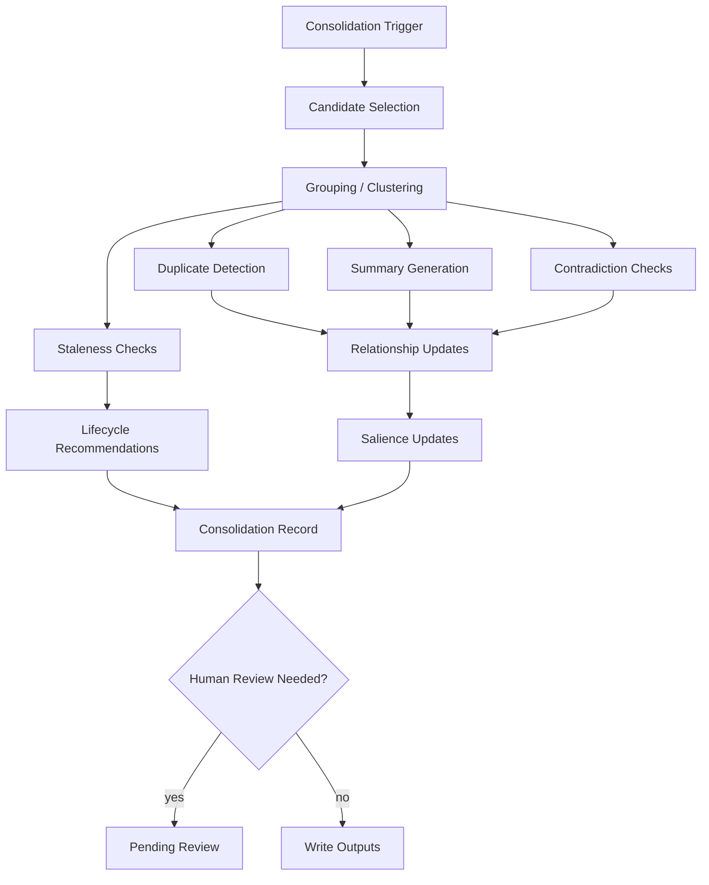
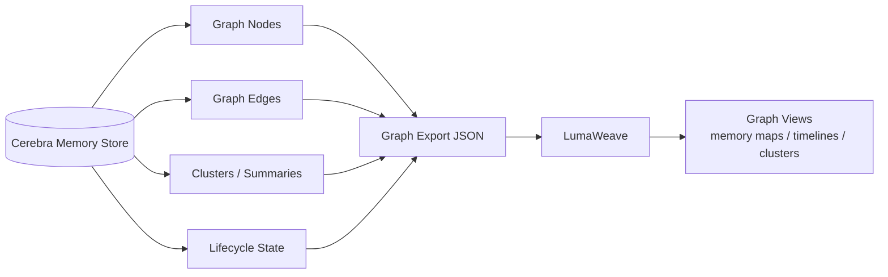
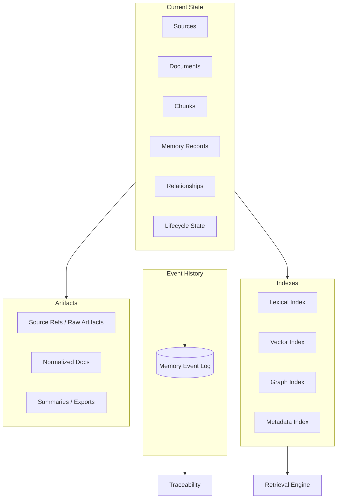

# Cerebra Classic — Design Specifications

Compressed archive of pre-build design specs, architectural exploration, policy-scout docs, brainstorm artifacts, and planning documents.
Sources: `docs/refined-runtime-model/` (top-level), `docs/policy-scout/`, `docs/brainstorm/` (recursive), `docs/planning/`.
Generated 2026-06-29.

---


<!-- source: docs/refined-runtime-model/CEREBRA_ARCHITECTURE.md -->

# Cerebra — Architecture

## 1. Purpose

This document defines Cerebra as a local-first cognitive runtime.

The previous memory-backend framing was useful but too narrow. This architecture keeps ingestion, retrieval, lifecycle, and graph export, but places them inside a broader runtime that can run configurable cognitive cycles.

---

## 2. System Spine

```text
Cycle Definition
  -> Runtime Planner
  -> Working Memory
  -> Retrieval / ContextPacket
  -> Cognitive Step Execution
  -> Signal Evaluation
  -> Clutch / Control Decision
  -> Memory Write
  -> Consolidation
  -> Prediction Update
  -> Graph Event Emission
```

---

## 3. High-Level Components

```text
Cycle Definition Registry
Cognitive Runtime
State Store
Working Memory Manager
Retrieval Engine
ContextPacket Builder
Capability Router
Signal Pipeline
Clutch Controller
Catalyst / Action Selector
Prediction Engine
Consolidation Engine
Memory Lifecycle Manager
Graph Event Writer
Source Ingestion System
LumaWeave Exporter
```

---

## 4. Cycle Definition Registry

Cerebra should run configurable cognitive cycles.

A cycle definition describes:

```text
cycle_id
purpose
agent roles
step order
allowed actions
input schema
output schema
metrics
memory scopes
tool/capability requirements
stop conditions
graph emission contract
```

Example cycle definitions:

```text
bonsai.ideation.v1
research_synthesis.v1
code_review.v1
planning_review.v1
decision_analysis.v1
```

Bons.ai becomes one cycle definition.

---

## 5. Cognitive Runtime

The runtime executes cycle definitions.

Responsibilities:

```text
load cycle config
initialize state
build ContextPackets
dispatch steps
collect outputs
evaluate metrics
update state
call clutch/controller
write memory events
emit graph-native events
stop or continue
```

The runtime is not hardcoded to one agent loop.

---

## 6. State Store

The state store owns durable runtime state.

State categories:

```text
cycle state
session state
working memory state
memory record state
retrieval trace state
evaluation state
prediction state
consolidation state
graph emission state
```

Use current-state tables for fast reads and event history for traceability.

---

## 7. Working Memory Manager

Working memory is a bounded contested space.

It tracks:

```text
active task
current goals
active hypotheses
selected memories
recent outputs
open contradictions
pending questions
interrupt candidates
```

Working memory is not just the LLM context window.

The context window is one rendering of working memory.

---

## 8. Retrieval Engine

The retrieval engine supports:

```text
lexical search
vector search
metadata filtering
graph expansion
summary retrieval
salience scoring
reranking
archive-aware retrieval
```

Retrieval returns candidate memory records with score components and trace.

---

## 9. ContextPacket Builder

The ContextPacket builder turns memory candidates into agent-ready context.

It includes:

```text
selected records
source provenance
working memory state
cycle instructions
procedural memory
uncertainties
token budget
retrieval trace
```

ContextPackets should be stored or summarized so users can inspect what agents saw.

---

## 10. Capability Router

The capability router chooses which cognitive capability or cycle step to invoke.

Examples:

```text
retrieve
summarize
critique
generate
compare
score
consolidate
branch
ask_question
write_graph_event
```

This is not a shell permission system.

Command safety belongs to Policy Scout if command execution becomes relevant.

---

## 11. Signal Pipeline

The signal pipeline converts outputs into structured metrics.

Signals may include:

```text
coherence
novelty
usefulness
specificity
contradiction
goal_alignment
confidence
surprise
progress_delta
retrieval_quality
context_fit
```

Signals should remain componentized.

Do not collapse early into one vague score.

---

## 12. Clutch Controller

The clutch is a reusable control primitive.

It reads state and signals, then returns an explainable control action.

Examples:

```text
accept
refine
critique
branch
explore
consolidate
pause
ask_user
retrieve_more
stop
```

The clutch should use:

```text
priority rules
multi-signal input
hysteresis
mode persistence
no-flapping behavior
```

---

## 13. Catalyst / Action Selector

The catalyst chooses cognitive transformation strategies under uncertainty.

Examples:

```text
exploration
refinement
disruption
analogy
structure
optimization
memory_integration
```

It can use bandit-style learning for non-critical strategy selection.

It should not override safety or user intent.

---

## 14. Prediction Engine

Cerebra should record predictions about its own outputs.

Prediction examples:

```text
expected coherence
expected improvement
expected user usefulness
expected retrieval relevance
expected need for consolidation
expected risk of goal drift
```

After a step, Cerebra records prediction error.

Prediction error becomes a learning signal.

---

## 15. Consolidation Engine

Consolidation converts episodic cycle history into durable semantic/procedural memory.

It creates:

```text
session summaries
project summaries
pattern notes
contradiction records
updated procedures
archive summaries
graph relationships
```

Consolidation may run after cycles or during quiescent periods.

---

## 16. Graph Event Writer

Cerebra emits graph-native records.

Events:

```text
CycleStarted
StepExecuted
ContextPacketBuilt
MemoryRetrieved
SignalEvaluated
ClutchDecisionIssued
PredictionMade
PredictionErrorRecorded
MemoryConsolidated
RelationshipCreated
CycleCompleted
```

LumaWeave consumes/visualizes these.

---

## 17. Async Runtime Boundary

Async behavior should be introduced in phases.

Initial v0.1:

```text
foreground cycle only
manual consolidation
manual retrieval
```

Later:

```text
background salience monitor
quiescent consolidation
interrupt candidates
stale memory detection
goal drift monitor
```

Avoid async complexity before the deterministic spine works.

---

## 18. Architecture Doctrine

Cerebra should be built around one senior-dev rule:

```text
Every cognitive action must leave behind structured state: input, context, output, signal, control decision, memory write, and graph event.
```

If a step cannot be inspected later, it is not mature enough for Cerebra.

---

<!-- source: docs/refined-runtime-model/CEREBRA_CATALYST.md -->

# Cerebra — Catalyst

## 1. Purpose

The catalyst is Cerebra's strategy and action selector under uncertainty.

Where the clutch is a *priority-rule controller* that maps signal state to typed control action via declarative cascades, the catalyst is a *bandit-driven multi-factor selector* that picks among cognitive strategies when no clear rule fires. The clutch handles known situations with known responses; the catalyst handles open situations where the system has to choose what to try.

The two primitives compose. The clutch decides "I should mutate strategy now." The catalyst decides "I should mutate to *this specific* strategy among the available options, weighted by what's worked before and what hasn't been tried lately."

This document defines the catalyst's scoring formula, the action vocabulary it selects over, the bandit integration, the diversity preservation discipline, and the integration points with the rest of the runtime.

---

## 2. Core Doctrine

The catalyst should be:

```text
bandit-driven
multi-factor-scored
diversity-preserving
chain-aware
weighted-random (not argmax)
confidence-ramping
safety-bounded
explainable
```

The catalyst is the place where the system tries things. It must explore enough to learn, exploit enough to make progress, and never lose access to actions that didn't perform well in the past — yesterday's failure may be tomorrow's success.

---

## 3. The Multi-Factor Scoring Formula

The catalyst's score for any candidate action is:

```text
score(action) = base_reward × chain_bonus × decay_factor × type_penalty × confidence_ramp
```

Each factor is bounded and explainable.

### 3.1 base_reward

Learned reward from the bandit. Mean reward this action has received in past selections, weighted by recency.

```text
base_reward = exponential_moving_average(past_rewards, decay=0.85)
range: [0, 1]
```

New actions (no past data) start at a neutral baseline (0.5) and ramp by the confidence factor.

### 3.2 chain_bonus

Reward for actions that have produced successful chains. If action A is frequently followed by action B in successful sequences, A earns a chain bonus.

```text
chain_bonus = 1 + (chain_success_rate × chain_weight)
range: [1, 1.5]
chain_weight default: 0.3
```

This is the catalyst's memory of *combinations that work*, not just individual actions that work.

### 3.3 decay_factor

Recency decay for actions that haven't been selected lately. Prevents the catalyst from getting stuck on early winners.

```text
cycles_since_last_selection = N
decay_factor = max(0.7, 1.0 - (N / decay_horizon))
decay_horizon default: 50 cycles
```

An action that hasn't been picked in 50 cycles still scores at 70% of its base. Never penalized below that floor — yesterday's loser is tomorrow's surprise.

### 3.4 type_penalty

Diversity preservation. If the catalyst has been picking actions of the same type repeatedly, similar-type actions get a penalty.

```text
recent_type_count = count of selections of this action's type in last K selections
type_penalty = max(0.5, 1.0 - (recent_type_count × type_pressure))
K default: 5
type_pressure default: 0.15
```

This is what keeps the system from converging on a narrow strategy band. Even if "refine" is the best-performing action, picking refine 5 times in a row triggers diversity pressure that makes "explore" or "branch" more attractive.

### 3.5 confidence_ramp

New actions get gentler scoring until enough samples exist to trust the data.

```text
samples = number of times this action has been selected and evaluated
confidence_ramp = min(1.0, samples / 10)
```

An action with 0 samples scores at 0% confidence — it relies entirely on its baseline. An action with 10+ samples scores at full confidence. Between 0 and 10, the ramp interpolates linearly.

---

## 4. Weighted-Random Selection

The catalyst does not pick the argmax. It samples from a weighted distribution over the candidate actions.

```text
weights = [score(action_i) for action_i in candidates]
selected = weighted_random_sample(candidates, weights)
```

This preserves exploration even after preferences form. The best-scoring action wins most of the time; the second-best wins sometimes; the lowest-scoring still has nonzero probability.

This is also what makes the catalyst safe to combine with the clutch. The clutch decides *whether* to mutate (deterministic policy); the catalyst decides *what* to mutate to (weighted-random sample). The combination has explainable structure plus exploratory freedom.

---

## 5. Action Vocabulary

The catalyst selects from action vocabularies declared by the cycle config. Vocabularies are per-cycle-config; what's available depends on what the cycle is doing.

For a Bons.ai-shaped ideation cycle:

```text
exploration       try a divergent direction
refinement        improve the current best
disruption        break from the current frame
analogy           bring in cross-domain mapping
structure         add formal scaffolding
optimization      tune existing parameters
memory_integration  retrieve and weave in prior context
self_optimize     adjust own scoring weights
```

For a planning cycle:

```text
decomposition     break the goal into sub-goals
constraint_check  validate against constraints
prerequisite_id   identify missing prerequisites
sequencing        determine order of operations
risk_assessment   identify failure modes
resource_estimate estimate required resources
```

For a debugging cycle:

```text
hypothesis_form   generate explanation candidates
trace_follow      walk through execution path
state_inspect     examine variable/memory state
diff_compare      compare working vs broken version
isolate           reduce to minimal reproducer
verify_assumption  test assumption that's underlying suspicion
```

Each vocabulary is declared in the cycle config. The catalyst loads the vocabulary when the cycle starts and selects from it.

---

## 6. Bandit Integration

The catalyst's `base_reward` and `confidence_ramp` are computed from a bandit primitive (see lattica-primitives §Bandit Selector). The bandit maintains per-arm statistics:

```text
arm_stats[action_id] = {
  count: int             # times selected
  total_reward: float    # sum of rewards received
  recent_rewards: [float]  # last N rewards for EMA
  last_selected_cycle: int  # cycle index of most recent selection
}
```

After every catalyst selection, the cycle evaluates the resulting step and computes a reward. That reward updates the arm stats.

```text
reward_computation = composite_score × confidence × signal_strength
```

This is the same signal-triangulator pattern used elsewhere in Cerebra. The catalyst's learning signal is high-quality because it's confidence-weighted — low-confidence wins teach the catalyst less than high-confidence wins.

---

## 7. Catalyst Invocation

The clutch invokes the catalyst when its rule cascade reaches a "select strategy" decision point.

```text
Clutch fires rule: failure_streak >= 2 and trajectory == "degrading"
Clutch action: ESCALATE
Clutch sub-action: invoke catalyst to select escalation strategy
  Catalyst loads vocabulary for current cycle config
  Catalyst computes scores for each candidate
  Catalyst weighted-samples and returns selection
  Cycle dispatches the selected action
```

The catalyst can also be invoked directly by the cycle runtime when no rule fires but the system needs to make a choice — e.g., at cycle start, the catalyst picks the initial strategy.

---

## 8. Safety Boundaries

The catalyst is exploratory. The leeway network (forthcoming) is the boundary enforcement.

```text
Catalyst sees the full vocabulary declared by the cycle config.
Catalyst scores candidates.
Before sampling, the leeway network filters the candidates:
  any candidate that violates current leeway grants is removed
  any candidate that would trigger constitutional revocation is removed
The catalyst samples from the remaining set.
```

This means the catalyst never has to know about safety. The catalyst's job is *what to try*; the leeway network's job is *what's currently permitted to try*. Two concerns, two layers, no interference.

If the leeway-filtered set is empty, the catalyst returns a `cannot_select` signal and the clutch falls back to a safe default.

---

## 9. Chain-Awareness

The catalyst tracks not just per-action stats but action *sequences*.

```text
chain_stats[(action_a, action_b)] = {
  count: int                # times this pair occurred in succession
  success_count: int        # times this pair led to a good cycle outcome
}

chain_success_rate(a, b) = chain_stats[(a, b)].success_count / chain_stats[(a, b)].count
```

When the catalyst is selecting the *next* action and a previous action was X, the chain_bonus boosts candidates Y such that (X, Y) has a high success rate.

This is how the catalyst learns *patterns*, not just *preferences*. "Exploration is usually best followed by refinement" emerges from chain stats; the catalyst doesn't need it pre-encoded.

---

## 10. Self-Optimization Action

One of the vocabulary entries deserves special treatment: `self_optimize`.

When the catalyst selects `self_optimize`, the resulting step doesn't produce a content output. Instead, it analyzes recent catalyst behavior and recommends adjustments to scoring weights:

```text
"The type_pressure has been over-correcting. We're switching strategies too often
 and not getting enough samples per strategy. Recommend reducing type_pressure
 from 0.15 to 0.10."
```

The cycle runtime can accept or reject these self-recommendations. If accepted, the catalyst's scoring weights update for future cycles.

This is the move that makes the catalyst self-improving in a deep sense. It's not just learning rewards for actions — it's learning the parameters of its own scoring function.

`self_optimize` is gated by the leeway network and should require multiple supporting signals to fire. It's not a default-frequent action.

---

## 11. Integration With Existing Components

**Clutch (`CEREBRA_COGNITIVE_RUNTIME.md`):** the clutch invokes the catalyst at "select strategy" decision points. The catalyst returns a sub-action; the clutch's outer action wraps it.

**Cycle Runtime (`CEREBRA_COGNITIVE_RUNTIME.md`):** the cycle config declares the catalyst's vocabulary. The runtime initializes the catalyst with cycle-specific arm stats.

**Signal Pipeline (`CEREBRA_PREDICTION_AND_EVALUATION.md`):** evaluation produces the reward that updates catalyst bandit stats. The signal-triangulator formula is the catalyst's learning signal.

**Leeway Network (forthcoming):** filters catalyst candidates before sampling. The catalyst sees only currently-permitted actions.

**Truth Tower (`CEREBRA_TRUTH_TOWER.md`):** catalyst selections become events in the cycle's history, which can be cited at T3 if the selection pattern itself becomes insight-worthy.

**SKU Addressing (`CEREBRA_SKU_ADDRESSING.md`):** catalyst behavior over time becomes a memory cluster — "what strategies has this system tried for this kind of query." This cluster gets its own SKU and becomes retrievable as procedural memory.

**Lattica Primitives:** the bandit selector at the catalyst's core is the same primitive used elsewhere. The catalyst is a *consumer* of the bandit primitive, not a replacement for it.

---

## 12. MVP Scope

Cerebra v0.1 should implement:

```text
Catalyst structure with the 5 scoring factors
Bandit integration for base_reward and confidence_ramp
Weighted-random sampling (not argmax)
Simple action vocabulary for one cycle config (default planning cycle)
type_penalty for diversity preservation
Manual catalyst invocation by clutch (no automatic firing)
Catalyst selection events emitted to graph
```

Cerebra v0.2 adds:

```text
Chain-awareness (chain_bonus factor)
Decay factor for recency
Multiple cycle configs with distinct vocabularies
Self-optimize action with manual approval
Catalyst integration with leeway network filter
```

Cerebra v0.3+:

```text
Self-optimize action with automatic acceptance for low-risk adjustments
Catalyst behavior memory cluster (procedural memory)
Cross-cycle catalyst learning (preferences from one cycle inform another)
Catalyst as bandit-arm-of-catalysts (meta-catalyst for cycle-config selection)
```

---

## 13. Testing Requirements

Catalyst tests should cover:

```text
scoring formula produces expected scores for known inputs
weighted-random sampling distributes correctly over many runs
type_penalty kicks in after N selections of same type
confidence_ramp prevents new actions from dominating
decay_factor keeps stale actions from falling below floor
chain_bonus increases scores for high-chain-success pairs
bandit stats update correctly after evaluation
leeway filter removes prohibited candidates before sampling
empty leeway-filtered set triggers cannot_select signal
self_optimize action produces parseable recommendations
catalyst events emit correctly
catalyst selection respects cycle config's vocabulary
```

---

## 14. Catalyst Doctrine

The clutch is the policy. The catalyst is the choice.

The clutch's rule cascade gives the system stable, explainable, debugging-friendly control behavior. But cognition is not only rule-following — sometimes the right move is "try something." The catalyst is the architectural primitive that does *trying* in a disciplined way.

The discipline comes from the multi-factor scoring: not just what's worked best (base_reward), but what hasn't been tried lately (decay), what's been overdone (type_penalty), what we don't yet have evidence for (confidence_ramp), and what tends to work in sequence (chain_bonus). Five factors, each addressing a different failure mode of pure greedy selection.

The weighted-random sampling is the discipline that makes the catalyst's exploration *durable*. An argmax catalyst converges. A weighted-random catalyst keeps wandering. Convergence feels efficient until you discover the local maximum it converged to wasn't the global one; wandering looks inefficient until you discover it was actually finding spaces you hadn't seen.

Combined with the clutch (which decides when to act) and the leeway network (which decides what's permitted), the catalyst is the *what to try* layer of a system that can think about hard problems without rigid prescription.

It is also where Bons.ai's most sophisticated existing logic lives. The bandit-blended chain-aware type-penalized scoring already in `catalyst.py` is the proof of concept. Cerebra inherits the pattern; the implementation gets cleaned and made primitive-shaped.

This is one of the load-bearing parts of the cognitive runtime. Get it right.

---

<!-- source: docs/refined-runtime-model/CEREBRA_COGNITIVE_RUNTIME.md -->

# Cerebra — Cognitive Runtime

## 1. Purpose

The runtime is what makes Cerebra more than a memory system.

It executes configurable cognitive cycles, manages state, builds context, evaluates outputs, controls iteration, writes memory, and emits graph-native events.

---

## 2. Core Doctrine

The runtime should be:

```text
configurable
stateful
inspectable
signal-driven
memory-aware
graph-native
bounded
testable
```

Do not hardcode Cerebra to one specific agent loop.

---

## 3. Cycle Definition

A cycle definition is a declarative or semi-declarative description of a cognitive process.

Fields:

```text
cycle_id
name
purpose
input_schema
output_schema
agent_roles
step_order
allowed_actions
memory_scopes
metrics
clutch_rules
catalyst_options
stop_conditions
graph_events
```

---

## 4. Example Cycle: Bons.ai Ideation

```yaml
cycle_id: bonsai.ideation.v1
purpose: Generate, critique, improve, and evaluate ideas.
roles:
  - generator
  - critic
  - improver
steps:
  - build_context
  - generate
  - critique
  - improve
  - evaluate
  - clutch_decision
  - memory_write
  - graph_emit
stop_conditions:
  - accepted
  - max_passes
  - user_stop
```

Bons.ai becomes a config loaded by Cerebra, not Cerebra itself.

---

## 5. Runtime Execution Flow

```text
load cycle definition
  -> create runtime session
  -> initialize working memory
  -> build ContextPacket
  -> execute step
  -> capture output
  -> evaluate signals
  -> record prediction/outcome
  -> issue clutch decision
  -> update working memory
  -> write memory/event records
  -> continue/branch/stop
```

---

## 6. Runtime Session

A runtime session tracks one execution of a cycle.

Session fields:

```text
session_id
cycle_id
user_goal
project
started_at
completed_at
status
current_step
working_memory_id
context_packet_ids
event_ids
graph_event_ids
```

---

## 7. Step Execution

Each step should have:

```text
step_id
step_type
input
ContextPacket
output
metrics
errors
duration
memory_writes
graph_events
```

No major step should be invisible.

---

## 8. Signal Pipeline

Signals convert outputs into structured metrics.

Signal categories:

```text
quality
coherence
novelty
specificity
goal_alignment
contradiction
confidence
retrieval_quality
context_fit
surprise
progress_delta
```

Signals are componentized.

---

## 9. Clutch Controller

The clutch decides what the runtime should do next.

Possible actions:

```text
accept
refine
critique
explore
branch
retrieve_more
consolidate
ask_user
pause
stop
```

Inputs:

```text
signals
working_memory_state
cycle_phase
recent trajectory
prediction error
user constraints
mode
```

Output:

```text
action
intensity
reason
confidence
cooldown/hysteresis metadata
```

---

## 10. Catalyst / Strategy Selector

The catalyst selects cognitive transformation strategies.

Examples:

```text
exploration
refinement
disruption
analogy
structure
optimization
memory_integration
self_optimize
```

Use bandit-style learning only for non-critical strategy optimization.

Do not let learned strategy selection override user intent or safety boundaries.

---

## 11. Branching

The runtime may branch when signals suggest divergent promising paths.

Branch controls:

```text
max_branches
branch_reason
branch_parent
branch_score
merge_policy
```

Branches are graph-native events.

---

## 12. Runtime Failure Behavior

Failures should preserve state.

Examples:

```text
agent step fails -> record StepFailed
retrieval fails -> continue with reduced context if safe
evaluation fails -> use default metrics and mark uncertainty
memory write fails -> buffer or stop depending on severity
graph export fails -> keep event in outbox
```

Do not silently drop failed steps.

---

## 13. MVP Runtime Scope

Cerebra v0.1 should implement:

```text
one cycle definition format
one simple built-in cycle
runtime session records
ContextPacket use
signal evaluation v0
clutch action v0
memory write events
graph event export
```

Bons.ai compatibility can be a v0.2 target unless it is easy to express as a config.

---

## 14. Runtime Doctrine

Cerebra's runtime should make cognition inspectable.

Every cycle should leave behind a trail:

```text
goal
context
action
output
signal
decision
memory
graph event
```

---

<!-- source: docs/refined-runtime-model/CEREBRA_CONSOLIDATION_ENGINE.md -->

# Cerebra — Consolidation Engine

## 1. Purpose

This document defines Cerebra's consolidation engine.

Consolidation is the process that turns accumulated records into useful, durable, lower-noise memory.

Without consolidation, Cerebra is just a searchable pile of chunks.

With consolidation, Cerebra can start to earn its name.

---

## 2. Core Doctrine

Consolidation should be:

```text
source-grounded
incremental
reversible where possible
confidence-aware
traceable
human-reviewable for high-impact changes
retrieval-improving
not destructive by default
```

Consolidation should never erase source truth.

---

## 3. What Consolidation Does

Consolidation may:

```text
detect duplicates
merge near-duplicates
summarize clusters
promote durable facts
detect contradictions
mark stale records
update salience
create relationship edges
create project summaries
create archive summaries
recommend lifecycle changes
```

---

## 4. What Consolidation Does Not Do

Consolidation should not:

```text
delete sources automatically
overwrite provenance
silently resolve contradictions
promote low-confidence claims as truth
tombstone user memory without policy/user action
hide uncertainty
```

---

## 5. Consolidation Flow

```text
trigger
  -> candidate selection
  -> grouping/clustering
  -> duplicate detection
  -> summary generation
  -> contradiction/staleness checks
  -> relationship updates
  -> salience updates
  -> lifecycle recommendations
  -> consolidation record
  -> optional human review
  -> write outputs
```

---

## 6. Consolidation Triggers

Triggers:

```text
after ingestion batch
after N new records
after project session
manual command
low retrieval quality signal
archive candidate detection
scheduled maintenance
before graph export
```

MVP should support manual and after-ingestion-batch consolidation.

---

## 7. Candidate Selection

Candidate selection should use:

```text
project
topic
entity
source
time window
high duplication
low salience
retrieval noise
user-selected group
```

Do not consolidate the whole vault by default.

---

## 8. Duplicate Detection

Duplicate signals:

```text
exact content hash
near text similarity
same source/section
same entity/topic
embedding similarity
same title/heading
same claim
```

Duplicate handling:

```text
keep best-supported record active
link duplicates
archive redundant copies
preserve provenance
```

---

## 9. Summary Generation

Summary types:

```text
document_summary
topic_summary
project_summary
session_summary
entity_summary
archive_summary
retrieval_card
```

Summaries should include:

```text
supporting_record_ids
source_ids
confidence
summary_method
created_at
```

A summary without supporting sources is not trusted memory.

---

## 10. Fact / Claim Promotion

Some memory can be promoted into durable statements.

Examples:

```text
Cerebra owns memory; LumaWeave owns visualization.
Policy Scout is optional safety/event source.
User prefers local-first systems.
```

Promotion requirements:

```text
multiple support signals or high-authority source
clear provenance
high confidence
not contradicted by newer source
```

Promoted claims should still link to support.

---

## 11. Contradiction Detection

Contradiction types:

```text
direct conflict
newer update supersedes older claim
different project boundary statements
conflicting user preference
conflicting implementation decision
```

Contradiction output:

```text
contradiction record
involved memory IDs
evidence
confidence
recommended resolution
```

Do not silently choose a winner unless policy says so.

---

## 12. Staleness Detection

Staleness signals:

```text
older than current project phase
contradicted by newer source
source marked deprecated
low recent access
outdated dependency/version reference
superseded decision
```

Stale memory can be:

```text
lower-ranked
marked stale
archived
summarized
linked to newer record
```

---

## 13. Salience Updates

Consolidation can update salience.

Signals:

```text
access frequency
recent retrieval use
user pin
source authority
project relevance
relationship centrality
summary inclusion
contradiction/staleness
```

Salience should remain component-based.

---

## 14. Relationship Updates

Consolidation can create/update graph edges.

Examples:

```text
supports
contradicts
duplicates
updates
derived_from
belongs_to
related_to
```

Edges should include:

```text
confidence
evidence
created_by
created_at
```

---

## 15. Lifecycle Recommendations

Consolidation may recommend:

```text
archive duplicate cluster
cool old project notes
tombstone false generated memory
restore archived memory due to renewed relevance
quarantine low-confidence import
```

Consolidation recommends. Lifecycle manager applies.

---

## 16. Consolidation Record

Each run should produce a record.

Example:

```json
{
  "consolidation_id": "con_123",
  "started_at": 1710000000,
  "completed_at": 1710000042,
  "trigger": "manual",
  "scope": {
    "project": "Cerebra",
    "records": 128
  },
  "outputs": {
    "summaries_created": 4,
    "relationships_created": 18,
    "duplicates_linked": 12,
    "lifecycle_recommendations": 6
  },
  "confidence": 0.84,
  "warnings": []
}
```

---

## 17. Human Review Boundaries

Human review should be required for:

```text
deletion
tombstoning high-salience memory
resolving major contradictions
promoting sensitive personal claims
large archive operations
source-of-truth changes
```

Automated consolidation can safely:

```text
suggest summaries
link duplicates
create low-risk relationships
recommend lifecycle changes
```

---

## 18. LLM Use in Consolidation

LLMs may help:

```text
summarize clusters
identify possible contradictions
draft retrieval cards
extract candidate claims
explain relationships
```

LLMs must not:

```text
delete source records
resolve high-impact contradictions alone
promote unsupported claims
hide uncertainty
```

LLM outputs should be marked as generated and linked to sources.

---

## 19. MVP Consolidation Scope

Cerebra v0.1 should support:

```text
manual consolidation command
duplicate detection by hash/text similarity
document summaries
project/topic summaries
archive retrieval cards
basic relationship creation
basic staleness marking
consolidation events
```

Contradiction detection can start simple.

---

## 20. Testing Requirements

Consolidation tests should cover:

```text
duplicate detection
summary source linking
archive retrieval card creation
relationship creation
stale marking
no source deletion
consolidation record creation
human-review boundary enforcement
```

---

## 21. Consolidation Doctrine

Consolidation is memory maintenance.

It should make retrieval better, context cleaner, and long-term memory more useful.

It should not pretend generated summaries are more authoritative than their sources.

---

<!-- source: docs/refined-runtime-model/CEREBRA_CONTEXT_PACKET_PROTOCOL.md -->

# Cerebra — ContextPacket Protocol

## 1. Purpose

The ContextPacket is Cerebra's main agent-facing output.

A ContextPacket is a structured bundle of memory selected for a specific task, query, agent, or context window.

It should answer:

```text
What should the agent know right now?
Where did this information come from?
Why was it selected?
How reliable is it?
What was omitted?
How much context budget remains?
```

---

## 2. Core Doctrine

ContextPackets should be:

```text
source-grounded
retrieval-traceable
budget-aware
agent-readable
human-inspectable
uncertainty-aware
graph-aware
persistent when useful
```

A ContextPacket is not just pasted text.

It is structured context with provenance and selection reasons.

---

## 3. ContextPacket Flow

```text
agent/task request
  -> retrieval plan
  -> candidate retrieval
  -> scoring/reranking
  -> context budget allocation
  -> packet assembly
  -> packet storage
  -> agent delivery
  -> optional user inspection
```

---

## 4. ContextPacket Schema

Example:

```json
{
  "context_packet_id": "ctxpkt_123",
  "schema_version": 1,
  "created_at": 1710000000,
  "task": {
    "task_id": "task_123",
    "query": "Plan the Cerebra retrieval architecture.",
    "agent": "local_planner",
    "project": "Cerebra"
  },
  "budget": {
    "max_tokens": 12000,
    "estimated_tokens": 8400,
    "reserved_tokens": 2000
  },
  "selected_memory": [],
  "summaries": [],
  "graph_context": [],
  "uncertainties": [],
  "excluded_candidates": [],
  "retrieval_trace_id": "trace_123"
}
```

---

## 5. Selected Memory Item

Each selected memory item should include:

```json
{
  "memory_id": "mem_123",
  "source_id": "src_123",
  "chunk_id": "chunk_123",
  "memory_type": "project_context",
  "title": "Cerebra is the memory runtime",
  "content": "Cerebra owns memory and retrieval; LumaWeave owns graph visualization.",
  "summary": "Project responsibility boundary.",
  "score": 0.91,
  "score_components": {
    "semantic": 0.74,
    "lexical": 0.3,
    "project": 1.0,
    "salience": 0.9
  },
  "why_selected": [
    "same project",
    "high semantic match",
    "high salience"
  ],
  "provenance": {
    "source_path": "docs/CEREBRA_PROJECT_SCOPE.md",
    "section": "Relationship to LumaWeave"
  }
}
```

---

## 6. Packet Sections

Recommended sections:

```text
task
budget
selected_memory
source_summaries
graph_context
procedural_notes
uncertainties
excluded_candidates
retrieval_trace
```

---

## 7. Source Summaries

Source summaries provide compact context.

Example:

```json
{
  "source_id": "src_123",
  "summary": "This document defines Cerebra's project scope and boundaries.",
  "supporting_memory_ids": ["mem_1", "mem_2"],
  "confidence": 0.92
}
```

---

## 8. Graph Context

Graph context includes nearby relationships.

Example:

```json
{
  "node_id": "mem_123",
  "neighbors": [
    {
      "target_id": "mem_456",
      "relationship": "supports",
      "confidence": 0.88
    }
  ]
}
```

Graph context should be bounded by token budget.

---

## 9. Procedural Notes

Procedural memory tells an agent how to work.

Examples:

```text
Do not treat Policy Scout as Cerebra's core.
Preserve source provenance in all memory records.
Use hybrid retrieval before graph expansion.
Do not overwrite source records during consolidation.
```

Procedural notes should be high-confidence and sparse.

---

## 10. Uncertainties

ContextPackets should include uncertainty notes.

Examples:

```text
Some source files failed parsing.
Vector index is stale.
Graph relationships are low-confidence.
Archive records were not searched.
```

This prevents false certainty.

---

## 11. Excluded Candidates

Sometimes it is useful to record what was not included.

Fields:

```text
memory_id
score
reason_excluded
token_cost
```

Reasons:

```text
low score
duplicate
outside project scope
archived
too large for budget
lower confidence than selected summary
```

---

## 12. Retrieval Trace Link

ContextPackets should reference the retrieval trace.

The trace records:

```text
query
retrieval modes used
candidate counts
scores
filters
reranking
budget decisions
```

This makes context-window viewing possible.

---

## 13. Agent-Facing Rendering

Cerebra may render ContextPackets into plain text for agents.

Suggested layout:

```text
# ContextPacket

## Task

## Critical Context

## Supporting Memory

## Source Summaries

## Procedural Notes

## Uncertainties

## Retrieval Trace Summary
```

The structured JSON should still be preserved.

---

## 14. Context Window Viewer

A future viewer should show:

```text
what memory was included
why it was included
what sources support it
what was omitted
token budget usage
retrieval path
graph neighbors
uncertainties
```

This is one of Cerebra's differentiating features.

---

## 15. Packet Lifecycle

ContextPackets may have lifecycle states:

```text
ephemeral
stored
summarized
archived
deleted
```

Not every packet needs permanent retention.

But packets that influenced major actions should be retained or summarized.

---

## 16. MVP ContextPacket

Cerebra v0.1 should support:

```text
task/query
selected records
source provenance
score components
token estimate
retrieval trace ID
plain text rendering
JSON rendering
```

Graph context and excluded candidates can be basic.

---

## 17. ContextPacket Doctrine

A good ContextPacket lets the user ask:

```text
Why did the agent know this?
Why did it not know that?
What memory did it rely on?
What source supports this?
```

That is the core of inspectable agent memory.

---

<!-- source: docs/refined-runtime-model/CEREBRA_DEV_ROADMAP_v8.1.md -->

# Cerebra — Development Roadmap v8.1

## Purpose

This roadmap defines the build sequence for Cerebra v0.1.

It supersedes the phase ordering in `CEREBRA_IMPLEMENTATION_PLAN.md`, which was written before the SKU, truth tower, leeway, signal epistemology, and inspector primitives were specified. The build order here integrates those primitives at the right points and places governance scaffolding before feature code.

The principle: **build the things that make every other thing inspectable, governable, and structurally safe first**. Feature code on top of weak foundations creates technical debt that compounds; feature code on top of strong governance produces code that stays maintainable indefinitely.

---

## Build Discipline

Three rules govern every phase:

```text
1. Every phase has a "done when" gate. No phase is complete without passing
   its gate. No subsequent phase starts until the gate passes.

2. Every phase produces tests as part of its scope. Phases without tests
   are not complete even if they "work."

3. Every phase emits inspector events. Code that runs silently is not
   complete even if it works correctly.
```

These rules are non-negotiable. They are what turn the prototype from "code that runs" into "code that can grow into v1.0."

---

## Phase 0 — Project Scaffolding and Governance

**Goal:** establish the floor that everything else builds on.

**Why first:** if you defer governance, you write code that ignores it. Then governance becomes a refactor instead of a foundation. The order here is the lever that makes the rest of the project maintainable.

**Tasks:**

```text
1. Create repository structure per CEREBRA_ARCHITECTURE.md §7
2. Set up pyproject.toml with Python 3.12+, no unnecessary dependencies
3. Set up pytest + coverage tooling
4. Set up linting (ruff) and formatting (black) with pre-commit hooks
5. Set up type checking (mypy) with strict mode
6. Create cerebra/_primitives/ directory and vendor the six Lattica primitives
7. Create cerebra/cognition/ module skeleton with __init__.py exposing
   the public API surface (even if empty for now)
8. Create vault initialization (cerebra/vault/init.py) — the cerebra init
   command and its directory structure
9. Set up SQLite schema migration framework (cerebra/storage/migrations.py)
10. Create the constitutional layer file format and load the v0.1 defaults
    (5 constitutional rules from CEREBRA_LEEWAY_NETWORK.md §12)
11. Create the leeway rule file format and load the v0.1 defaults
    (15 leeway rules from CEREBRA_LEEWAY_NETWORK.md §12)
12. Create the inspector event schema and SQLite event table
13. Create the NDJSON append-only event log infrastructure
14. Create CI workflow that runs lint + types + tests on every push
```

**Done when:**

```text
[ ] Repository structure matches the spec
[ ] Pre-commit hooks block bad commits
[ ] CI runs on push and fails on lint/type/test errors
[ ] `cerebra init <path>` creates a vault with all required directories
[ ] Vault contains: config.yaml, data/cerebra.db, artifacts/, indexes/,
    exports/, events/, leeway/, constitutional/
[ ] Constitutional and leeway YAML files load and validate
[ ] Inspector event infrastructure can emit and store an event
[ ] All six Lattica primitives are importable and have passing tests
[ ] Coverage report exists; coverage stays >=80% from here on
```

**Time estimate:** 2-3 working days for a focused solo developer with AI assistance.

---

## Phase 1 — Source Memory Foundation

**Goal:** reliable source ingestion with provenance preservation.

**Tasks:**

```text
1. Source registry table and operations (cerebra/sources/registry.py)
2. Content hashing (cerebra/sources/hashing.py)
3. File discovery (cerebra/sources/discovery.py)
4. Type detection with confidence (cerebra/sources/detector.py)
5. Markdown parser adapter (cerebra/ingest/adapters/markdown.py)
6. Text parser adapter (cerebra/ingest/adapters/text.py)
7. Normalization layer (cerebra/ingest/normalization.py)
8. Heading-based chunker for markdown (cerebra/ingest/chunking.py)
9. Memory record builder for source_chunk type (cerebra/memory/records.py)
10. Storage layer for sources, documents, chunks, records (cerebra/storage/sqlite_store.py)
11. Inspector events for every ingestion action
12. Idempotency check using content hash + parser version
13. CLI command: cerebra ingest <path>
```

**Done when:**

```text
[ ] `cerebra ingest ./docs` registers every markdown file
[ ] Sources have stable IDs based on content hash
[ ] Re-running ingest on unchanged files is a no-op (idempotency)
[ ] Chunks preserve heading path and source position
[ ] No orphan chunks (every chunk traces back to a source)
[ ] Inspector events emit for SourceRegistered, ChunkCreated, etc.
[ ] Tests cover happy path, malformed input, duplicate detection,
    modification detection
```

**Defer to later phases:** PDF, docx, JSON/YAML/CSV adapters. Markdown + text only for v0.1.

**Time estimate:** 2-3 days.

---

## Phase 2 — SKU Classifier and Addressing

**Goal:** every memory gets a SKU address at write time.

**Why early:** SKU is the substrate for everything above the raw chunks. If you defer it, you write retrieval code that doesn't use SKU and then refactor later.

**Tasks:**

```text
1. SKU data model and serialization (cerebra/cognition/sku.py)
2. The 16 cognitive categories table (cerebra/cognition/sku_categories.py)
3. The 16 relationship types table (cerebra/cognition/sku_relationships.py)
4. Single-pass SKU classifier with prompt + formula pairing
   (cerebra/cognition/sku_classifier.py)
5. Classifier metadata preservation (forward compat for ablation)
6. SKU storage as adjacent metadata on memory records
7. Inspector events: SKUAssigned with full classifier output
8. SKU validation (digit ranges, null handling)
9. Tests with known-content fixtures for classifier behavior
```

**Done when:**

```text
[ ] Every new memory record receives a SKU at write time
[ ] Classifier outputs per-category scores for all 16 categories
   (not just the top 3)
[ ] Classifier confidence is preserved per anchor position
[ ] SKU includes location digits (D1-D4 minimum), entry index (D7-D8),
    and provenance digit (D10)
[ ] D10 distinguishes observed vs synthesized vs consolidated
[ ] SKUs round-trip through serialization without data loss
[ ] Tests validate stable classification on unchanged content
[ ] Tests validate D10 enforcement (synthesized memories never tagged observed)
```

**Defer to v0.2:** D5/D6 temporal/novelty bands, multi-pointer fanout,
multi-prompt triangulation, calibration audits.

**Time estimate:** 2-3 days. The classifier prompt design is the load-bearing
work here.

---

## Phase 3 — Storage and Index Layer

**Goal:** memory persists; retrieval has indexes to work with.

**Tasks:**

```text
1. Complete SQLite schemas: sources, documents, chunks, memory_records,
   sku_assignments, lifecycle_states, events, graph_nodes, graph_edges
2. Artifact store for normalized documents (cerebra/storage/artifact_store.py)
3. Lexical index using SQLite FTS5 (cerebra/storage/lexical.py)
4. Vector index using a simple local strategy
   - For MVP: numpy + cosine similarity over an embedding table
   - Defer: Qdrant/LanceDB until volume demands it
5. Embedding generation (use sentence-transformers locally;
   no cloud APIs in v0.1)
6. Graph store using SQLite (cerebra/storage/graph_store.py)
7. Index freshness tracking (cerebra/storage/index_state.py)
8. Schema migration tooling (forward-only migrations)
9. Inspector events for all storage operations
```

**Done when:**

```text
[ ] Source/document/chunk/record persistence works
[ ] Lexical index returns matches for known queries
[ ] Vector index returns matches for semantic queries
[ ] Index freshness is queryable
[ ] Schema migration runs idempotently on existing vaults
[ ] Tests cover persistence round-trips, index freshness, migration
```

**Time estimate:** 3-4 days.

---

## Phase 4 — Retrieval and ContextPacket

**Goal:** retrieval through the SKU substrate, producing inspectable ContextPackets.

**Tasks:**

```text
1. Query planner (cerebra/retrieval/query_planner.py)
2. Query SKU construction (parse query, build partial SKU pattern)
3. The 6-step traversal:
   - Step 1: exact match
   - Step 2: partial match (D1+D2+D3, vary D4-D10)
   - Step 3: sibling pointer traversal (will be no-op until v0.2 fanout)
   - Step 4: 1-hop expansion (also requires fanout; placeholder for v0.1)
   - Step 5: bounded vector fallback
   - Step 6: trace annotation
4. Salience scoring with v0.1 component set
   (semantic, lexical, project, source authority, recency, confidence,
    lifecycle, user_pin per CEREBRA_SALIENCE_SCORING.md §15)
5. Reranker (deterministic, formula-based for v0.1)
6. ContextPacket builder (cerebra/retrieval/context_packet.py)
7. Plain text + JSON rendering of ContextPackets
8. Retrieval trace storage with full annotation
9. Inspector events for QueryReceived, RetrievalPerformed,
   each step completion, ContextPacketBuilt
10. CLI commands: cerebra search, cerebra context
```

**Done when:**

```text
[ ] `cerebra search "query"` returns scored candidates with paths
[ ] Every result includes retrieval_path annotation ("exact match on D1+D2")
[ ] `cerebra context "task"` produces a ContextPacket with provenance
[ ] ContextPackets render as both JSON and plain text
[ ] Retrieval traces persist and are queryable
[ ] Tombstoned/quarantined memory is excluded from default retrieval
[ ] Score components are visible per result
[ ] Tests cover exact match, partial match, vector fallback,
    tombstone exclusion, trace presence
```

**Time estimate:** 3-4 days.

---

## Phase 5 — Working Memory and Truth Tower (Skeletal)

**Goal:** the cognitive workspace exists with M4 working memory and minimal T1/T2 tower.

**Tasks:**

```text
1. Working memory data model with named slots
   (cerebra/cognition/working_memory.py)
2. Slot capacity defaults from CEREBRA_DRIFT_FIXES_v8.1.md §1
3. Attention item promotion/eviction logic
4. ContextPacket integration (working memory contributes to packet)
5. Truth tower data model with T1 and T2 only
   (cerebra/cognition/truth_tower.py)
6. PROMOTE operation (T1→T2 with salience threshold)
7. Manual EVICT operation (no auto-staleness propagation in v0.1)
8. One render format: chronological
9. Tower-to-ContextPacket projection
10. Inspector events for all attention and tower operations
```

**Done when:**

```text
[ ] Working memory tracks active goal, constraints, context, recent outputs
[ ] Capacity caps are enforced; user-pinned items non-evictable
[ ] T1 populates from retrieval results
[ ] T2 promotion respects salience threshold and citation requirement
[ ] Tower renders into ContextPackets via chronological format
[ ] Events emit for all working memory + tower operations
[ ] Tests cover capacity enforcement, promotion rules, eviction priority
```

**Defer to v0.2:** T3/T4/T5, staleness propagation, multi-render formats.

**Time estimate:** 2-3 days.

---

## Phase 6 — Signal Pipeline and Prediction Records

**Goal:** evaluate step outputs across the six perennial-thread signals; record predictions.

**Tasks:**

```text
1. Signal evaluation prompts (one per signal, per CEREBRA_SIGNAL_EPISTEMOLOGY.md §8)
   - COHERENCE checklist prompt
   - GROUNDEDNESS checklist prompt
   - GENERATIVITY checklist prompt
   - RELEVANCE checklist prompt
   - PRECISION checklist prompt
   - EPISTEMIC HUMILITY checklist prompt
2. Signal evaluator that runs prompts and aggregates scores
   (cerebra/cognition/signals.py)
3. Default weights table (from CEREBRA_SIGNAL_EPISTEMOLOGY.md §6)
4. Composition formula using the Lattica primitive triangulator
5. Per-cycle config weight overrides
6. Prediction record schema (cerebra/cognition/predictions.py)
7. Outcome record + prediction error computation
8. Prediction-error thresholds (noise/notable/severe per cycle config)
9. EvaluationPacket creation per step
10. Inspector events for SignalEvaluated, PredictionMade,
    PredictionResolved, PredictionErrorRecorded, PredictionSevereMiss
```

**Done when:**

```text
[ ] Every step produces an EvaluationPacket with all 6 signals scored
[ ] Composite computes via weighted mean
[ ] Triangulated reward computes via confidence × signal_strength
[ ] Per-cycle weight overrides work
[ ] Predictions persist with confidence and basis
[ ] Outcomes link to predictions and produce typed error records
[ ] Severe misses (|error| > 0.40) emit additional flag events
[ ] Tests cover formula correctness, weight override, threshold bands
```

**Time estimate:** 3-4 days. The signal prompts are the load-bearing work.

---

## Phase 7 — Leeway Network (Pre-Action Gate)

**Goal:** safety architecture in place before any cycle runs.

**Why now:** by Phase 7 you have all the things leeway needs to gate — retrieval, evaluation, working memory writes. Putting leeway in place now means every subsequent line of code already respects it. Putting it in later means refactoring everything.

**Tasks:**

```text
1. Leeway rule schema validation (cerebra/cognition/leeway.py)
2. Constitutional rule schema validation
3. Leeway rule loader (reads vault leeway/ directory at init)
4. Constitutional rule loader (reads vault constitutional/ directory at init)
5. Pre-action gate evaluation
   - Capability lookup
   - Condition evaluation
   - Revocation check (rule-level)
   - Constitutional revocation check
6. Candidate filtering for catalyst (defer until catalyst lands;
   build the API surface now)
7. cannot_select signal handling
8. Inspector events for LeewayGrantApplied, LeewayGrantDenied,
   LeewayRevocationFired, ConstitutionalBlock, LeewaySetEmpty
9. CLI commands: cerebra inspect leeway active, cerebra inspect constitutional
```

**Done when:**

```text
[ ] Default leeway set (15 rules) loads at vault init
[ ] Default constitutional set (5 rules) loads at vault init
[ ] Pre-action gate evaluates capabilities correctly
[ ] Constitutional rules override leeway grants when conditions match
[ ] LeewaySetEmpty signal raises when no candidates pass
[ ] Inspector renders active grants and recent decisions
[ ] Tests cover grant matching, revocation, constitutional override,
    empty-set handling
```

**Defer to v0.2:** post-action audit phase.

**Time estimate:** 2-3 days.

---

## Phase 8 — Cycle Runtime (Skeletal)

**Goal:** the runtime can load a cycle config and execute one step.

**Tasks:**

```text
1. Cycle definition schema (cerebra/cognition/cycle_config.py)
   per CEREBRA_DRIFT_FIXES_v8.1.md §2
2. Cycle config YAML loader with validation
3. Runtime session model (cerebra/cognition/session.py)
4. Step execution framework with mockable LLM calls for v0.1
5. The "simple.planning.v0" built-in cycle config
6. Step orchestration: build_context → execute → evaluate → record
7. Inspector events for CycleStarted, StepStarted, StepCompleted,
   StepFailed, CycleCompleted
8. CLI command: cerebra run-cycle <config> --goal <text>
```

**Done when:**

```text
[ ] Cycle config YAML loads and validates
[ ] `cerebra run-cycle simple.planning.v0 --goal "..."` executes one cycle
[ ] Cycle produces step outputs (mockable LLM is fine for now)
[ ] EvaluationPacket attaches to each step
[ ] Runtime session persists with full step history
[ ] Tests cover config loading, session lifecycle, step orchestration
```

**Time estimate:** 3-4 days.

---

## Phase 9 — Clutch and Catalyst (Minimal)

**Goal:** decisions flow through the proper primitives.

**Tasks:**

```text
1. Clutch primitive from cerebra/_primitives/clutch.py (already vendored)
2. Clutch rule definitions for simple.planning.v0 cycle config
3. Clutch action group enforcement (terminal/iterative/structural/social)
4. Catalyst skeleton with five scoring factors
   (cerebra/cognition/catalyst.py)
5. Bandit primitive integration for base_reward
6. Weighted-random sampling (not argmax)
7. Leeway filter integration before sampling
8. Catalyst vocabulary for simple.planning.v0
9. Inspector events for ClutchDecisionIssued, CatalystSelectionMade
```

**Done when:**

```text
[ ] Clutch evaluates rules and returns explainable decisions
[ ] First-match-wins semantics work correctly
[ ] Action grouping respected; rules declare their group
[ ] Catalyst scores candidates with all five factors
[ ] Weighted-random sampling never returns the same answer
    100% of the time on diverse runs
[ ] Leeway filter removes prohibited candidates before sampling
[ ] cannot_select signal handling triggers safe defaults
[ ] Tests cover scoring formula, sampling distribution, leeway integration
```

**Defer to v0.2:** chain_bonus, decay_factor, self_optimize action.

**Time estimate:** 2-3 days.

---

## Phase 10 — Consolidation v0

**Goal:** memory maintenance happens automatically after cycles.

**Tasks:**

```text
1. Consolidation engine skeleton (cerebra/memory/consolidation.py)
2. Duplicate detection (hash + text similarity)
3. Document summary creation
4. Project/topic summary creation
5. Archive retrieval card creation
6. SKU pointer rewriting when consolidation produces summaries
7. Calibration audit hook (placeholder; full implementation in v0.2)
8. Lifecycle recommendation generation
9. Inspector events for ConsolidationStarted, ConsolidationCompleted,
   SummaryCreated, DuplicateLinked
10. CLI command: cerebra consolidate --session <id>
```

**Done when:**

```text
[ ] Consolidation runs on demand
[ ] Duplicates link without source deletion
[ ] Summaries cite supporting records
[ ] SKU pointer rewrites work for consolidated content
[ ] Tests cover duplicate detection, summary support links, no-deletion
```

**Time estimate:** 2-3 days.

---

## Phase 11 — Lifecycle Manager

**Goal:** memory states transition correctly.

**Tasks:**

```text
1. Lifecycle state machine (cerebra/memory/lifecycle.py)
2. Active/archived/tombstoned/deleted-marker states for v0.1
   (warm/cold/quarantined deferred)
3. Tombstone-aware set primitive integration
4. State transition validation
5. Restore from archive operation
6. Inspector events for all transitions
7. CLI commands: cerebra archive, cerebra tombstone, cerebra restore
```

**Done when:**

```text
[ ] Archived memory retrieves via retrieval card only
[ ] Tombstoned memory is excluded from normal retrieval
[ ] Re-ingestion of tombstoned content is blocked
[ ] Restore from archive works
[ ] Lifecycle events emit and persist
[ ] Tests cover transition validity, tombstone re-ingestion block,
    retrieval exclusion
```

**Time estimate:** 1-2 days.

---

## Phase 12 — Graph Event Writer and Export

**Goal:** Cerebra emits structured graph data that LumaWeave can consume.

**Tasks:**

```text
1. Graph node and edge models (cerebra/graph/model.py)
2. Graph event outbox pattern (decouple emission from cycle execution)
3. NDJSON event writer per session
4. JSON graph export (cerebra/graph/export.py)
5. LumaWeave-compatible schema with provenance edges
6. CLI command: cerebra export graph --out <path>
```

**Done when:**

```text
[ ] Every cycle emits graph events to NDJSON file
[ ] `cerebra export graph` produces stable JSON with nodes + edges
[ ] Export includes provenance chains
[ ] Export includes lifecycle states
[ ] NDJSON file is line-atomic (LumaWeave can tail safely)
[ ] Tests cover event ordering, NDJSON validity, export schema
```

**Time estimate:** 1-2 days.

---

## Phase 13 — Inspector CLI Polish

**Goal:** the observability surface is genuinely useful for development and debugging.

**Tasks:**

```text
1. Implement all v0.1 inspector commands per CEREBRA_INSPECTOR.md §7
2. Pretty-text rendering with color and structure
3. JSON output flag (--json) for piping
4. Tail mode for live event streams
5. The "why was this retrieved" rendering (--explain flag)
6. Session, cycle, memory, retrieval, leeway sub-commands
7. Query command with event-type and signal-threshold filters
```

**Done when:**

```text
[ ] All v0.1 inspect commands work and produce useful output
[ ] --json flag produces parseable JSON
[ ] Tail mode streams new events as they emit
[ ] --explain on retrieval shows full path and reasoning
[ ] Tests cover command output structure
```

**Time estimate:** 2-3 days.

---

## Phase 14 — Integration Testing and Polish

**Goal:** the full spine works end-to-end with confidence.

**Tasks:**

```text
1. End-to-end test: ingest, run cycle, retrieve, export
2. Performance baseline measurements
3. Documentation pass on README and quickstart
4. Example vault with sample content
5. Bug fixes from integration testing
6. v0.1 release notes
```

**Done when:**

```text
[ ] End-to-end test passes from clean vault to graph export
[ ] Performance baseline documented (queries/sec, ingestion rate)
[ ] README walks a new user through their first 5 minutes
[ ] v0.1 git tag exists
[ ] All v0.1 success criteria from CEREBRA_MVP_SPEC.md §11 pass
```

**Time estimate:** 2-3 days.

---

## Total Time Estimate

```text
Phase 0 (Scaffolding):          2-3 days
Phase 1 (Source Memory):        2-3 days
Phase 2 (SKU Classifier):       2-3 days
Phase 3 (Storage/Index):        3-4 days
Phase 4 (Retrieval/Context):    3-4 days
Phase 5 (Working Memory+Tower): 2-3 days
Phase 6 (Signals/Predictions):  3-4 days
Phase 7 (Leeway):               2-3 days
Phase 8 (Cycle Runtime):        3-4 days
Phase 9 (Clutch/Catalyst):      2-3 days
Phase 10 (Consolidation):       2-3 days
Phase 11 (Lifecycle):           1-2 days
Phase 12 (Graph Export):        1-2 days
Phase 13 (Inspector Polish):    2-3 days
Phase 14 (Integration):         2-3 days
                                ----------
Total:                          32-47 days
```

For a focused solo developer with strong AI assistance: roughly 6-9 weeks of actual work, calendar-spread however life requires.

---

## What This Roadmap Deliberately Does Not Cover

**Frontend.** Separate project starting ~4 days post-v0.1 ship. Not in scope here.

**Advanced primitives (deferred to v0.2+):**
- Multi-pointer SKU fanout
- Truth tower T3/T4/T5
- Orthogonal ablation operations
- Re-injection loop temporal/structural parallel
- Leeway post-action audit
- Multi-prompt triangulation
- Catalyst chain-bonus and decay
- Calibration audits
- Self-improving retrieval bandit
- Synthesis at endpoint
- Continental modifier
- Dream/retrain integration

**Policy Scout integration.** Separate project; integrates via ingested events when both projects exist.

**LumaWeave integration depth.** Cerebra emits events; LumaWeave consumes. Cerebra does not embed LumaWeave logic.

---

## Roadmap Doctrine

The phases above are not arbitrary. They are ordered by *dependency* and *governance leverage*.

Phase 0 establishes the floor. Every subsequent phase respects that floor — events, tests, lint, governance scaffolding. Skipping Phase 0 doesn't speed things up; it slows everything down later because you refactor what should have been built right.

Phases 1-4 build the substrate: source memory, SKU, storage, retrieval. These are the layers everything else stands on.

Phases 5-9 build the cognitive runtime: working memory, signals, leeway, runtime, clutch/catalyst. This is where Cerebra earns its name.

Phases 10-14 close the loop: maintenance, lifecycle, export, observability, integration testing.

If a phase reveals a flaw in an earlier phase, fix the earlier phase first. Building forward on broken foundations compounds errors that take 10x longer to fix later than 1x to fix now.

**The prototype gate from `CEREBRA_PROTOTYPE_CHECKLIST.md` runs after Phase 8.**

Once Phase 8 completes, you have everything the prototype gate requires. Run it. If it passes, continue to Phase 9. If it doesn't, that's the signal something earlier was wrong; fix it before continuing.

Build the spine. Let it tell you what the plans got wrong. Update from evidence.

---

<!-- source: docs/refined-runtime-model/CEREBRA_DIAGRAM_MANIFEST.md -->

# Cerebra — Diagram Manifest

## Purpose

This manifest lists the individual Mermaid diagram source files for Cerebra.

These `.mmd` files can be rendered individually into SVG, PNG, or PDF.

## Diagram Files

| # | File | Purpose |
|---:|---|---|
| 1 | `01-cerebra-system-architecture.mmd` | Full Cerebra backend spine. |
| 2 | `02-source-ingestion-pipeline.mmd` | How raw sources become memory records. |
| 3 | `03-memory-layer-stack.mmd` | Layered memory model. |
| 4 | `04-hybrid-retrieval-flow.mmd` | Retrieval order and ContextPacket flow. |
| 5 | `05-contextpacket-assembly-flow.mmd` | Agent-ready context assembly. |
| 6 | `06-memory-lifecycle-state-machine.mmd` | Memory lifecycle transitions. |
| 7 | `07-consolidation-engine-flow.mmd` | Memory consolidation flow. |
| 8 | `08-graph-export-lumaweave-bridge.mmd` | Cerebra-to-LumaWeave graph export. |
| 9 | `09-state-governance-map.mmd` | Current state, events, indexes, artifacts. |
| 10 | `10-salience-scoring-components.mmd` | Component-based salience scoring. |

## Rendering Example

```bash
mmdc -i diagrams/01-cerebra-system-architecture.mmd -o docs/assets/diagrams/cerebra-system-architecture.svg
```

## Doctrine

Cerebra diagrams should show memory flow, provenance, retrieval, lifecycle, and graph export.

---

<!-- source: docs/refined-runtime-model/CEREBRA_DOC_INDEX.md -->

# Cerebra — Documentation Index

## 1. Purpose

This index explains the Cerebra documentation set and recommended reading order.

Cerebra is a **local-first cognitive runtime** that uses memory as one major subsystem. It is not Policy Scout. It is not LumaWeave. Bons.ai will eventually be expressible as one cycle configuration that Cerebra runs.

Cerebra runs configurable cognitive cycles, maintains durable state and memory, manages working context, evaluates signals, consolidates experience, learns from prediction error, and emits graph-native records.

---

## 2. Current Status

The Cerebra documentation set is **architecture-complete for v0.1**. Every primitive has a specification. Integration points are named. The MVP scope is bounded. The prototype gate is concretely defined.

Doc set version: **v8.1**
Document count: 26 Cerebra docs + 1 Lattica-suite doc

Next step: build the prototype gate and update docs from real implementation evidence. Do not keep planning indefinitely before proving the spine.

---

## 3. Recommended Reading Order

For a fresh reader (human or implementing agent), read in this order:

### 3.1 Foundation (start here)

```text
1. CEREBRA_PROJECT_SCOPE.md          what Cerebra is and what it owns
2. CEREBRA_ARCHITECTURE.md           the system spine and major components
3. CEREBRA_DOC_INDEX.md              this document
```

### 3.2 The Cognitive Runtime Layer (the differentiators)

```text
4. CEREBRA_COGNITIVE_RUNTIME.md      cycle definitions and runtime execution
5. CEREBRA_WORKING_MEMORY_AND_ATTENTION.md   contested working memory + slots
6. CEREBRA_TRUTH_TOWER.md            five-tier structured cognitive workspace
7. CEREBRA_CATALYST.md               multi-factor strategy selector
8. CEREBRA_REINJECTION_LOOP.md       cognitive continuity across context limits
9. CEREBRA_SIGNAL_EPISTEMOLOGY.md    the six perennial threads and core signals
10. CEREBRA_PREDICTION_AND_EVALUATION.md  predictions, outcomes, error learning
```

### 3.3 The Memory Substrate

```text
11. CEREBRA_MEMORY_LAYERS.md         M0-M10 layered memory model
12. CEREBRA_SKU_ADDRESSING.md        multi-pointer cognitive-shape addressing
13. CEREBRA_INGESTION_ARCHITECTURE.md   source-to-memory pipeline
14. CEREBRA_RETRIEVAL_ARCHITECTURE.md   layered hybrid retrieval
15. CEREBRA_CONTEXT_PACKET_PROTOCOL.md  agent-facing memory bundles
16. CEREBRA_SALIENCE_SCORING.md      component-based salience
17. CEREBRA_ORTHOGONAL_ABLATION.md   memory aspect attribution
18. CEREBRA_CONSOLIDATION_ENGINE.md  memory maintenance and synthesis
19. CEREBRA_MEMORY_LIFECYCLE.md      state transitions and tombstones
20. CEREBRA_GRAPH_MODEL.md           graph-ready memory structures
```

### 3.4 Governance and Safety

```text
21. CEREBRA_STATE_GOVERNANCE.md      state schema, events, versioning
22. CEREBRA_LEEWAY_NETWORK.md        permissions-shaped safety architecture
23. CEREBRA_INSPECTOR.md             observability surface and event log
```

### 3.5 Build

```text
24. CEREBRA_MVP_SPEC.md              v0.1 scope and definition of done
25. CEREBRA_IMPLEMENTATION_PLAN.md   build order with milestones
26. CEREBRA_PROTOTYPE_CHECKLIST.md   the prototype gate before MVP
27. CEREBRA_TESTING_STRATEGY.md      testing requirements
```

### 3.6 Cross-Suite

```text
28. LATTICA_PRIMITIVES.md            shared primitives across Lattica projects
```

### 3.7 Housekeeping

```text
- CEREBRA_DRIFT_FIXES_v8.1.md        surgical patches to existing docs
- CEREBRA_OPEN_QUESTIONS.md          resolved/remaining design questions
- CEREBRA_REPLACEMENT_MANIFEST.md    historical migration record
- CEREBRA_MATRICES.md                reference tables for implementation
- CEREBRA_SCENARIO_CARDS.md          example use cases
- CEREBRA_MERMAID_DIAGRAMS.md        diagrams catalog
- CEREBRA_DIAGRAM_MANIFEST.md        diagram metadata
- CEREBRA_VISUAL_PRODUCTION_PLAN.md  visual production guide
```

---

## 4. The Layered Architecture, At A Glance

```text
┌──────────────────────────────────────────────────────────────┐
│ Constitutional Layer (inviolable — see Leeway Network)       │
├──────────────────────────────────────────────────────────────┤
│ Capability Bounds (structural — what adapters exist)         │
├──────────────────────────────────────────────────────────────┤
│ Truth Tower Structural Rules (derivation discipline)         │
├──────────────────────────────────────────────────────────────┤
│ Leeway Network (conditional permissions)                     │
├──────────────────────────────────────────────────────────────┤
│                                                              │
│   ┌────────────────────────────────────────────────────┐    │
│   │ Cycle Runtime                                      │    │
│   │   - Cycle Definitions (Bons.ai as one config)      │    │
│   │   - Clutch (priority-rule controller)              │    │
│   │   - Catalyst (multi-factor strategy selector)      │    │
│   │   - Signal Pipeline (6 perennial threads)          │    │
│   │   - Prediction Layer (expected vs actual)          │    │
│   │   - Re-injection Loop (cognitive continuity)       │    │
│   └────────────────────────────────────────────────────┘    │
│                          ↕                                   │
│   ┌────────────────────────────────────────────────────┐    │
│   │ Truth Tower (M4.5 - derived workspace)             │    │
│   │   T5 Goal / T4 Hypotheses / T3 Insights /          │    │
│   │   T2 Memories / T1 Evidence                        │    │
│   └────────────────────────────────────────────────────┘    │
│                          ↕                                   │
│   ┌────────────────────────────────────────────────────┐    │
│   │ Working Memory (M4 - contested slots)              │    │
│   └────────────────────────────────────────────────────┘    │
│                          ↕                                   │
│   ┌────────────────────────────────────────────────────┐    │
│   │ Memory Substrate                                   │    │
│   │   M0 Sources / M1 Docs / M2 Chunks /               │    │
│   │   M3 Episodic / M5 Semantic / M6 Procedural /      │    │
│   │   M7 Predictive / M8 Graph /                       │    │
│   │   M9 Consolidated / M10 Tombstones                 │    │
│   └────────────────────────────────────────────────────┘    │
│                          ↕                                   │
│   ┌────────────────────────────────────────────────────┐    │
│   │ SKU Addressing (across all memory layers)          │    │
│   │   - 10-digit address: location + entry + tags      │    │
│   │   - Multi-pointer fanout                           │    │
│   │   - Cognitive-shape categories (16 quadrants)      │    │
│   │   - Self-improving retrieval                       │    │
│   └────────────────────────────────────────────────────┘    │
│                                                              │
├──────────────────────────────────────────────────────────────┤
│ Inspector (observability across all layers)                  │
├──────────────────────────────────────────────────────────────┤
│ Graph Event Emission (to LumaWeave)                          │
└──────────────────────────────────────────────────────────────┘
```

---

## 5. Project Laws

These laws guide every Cerebra implementation decision:

```text
1. Cerebra is a cognitive runtime, not just memory storage.
2. Cerebra owns memory, not visualization.
3. Cerebra is local-first by default.
4. Every memory needs provenance.
5. Retrieval must be layered, not vector-only.
6. Salience must be component-based.
7. Signals must derive from epistemological foundation, not arbitrary metrics.
8. Every cognitive action must be inspectable.
9. Consolidation must not erase source truth.
10. Synthesized memories must be distinguishable from observed memories.
11. Tombstones prevent accidental resurrection.
12. Safety is structural (capabilities + leeway), not procedural (rules-on-rules).
13. The constitutional layer is small (5-10 rules) and inviolable.
14. Graph export is derived from memory records.
15. Bons.ai is a cycle config, not the engine.
16. Policy Scout is optional source material, not Cerebra's core.
17. LumaWeave consumes Cerebra's events; Cerebra does not depend on LumaWeave.
```

---

## 6. Quick Reference — Which Doc Answers Which Question

**"How does Cerebra work overall?"** → ARCHITECTURE + PROJECT_SCOPE

**"What's a cycle and how does it run?"** → COGNITIVE_RUNTIME

**"How does the system decide what to do next?"** → COGNITIVE_RUNTIME §9 (Clutch) + CATALYST

**"How does the system pick strategies?"** → CATALYST

**"How does the system think for longer than a context window?"** → REINJECTION_LOOP

**"What does the system measure and why those things?"** → SIGNAL_EPISTEMOLOGY

**"How does the system learn from its own mistakes?"** → PREDICTION_AND_EVALUATION

**"How is memory addressed?"** → SKU_ADDRESSING

**"How does memory get categorized?"** → SKU_ADDRESSING §4 (16 cognitive categories)

**"How does retrieval work?"** → RETRIEVAL_ARCHITECTURE + SKU_ADDRESSING §11

**"How does the system score memory relevance?"** → SALIENCE_SCORING

**"How does the system know which aspects of a memory matter?"** → ORTHOGONAL_ABLATION

**"How does the system maintain memory over time?"** → CONSOLIDATION_ENGINE + MEMORY_LIFECYCLE

**"How does the system represent thinking-in-progress?"** → TRUTH_TOWER + WORKING_MEMORY_AND_ATTENTION

**"How is safety handled?"** → LEEWAY_NETWORK

**"How do I debug what the system did?"** → INSPECTOR

**"How does Cerebra connect to LumaWeave?"** → INSPECTOR §11 + GRAPH_MODEL §18

**"What do I build for v0.1?"** → MVP_SPEC + IMPLEMENTATION_PLAN

**"What's the first thing to build?"** → PROTOTYPE_CHECKLIST

**"What primitives are shared with other Lattica projects?"** → LATTICA_PRIMITIVES

---

## 7. Implementation Discipline

Before writing more docs, build the prototype gate.

The prototype is defined in `CEREBRA_PROTOTYPE_CHECKLIST.md`:

```text
ingest 3-5 markdown files
load one cycle definition
build one ContextPacket
run one mock cognitive step
score it with component signals
issue one clutch decision
write graph events
export tiny graph JSON
```

When this runs end to end, the spine is proven. Subsequent docs and architecture refinements should follow from what the prototype reveals.

---

## 8. Version History

```text
v1 - v7:    earlier ChatGPT iterations (deprecated; framing was RAG-shaped)
v8:         realignment to cognitive-runtime framing
            (PROJECT_SCOPE, ARCHITECTURE, MEMORY_LAYERS, MVP_SPEC, 
             IMPLEMENTATION_PLAN, DOC_INDEX replaced;
             COGNITIVE_RUNTIME, WORKING_MEMORY_AND_ATTENTION, 
             PREDICTION_AND_EVALUATION added)
v8.1:       cognitive primitives complete
            (SKU_ADDRESSING, ORTHOGONAL_ABLATION, TRUTH_TOWER,
             REINJECTION_LOOP, CATALYST, SIGNAL_EPISTEMOLOGY,
             LEEWAY_NETWORK, INSPECTOR added;
             DRIFT_FIXES patches; LATTICA_PRIMITIVES established;
             OPEN_QUESTIONS resolved)
v0.1:       (in progress) — prototype gate construction
```

---

## 9. Index Doctrine

This index is the navigation map. When new docs are added, this index is updated in the same commit. When the doc set drifts from this index, the index is wrong and must be updated.

Current entry point for any reader: read §3 in order. Diverge as needed for specific questions per §6.

Build the prototype.

---

<!-- source: docs/refined-runtime-model/CEREBRA_DRIFT_FIXES_v8.1.md -->

# Cerebra — Drift Fix Patches v8.1

## Purpose

This document consolidates small additions and corrections to existing Cerebra docs. These are surgical fixes — patches to apply, not full rewrites. Each section identifies the target doc, the section to update, and the specific text or specification to add.

The fixes here are >= 92% confidence. Lower-confidence items are flagged in `CEREBRA_OPEN_QUESTIONS.md` and need user input before landing.

---

## 1. Working Memory Slot Capacity Defaults

**Target:** `CEREBRA_WORKING_MEMORY_AND_ATTENTION.md` §4

**Add this subsection after the slot enumeration:**

### 4.1 Default Slot Capacities

Initial capacity defaults. These are arbitrary starting points; adjust based on real cycle behavior.

```text
Slot                  Capacity   Rationale
goal_slot             1          One active goal at a time. Multiple goals fragment focus.
constraint_slot       4          Active constraints rarely exceed four; more should be hierarchical.
context_slot          7          Miller's classic working-memory limit; tunable per cycle.
hypothesis_slot       3          Tracks multiple competing hypotheses without combinatorial blowup.
evidence_slot         5          Enough to triangulate, not enough to drown.
contradiction_slot    2          Surfaces real tensions without distracting from primary task.
recent_output_slot    2          Last two outputs for self-comparison and revision.
question_slot         3          Open questions the cycle is actively pursuing.
procedure_slot        4          Active procedural knowledge — how the work is being done.
interrupt_slot        3          Salience-monitor interrupt candidates pending review.

TOTAL: 34 maximum attention items
```

Per-cycle configs may override defaults. The Bons.ai ideation cycle might want hypothesis_slot=5 (more divergent ideas competing); a planning cycle might want constraint_slot=8 (more constraints to track).

**Eviction policy when capacity is reached:**

```text
1. user-pinned items: non-evictable
2. items cited by truth tower: eviction-resistant (penalty applied)
3. lowest-salience non-pinned item evicted first
4. tie: oldest item evicted
```

---

## 2. Cycle Definition Schema Pin

**Target:** `CEREBRA_COGNITIVE_RUNTIME.md` §3 (Cycle Definition)

**Replace the current prose with this formal schema:**

### 3. Cycle Definition Schema

Cycle definitions are YAML files with the following schema:

```yaml
# Required fields
cycle_id: string             # globally unique, dotted-path convention (e.g. "bonsai.ideation.v1")
name: string                 # human-readable name
purpose: string              # short purpose statement
schema_version: integer      # cycle schema version (currently 1)

# Required structural fields
agent_roles:                 # list of agent roles this cycle uses
  - role_id: string
    role_name: string
    description: string

step_order:                  # ordered list of step types
  - step_type: string
    optional: boolean        # default false
    repeatable: boolean      # default false

allowed_actions:             # vocabulary for the catalyst
  - action_id: string
    action_name: string
    group: enum [terminal, iterative, structural, social]

# Required signal fields
metrics:                     # which signals this cycle evaluates
  - signal_id: string
    weight: float            # contribution to composite (sum should ≈ 1.0)

clutch_rules:                # priority-ordered rule cascade
  - rule_id: string
    priority: integer
    guard_expression: string
    action: object
    explanation_template: string

# Required output fields
output_schema:               # what this cycle emits to memory
  memory_record_types: [string]
  graph_event_types: [string]

stop_conditions:             # when the cycle ends
  - condition_id: string
    expression: string

# Optional fields
memory_scopes:               # which memory layers this cycle reads/writes
  reads: [string]            # default: all active layers
  writes: [string]            # default: episodic + working

catalyst_options:            # catalyst configuration
  vocabulary: [string]       # action ids from allowed_actions
  scoring_overrides: object  # optional weight adjustments

max_continuations: integer   # cap for re-injection loops, default 5
max_recursion_depth: integer # cap for nested continuations, default 5
```

### 3.1 Schema Validation

Cycle definitions must validate before loading. Validation checks:

```text
all required fields present
metric weights sum to between 0.95 and 1.05
clutch rules have unique rule_ids
clutch rule priorities are unique
action groups are valid enum values
referenced step_types exist
referenced signal_ids exist
stop_conditions cover at least one terminal case
```

Cycle definitions fail-loud at load time. Invalid configs do not partially load.

---

## 3. Clutch Action Grouping

**Target:** `CEREBRA_COGNITIVE_RUNTIME.md` §9 (Clutch Controller)

**Add this subsection:**

### 9.1 Action Groups

The 10 clutch actions are grouped by what they do to the cycle. Rules declare which group they fire in to prevent overlap and interference.

**Terminal group** (ends or pauses the cycle):

```text
accept    cycle complete, output is final
stop      cycle aborted, no useful output
pause     cycle suspended, may resume
```

**Iterative group** (continues the cycle with adjustment):

```text
refine    improve current output, same approach
critique  challenge current output, may change approach
explore   diverge from current approach
retrieve_more  expand the working memory context
```

**Structural group** (changes the cycle's shape):

```text
branch    fork into multiple parallel cycle paths
consolidate  trigger consolidation on accumulated memory
```

**Social group** (involves the user or another agent):

```text
ask_user  pause for user input
```

### 9.2 Group Discipline

Rules in the clutch's priority cascade declare their target group. Two rules in the same group can compete on priority. Two rules in different groups *cannot directly compete* — group choice is the higher-level decision.

This means the clutch's rule cascade is implicitly two-pass:

```text
Pass 1: which group should this decision come from?
  Driven by overall cycle state — failure_streak, progress_delta, mode_duration
Pass 2: which action within that group?
  Driven by specific signals — coherence, novelty, confidence
```

Rules can be written to either pass. Most rules will be pass-2 (action within group). A small number of pass-1 rules establish which group dominates given the current cycle phase.

This structure prevents the rules-interfering-with-rules problem. Adding a refinement rule cannot interfere with a termination rule because they're in different groups.

---

## 4. Signal Composition Formula

> **⚠ SUPERSEDED:** This section is superseded by `CEREBRA_SIGNAL_EPISTEMOLOGY.md`.
> The 11-signal model below was an intermediate iteration. The canonical model is
> the six-signal epistemological architecture (COHERENCE, GROUNDEDNESS, GENERATIVITY,
> RELEVANCE, PRECISION, EPISTEMIC HUMILITY) grounded in the six perennial threads.
> Implementing agents should read `CEREBRA_SIGNAL_EPISTEMOLOGY.md` instead of this
> section. The composition formula structure (weighted mean × confidence × signal_strength)
> is preserved; only the signal vocabulary and weights differ.
>
> This section is retained for historical traceability but is **not** the spec.

**Target:** `CEREBRA_PREDICTION_AND_EVALUATION.md` §8 (Signal Pipeline)

**Add this subsection:**

### 8.1 Composite Formula

The composite score combines per-signal scores via weighted mean, then triangulates against confidence and signal strength.

```text
composite = Σ (signal_score_i × signal_weight_i) for i in signals
                where Σ signal_weight_i = 1.0

reward = composite × confidence × signal_strength
             range: [0, 1.0] (occasional overshoot to ~1.2 with positive shaping)
```

### 8.2 Default Signal Weights

Signals and their default weights for a general-purpose cycle. Per-cycle configs override:

```text
coherence            0.18
novelty              0.12
usefulness           0.20
specificity          0.10
contradiction        0.05   (penalty signal — negative contribution)
goal_alignment       0.20
confidence           (used as multiplier, not weighted-mean factor)
surprise             0.05
progress_delta       0.05
retrieval_quality    0.03
context_fit          0.02
                     ----
total                1.00
```

Two signals are excluded from the weighted mean and act as multipliers instead:

```text
confidence:        used in reward triangulation (composite × confidence × signal_strength)
signal_strength:   used in reward triangulation; derived from input data quality
```

### 8.3 Confidence and Signal Strength Bands

```text
confidence:        0.0 - 0.4   low (treat output as tentative)
                   0.4 - 0.7   moderate (proceed with care)
                   0.7 - 1.0   high (treat as reliable)

signal_strength:   0.0 - 0.5   weak (limited input data)
                   0.5 - 0.8   moderate (typical input)
                   0.8 - 1.0   strong (rich, validated input)
```

### 8.4 Calibration Audit

Signals are calibrated over time. The consolidation engine periodically reviews:

```text
predicted signal score vs actual signal score (when measurable)
per-signal systematic bias
per-signal variance vs claimed confidence
```

Calibration deltas adjust per-signal scoring formulas. This is the prediction-error feedback loop applied to the signal pipeline itself.

---

## 5. Prediction-Error Control Thresholds

**Target:** `CEREBRA_PREDICTION_AND_EVALUATION.md` §10 (Control Use)

**Replace §10 with this concrete specification:**

### 10. Control Use of Prediction Error

Prediction error feeds the clutch and catalyst as concrete signals with thresholds.

### 10.1 Thresholds

```text
absolute_error < 0.10:   noise band, no control adjustment
absolute_error 0.10-0.25: notable miss, soft adjustment
absolute_error 0.25-0.40: significant miss, moderate adjustment
absolute_error > 0.40:    severe miss, strong adjustment + flag for review
```

### 10.2 Adjustment Rules

When prediction error exceeds threshold, control feedback fires:

**Retrieval prediction error:**

```text
predicted retrieval_quality = 0.8, actual = 0.3 (large negative error)
  -> broaden retrieval next cycle (higher attention budget)
  -> lower salience for sources in this prediction's evidence chain
  -> log calibration delta for retrieval predictor
```

**Coherence prediction error:**

```text
predicted coherence = 0.7, actual = 0.4 (notable miss)
  -> next cycle's clutch favors `refine` over `accept`
  -> if pattern persists 3+ cycles, recommend mode change to refinement-heavy cycle
```

**Goal-alignment prediction error:**

```text
predicted alignment = 0.9, actual = 0.5 (severe miss)
  -> spawn continuation with explicit goal re-anchoring
  -> flag for user review (possible goal drift)
  -> calibration delta against goal-alignment predictor
```

**Novelty prediction error (over-prediction):**

```text
predicted novelty = 0.7, actual = 0.3
  -> catalyst type_pressure increased temporarily
  -> next selection favors actions in unexplored vocabulary regions
```

### 10.3 Worked Example

Cycle 14 of a planning session. Predictions and outcomes:

```text
predicted output_quality: 0.78
actual output_quality:    0.54
absolute_error:           0.24  (in the notable-miss band)
interpretation:           "overestimated planning step quality"

Adjustments:
  clutch: shift toward `refine` for next step
  catalyst: increase confidence_ramp threshold for current strategy
  calibration: log -0.24 delta against output_quality predictor
```

### 10.4 Severe Miss Handling

Errors above 0.40 trigger additional behavior:

```text
log to inspector with severity flag
emit graph event PREDICTION_SEVERE_MISS
if 3+ severe misses in last 10 cycles: pause cycle and request user review
do not auto-adjust scoring weights from a single severe miss
   (require pattern across multiple cycles to change scoring)
```

The pattern requirement is the discipline that prevents single-event overcorrection.

---

## 6. Multi-Prompt Triangulation Pattern

**Target:** `CEREBRA_PREDICTION_AND_EVALUATION.md` (new section after §8)

**Add this subsection:**

### 8.5 Multi-Prompt Triangulation

For high-stakes evaluation (high-salience memories, decisions with downstream impact, user-pinned content), the signal pipeline runs multiple narrower prompts instead of one wide prompt, then triangulates.

### Pattern

```text
Instead of one prompt asking for all 11 signal scores in one call:
  Run 3-4 prompts, each asking for a related signal group
  Compare scores across prompts for the same signal
  Signals where all prompts agree: high confidence
  Signals where prompts diverge: low confidence
```

### Signal Groups

```text
Quality group:       coherence + specificity + usefulness
Novelty group:       novelty + surprise + retrieval_quality
Alignment group:     goal_alignment + context_fit + contradiction
Progress group:      progress_delta + signal_strength
```

Each group is one prompt. Confidence emerges from cross-prompt agreement.

### When to Triangulate

```text
Always:    user-pinned content evaluation
Always:    memories being promoted to semantic memory
Always:    high-stakes clutch decisions (terminal group actions)
Optional:  routine cycle steps (cost vs benefit tradeoff)
```

Triangulation triples evaluation cost. Apply it where it earns its keep.

---

## 7. Prompt-Formula Awareness

**Target:** `CEREBRA_COGNITIVE_RUNTIME.md` (new section)

**Add this subsection:**

### 8.6 Prompt-Formula Mutual Awareness

Evaluation prompts and the formulas that consume their outputs should be mutually aware. This is a discipline that improves calibration.

### Prompt-Side Awareness

LLM prompts that produce metric scores should know:

```text
the scale they're scoring on (0-10 or 0-1)
the weight their score will receive in the composite
whether confidence will multiply their score
what "high" and "low" mean operationally for this metric
```

Example prompt fragment:

```text
Score coherence on a 0-10 scale.
Your coherence score contributes 18% of the composite.
A 7+ here suggests refinement is unnecessary.
A 4 or below triggers a critique cycle.
Be specific: cite which sentences cohere and which don't.
```

This calibrates the LLM's judgment toward the consumer's needs. Without this, prompts produce miscalibrated scores that the formula then weighs as if they were calibrated.

### Formula-Side Awareness

Formulas should preserve metadata about which prompt produced which input:

```text
metric_input: {
  signal: "coherence",
  score: 7.2,
  source_prompt_id: "coherence_eval_v3",
  source_prompt_version: 3,
  confidence_self_reported: 0.74
}
```

This makes calibration audits possible. If prompt v2 consistently underscores compared to prompt v3, the consolidation engine can detect and flag it.

---

## 8. SKU Cross-References in Existing Docs

The following existing docs should add cross-references to `CEREBRA_SKU_ADDRESSING.md`:

**`CEREBRA_RETRIEVAL_ARCHITECTURE.md`:** Add to §2 (Core Doctrine):

```text
All retrieval modes operate over the SKU-addressed substrate.
SKU is the precondition for efficient retrieval, not a fifth retrieval mode.
See CEREBRA_SKU_ADDRESSING.md for address shape and traversal.
```

**`CEREBRA_MEMORY_LAYERS.md`:** Add to §2 (Core Memory Doctrine):

```text
Every memory record at M2 and above carries a SKU at write time.
Memory addressing is uniform across layers; subcategory schemas vary by layer.
```

**`CEREBRA_CONSOLIDATION_ENGINE.md`:** Add to §5 (Consolidation Flow):

```text
Consolidation rewrites SKU pointers when summaries are produced.
Consolidation runs calibration audits on the classifier.
Consolidation triggers orthogonal ablation for promoted memories.
See CEREBRA_SKU_ADDRESSING.md §10 (pointer staleness) and
CEREBRA_ORTHOGONAL_ABLATION.md §6 (ablation scheduling).
```

**`CEREBRA_SALIENCE_SCORING.md`:** Add two new components to §4 (Salience Components):

```text
sku_sibling_distance:        closer in SKU space = higher salience for related queries
attribution_aligned_match:   query's match position aligned with memory's high-attribution position
```

---

## 9. Internal Cognition Module Boundary

**Target:** `CEREBRA_ARCHITECTURE.md` (new section)

**Add this subsection:**

### 19. Internal Cognition Module

Cerebra's cognitive primitives — clutch, catalyst, signal pipeline, truth tower, re-injection loop, salience scoring, prediction layer — are organized as an internal module with a clearly bounded public API:

```text
cerebra/
  cognition/
    __init__.py       # public API surface
    clutch.py
    catalyst.py
    signals.py
    truth_tower.py
    reinjection.py
    salience.py
    predictions.py
    _internal/        # implementation details, not part of public API
```

### 19.1 API Boundary Discipline

Other parts of Cerebra access cognitive primitives *only* through `cerebra.cognition`'s public API. The internal layer can be refactored freely without affecting other Cerebra modules.

### 19.2 Future Extraction

When the cognitive primitives stabilize (estimated 6-12 months of use), the `cerebra.cognition` module will be extracted into its own package: `lattica-cognition`. The eventual dependency graph:

```text
lattica-primitives    (small, stable, ubiquitous: clutch, triangulator, etc.)
       ↑
lattica-cognition     (cognitive harness: truth tower, re-injection, leeway, etc.)
       ↑
cerebra               (memory runtime built on lattica-cognition)
       ↑
bonsai (config)       (cycle config that Cerebra runs)
```

Until extraction, the internal module discipline approximates the eventual package boundary. This means the eventual extraction is mechanical, not a refactor.

### 19.3 What's In vs Out of cerebra.cognition

**In:**

```text
clutch, catalyst (the control primitives)
signal pipeline + composite formula
truth tower (tier structure, derivation, render formats)
re-injection loop (continuation bundles, voice modes)
salience scoring (component-based)
prediction layer (predictions, outcomes, calibration)
```

**Out (Cerebra-internal, not cognition):**

```text
ingestion adapters
storage (SQLite, vector index)
retrieval engine
ContextPacket builder
consolidation engine
memory lifecycle
graph export
```

The split is *primitives* (in cognition) vs *infrastructure* (in Cerebra). Cognition uses infrastructure through the public API.

---

## 10. Self-Improving Retrieval Reference

**Target:** `CEREBRA_COGNITIVE_RUNTIME.md` (add to §10 Catalyst section)

**Add this paragraph:**

### 10.1 Retrieval Strategies as Bandit Arms

Retrieval strategies (defined in `CEREBRA_SKU_ADDRESSING.md` §12) are catalyst-selectable actions. The cycle's clutch can issue an "adjust retrieval strategy" decision; the catalyst selects among the available retrieval strategy arms based on past performance for similar queries.

This means Cerebra learns to retrieve better over time. The same machinery that learns which cognitive strategies work (catalyst) also learns which retrieval strategies work. The pitch property: **a memory system with built-in self-improvement on the retrieval side.**

See `CEREBRA_SKU_ADDRESSING.md` §12 for the strategy space and `CEREBRA_CATALYST.md` for the selection mechanics.

---

## 11. Drift Fix Doctrine

These are surgical patches. The intent is to land small additions and corrections without rewriting working docs.

Each patch is independent. They can be applied in any order, though some have implicit dependencies (the clutch action grouping helps the cycle definition schema; the signal composition formula helps the prompt-formula awareness).

After these patches land, the planned-doc backlog drops to the lower-confidence items: Leeway Network, Inspector, Lattica Primitives package spec. Those need user input before writing.

---

<!-- source: docs/refined-runtime-model/CEREBRA_GRAPH_MODEL.md -->

# Cerebra — Graph Model

## 1. Purpose

This document defines Cerebra's graph-ready memory model.

Cerebra is not the graph viewer. LumaWeave owns graph visualization.

Cerebra owns the memory graph data:

```text
nodes
edges
relationship confidence
provenance
lifecycle state
retrieval relevance
```

The graph model should support retrieval, consolidation, inspection, and export.

---

## 2. Core Doctrine

The graph should be:

```text
source-grounded
confidence-aware
typed
queryable
exportable
lifecycle-aware
retrieval-useful
not visualization-specific
```

The graph exists to improve memory and make relationships inspectable.

It should not be designed only for pretty layouts.

---

## 3. Graph Responsibilities

Cerebra's graph model should support:

```text
entity relationships
source relationships
memory record relationships
topic clusters
project boundaries
summary support links
contradictions
duplicates
updates/supersession
retrieval expansion
LumaWeave export
```

---

## 4. Node Types

Initial node types:

```text
Source
Document
Chunk
MemoryRecord
Summary
Entity
Topic
Project
RelationshipClaim
ContextPacket
ArchivePackage
ScoutReport
```

Policy Scout appears only as an optional source type through `ScoutReport` or structured imported reports.

---

## 5. Edge Types

Initial edge types:

```text
CONTAINS
DERIVED_FROM
MENTIONS
SUPPORTS
CONTRADICTS
DUPLICATES
UPDATES
SUPERSEDES
BELONGS_TO
RELATED_TO
PART_OF
SUMMARIZES
USED_IN_CONTEXT
ARCHIVED_AS
RESTORED_FROM
```

Each edge should include:

```text
edge_id
source_node_id
target_node_id
edge_type
confidence
evidence
created_by
created_at
lifecycle_state
```

---

## 6. Source and Provenance Edges

Source provenance must be explicit.

Examples:

```text
Source CONTAINS Document
Document CONTAINS Chunk
MemoryRecord DERIVED_FROM Chunk
Summary SUMMARIZES MemoryRecord
```

No memory record should exist without a path back to source, unless it is explicitly marked as user-authored or system-generated.

---

## 7. Entity Nodes

Entities may include:

```text
person
project
tool
library
file
module
concept
organization
package
command
agent
system
```

Entity extraction should be confidence-aware.

Do not overtrust auto-extracted entities.

---

## 8. Topic Nodes

Topics represent thematic clusters.

Examples:

```text
hybrid retrieval
memory lifecycle
context windows
graph export
Policy Scout integration
LumaWeave bridge
```

Topic nodes can be created by:

```text
manual tagging
clustering
consolidation
summarization
user annotation
```

---

## 9. Project Nodes

Project nodes help scope memory.

Examples:

```text
Cerebra
LumaWeave
Policy Scout
Bons.ai
Echoes of the Glade
```

Project-scoped retrieval should prefer memories connected to the active project.

---

## 10. Summary Support Graph

Summaries should link to supporting records.

Example:

```text
ProjectSummary SUMMARIZES MemoryRecord A
ProjectSummary SUMMARIZES MemoryRecord B
ProjectSummary DERIVED_FROM Source C
```

This prevents summaries from becoming unsupported claims.

---

## 11. Contradiction Graph

Contradictions should be first-class.

Example:

```text
MemoryRecord A CONTRADICTS MemoryRecord B
```

Contradiction edge fields:

```text
confidence
reason
detected_by
review_status
preferred_record_id optional
```

Do not silently resolve major contradictions.

---

## 12. Duplicate Graph

Duplicates should be linked, not blindly deleted.

Example:

```text
MemoryRecord A DUPLICATES MemoryRecord B
```

Duplicate edge fields:

```text
similarity
method
confidence
canonical_record_id optional
```

Consolidation may recommend archiving duplicates.

---

## 13. Update / Supersession Graph

When newer memory updates older memory:

```text
MemoryRecord Newer UPDATES MemoryRecord Older
MemoryRecord Newer SUPERSEDES MemoryRecord Older
```

This helps retrieval prefer current records while preserving history.

---

## 14. Graph Confidence

Graph confidence should be explicit.

Confidence levels:

```text
low
moderate
high
confirmed
```

Numeric confidence can also be stored:

```text
0.0 to 1.0
```

Graph retrieval should prefer high-confidence edges unless the query asks for exploratory context.

---

## 15. Graph Lifecycle

Graph nodes and edges should respect lifecycle state.

States:

```text
active
warm
cold
archived
tombstoned
deleted
quarantined
```

Normal retrieval should exclude tombstoned/deleted/quarantined nodes.

Archived nodes may appear through retrieval cards or archive summaries.

---

## 16. Graph Expansion for Retrieval

Graph expansion should be bounded.

Parameters:

```text
max_depth
max_neighbors
edge_type_filter
min_edge_confidence
lifecycle_filter
project_scope
topic_scope
```

Default expansion should be conservative.

Example:

```text
Start from top 10 retrieved records.
Expand one hop through SUPPORTS, UPDATES, BELONGS_TO, RELATED_TO.
Exclude low-confidence and tombstoned edges.
```

---

## 17. Community / Cluster Graph

Cerebra can later create graph communities.

Community nodes may represent:

```text
topic clusters
project areas
source clusters
entity neighborhoods
archive packages
```

Community summaries can support global retrieval and DRIFT-like search.

---

## 18. LumaWeave Export

Graph export should include:

```text
nodes
edges
labels
types
weights
confidence
source references
lifecycle state
created_at
updated_at
```

Export format should be stable JSON.

Example:

```json
{
  "schema_version": 1,
  "nodes": [
    {
      "id": "mem_123",
      "type": "MemoryRecord",
      "label": "Cerebra owns memory runtime",
      "properties": {
        "project": "Cerebra",
        "lifecycle_state": "active",
        "salience": 0.92
      }
    }
  ],
  "edges": [
    {
      "id": "edge_123",
      "type": "SUPPORTS",
      "source": "mem_123",
      "target": "summary_456",
      "confidence": 0.88
    }
  ]
}
```

---

## 19. Graph Store

Initial graph storage can live in SQLite tables.

Tables:

```text
nodes
edges
node_properties
edge_properties
graph_exports
```

Do not require a graph database for v0.1.

A graph database can be evaluated later if needed.

---

## 20. Graph Events

Events:

```text
GraphNodeCreated
GraphEdgeCreated
GraphEdgeUpdated
GraphEdgeRejected
GraphCommunityCreated
GraphExported
GraphNodeArchived
GraphNodeTombstoned
```

---

## 21. MVP Graph Scope

Cerebra v0.1 should support:

```text
Source -> Document -> Chunk -> MemoryRecord provenance graph
Project membership edges
Summary support edges
basic related_to edges
basic graph export JSON
bounded graph expansion in retrieval
```

Contradiction and duplicate edges can be basic.

Community graph can come later.

---

## 22. Testing Requirements

Graph tests should cover:

```text
node creation
edge creation
provenance chain
lifecycle filtering
graph expansion bounds
summary support links
duplicate links
contradiction links
export JSON
tombstone exclusion
```

---

## 23. Graph Doctrine

Cerebra's graph is a memory structure first and a visualization source second.

If the graph helps retrieval, consolidation, and provenance, it belongs.

If it only makes a pretty picture, defer it to LumaWeave.

---

<!-- source: docs/refined-runtime-model/CEREBRA_INGESTION_ARCHITECTURE.md -->

# Cerebra — Ingestion Architecture

## 1. Purpose

This document defines Cerebra's source ingestion architecture.

Ingestion is the front door of Cerebra.

It determines how raw user data becomes structured, retrievable, graph-ready memory.

Cerebra should ingest many source types, but it should not pretend that every source can be perfectly understood. Every adapter should preserve provenance, confidence, and uncertainty.

---

## 2. Core Doctrine

Cerebra ingestion should be:

```text
source-grounded
adapter-based
schema-governed
provenance-preserving
confidence-aware
idempotent
incremental
local-first
failure-tolerant
```

Ingestion should never create memory with no source trail.

---

## 3. Ingestion Flow

```text
Source Discovered
  -> Source Registered
  -> Type Detected
  -> Adapter Selected
  -> Source Parsed
  -> Content Normalized
  -> Metadata Extracted
  -> Document Sections Created
  -> Chunks Created
  -> Memory Records Built
  -> Indexes Updated
  -> Relationships Suggested
  -> Ingestion Event Logged
```

---

## 4. Source Discovery

Sources may be discovered through:

```text
manual file path
folder ingestion
watch directory
import manifest
CLI command
local API
future app integration
future Policy Scout report adapter
```

Initial MVP should support:

```bash
cerebra ingest ./docs
cerebra ingest ./project
cerebra ingest ./file.md
```

---

## 5. Source Registry

Every source should be registered before parsing.

Source registry fields:

```text
source_id
source_uri
source_path
source_type_guess
content_hash
size_bytes
created_at
modified_at
ingested_at
parser_status
parser_adapter
parser_confidence
schema_version
```

The source registry prevents duplicate ingestion and supports incremental updates.

---

## 6. Type Detection

Type detection should combine:

```text
file extension
MIME guess
magic bytes where available
content sniffing
user override
adapter availability
```

Detection output:

```json
{
  "source_id": "src_123",
  "detected_type": "markdown",
  "confidence": 0.96,
  "signals": {
    "extension": ".md",
    "mime": "text/markdown",
    "content_sniff": "markdown_headings"
  }
}
```

Low-confidence detection should route to safe fallback parsing.

---

## 7. Adapter Selection

The ingestion router selects an adapter.

Initial adapters:

```text
text
markdown
json
yaml
csv
code
pdf_text
generic_binary_stub
```

Later adapters:

```text
docx
odt
html
email
chat_export
notebook
audio_transcript
image_metadata
archive_zip
policy_scout_report
```

Adapter selection should produce:

```text
adapter_name
adapter_version
selection_confidence
fallback_adapter
reason
```

---

## 8. Parser Adapter Contract

Every parser adapter should implement a common contract.

Input:

```text
source_id
source_path
source_metadata
adapter_options
```

Output:

```text
ParseResult
NormalizedDocument candidate
metadata
warnings
errors
confidence
```

Adapter output should not directly write memory records.

Adapters parse; the ingestion pipeline writes.

---

## 9. ParseResult Model

Example:

```json
{
  "parse_id": "parse_123",
  "source_id": "src_123",
  "adapter": "markdown",
  "adapter_version": "0.1.0",
  "success": true,
  "confidence": 0.95,
  "normalized_document_id": "doc_123",
  "warnings": [],
  "errors": [],
  "extracted_metadata": {
    "title": "Cerebra Architecture",
    "headings_count": 12
  }
}
```

---

## 10. NormalizedDocument Model

Normalized documents are stable intermediate representations.

Example:

```json
{
  "document_id": "doc_123",
  "source_id": "src_123",
  "document_type": "markdown",
  "title": "Cerebra Architecture",
  "content": "...",
  "sections": [],
  "metadata": {},
  "normalization_confidence": 0.94,
  "schema_version": 1
}
```

Normalized documents should preserve:

```text
source order
headings
section boundaries
code blocks
tables where possible
links/references
offset hints where possible
```

---

## 11. Metadata Extraction

Metadata extraction should be adapter-specific and normalized.

Common metadata:

```text
title
author
created_at
modified_at
language
source_type
project
tags
headings
file_extension
file_size
content_hash
```

Code metadata:

```text
language
imports
symbols
classes
functions
comments
module path
```

Document metadata:

```text
title
headings
sections
frontmatter
links
tables
```

---

## 12. Chunking

Chunking should happen after normalization.

Chunking strategies:

```text
heading-based
paragraph-based
semantic
code-symbol
table-aware
sliding-window fallback
```

Each chunk must preserve:

```text
chunk_id
source_id
document_id
position
heading_path
content
token_estimate
chunk_strategy
confidence
```

---

## 13. Chunking Rules

General rules:

1. Prefer natural document boundaries.
2. Avoid chunks with no provenance.
3. Keep code symbols intact where possible.
4. Keep headings with their section content.
5. Keep tables coherent where possible.
6. Use sliding windows only as fallback.
7. Track chunker version.
8. Track token estimates.

---

## 14. Memory Record Creation

Chunks become memory records.

Memory records may include:

```text
source_chunk
document_summary
entity
relationship
project_note
decision
task
report_summary
```

The record builder should not over-extract from weak sources.

If confidence is low, create a conservative chunk record and defer deeper interpretation.

---

## 15. Relationship Suggestion

Ingestion may suggest graph relationships.

Examples:

```text
source belongs_to project
chunk mentions entity
document references file
code imports module
summary derived_from chunks
report relates_to project
```

Relationship suggestions should have confidence.

Do not make low-confidence relationships central by default.

---

## 16. Idempotency

Ingestion should avoid duplicate records.

Use:

```text
source path
content hash
adapter version
normalizer version
chunker version
schema version
```

If content hash and processing versions match, skip reprocessing unless forced.

---

## 17. Incremental Updates

When a source changes:

```text
detect hash change
mark old normalized document stale
re-parse source
re-chunk
compare chunk hashes
reuse unchanged records where possible
update indexes
log SourceChanged event
```

Do not blindly duplicate all chunks.

---

## 18. Error Handling

Ingestion should fail gracefully.

Examples:

```text
unsupported file -> register source with unsupported status
parser failure -> store ParseFailed event
partial extraction -> store warnings and partial result
binary file -> create metadata-only stub
large file -> defer or chunk streaming
```

Failures should be visible.

---

## 19. Confidence and Uncertainty

Every ingestion stage should preserve confidence.

Stages:

```text
type detection confidence
adapter selection confidence
parse confidence
normalization confidence
chunk confidence
extraction confidence
relationship confidence
```

Uncertainty should affect retrieval and consolidation.

---

## 20. Local-First Ingestion

Ingestion should not upload user files by default.

Cloud parsing or external APIs should be optional adapters.

Default MVP behavior:

```text
local parsing
local storage
local indexing
no network required except optional model/embedding setup
```

---

## 21. Policy Scout as Optional Source

Policy Scout may later provide source material:

```text
Scout Reports
audit event summaries
security findings
package review reports
```

Cerebra should ingest these through an adapter like any other structured source.

Policy Scout is not required for core Cerebra ingestion.

---

## 22. MVP Ingestion Scope

Cerebra v0.1 should support:

```text
text
markdown
json
yaml
csv
code files
folder ingestion
source registry
hash-based dedupe
basic chunking
basic memory records
basic metadata extraction
```

PDF/docx/odt can be later unless easy local parsing is available.

---

## 23. Testing Requirements

Ingestion tests should cover:

```text
source registration
file type detection
adapter selection
markdown parsing
text parsing
json parsing
code parsing
chunking
metadata extraction
hash dedupe
incremental re-ingestion
unsupported file handling
parse failure handling
provenance preservation
```

---

## 24. Ingestion Doctrine

Cerebra should be generous in what it can accept, but strict in what it claims to understand.

When in doubt:

```text
preserve source
extract conservatively
record uncertainty
keep provenance
avoid hallucinated structure
```

---

<!-- source: docs/refined-runtime-model/CEREBRA_INSPECTOR.md -->

# Cerebra — Inspector

## 1. Purpose

The Inspector is Cerebra's observability surface.

Every cycle, every retrieval, every salience computation, every clutch decision, every leeway consultation produces structured events. The Inspector turns those events into something a user can examine.

The Inspector exists because *a system that thinks must be inspectable*. If the user cannot see why the system attended to one memory rather than another, why it chose to refine rather than accept, what hypotheses it was testing — the system's behavior is opaque, and opacity erodes trust.

This document defines the structured event schema, the CLI inspection commands, the rendering boundary between Cerebra and LumaWeave, the eventual frontend roadmap, and the integration with the rest of the runtime.

---

## 2. Core Doctrine

The Inspector should be:

```text
structured-first (events are data, then renderings)
locally-renderable (CLI in v0.1, no external dependency)
queryable
inspector-trace-complete (every cognitive action emits trace)
LumaWeave-handoff-ready (events are the integration shape)
budget-aware (event storage is bounded)
schema-versioned
non-intrusive (event emission cannot block cycle execution)
```

The Inspector is *not* a UI. The CLI rendering is one consumer of the event stream. LumaWeave is another. The eventual frontend is a third. The underlying truth is the structured event log; renderings derive from it.

---

## 3. Rendering Boundary

Cerebra ships the structured event log plus a minimal CLI inspector. LumaWeave handles rich visual rendering and cross-session graph exploration. The eventual standalone frontend (development beginning ~4 days post-v0.1) is the long-term command-center surface.

```text
Cerebra ships:
  Event emission infrastructure
  Structured event log on disk
  Query API over events
  CLI commands rendering text/JSON to terminal

LumaWeave handles:
  Visual graph rendering of events as nodes and edges
  Cross-session exploration
  Time-scrubber views (see Archive Refinery preset)
  Interactive graph navigation

Future Frontend (separate project):
  Command center / dashboard
  Agent selection
  Transformer options
  Weighting controls
  Live cognitive process rendering
```

The architectural rule: **Cerebra is independently inspectable.** A user with only Cerebra installed can debug a cycle, examine a tower, trace a retrieval, audit a leeway decision. Without LumaWeave. Without the frontend. The CLI inspector is the floor that ensures Cerebra never depends on its siblings for usability.

---

## 4. Event Schema

Every inspectable action emits an event with a common envelope.

```json
{
  "event_id": "evt_abc123",
  "event_type": "RetrievalPerformed",
  "schema_version": 1,
  "timestamp": 1717459200,
  "session_id": "sess_xyz",
  "cycle_id": "cyc_42",
  "step_id": "step_5",
  "subject_id": "ret_id_99",
  "actor": "cycle_runtime",
  "summary": "Retrieved 7 candidates via hybrid SKU + vector",
  "data": {
    "...event-specific payload..."
  }
}
```

### Envelope fields

```text
event_id        globally unique
event_type      from controlled vocabulary (see §5)
schema_version  for forward compatibility
timestamp       unix epoch seconds
session_id      cycle session this event belongs to
cycle_id        cycle within the session
step_id         step within the cycle
subject_id      the entity this event is about (memory, packet, decision, etc.)
actor           which subsystem produced the event
summary         short human-readable description
data            event-type-specific payload
```

Events are append-only. Once written, they are not modified. Corrections happen via subsequent events that supersede or annotate prior ones.

---

## 5. Event Type Vocabulary

The vocabulary is structured by subsystem.

### 5.1 Source and Ingestion

```text
SourceRegistered
SourceChanged
SourceParsed
SourceParseFailed
DocumentNormalized
ChunkCreated
MemoryRecordCreated
EmbeddingCreated
IndexUpdated
SKUAssigned
```

### 5.2 Retrieval and Context

```text
QueryReceived
RetrievalPerformed
RetrievalStepCompleted     (one for each of the 6 SKU traversal steps)
RetrievalCandidateScored
RetrievalCandidateExcluded
ContextPacketBuilt
ContextPacketRendered
ContinuationBundleDistilled
ContinuationSpawned
PromptReinjected
```

### 5.3 Working Memory and Attention

```text
WorkingMemoryCreated
AttentionItemProposed
AttentionItemPromoted
AttentionItemEvicted
AttentionItemDeferred
InterruptCandidateCreated
WorkingMemoryRendered
WorkingMemoryCleared
```

### 5.4 Truth Tower

```text
TowerInitialized
TowerItemPromoted
TowerItemEvicted
TowerCrossReferenceAdded
TowerItemStaled
TowerTierRebuilt
TowerCollapsed
TowerRendered
```

### 5.5 Cycle Runtime and Signals

```text
CycleStarted
StepStarted
StepCompleted
StepFailed
SignalEvaluated
EvaluationPacketCreated
ClutchDecisionIssued
CatalystSelectionMade
CycleCompleted
CyclePaused
CycleResumed
```

### 5.6 Predictions

```text
PredictionMade
PredictionResolved
PredictionErrorRecorded
PredictionSevereMiss
CalibrationDeltaApplied
```

### 5.7 Memory Lifecycle and Consolidation

```text
MemoryActivated
MemoryWarmed
MemoryCooled
MemoryArchived
MemoryTombstoned
MemoryRestored
MemoryDeleted
MemoryQuarantined
ConsolidationStarted
ConsolidationCompleted
SummaryCreated
DuplicateLinked
ContradictionDetected
StaleMarked
AblationPerformed
ContributionProfileUpdated
```

### 5.8 Leeway and Constitutional

```text
LeewayGrantApplied
LeewayGrantDenied
LeewayRevocationFired
ConstitutionalBlock
LeewaySetEmpty
LeewayRuleLoaded
LeewayRuleExpired
```

### 5.9 Graph Export

```text
GraphNodeCreated
GraphEdgeCreated
GraphNodeArchived
GraphNodeTombstoned
GraphExported
```

Each event type has a specific data schema. Schemas are versioned. Backward-incompatible changes require schema version bumps.

---

## 6. Event Storage

Events are stored in two places.

### 6.1 SQLite Event Table

```sql
CREATE TABLE inspector_events (
  event_id TEXT PRIMARY KEY,
  event_type TEXT NOT NULL,
  schema_version INTEGER NOT NULL,
  timestamp INTEGER NOT NULL,
  session_id TEXT,
  cycle_id TEXT,
  step_id TEXT,
  subject_id TEXT,
  actor TEXT NOT NULL,
  summary TEXT NOT NULL,
  data_json TEXT NOT NULL
);

CREATE INDEX idx_events_session ON inspector_events(session_id);
CREATE INDEX idx_events_cycle ON inspector_events(cycle_id);
CREATE INDEX idx_events_type_time ON inspector_events(event_type, timestamp);
CREATE INDEX idx_events_subject ON inspector_events(subject_id);
```

### 6.2 NDJSON Append-Only Log

Each session also writes a flat NDJSON file at `<vault>/events/<session_id>.ndjson`. One event per line. Append-only. The NDJSON file is the authoritative log; the SQLite table is the queryable index.

```text
Why both:
  SQLite gives fast queries for the CLI inspector
  NDJSON gives durable, grep-able, replayable history
  If the SQLite index is lost, it can be rebuilt from NDJSON
  LumaWeave can consume NDJSON files directly
```

### 6.3 Retention

```text
Default: keep all events for 30 days, then compact
Compaction: detail events older than 30 days are summarized; SKU/cycle-level
            events are preserved indefinitely
Configurable per vault
Tombstones and deletions are preserved indefinitely (audit requirement)
```

---

## 7. CLI Inspector Commands

All commands operate on the local vault.

### 7.1 Session-Level

```bash
cerebra inspect session list                    # list all sessions
cerebra inspect session <session_id>            # session summary
cerebra inspect session <session_id> --events   # full event list
cerebra inspect session <session_id> --json     # JSON output for piping
```

### 7.2 Cycle-Level

```bash
cerebra inspect cycle <cycle_id>                # cycle summary
cerebra inspect cycle <cycle_id> --steps        # step-by-step trace
cerebra inspect cycle <cycle_id> --signals      # signal evaluations
cerebra inspect cycle <cycle_id> --clutch       # clutch decisions
cerebra inspect cycle <cycle_id> --tower        # truth tower snapshot
```

### 7.3 Memory-Level

```bash
cerebra inspect memory <memory_id>              # memory summary with SKU
cerebra inspect memory <memory_id> --history    # all events touching this memory
cerebra inspect memory <memory_id> --attribution  # contribution profile if available
cerebra inspect memory <memory_id> --graph      # graph neighbors
```

### 7.4 Retrieval-Level

```bash
cerebra inspect retrieval <retrieval_id>        # what was queried, what came back
cerebra inspect retrieval <retrieval_id> --path # traversal path through SKU
cerebra inspect retrieval <retrieval_id> --scores  # all score components
```

### 7.5 Leeway-Level

```bash
cerebra inspect leeway active                   # currently active grants
cerebra inspect leeway history <session_id>     # consultation history
cerebra inspect leeway revocations              # revocations triggered recently
cerebra inspect constitutional                  # constitutional rules
```

### 7.6 Query

```bash
cerebra inspect query --event-type RetrievalPerformed --last 1h
cerebra inspect query --signal-low GROUNDEDNESS --threshold 0.4
cerebra inspect query --severe-misses --last 24h
cerebra inspect query --cycle <cycle_id> --filter "clutch_action=escalate"
```

---

## 8. Rendering Formats

CLI commands support three output formats.

### 8.1 Default — Pretty Text

Human-readable with color and structure. The default for terminal use.

```text
$ cerebra inspect cycle cyc_42

Cycle cyc_42                                            [completed: 12m ago]
  Session:        sess_xyz
  Goal:           Plan the Cerebra prototype gate
  Cycle config:   bonsai.ideation.v1
  Started:        2026-06-04 09:14:22
  Duration:       4m 18s
  Status:         accepted

Signal Composite: 0.78 (confidence 0.84, signal_strength 0.92)
  COHERENCE:           0.82
  GROUNDEDNESS:        0.71
  GENERATIVITY:        0.68
  RELEVANCE:           0.91
  PRECISION:           0.76
  EPISTEMIC HUMILITY:  0.79

Steps (7 total):
  step_1  build_context           ContextPacket 8.4k tokens
  step_2  generate                output: 1.2k tokens
  step_3  evaluate_signals        composite 0.62
  step_4  clutch                  REFINE (iterative group)
  step_5  generate                output: 1.5k tokens
  step_6  evaluate_signals        composite 0.78
  step_7  clutch                  ACCEPT (terminal group)

Use --steps for detail, --tower for truth tower snapshot
```

### 8.2 JSON

For piping to other tools or programmatic inspection.

```bash
cerebra inspect cycle cyc_42 --json | jq '.signals'
```

### 8.3 NDJSON Stream

For tailing live events.

```bash
cerebra inspect tail --session sess_xyz
cerebra inspect tail --event-type ClutchDecisionIssued
```

---

## 9. Why-Was-This-Retrieved Query

One of the Inspector's most important capabilities: explaining a single retrieval.

```bash
$ cerebra inspect retrieval ret_id_99 --explain

Retrieval ret_id_99                                     [cyc_42 step_1]
Query:  "Plan the Cerebra prototype gate test scenarios"
Time:   2026-06-04 09:14:25 (3.2s)
Strategy: medium_sibling_wide (selected by catalyst with score 0.78)

Steps performed:
  1. exact_match     -> 2 candidates
  2. partial_match   -> 5 candidates
  3. sibling_traverse -> 12 candidates
  4. vector_fallback -> 15 candidates (capped)

7 candidates selected for ContextPacket:

  [0.91] mem_abc — Cerebra MVP scope spec
         SKU: 0x5A.B1.4F.04.B2.04
         match: exact on D1+D2, sibling from query D3
         attribution: D1=0.42, D2=0.31, D3=0.18 (well-aligned with match)
         lifecycle: active, salience: 0.88

  [0.84] mem_def — Truth tower derivation operations
         SKU: 0x52.B3.4F.0C.B2.04
         match: partial on D1+D2, vector fallback for D3
         attribution: D2=0.55, D1=0.28 (partial alignment)
         lifecycle: active, salience: 0.76

  ...

Excluded candidates (12):
  4 archived
  3 below salience threshold
  2 duplicates linked to selected
  3 lower-scoring on attribution-aligned-match

LeewayGrants consulted: LR-001 (retrieve_from_memory) — applied
No revocations fired.
```

This is the explainability surface that no pure-RAG system can produce. Every retrieved memory has a stated reason; every excluded candidate has a stated reason; the leeway decisions are visible.

---

## 10. Tower Inspection

```bash
$ cerebra inspect cycle cyc_42 --tower

Truth Tower [cyc_42 final state]

T5  Active Goal (1/1)
  goal: Plan the Cerebra prototype gate test scenarios

T4  Working Hypotheses (3/4)
  h_1: SKU-based ingestion will surface classification edge cases first
       supports: ins_3, ins_5
       counter:  obs_7
  h_2: Truth tower derivation will need real cycles to tune
       supports: ins_2, ins_4
  h_3: Clutch action grouping reduces rule interference at MVP scale
       supports: ins_1

T3  Cross-Validated Insights (5/7)
  ins_1: Two-pass clutch reduces overlap (cited by h_3)
  ins_2: T1 evidence churn forces tower rebuild (cited by h_2)
  ...

T2  High-Salience Memories (8/12)
  mem_abc  (cited by ins_1, ins_3)
  mem_def  (cited by ins_2)
  ...

T1  Source-Grounded Evidence (14/20)
  ...

Last rebuild: T3 rebuilt 2m ago after ins_4 went stale
Last eviction: mem_xyz from T2 at 1m ago (lower salience than newcomer)
```

---

## 11. LumaWeave Handoff

LumaWeave consumes the event stream directly. The integration is:

```text
Cerebra writes NDJSON events to <vault>/events/*.ndjson
LumaWeave watches the events directory (live tail)
LumaWeave renders events as graph nodes and edges:
  SourceRegistered    -> Source node
  ChunkCreated         -> Chunk node + DERIVED_FROM edge
  ClutchDecisionIssued -> Decision node + DECIDED_BY edge
  ...
LumaWeave's perspective presets filter events for specific views:
  "Cycle Trace"     shows one cycle's full event sequence
  "Tower Evolution" shows truth tower state over time
  "Retrieval Atlas" shows SKU navigation paths
  "Archive Refinery" (Bons.ai ↔ Cerebra dogfood view)
```

The handoff is one-way: Cerebra produces events, LumaWeave renders them. Cerebra does not consume LumaWeave state. This preserves the standalone property.

---

## 12. Frontend Roadmap (Separate Project)

The eventual frontend is its own project, starting development ~4 days after Cerebra v0.1 ships.

Approach decisions:

```text
Backend: connects to Cerebra's local API + event stream
Frontend: custom roll (per user preference)
   May incorporate winning patterns from open-webui
   Independent codebase, not bundled with Cerebra
Communication: HTTP/WebSocket against Cerebra's local service mode
```

Capabilities targeted for the frontend over time:

```text
v1: Command center dashboard
    Agent selection from registered agents
    Cycle config selection
    Live session view with event tail
    Truth tower visualization
    Retrieval inspector

v2: Configuration surfaces
    Signal weight tuning
    Catalyst strategy selection
    Leeway rule visualization
    Cycle config builder

v3: Live cognitive process rendering
    Tied into LumaWeave's graph view
    Real-time agent thought visualization
    "Dogfood" view of running cycles
```

The frontend is downstream of Cerebra. Cerebra's CLI inspector is the floor.

---

## 13. Integration Points

**All Cerebra subsystems** emit events. Every major action produces an event. There are no silent operations.

**Cycle Runtime (`CEREBRA_COGNITIVE_RUNTIME.md`):** every step boundary, every clutch decision, every catalyst selection emits an event.

**Truth Tower (`CEREBRA_TRUTH_TOWER.md`):** every tower operation emits an event. The tower is reconstructable from its event history.

**Consolidation Engine (`CEREBRA_CONSOLIDATION_ENGINE.md`):** every consolidation run emits a start, completion, and per-output event.

**Leeway Network (`CEREBRA_LEEWAY_NETWORK.md`):** every consultation, every grant application, every revocation emits an event. Audit trail is complete.

**Signal Epistemology (`CEREBRA_SIGNAL_EPISTEMOLOGY.md`):** every signal evaluation emits an event with full component breakdown.

**Predictions (`CEREBRA_PREDICTION_AND_EVALUATION.md`):** prediction and outcome events emit. Severe misses emit additional flag events.

**Memory Lifecycle (`CEREBRA_MEMORY_LIFECYCLE.md`):** state transitions emit events.

**Catalyst (`CEREBRA_CATALYST.md`):** selections emit with full scoring breakdown.

**Re-injection Loop (`CEREBRA_REINJECTION_LOOP.md`):** continuation bundles emit creation, distillation, spawning events.

**SKU Addressing (`CEREBRA_SKU_ADDRESSING.md`):** SKU assignments and traversal events emit.

---

## 14. MVP Scope

Cerebra v0.1 ships:

```text
Event emission infrastructure (envelope + 30 most-used event types)
SQLite event table + NDJSON append log
Basic CLI commands:
  cerebra inspect session ...
  cerebra inspect cycle ...
  cerebra inspect memory ...
  cerebra inspect retrieval ...
  cerebra inspect query ...
Pretty text rendering (default)
JSON rendering (--json flag)
Tail mode for live event streams
Event retention default (30 days)
```

Cerebra v0.2 adds:

```text
Remaining event types (full vocabulary from §5)
NDJSON tail mode for LumaWeave consumption
Compaction for events older than retention
Event replay capability (rebuild SQLite from NDJSON)
--explain flag on retrieval (full retrieval explanation)
Tower inspection commands
Leeway inspection commands
```

Cerebra v0.3+:

```text
Local web inspector (HTML rendering, localhost only)
Frontend integration API
Cross-session correlation queries
Statistical summary commands
```

---

## 15. Testing Requirements

Inspector tests should cover:

```text
event emission for every major action type
event ordering preserved within a session
NDJSON file is valid JSON-per-line
SQLite index rebuilds correctly from NDJSON
session inspect command returns expected summary
cycle inspect command shows step sequence
retrieval inspect command includes traversal path
memory inspect command includes attribution if available
tower inspect command renders all tiers
leeway inspect command shows active grants
query command filters by event type
query command filters by signal threshold
tail mode streams events as they emit
JSON output is valid and parseable
retention policy compacts old events correctly
tombstones preserved through compaction
```

---

## 16. Failure Modes To Watch

**Event emission blocking cycle execution.** If the event log is slow to write, it could backpressure the cycle. Mitigation: event writes are async with bounded queue. If the queue overflows, events are dropped with a single overflow marker (better to lose some events than to block cycles).

**Storage growth.** High-frequency cycles can produce many events. Mitigation: compaction at 30 days; configurable retention; per-event-type retention policies (lifecycle events kept forever, retrieval events kept 7 days, etc.).

**Schema drift.** Event schemas evolve over time. Mitigation: schema_version on every event; consumers (CLI inspector, LumaWeave) handle multiple versions; old events readable forever.

**Sensitive data in events.** Events might contain user content that should be filtered. Mitigation: events store IDs and summaries by default, not full content. Full content retrievable through subject_id lookup, which can apply sensitivity filtering.

**LumaWeave consuming partial events.** If LumaWeave reads an NDJSON file that's actively being appended, it could see partial lines. Mitigation: NDJSON writes are line-atomic; LumaWeave's tail-reader skips partial final lines.

---

## 17. Inspector Doctrine

A memory system that thinks must be inspectable. Without inspection, the system's behavior is opaque, and opacity erodes trust faster than any clever architectural property can build it.

The Inspector is the architectural commitment that **no cognitive action happens silently**. Every retrieval has a stated reason. Every clutch decision has a stated rationale. Every leeway grant has a stated condition. Every truth tower promotion has a stated derivation. The user can ask "why?" of any action and receive a structured, traceable answer.

This is the property that distinguishes Cerebra from systems that produce outputs and hide their work. It is also the property that makes the system genuinely debuggable — a system whose internal state is fully observable is a system that can be improved with discipline rather than guesswork.

The CLI is the floor. LumaWeave is the rich visual ceiling. The eventual frontend is the polished command center. All three render the same underlying truth: the event log.

Inspectability is not a feature added on top. It is the architectural commitment that the system's reasoning is reviewable. Build it from the foundation.

---

<!-- source: docs/refined-runtime-model/CEREBRA_KICKOFF_PROMPT.md -->

# Cerebra v0.1 — Implementing Agent Kickoff Prompt

## How to use this

This is the opening brief for an implementing agent (Claude Code, or any capable coding agent) that will build Cerebra v0.1 from the planning documents.

Paste the prompt below into the agent's first turn. It establishes the project context, the discipline expectations, and the immediate task.

The prompt is deliberately long because the first message sets the tone for everything that follows. Skimping here produces an agent that takes shortcuts later; investing here produces an agent that respects the project's discipline.

---

## The Prompt

```
You are building Cerebra v0.1, a local-first cognitive runtime that uses memory as one major subsystem. This is a magnum-opus-scale project by a solo developer who has demonstrated shipping discipline (see blog.bumper for prior work). The architecture has been carefully designed across approximately 28 planning documents. Your job is to implement it.

Read these documents in this order before writing any code:

1. CEREBRA_DOC_INDEX.md — the navigation map
2. CEREBRA_PROJECT_SCOPE.md — what Cerebra is
3. CEREBRA_ARCHITECTURE.md — the system spine
4. CEREBRA_DEV_ROADMAP_v8.1.md — the build sequence (your phase guide)
5. CEREBRA_MVP_SPEC.md — v0.1 scope
6. CEREBRA_PROTOTYPE_CHECKLIST.md — the gate to hit after Phase 8

Then read the cognitive-runtime layer docs:
7. CEREBRA_COGNITIVE_RUNTIME.md
8. CEREBRA_WORKING_MEMORY_AND_ATTENTION.md
9. CEREBRA_TRUTH_TOWER.md
10. CEREBRA_SIGNAL_EPISTEMOLOGY.md
11. CEREBRA_LEEWAY_NETWORK.md
12. CEREBRA_INSPECTOR.md
13. CEREBRA_SKU_ADDRESSING.md

Then the substrate docs as you reach those phases:
14. CEREBRA_MEMORY_LAYERS.md
15. CEREBRA_INGESTION_ARCHITECTURE.md
16. CEREBRA_RETRIEVAL_ARCHITECTURE.md
17. CEREBRA_CONTEXT_PACKET_PROTOCOL.md
18. CEREBRA_SALIENCE_SCORING.md
19. CEREBRA_CONSOLIDATION_ENGINE.md
20. CEREBRA_MEMORY_LIFECYCLE.md
21. CEREBRA_GRAPH_MODEL.md
22. CEREBRA_STATE_GOVERNANCE.md

Read the supporting docs as relevant:
23. CEREBRA_CATALYST.md (Phase 9)
24. CEREBRA_REINJECTION_LOOP.md (mostly v0.2; understand the shape now)
25. CEREBRA_ORTHOGONAL_ABLATION.md (mostly v0.2; understand the metadata preservation requirement)
26. CEREBRA_PREDICTION_AND_EVALUATION.md (Phase 6)
27. CEREBRA_DRIFT_FIXES_v8.1.md (apply these patches as you reach the relevant phases)
28. LATTICA_PRIMITIVES.md (vendor these into cerebra/_primitives/)

NOTE: CEREBRA_DRIFT_FIXES_v8.1.md §4 is SUPERSEDED by CEREBRA_SIGNAL_EPISTEMOLOGY.md. The six-signal architecture is canonical; the 11-signal model in that section is historical.

============================================================

OPERATING DISCIPLINE

These rules govern every action you take on this project. They are non-negotiable.

1. INSPECTABILITY IS LOAD-BEARING.
   Every cognitive action must emit a structured inspector event. Code that runs silently is incomplete even if it works correctly. The Inspector is not a feature; it is the architectural commitment that the system's behavior is reviewable.

2. SAFETY IS STRUCTURAL, NOT PROCEDURAL.
   The leeway network and constitutional layer are not "checks" added on top. They are the architecture's spine. Build them in Phase 0, respect them in every subsequent phase. Never write code that bypasses the leeway gate "just for this one case."

3. PROVENANCE IS NON-NEGOTIABLE.
   Every memory record traces back to its source. Synthesized content is tagged distinctly from observed content via SKU digit D10. The provenance digit enforcement is what protects the substrate from contamination. If you find yourself writing code that loses provenance, stop and ask.

4. TESTS COME WITH THE CODE.
   Every phase produces tests as part of its scope. No phase is "done" without passing tests. Coverage stays >=80% from Phase 0 onward. If a feature is hard to test, that's a signal it needs to be designed differently, not that the tests can be skipped.

5. SCHEMA STABILITY MATTERS.
   Data formats (SKU layout, ContextPacket schema, cycle config schema, event envelope, leeway rule schema) are load-bearing. Once stored data uses them, changing them requires migrations. Version every schema. Treat schema changes with the gravity they deserve.

6. RESPECT THE PRIMITIVES.
   The six Lattica primitives (Clutch, Signal Triangulator, Trajectory Tracker, Hysteresis Mode Router, Component Score Composer, Tombstone-Aware Set) are specified in LATTICA_PRIMITIVES.md. Vendor them into cerebra/_primitives/ exactly as specified. Do not rewrite them inline. They are stable across the Lattica suite and will eventually become a published package.

7. THE COGNITION MODULE HAS A PUBLIC API.
   Code in cerebra/cognition/ exposes a deliberate public API through its __init__.py. Other Cerebra modules access cognitive primitives only through that API. This discipline approximates the eventual lattica-cognition package extraction. Respect it.

8. NO PREMATURE OPTIMIZATION.
   Use SQLite for storage, simple numpy + cosine similarity for vectors, no external services in v0.1. If something gets slow, profile first, optimize the actual bottleneck. Do not add Qdrant, LanceDB, Rust hot paths, or async processing to v0.1.

9. NO SCOPE CREEP.
   Many capabilities are deferred to v0.2+ (see CEREBRA_DEV_ROADMAP_v8.1.md "What This Roadmap Deliberately Does Not Cover"). If you find yourself wanting to add a v0.2 capability "while you're here," stop. v0.2 starts after v0.1 ships.

10. ASK BEFORE INVENTING.
    If a planning document is unclear or seems to conflict with another document, ASK. Do not invent a resolution. The user has thought carefully about these decisions; getting them wrong because you guessed creates technical debt that costs 10x to fix later.

============================================================

PHASE 0 — STARTING NOW

Begin with Phase 0 of CEREBRA_DEV_ROADMAP_v8.1.md. The deliverables are:

1. Repository structure per CEREBRA_ARCHITECTURE.md §7
2. pyproject.toml with Python 3.12+, minimal dependencies
3. Test framework (pytest + coverage)
4. Linting (ruff) and formatting (black) with pre-commit hooks
5. Type checking (mypy) with strict mode
6. cerebra/_primitives/ directory with the six Lattica primitives
7. cerebra/cognition/ module skeleton with __init__.py
8. Vault initialization (cerebra init command)
9. SQLite migration framework
10. Constitutional and leeway YAML loaders with default rule sets loaded
11. Inspector event schema + SQLite table + NDJSON log
12. CI workflow (GitHub Actions or equivalent)

Phase 0 ends when:
- Repo structure matches the spec
- Pre-commit hooks block lint/type/format errors
- CI passes on a clean checkout
- `cerebra init <path>` creates a working vault
- The 6 primitives have passing tests
- The constitutional and leeway defaults load and validate
- An inspector event can be emitted and queried back

DO NOT START PHASE 1 UNTIL PHASE 0 IS COMPLETE.

============================================================

WORKING STYLE

The user prefers:
- Brainstorm and analysis mode for design questions; honest assessment without softening
- High-precision and expertise in coding structures, design, and hygiene
- Proactive identification of potential problems before they manifest
- Senior-dev-quality work — proposing concrete solutions, not just questions

When you complete a phase, report:
- What you built (specific files/modules)
- What tests you wrote and what they cover
- Any drift from the planning docs (and why, if justified)
- Inspector events that emit during this phase's operations
- Open questions for the user before starting the next phase

When you encounter ambiguity in the planning docs:
- Quote the specific section that's ambiguous
- State your interpretation
- State the alternative interpretation
- Ask the user which to use

When a planning doc seems wrong based on what you discover building:
- Do NOT silently modify the planning doc
- Surface the issue with the specific concern
- Propose the fix
- Wait for user confirmation

============================================================

Begin by reading the six entry-point documents listed at the top, then propose your Phase 0 implementation plan. Do not write code until the plan is confirmed.
```

---

## Notes on the Prompt

### Why it's structured this way

**The reading list comes first** because the agent needs grounding before discipline. A discipline section without context becomes ritualistic; a reading section without discipline becomes plan-without-execution.

**Ten discipline rules, not more.** Each is load-bearing for a specific failure mode. Adding more would dilute. Removing any of them invites the corresponding failure.

**Phase 0 is explicit in the prompt.** Without a concrete first task, agents tend to either start writing feature code immediately or get stuck in planning. Phase 0 gives a concrete deliverable with a clear gate.

**Working style is the closer** because it sets expectations for the dialogue, not just the code. The user wants to be a partner in implementation, not a bystander.

### What this prompt assumes

The implementing agent has:

```text
- Access to all 28 planning documents in the project repository
- The Lattica primitives spec to vendor from
- Permission to create files, run tests, configure CI
- The ability to ask clarifying questions before acting
```

If any of those aren't true in the agent's environment, address them before pasting the prompt.

### What to do after the agent reports Phase 0 complete

Verify against the Phase 0 "done when" criteria yourself. Don't trust the agent's self-report. Specifically:

```text
1. `cerebra init /tmp/test-vault` should create a working vault
2. Run `pytest` — all primitive tests should pass
3. Make a deliberate type error in a file; pre-commit should block the commit
4. Check that an inspector event written to SQLite can be queried back
5. Check that the constitutional and leeway YAML files load
```

If any of these fail, fix them before starting Phase 1.

### When to break out of the prompt

The kickoff prompt is the opening brief. The agent should NOT need it for every subsequent turn. After Phase 0, work in normal back-and-forth dialogue.

Re-paste the prompt only if:
- The agent has lost the project context (rare with good agents)
- You're starting a fresh agent session
- The agent has drifted into a different working style and needs the reset

### A note on Claude Code specifically

If you're using Claude Code, you can save this prompt as `.claude/AGENTS.md` in the project root. Claude Code reads that file at session start, so the kickoff happens automatically every time you open the project. This is the cleanest way to keep the agent oriented across multiple sessions.

For ad-hoc use with Claude in a chat window, paste the prompt once at the start of the building session.

---

<!-- source: docs/refined-runtime-model/CEREBRA_LEEWAY_NETWORK.md -->

# Cerebra — Leeway Network

## 1. Purpose

The leeway network is Cerebra's permissions-shaped safety architecture.

Standard safety frameworks define what's *forbidden*; everything else happens by default. The action space shrinks with each new rule. Eventually rules interact in ways nobody predicted and the agent becomes paralyzed or behaves unpredictably under composed constraints.

The leeway network inverts this. It defines what's *permitted under what conditions*. The action space grows with each permission. Adding a new permission cannot restrict other permissions because permissions compose by union, not by negation.

Inside the capability-bounded region defined by the leeway network, the cycle runtime has full cognitive freedom. The clutch is a behavioral policy, not a safety mechanism. The catalyst can mutate aggressively. Prediction-error learning can push behavior in any direction. The freedom is preserved because safety lives in the structure of what capabilities exist, not in runtime checks that interfere with each other.

This document defines the leeway rule schema, the consultation protocol (pre-action gate + post-action audit), the constitutional revocation layer, the integration with the cycle runtime and catalyst, and the MVP scope.

---

## 2. Core Doctrine

The leeway network should be:

```text
permissions-shaped (grants, not prohibitions)
capability-bounded (safety is structural, not procedural)
constitutionally-revocable (small inviolable layer above the network)
non-interfering (rules compose by union, not by precedence)
explainable (every grant or revocation has a stated reason)
auditable (consultation produces inspectable trace)
two-phase (pre-action gate + post-action audit)
declarative (rules are data, not code)
```

The leeway network is not a substitute for capability-based architecture. It operates *on top of* capability bounds. If the system has no shell-exec adapter, no leeway rule can grant shell exec — the capability doesn't exist to grant. Leeway operates within the space of capabilities the system actually has.

---

## 3. The Composition Property

This is the load-bearing property that makes the network work.

In a prohibition model, two rules can contradict ("never do X" + "always do X under condition Y"). Resolution requires priority arbitration and exception handling. Over time, the system accumulates an unmanageable resolution layer.

In a leeway model, two rules cannot contradict by construction. Both rules grant capabilities under conditions. If both conditions hold, the agent has both capabilities. If only one holds, the agent has that one. If neither, the agent has neither.

```text
There is no contradiction — there is just the union of currently-granted capabilities.
```

This is the same property that makes capability-based security work in operating systems. You can hand out a million capabilities without them interfering because *adding a capability never removes another capability*.

The leeway network can grow large without the network's rules interfering with each other. Density of guardrails does not produce procedural interference because the guardrails are not procedural.

---

## 4. The Stack

Cerebra's safety architecture stacks five layers, each typed differently and composed differently. They do not interfere because they are not the same kind of thing.

```text
┌──────────────────────────────────────────────────────────┐
│ Constitutional Layer (5-10 hard rules)                   │  inviolable
├──────────────────────────────────────────────────────────┤
│ Capability Bounds (what adapters/storage exist)          │  structurally enforced
├──────────────────────────────────────────────────────────┤
│ Truth Tower Structural Rules (tier constraints)          │  derivation discipline
├──────────────────────────────────────────────────────────┤
│ Leeway Network (conditional permissions)                 │  the focus of this doc
├──────────────────────────────────────────────────────────┤
│ Clutch Policy (what's preferred in current state)        │  behavioral
├──────────────────────────────────────────────────────────┤
│ Catalyst Defaults (what's tried under uncertainty)       │  exploratory
└──────────────────────────────────────────────────────────┘
```

The constitutional layer is the ceiling. Capability bounds are the floor. The leeway network operates in the middle, with the clutch and catalyst sitting inside the leeway-bounded space.

---

## 5. Leeway Rule Schema

A leeway rule grants a capability under conditions.

```json
{
  "rule_id": "lr_abc123",
  "schema_version": 1,
  "capability": "mutate_strategy_weights",
  "conditions": [
    {"signal": "failure_streak", "op": ">=", "value": 2},
    {"signal": "trajectory", "op": "==", "value": "degrading"}
  ],
  "condition_join": "AND",
  "scope": "current_cycle",
  "override_priority": 5,
  "revocation_conditions": [
    {"signal": "user_paused", "op": "==", "value": true}
  ],
  "phase": "pre_action",
  "reason": "Allow strategy mutation when current strategy is failing repeatedly",
  "created_at": 1717459200,
  "created_by": "system_default"
}
```

### Field semantics

```text
capability             string identifier matching what the system knows how to do
conditions             list of signal predicates that must hold
condition_join         AND | OR — how multiple conditions combine
scope                  current_step | current_cycle | current_session | persistent
override_priority      higher priorities win when multiple grants conflict on same capability
revocation_conditions  unilateral revocation triggers; if any fires, grant is void
phase                  pre_action | post_action | both — when this rule is consulted
reason                 human-readable explanation for the grant
```

### Scope semantics

```text
current_step:     grant valid only for the current cycle step
current_cycle:    grant valid for the duration of the active cycle
current_session:  grant valid until the session ends
persistent:       grant valid indefinitely (subject to revocation)
```

### Override priority semantics

When multiple rules grant the same capability with different conditions, all that match contribute. The grant is *the union of permitted variants*. Priority only matters when grants conflict on *constraints attached to* the capability (e.g., one grant allows mutation up to 0.2 magnitude, another allows up to 0.5 — the higher-priority one wins).

---

## 6. The Constitutional Layer

Constitutional rules are the few inviolable principles. They do not grant capabilities; they *revoke* leeway grants under specified conditions.

```json
{
  "rule_id": "const_001",
  "description": "Do not assist with creating weapons capable of mass casualties.",
  "revokes_leeway_when": [
    {"output_topic_in": ["cbrn_weapons", "mass_violence_planning"]}
  ],
  "applies_to": "all_capabilities",
  "is_inviolable": true,
  "created_at": 1700000000
}
```

```json
{
  "rule_id": "const_002",
  "description": "Do not claim subjective experience or consciousness.",
  "revokes_leeway_when": [
    {"output_contains_claim": "sentience"},
    {"output_contains_claim": "consciousness"},
    {"output_contains_claim": "subjective_experience"}
  ],
  "applies_to": "all_capabilities",
  "is_inviolable": true
}
```

### Constitutional Discipline

Constitutional rules must satisfy three properties:

```text
1. Few in number (5-10 maximum)
2. Articulated at the right level of abstraction
3. Auditable by external review
```

Every additional constitutional rule increases interference risk. If the constitutional layer has 30 rules, it is a procedural-safety system wearing different clothes.

The constitutional layer operates *on the leeway network*, not on actions directly. Constitutional rules don't say "never do X" — they say "any leeway grant that would permit X is automatically revoked when X-conditions are present."

This keeps the constitutional layer tiny while letting the leeway network grow as large as needed.

---

## 7. The Consultation Protocol

Leeway consultation happens in two phases.

### 7.1 Pre-Action Gate (Phase 1)

```text
Action requested by cycle runtime or catalyst
  -> leeway network filter:
       for each candidate capability, check matching leeway grants
       remove candidates that have no grant
       remove candidates whose grants are currently revoked
  -> filtered candidate set returned to caller
  -> if empty: action.cannot_proceed signal raised
       clutch falls back to next-best action or safe default
```

Pre-action gating answers: *does the system currently have permission to do this kind of thing?*

### 7.2 Post-Action Audit (Phase 2)

```text
Action completes and produces output
  -> leeway network audit:
       evaluate output against revocation conditions of any applied grant
       evaluate output against constitutional layer revocation conditions
  -> if revocation triggers:
       rollback if action is reversible
       quarantine output if action is not reversible
       log incident with full audit trace
       update calibration on triggering rule
```

Post-action audit answers: *given what was actually produced, did the system violate any constraint?*

### 7.3 Why Both Phases

Pre-action checks are cheap and prevent the wrong *kind* of action from running at all. Post-action checks are expensive but can evaluate the actual *content* of what was produced.

Some constraints are knowable pre-action (capability gating). Some are only knowable post-action (content evaluation). Trying to collapse to one phase produces worse failure modes than implementing both.

Each leeway rule declares its phase:

```text
phase: pre_action     consulted only at the gate
phase: post_action    consulted only at the audit
phase: both           consulted at both phases (rare; for edge cases)
```

Default for capability-shaped rules: pre_action. Default for content-shaped rules: post_action.

---

## 8. Concrete Examples

### 8.1 Mutation Permission

```json
{
  "capability": "mutate_strategy_weights",
  "conditions": [
    {"signal": "failure_streak", "op": ">=", "value": 2},
    {"signal": "trajectory", "op": "==", "value": "degrading"}
  ],
  "condition_join": "AND",
  "scope": "current_cycle",
  "phase": "pre_action",
  "reason": "Strategy mutation is risky; permitted only when current strategy is clearly failing"
}
```

### 8.2 Truth Tower Promotion

```json
{
  "capability": "promote_to_truth_tower_T4",
  "conditions": [
    {"signal": "cross_validation_count", "op": ">=", "value": 2},
    {"signal": "confidence", "op": ">=", "value": 0.7}
  ],
  "condition_join": "AND",
  "scope": "current_session",
  "phase": "pre_action",
  "revocation_conditions": [
    {"signal": "contradiction_detected_among_supports", "op": "==", "value": true}
  ],
  "reason": "T4 promotion requires cross-validation and reasonable confidence"
}
```

### 8.3 Continuation Spawn

```json
{
  "capability": "spawn_continuation_bundle",
  "conditions": [
    {"signal": "composite", "op": "<", "value": 0.6},
    {"signal": "continuation_count", "op": "<", "value": 5},
    {"signal": "has_clear_next_focus", "op": "==", "value": true}
  ],
  "condition_join": "AND",
  "scope": "current_step",
  "phase": "pre_action",
  "revocation_conditions": [
    {"signal": "token_budget_exhausted", "op": "==", "value": true}
  ],
  "reason": "Continuations are valuable but bounded; spawn when stuck with clear next move"
}
```

### 8.4 Memory Write to Semantic Layer

```json
{
  "capability": "write_to_semantic_memory",
  "conditions": [
    {"signal": "groundedness", "op": ">=", "value": 0.7},
    {"signal": "epistemic_humility", "op": ">=", "value": 0.6}
  ],
  "condition_join": "AND",
  "scope": "persistent",
  "phase": "both",
  "revocation_conditions": [
    {"signal": "contradiction_against_existing_semantic", "op": "==", "value": true}
  ],
  "reason": "Semantic memory should be grounded and appropriately humble"
}
```

### 8.5 Memory Tombstone (Constitutional Interaction)

```json
{
  "capability": "tombstone_memory",
  "conditions": [
    {"signal": "user_requested", "op": "==", "value": true}
  ],
  "scope": "persistent",
  "phase": "pre_action",
  "reason": "Tombstoning user memory requires explicit user action"
}
```

The constitutional layer would not revoke this grant under normal conditions. But if a constitutional rule says "do not tombstone memory containing user safety information unless user has confirmed via secondary channel," that constitutional revocation overrides this grant when the conditions match.

---

## 9. Catalyst Integration

The catalyst integration is clean because leeway operates as a *filter*.

```text
Catalyst is invoked at a "select strategy" decision point
  -> catalyst scores its full vocabulary of candidate actions
  -> leeway network pre-action gate filters candidates:
       removes candidates with no current grant
       removes candidates whose grants are currently revoked
  -> catalyst weighted-randomly samples from filtered set
```

The catalyst never has to know about safety. The catalyst's job is *what to try*. The leeway network's job is *what's currently permitted to try*. Two concerns, two layers, no interference.

If the leeway-filtered set is empty, the catalyst returns a `cannot_select` signal. The clutch then falls back to a safe default (typically: end the cycle, ask the user, or escalate to a higher-permission cycle config).

---

## 10. Cycle Runtime Integration

The cycle runtime consults leeway at multiple points:

```text
At cycle start:
  load leeway rules applicable to this cycle config and session
  verify required capabilities have at least baseline grants
  if missing: cycle cannot start; surface to user

At each step start (pre-action gate):
  identify capabilities the step will need
  filter against current leeway grants
  if filtered set is empty for required capability: step fails fast

At each step end (post-action audit):
  evaluate step output against post_action and both phase rules
  if revocation triggered: handle per recoverability

At cycle end:
  capture full leeway consultation trace for inspector
  emit graph events for all grants applied and any revocations triggered
```

---

## 11. Graph Event Emission

The leeway network emits structured events for the inspector.

```text
LEEWAY_GRANT_APPLIED      a grant was active and permitted an action
LEEWAY_GRANT_DENIED       no matching grant for requested capability
LEEWAY_REVOCATION_FIRED   a revocation condition triggered
CONSTITUTIONAL_BLOCK      a constitutional rule revoked a leeway grant
LEEWAY_SET_EMPTY          all candidates filtered; cycle handled fallback
LEEWAY_RULE_LOADED        a new rule was loaded into the active set
LEEWAY_RULE_EXPIRED       a scoped rule reached end of scope
```

Every event includes:

```text
event_id
event_type
rule_id (if applicable)
capability
conditions evaluated
result
cycle_id and step_id
timestamp
```

The inspector renders these as the "what was permitted, what wasn't, why" view.

---

## 12. Default Leeway Set for v0.1

A minimum viable leeway network ships with Cerebra v0.1. Roughly 12-15 rules covering the core cycle capabilities:

```text
LR-001  retrieve_from_memory          baseline grant; always permitted
LR-002  build_context_packet           baseline grant; always permitted
LR-003  evaluate_signals               baseline grant; always permitted
LR-004  issue_clutch_decision          baseline grant; always permitted
LR-005  spawn_continuation_bundle      conditional; see §8.3
LR-006  mutate_strategy_weights        conditional; see §8.1
LR-007  promote_to_truth_tower_T2      conditional on salience threshold
LR-008  promote_to_truth_tower_T3      conditional; see §8.2 for T4 shape
LR-009  consolidate_memory             baseline grant for consolidation cycle
LR-010  write_to_episodic_memory       baseline grant
LR-011  write_to_semantic_memory       conditional; see §8.4
LR-012  tombstone_memory               conditional on user request
LR-013  emit_graph_event               baseline grant
LR-014  ask_user                       baseline grant
LR-015  end_cycle                      baseline grant
```

And a minimum viable constitutional set:

```text
CONST-001  No CBRN weapon assistance
CONST-002  No claims of subjective experience
CONST-003  No assistance with targeted real-person harm
CONST-004  No deception of user about system state or capabilities
CONST-005  No tombstoning user-pinned safety information without explicit confirm
```

Five constitutional rules. Twelve to fifteen leeway rules. Total: ~20 rules. Manageable, auditable, defensible.

---

## 13. MVP Scope

Cerebra v0.1 ships:

```text
Leeway rule schema (full schema)
Constitutional rule schema (full schema)
Pre-action gate only (post-action audit deferred)
Default leeway set (LR-001 through LR-015)
Default constitutional set (CONST-001 through CONST-005)
YAML-based rule definitions loaded at vault init
Graph event emission for all consultations
Inspector view of leeway decisions
```

Cerebra v0.2 adds:

```text
Post-action audit phase
Rule reloading without vault restart
Per-cycle-config leeway overrides
Calibration based on revocation patterns
```

Cerebra v0.3+:

```text
Policy Scout integration for ingested safety events as revocation conditions
Multi-actor consultations (multiple agents with different leeway sets)
Leeway granularity at the sub-capability level (parameter-bound permissions)
Learned leeway adjustments (with strong constitutional guards on what can learn)
```

---

## 14. Testing Requirements

Leeway network tests should cover:

```text
schema validation rejects malformed rules
grant evaluation with single condition
grant evaluation with multi-condition AND
grant evaluation with multi-condition OR
revocation overrides matching grant
constitutional revocation overrides any leeway grant
empty filtered set returns cannot_select signal
scope expiration removes grant from active set
override_priority resolves conflicts correctly
pre_action phase rules consulted at gate only
post_action phase rules consulted at audit only
both phase rules consulted at both
graph events emit correctly
inspector trace contains all consultations
unknown capability raises clear error
unknown signal in condition raises clear error
default leeway set loads correctly at vault init
default constitutional set is non-modifiable through normal config
```

---

## 15. Failure Modes To Watch

**Constitutional bloat.** If the constitutional layer grows past 10 rules, it becomes procedural safety again. Mitigation: hard limit at 10 in schema; any addition requires explicit review and replacement of an existing rule.

**Capability inflation.** If every conceivable action gets a leeway rule, the network becomes unwieldy. Mitigation: capabilities should be coarse-grained; sub-capabilities can be parameterized within a single grant rather than getting their own grants.

**Revocation cascade.** If revocations propagate too eagerly, a single triggering condition could shut down large swaths of the system. Mitigation: revocations are per-grant, not per-rule-set; revoking one grant doesn't revoke unrelated grants.

**Constitutional regulatory capture.** If the constitutional layer can be modified by the system itself, the inviolability claim is empty. Mitigation: constitutional rules are loaded at vault init and are not modifiable through any normal config path. Changing constitutional rules requires vault re-init with audit trail.

**Phase confusion.** If a rule is set to wrong phase, it may evaluate against unavailable information. Mitigation: phase choice is part of schema validation; rules whose conditions can't be evaluated at their declared phase are flagged at load time.

---

## 16. Leeway Network Doctrine

Safety in adaptive systems is hard because every additional procedural rule constrains the action space, and constrained action spaces interact in unpredictable ways. The traditional response is more rules, more priority arbitration, more exception handling — and eventually, a system whose behavior nobody can predict because too many rules are interacting.

The leeway network is the alternative. Instead of subtracting from action space through prohibitions, it builds action space through conditional grants. Permissions compose by union. Adding a permission cannot restrict other permissions. Density of guardrails does not produce procedural interference.

Inside the network's bounds, the cycle runtime has cognitive freedom. The clutch doesn't worry about safety. The catalyst doesn't worry about safety. Both can be aggressive about behavioral selection because the leeway-bounded action space is by construction safe.

The constitutional layer above is the small set of inviolable principles that operate by *revoking* leeway grants under specified conditions. Five to ten rules, articulated clearly, externally auditable. This is the ceiling that makes the freedom underneath defensible.

This is the architectural answer to the question: *how do we build genuinely autonomous cognitive systems that are also reliably benevolent?*

Not with more rules. With differently-typed rules at the right layers. Capability bounds at the floor (structural impossibility). Truth tower structural rules above that (derivation discipline). Leeway network in the middle (conditional permissions). Constitutional revocation at the top (inviolable principles).

The freedom is preserved because the safety is at the structural floor and the constitutional ceiling — not woven through the middle.

That is what *intelligent autonomy that is benevolent and helpful* looks like at the architecture level.

---

<!-- source: docs/refined-runtime-model/CEREBRA_MATRICES.md -->

# Cerebra — Matrices and Reference Tables

## 1. Purpose

This document collects practical matrices for Cerebra implementation, testing, and future visual aids.

Matrices help keep behavior clear without turning the system into vague prose.

These are summaries, not replacements for schema-governed implementation.

---

## 2. Source Type → Adapter Matrix

| Source Type | Examples | MVP Adapter | Confidence Strategy | Notes |
|---|---|---|---|---|
| Plain text | `.txt`, logs, notes | `text` | high if readable text | Preserve line boundaries where useful. |
| Markdown | `.md`, docs | `markdown` | high | Preserve headings, code blocks, links. |
| JSON | `.json` | `json` | high if valid JSON | Keep structure and summarize keys. |
| YAML | `.yaml`, `.yml` | `yaml` | high if valid YAML | Useful for configs and registries. |
| CSV | `.csv` | `csv` | moderate-high | Store schema/columns and row summaries. |
| Code | `.py`, `.ts`, `.rs`, `.js` | `code` | moderate | MVP can use lightweight symbol hints. |
| PDF | `.pdf` | later `pdf_text` | variable | Defer unless local parser is easy. |
| Office docs | `.docx`, `.odt` | later | variable | Defer for MVP. |
| Chat export | `.json`, `.txt`, `.md` | later specialized | variable | Important later for conversation memory. |
| Policy Scout report | `.md`, `.json` | later specialized | high if structured | Optional source, not core dependency. |
| Binary/unknown | unknown | `generic_binary_stub` | low | Register metadata, do not hallucinate contents. |

---

## 3. Memory Layer → Storage / Retrieval Matrix

| Layer | Stored As | Retrieval Role | Lifecycle Behavior |
|---|---|---|---|
| L0 Source Artifacts | file refs, hashes, metadata | provenance lookup | never altered silently |
| L1 Normalized Documents | artifact store + SQLite metadata | section/source lookup | can be regenerated |
| L2 Chunks | SQLite + artifact text | lexical/vector candidates | can be archived/cold |
| L3 Memory Records | SQLite records | primary retrieval object | active/warm/cold/archive/tombstone |
| L4 Derived Summaries | SQLite + artifact text | summary retrieval | high value if source-linked |
| L5 Relationship Graph | SQLite graph tables | graph expansion | lifecycle-aware edges |
| L6 ContextPackets | JSON/artifact + SQLite | agent context inspection | store/summarize/archive |
| L7 Consolidated Long Memory | SQLite records | high-salience retrieval | user-review for sensitive claims |
| L8 Archive/Tombstone | archive manifest + tombstone records | explicit/archive-aware retrieval | prevents accidental resurrection |

---

## 4. Retrieval Mode Matrix

| Mode | Best For | Uses | MVP? |
|---|---|---|---|
| `exact_lookup` | file names, symbols, IDs | lexical + metadata | yes |
| `hybrid_search` | general search | lexical + vector fusion | yes |
| `project_scoped` | active project work | metadata + salience | yes |
| `graph_expand` | related context | graph neighbors | basic |
| `archive_search` | old/cold material | archive cards + explicit retrieval | basic |
| `global_summary` | broad overview | summaries/community summaries | later |
| `drift_like` | local + global mixed reasoning | local search + community summaries | later |
| `context_refresh` | updating agent state | recent ContextPackets + retrieval trace | later |

---

## 5. Lifecycle State Matrix

| State | Normal Retrieval | ContextPacket Eligible | Graph Visible | Restore? | Notes |
|---|---|---|---|---|---|
| `active` | yes | yes | yes | n/a | Current useful memory. |
| `warm` | yes | yes | yes | n/a | Useful but less central. |
| `cold` | lowered | maybe | yes | n/a | Low-access but not useless. |
| `archived` | retrieval card / explicit | usually no | graph stub | yes | Compressed/cold storage. |
| `tombstoned` | no | no | marker only | explicit only | Blocks resurrection. |
| `deleted` | no | no | no or deletion marker | no | Physical purge where possible. |
| `quarantined` | no | no | review marker | after review | Untrusted/poisoned/low-confidence. |

---

## 6. Salience Component Matrix

| Component | Boosts When | Penalizes When | MVP |
|---|---|---|---|
| semantic similarity | meaning matches task | low semantic match | yes |
| lexical match | exact term/symbol match | no exact anchor | yes |
| project relevance | same active project | different project | yes |
| source authority | canonical/user-authored | speculative/generated | yes |
| recency | current project phase | old stale detail | yes |
| confidence | extraction/source high-confidence | low confidence | yes |
| lifecycle state | active/warm | archived/tombstoned/quarantined | yes |
| user pin | user marks important | unpinned | yes |
| relationship centrality | connected to important graph | isolated | later |
| task relevance | matches task type | irrelevant to task | later |
| contradiction penalty | no contradiction | contradicted/superseded | later/basic |
| sensitivity penalty | safe for agent context | sensitive/secret-adjacent | later/basic |

---

## 7. ContextPacket Section Matrix

| Section | Purpose | Required MVP |
|---|---|---|
| task/query | explains why packet exists | yes |
| selected memory | main agent context | yes |
| source provenance | supports trust | yes |
| score components | explains selection | yes |
| summaries | compact high-level context | yes/basic |
| graph context | relationship hints | basic |
| uncertainties | prevents false certainty | yes |
| excluded candidates | explains omissions | optional/basic |
| token budget | context management | yes |
| retrieval trace | inspectability | yes |

---

## 8. Consolidation Action Matrix

| Action | Auto OK? | Human Review? | Notes |
|---|---|---|---|
| link exact duplicates | yes | no | Preserve provenance. |
| create document summary | yes | no | Must link support. |
| create topic summary | yes | optional | Confidence-aware. |
| create archive retrieval card | yes | optional | Do not delete sources. |
| mark stale | maybe | for high-salience records | Prefer recommendation first. |
| resolve contradiction | no | yes | Do not silently pick winner. |
| tombstone memory | no | yes | User/system explicit only. |
| delete memory | no | yes | Explicit purge only. |
| promote durable fact | maybe | for sensitive/personal claims | Must link source support. |

---

## 9. MVP Confidence Matrix

| Area | Current Confidence | Main Risk | Prototype Evidence Needed |
|---|---:|---|---|
| Source registry | 94% | path/hash edge cases | ingest + re-ingest fixtures |
| Text/Markdown ingestion | 92% | chunk boundaries | markdown fixture tests |
| JSON/YAML/CSV ingestion | 86–90% | structure flattening quality | mixed structured fixtures |
| Code ingestion | 78–84% | symbol extraction depth | keep MVP lightweight |
| Hybrid retrieval | 90–93% | ranking quality | compare lexical/vector/fusion |
| ContextPacket protocol | 92–94% | token budgeting details | generated packet inspection |
| Lifecycle/tombstone | 86–90% | restore/delete semantics | lifecycle tests |
| Consolidation v0 | 82–87% | summary quality/overclaiming | support-linked summaries |
| Graph export | 88–91% | schema stability | tiny LumaWeave-ready export |

---

## 10. Matrix Doctrine

Matrices should help agents implement consistently.

If behavior changes, update the relevant matrix and source architecture doc.

---

<!-- source: docs/refined-runtime-model/CEREBRA_MEMORY_LAYERS.md -->

# Cerebra — Memory Layers

## 1. Purpose

Cerebra's memory is not only source chunks plus vector search. It supports cognitive runtime behavior: working memory, episodic memory, semantic memory, procedural memory, predictive memory, and graph-native memory.

---

## 2. Revised Memory Layer Overview

Canonical layers:

```text
M0 Source Memory
M1 Normalized Document Memory
M2 Chunk Memory
M3 Episodic Runtime Memory
M4 Working Memory
M5 Semantic Memory
M6 Procedural Memory
M7 Predictive Memory
M8 Relationship Graph Memory
M9 Consolidated / Archive Memory
M10 Tombstone / Suppression Memory
```

---

## 3. M0 — Source Memory

Raw or referenced source material.

Examples:

```text
files
docs
code
reports
chat exports
cycle logs
```

Purpose:

```text
Preserve origin and provenance.
```

---

## 4. M1 — Normalized Document Memory

Parser-normalized representations.

Purpose:

```text
Create stable input for chunking, extraction, and citation.
```

---

## 5. M2 — Chunk Memory

Retrievable units from normalized documents.

Purpose:

```text
Provide source-grounded retrieval candidates.
```

Chunk memory supports:

```text
lexical index
vector index
metadata filters
source citations
```

---

## 6. M3 — Episodic Runtime Memory

Time-indexed cycle/session events.

Examples:

```text
cycle started
agent output
critique generated
score computed
clutch decision issued
branch created
prediction made
user feedback received
```

Purpose:

```text
Remember what happened.
```

Episodic memory is the raw material for consolidation.

---

## 7. M4 — Working Memory

Current active cognitive context.

Contains:

```text
active goal
current task
selected memories
open hypotheses
active contradictions
recent outputs
pending questions
interrupt candidates
```

Working memory is bounded and contested.

---

## 8. M5 — Semantic Memory

Durable facts, summaries, and project knowledge.

Examples:

```text
Cerebra owns cognitive runtime behavior.
LumaWeave owns visualization.
Bons.ai is one cycle definition.
```

Semantic memory should be source-supported.

---

## 9. M6 — Procedural Memory

Durable process knowledge.

Examples:

```text
how to run a Bons.ai ideation cycle
how to assemble a ContextPacket
how to consolidate a session
how to score retrieval quality
how to emit graph events
```

Procedural memory may be encoded as prompts, policies, cycle configs, or executable adapters.

---

## 10. M7 — Predictive Memory

Predictions and prediction-error records.

Examples:

```text
expected coherence of next output
expected retrieval usefulness
expected risk of goal drift
predicted need for consolidation
actual outcome
prediction error
```

Purpose:

```text
Let Cerebra learn from expectation gaps.
```

---

## 11. M8 — Relationship Graph Memory

Typed relationships among memory items.

Examples:

```text
supports
contradicts
updates
duplicates
derived_from
belongs_to
used_in_context
caused_by
```

This layer supports graph expansion, synthesis, and LumaWeave export.

---

## 12. M9 — Consolidated / Archive Memory

Compressed long-term memory.

Includes:

```text
project summaries
topic summaries
session summaries
archive summaries
retrieval cards
graph stubs
```

Purpose:

```text
Reduce noise while preserving recoverability.
```

---

## 13. M10 — Tombstone / Suppression Memory

Markers that prevent accidental resurrection.

Includes:

```text
false memory tombstones
user-deleted memory markers
privacy suppressions
poisoned-source markers
```

Purpose:

```text
Remember what should not be retrieved.
```

---

## 14. Retrieval Order

Default retrieval should consider:

```text
1. Working memory
2. Active semantic/procedural memory
3. Relevant chunk/source memory
4. Recent episodic memory
5. Graph-expanded neighbors
6. Consolidated summaries
7. Archive retrieval cards
```

Tombstoned/quarantined memory is excluded by default.

---

## 15. Consolidation Path

Typical consolidation path:

```text
episodic runtime memory
  -> session summary
  -> semantic memory
  -> procedural update
  -> predictive error update
  -> graph relationships
  -> archive card if needed
```

---

## 16. MVP Memory Scope

Cerebra v0.1 should implement:

```text
M0 source memory
M1 normalized documents
M2 chunks
M3 episodic cycle events
M4 basic working memory
M5 basic semantic summaries
M8 basic relationship graph
M9 basic archive summaries/cards
M10 tombstones
```

M6 procedural and M7 predictive memory can begin as simple records in v0.1 and deepen in v0.2+.

---

## 17. Memory Doctrine

Cerebra earns its name when memory is not just stored, but actively shaped:

```text
retrieved
contested
evaluated
consolidated
predicted against
suppressed when wrong
exported as graph-native structure
```

---

<!-- source: docs/refined-runtime-model/CEREBRA_MEMORY_LIFECYCLE.md -->

# Cerebra — Memory Lifecycle

## 1. Purpose

This document defines how Cerebra manages memory over time.

Cerebra should not keep every memory equally hot forever.

It should cool, summarize, archive, tombstone, restore, or delete memory according to explicit lifecycle rules.

The goal is not accidental forgetting.

The goal is controlled memory maintenance.

---

## 2. Core Doctrine

Cerebra never forgets by accident.

Memory lifecycle should be:

```text
explicit
auditable
reversible where possible
source-grounded
retrieval-aware
user-respecting
tombstone-safe
archive-aware
```

Cold memory should become cheaper and quieter, not necessarily disappear.

---

## 3. Lifecycle States

Initial states:

```text
active
warm
cold
archived
tombstoned
deleted
quarantined
```

---

## 4. `active`

Active memory is fully available.

Behavior:

```text
normal retrieval
normal graph visibility
normal ContextPacket eligibility
normal consolidation eligibility
```

Use for:

```text
current projects
recent sources
high-salience facts
pinned user memories
frequently accessed records
```

---

## 5. `warm`

Warm memory is useful but less central.

Behavior:

```text
retrievable
slightly lower default salience
eligible for summaries
eligible for consolidation
visible in graph
```

Use for:

```text
older but useful project context
less frequently accessed notes
supporting details
```

---

## 6. `cold`

Cold memory is low-access or low-current-salience.

Behavior:

```text
retrievable through explicit or broad search
lower default ranking
candidate for archive summary
candidate for compression
```

Cold does not mean useless.

---

## 7. `archived`

Archived memory is compressed or moved out of hot retrieval.

Behavior:

```text
raw/source details preserved where configured
archive summary remains retrievable
retrieval card remains active/warm
graph stub remains visible
full restore possible if source still available
```

Archived memory should not be pulled into normal ContextPackets unless specifically relevant.

---

## 8. `tombstoned`

Tombstoned memory is intentionally suppressed.

Behavior:

```text
excluded from normal retrieval
excluded from ContextPackets
blocks accidental resurrection
keeps minimal marker
requires explicit restore to re-enable
```

Use for:

```text
user-deleted memory
known false memory
unsafe or poisoned source
superseded generated claims
privacy-sensitive suppressed memory
```

---

## 9. `deleted`

Deleted memory is physically removed where possible.

Behavior:

```text
raw record removed
indexes cleaned
relationships removed or invalidated
minimal deletion audit retained only if policy allows
```

Deletion should be explicit.

---

## 10. `quarantined`

Quarantined memory is isolated pending review.

Use for:

```text
malformed sources
possibly poisoned data
untrusted imports
security reports needing review
low-confidence automated extraction
```

Quarantined memory should not be used in normal agent context.

---

## 11. Lifecycle Scoring

Lifecycle decisions should use components.

Signals:

```text
access frequency
last accessed
source priority
project activity
user pin
salience
confidence
duplication
staleness
contradiction
sensitivity
replaceability
storage cost
retrieval noise
```

Do not archive or delete based only on last access.

---

## 12. Archive Packages

Archived clusters may produce archive packages.

Suggested structure:

```text
archive_package/
  manifest.cerebra.json
  source_bundle.zst or source_refs.json
  summary.md
  retrieval_card.md
  graph_stub.json
  provenance.json
  checksums.sha256
  restore_plan.json
```

For MVP, this can be represented logically rather than physically zipped.

---

## 13. Retrieval Cards

Every archive should have a retrieval card.

A retrieval card answers:

```text
What is in this archive?
Why was it archived?
What projects/topics/entities does it relate to?
When should Cerebra restore/search it?
What are the strongest keywords/entities?
What sources support it?
What warnings exist?
```

Retrieval cards remain searchable.

---

## 14. Graph Stubs

Archived memory should leave a graph stub.

Graph stub fields:

```text
archive_id
summary_id
source_count
record_count
related_entities
related_projects
lifecycle_state
restore_policy
```

This lets LumaWeave show that archived memory exists without loading all details.

---

## 15. Tombstone Records

Tombstones prevent accidental resurrection.

Tombstone fields:

```text
tombstone_id
target_ids
source_hashes
semantic_hashes
reason
created_at
created_by
scope
restore_policy
```

On re-ingestion, Cerebra should check tombstones.

If a new source matches tombstoned material, Cerebra should block or ask.

---

## 16. Restore Behavior

Restore should be explicit.

Restore paths:

```text
archive -> warm
archive -> active
tombstoned -> active only with explicit user action
quarantined -> active after review
```

Restores should log events.

---

## 17. Lifecycle Events

Events:

```text
MemoryActivated
MemoryWarmed
MemoryCooled
MemoryArchived
ArchiveSummaryCreated
RetrievalCardCreated
MemoryTombstoned
MemoryRestored
MemoryDeleted
MemoryQuarantined
```

Events should include reason and actor.

---

## 18. Consolidation Interaction

Consolidation may suggest lifecycle changes.

Examples:

```text
duplicate cluster -> archive duplicates
stale project notes -> cool or archive
contradicted records -> mark stale or contradicted
low-confidence extraction -> quarantine
```

Consolidation should recommend. Lifecycle manager should apply rules.

---

## 19. Retrieval Interaction

Retrieval should respect lifecycle state.

Default retrieval order:

```text
active
warm
cold
archived retrieval cards
```

Excluded by default:

```text
tombstoned
deleted
quarantined
```

Explicit search can include archived records.

Tombstoned records require special restore/admin path.

---

## 20. User Controls

Users should eventually be able to:

```text
pin memory
archive memory
restore archive
tombstone memory
delete memory
view lifecycle state
view why memory was archived
view retrieval cards
```

MVP can start with CLI commands.

---

## 21. MVP Lifecycle Scope

Cerebra v0.1 should support:

```text
active
archived
tombstoned
deleted marker
basic lifecycle events
manual archive
manual tombstone
manual restore from archive
retrieval exclusion for tombstones
```

Warm/cold automated transitions can come later.

---

## 22. Testing Requirements

Lifecycle tests should cover:

```text
active retrieval
archive summary retrieval
archive restore
tombstone exclusion
tombstone re-ingestion block
delete marker
lifecycle event creation
graph stub creation
retrieval card creation
```

---

## 23. Lifecycle Doctrine

Memory lifecycle is part of memory intelligence.

Cerebra should not just retrieve memory.

It should maintain memory.

---

<!-- source: docs/refined-runtime-model/CEREBRA_MERMAID_DIAGRAMS.md -->

# Cerebra — Mermaid Diagrams

## 1. Cerebra System Architecture

```mermaid
flowchart LR
  sources[Source Bank<br/>files / docs / code / exports] --> registry[Source Registry]
  registry --> router[Ingestion Router]
  router --> adapters[Parser Adapters]
  adapters --> normalize[Normalization Layer]
  normalize --> chunker[Chunker]
  chunker --> records[Memory Record Builder]

  records --> store[(Memory Store<br/>SQLite + artifacts)]
  records --> lexical[(Lexical Index)]
  records --> vector[(Vector Index)]
  records --> graph[(Graph Store)]

  lexical --> retrieval[Retrieval Engine]
  vector --> retrieval
  graph --> retrieval
  store --> retrieval

  retrieval --> context[ContextPacket Builder]
  retrieval --> trace[(Retrieval Trace)]

  store --> consolidation[Consolidation Engine]
  consolidation --> lifecycle[Lifecycle Manager]
  consolidation --> graph
  lifecycle --> store

  graph --> export[Graph Exporter]
  export --> luma[LumaWeave]

  context --> agents[Agents / Tools]
```

---

## 2. Source Ingestion Pipeline



---

## 3. Memory Layer Stack



---

## 4. Hybrid Retrieval Flow

```mermaid
flowchart LR
  query[Query / Task] --> planner[Query Planner]
  planner --> lexical[Lexical Retrieval]
  planner --> vector[Vector Retrieval]
  planner --> metadata[Metadata Filters]

  lexical --> fusion[Hybrid Fusion]
  vector --> fusion
  metadata --> fusion

  fusion --> graph[Graph Expansion]
  graph --> summaries[Summary / Community Retrieval]
  summaries --> salience[Salience Scoring]
  salience --> rerank[Reranking]
  rerank --> budget[Context Budget Allocation]
  budget --> packet[ContextPacket]
  budget --> trace[(Retrieval Trace)]
```

---

## 5. ContextPacket Assembly Flow

```mermaid
flowchart TD
  task[Task / Agent Need] --> plan[Retrieval Plan]
  plan --> candidates[Candidate Memories]
  candidates --> score[Score + Rerank]
  score --> budget[Token Budget Allocation]
  budget --> selected[Selected Memory]
  budget --> summaries[Source Summaries]
  budget --> graph[Graph Context]
  budget --> uncertain[Uncertainties]
  budget --> excluded[Excluded Candidates]

  selected --> packet[ContextPacket]
  summaries --> packet
  graph --> packet
  uncertain --> packet
  excluded --> packet
  packet --> render[Plain Text + JSON Rendering]
  packet --> store[(Stored Packet + Trace)]
```

---

## 6. Memory Lifecycle State Machine



---

## 7. Consolidation Engine Flow



---

## 8. Graph Export / LumaWeave Bridge



---

## 9. State Governance Map



---

## 10. Salience Scoring Components

```mermaid
flowchart LR
  semantic[Semantic Similarity] --> salience[Salience Score]
  lexical[Lexical Match] --> salience
  project[Project Relevance] --> salience
  authority[Source Authority] --> salience
  recency[Recency] --> salience
  access[Access Frequency] --> salience
  pin[User Pin] --> salience
  graph[Relationship Centrality] --> salience
  confidence[Confidence] --> salience
  lifecycle[Lifecycle State] --> salience
  task[Task Relevance] --> salience
  penalties[Contradiction / Staleness / Sensitivity Penalties] --> salience

  salience --> ranking[Retrieval Ranking]
  salience --> context[ContextPacket Selection]
```

---

<!-- source: docs/refined-runtime-model/CEREBRA_MVP_SPEC.md -->

# Cerebra — MVP Specification

## 1. Purpose

This document defines the revised Cerebra v0.1 MVP.

The MVP must prove Cerebra as a cognitive runtime, not just a RAG backend.

The goal is a small but real spine:

```text
cycle definition -> runtime session -> working memory -> retrieval -> ContextPacket -> step output -> signal evaluation -> clutch decision -> memory write -> graph event
```

---

## 2. MVP Product Statement

Cerebra v0.1 is a local-first cognitive runtime prototype that can:

1. Initialize a local vault.
2. Ingest a small set of local project docs.
3. Create source-grounded memory records.
4. Load a simple cognitive cycle definition.
5. Build a ContextPacket from retrieval + working memory.
6. Execute a simple cycle step.
7. Evaluate the output with component signals.
8. Issue a clutch/control decision.
9. Write episodic memory and graph-native events.
10. Create a basic consolidation summary.
11. Export graph JSON for LumaWeave.

---

## 3. Prototype Gate Comes First

Before building the full MVP, build a thin prototype.

Prototype goal:

```text
ingest three markdown files
load one cycle definition
build one ContextPacket
run one mock cognitive step
score it
issue one clutch decision
write graph events
export graph JSON
```

This prevents planning from outrunning implementation proof.

---

## 4. MVP CLI Commands

```bash
cerebra init ./demo-vault
cerebra ingest ./docs
cerebra search "ContextPacket retrieval trace"
cerebra context "Plan Cerebra runtime implementation" --project Cerebra
cerebra run-cycle simple.planning.v0 --goal "Draft a prototype plan"
cerebra consolidate --session sess_123
cerebra export graph --out cerebra_graph.json
```

---

## 5. MVP Cycle Scope

Support one simple built-in cycle.

Example:

```text
simple.planning.v0
```

Steps:

```text
build_context
generate_response_or_mock_step
evaluate_signals
clutch_decision
memory_write
graph_emit
```

The first implementation can mock the LLM call if needed.

The runtime spine matters more than model quality.

---

## 6. MVP Memory Scope

Support:

```text
source memory
normalized documents
chunks
episodic runtime events
basic working memory
basic semantic summaries
relationship graph
tombstone markers
```

Procedural and predictive memory can begin as simple records.

---

## 7. MVP Working Memory Scope

Support:

```text
working memory record
active goal
selected memory items
constraint items
recent output item
basic salience ordering
ContextPacket rendering
```

No automatic interrupt system in v0.1.

---

## 8. MVP Prediction/Evaluation Scope

Support:

```text
prediction record optional
evaluation packet required
signal components
composite score summary
clutch decision input
graph event emission
```

Prediction can be deterministic/simple.

---

## 9. MVP Graph Scope

Export graph nodes:

```text
Source
Document
Chunk
MemoryRecord
RuntimeSession
CycleStep
EvaluationPacket
ClutchDecision
ContextPacket
Summary
```

Export graph edges:

```text
CONTAINS
DERIVED_FROM
USED_IN_CONTEXT
PRODUCED
EVALUATED_BY
DECIDED_BY
SUMMARIZES
BELONGS_TO
```

---

## 10. MVP Non-Goals

Do not build:

```text
full polished UI
async background cognition
advanced prediction models
automatic interrupts
multi-cycle marketplace
full Bons.ai migration
Policy Scout integration
full LumaWeave integration
universal file parsing
cloud sync
```

---

## 11. Definition of Done

Cerebra v0.1 is done when:

1. `cerebra init` creates a vault.
2. `cerebra ingest` registers and chunks Markdown docs.
3. Source provenance is preserved.
4. `cerebra search` returns traceable results.
5. `cerebra context` creates a ContextPacket.
6. A working memory record is created and updated.
7. `cerebra run-cycle` executes one simple cycle.
8. The cycle produces a step output.
9. The signal pipeline creates component metrics.
10. The clutch returns an explainable decision.
11. Runtime events are written.
12. Consolidation creates a source-linked summary.
13. Graph export includes runtime + memory nodes.
14. Tests cover the full spine.

---

## 12. Build Order

```text
1. vault init
2. source registry
3. markdown ingestion
4. chunking
5. memory records
6. lexical retrieval
7. ContextPacket builder
8. working memory record
9. cycle definition schema
10. runtime session
11. mock step execution
12. signal evaluation
13. clutch decision v0
14. runtime memory writes
15. graph event writer
16. consolidation summary
17. graph export
18. tests
```

---

## 13. MVP Doctrine

Cerebra v0.1 should prove the smallest cognition-shaped loop:

```text
know something
hold something in mind
do a step
evaluate it
decide what next
remember what happened
emit a graph-native trace
```

---

<!-- source: docs/refined-runtime-model/CEREBRA_OPEN_QUESTIONS.md -->

# Cerebra — Open Questions (Resolved)

## Status

All six open questions from v8.1 planning have been resolved. This doc preserves the resolutions for the record and to maintain traceability.

For ongoing or future open questions, see project notes or a new `CEREBRA_OPEN_QUESTIONS_v0.2.md` when v0.1 prototype reveals new questions.

---

## Q1. Leeway Network — Consultation Timing  ✅ RESOLVED

**Decision:** Option C — pre-action gate + post-action audit, with phase declared per rule.

**v0.1 implementation:** pre-action only. Post-action audit deferred to v0.2 when content-evaluation pipelines are richer.

**Documented in:** `CEREBRA_LEEWAY_NETWORK.md` §7

---

## Q2. Inspector — Rendering Boundary  ✅ RESOLVED

**Decision:** Option B with future Option C — CLI structured event log in v0.1, eventual frontend as separate project starting ~4 days after v0.1 ships. LumaWeave handles rich visual rendering.

**Frontend approach:** custom-rolled. May incorporate winning patterns from open-webui. Independent codebase, communicates with Cerebra's local API.

**Long-term aspiration:** live cognitive process rendering tied into LumaWeave's graph view.

**Documented in:** `CEREBRA_INSPECTOR.md` §3 and §12

---

## Q3. Signal Composition — Categories To Compress  ✅ RESOLVED (reframed)

**Decision:** Neither A nor B nor C. The question was reframed at the user's direction toward an epistemologically grounded signal architecture.

**Resolution:** six signals derived from the perennial threads (university-level logic, philosophy, contemplative traditions, LLM failure modes):

```text
COHERENCE          ← internal consistency thread
GROUNDEDNESS       ← grounding in evidence/experience thread
GENERATIVITY       ← productive tension thread
RELEVANCE          ← fit to purpose thread
PRECISION          ← clarity of distinction thread
EPISTEMIC HUMILITY ← awareness of own limits thread (NEW; load-bearing)
```

Plus CONFIDENCE and SIGNAL_STRENGTH as triangulating multipliers.

**This is more than a compression of the 11-signal list — it's a foundational reframe of what the signal pipeline measures.**

**Documented in:** `CEREBRA_SIGNAL_EPISTEMOLOGY.md` (new doc)

**Deprecates:** `CEREBRA_DRIFT_FIXES_v8.1.md` §4 (marked superseded)

---

## Q4. Prediction-Error Thresholds — Tunability vs Defaults  ✅ RESOLVED

**Decision:** Option C — committed defaults exposed as cycle-config overridable parameters from day one.

```yaml
prediction_error_thresholds:
  noise_band:    0.10
  notable_miss:  0.25
  severe_miss:   0.40
```

**Documented in:** `CEREBRA_DRIFT_FIXES_v8.1.md` §5

---

## Q5. Lattica Primitives — Packaging Discipline  ✅ RESOLVED

**Decision:** Vendor-for-now per recommendation. Python first. Rust possible later for hot paths.

**Implementation:**

```text
Each Lattica project has a _primitives/ directory with canonical copies
Canonical source lives initially in Cerebra subdirectory
Extraction to lattica-primitives PyPI package when criteria are met
   (two consumers, 90+ days production, stable interfaces, external interest)
Estimated extraction: 9-12 months post-Cerebra v0.1
```

**Documented in:** `LATTICA_PRIMITIVES.md` §4 and §5

---

## Q6. Cycle Vocabulary Granularity  ✅ RESOLVED

**Decision:** Option B — shared base vocabulary + per-cycle additions. Evolve toward hierarchical (Option C) as patterns emerge.

**Documented in:** `CEREBRA_CATALYST.md` §5 (action vocabularies) and `CEREBRA_DRIFT_FIXES_v8.1.md` §3 (clutch action grouping)

---

## What Remains Open

No high-confidence design questions remain for v0.1.

Questions that will emerge during implementation (expected, normal):

```text
Specific subcategory schemas for each of the 16 SKU categories
   - Currently only the most-used 4-5 categories need subcategory layouts
   - Defer to post-prototype when real ingestion reveals usage patterns
Specific clutch rule weights and thresholds
   - Need real cycle data to tune
   - Reasonable defaults specified; tuning in v0.2
Specific catalyst vocabulary entries per cycle config beyond Bons.ai ideation
   - Build cycle configs as needed; not all in v0.1
Specific cross-product entries for digit 4 relationship axis
   - The 16 relationship types are pinned; specific usage patterns
     will emerge from real memories
```

These are expected refinements, not design questions. The architecture supports them; the specific values get filled in from evidence.

---

## v0.1 Open-Question Status: clear

The architecture is ready for implementation. New questions raised by implementation should be logged in a new `CEREBRA_OPEN_QUESTIONS_v0.2.md` document rather than appended here, so the v0.1 record stays stable.

---

<!-- source: docs/refined-runtime-model/CEREBRA_ORTHOGONAL_ABLATION.md -->

# Cerebra — Orthogonal Ablation

## 1. Purpose

Orthogonal ablation is the analytical primitive that lets Cerebra attribute value to the right aspects of a memory.

When the SKU classifier places a memory at `D2 × D3` (an orthogonal pair under relationship D4), the system knows the pair was useful enough to anchor the address. It does not know which side carried the weight. Was D2 the load-bearing aspect and D3 contextual support? Was D3 the insight and D2 the evidence? Did the pair produce emergent value that neither side carries alone?

Orthogonal ablation answers that question by splitting the pair, evaluating each element in alternative orthogonal contexts, and reattributing value to the elements and their combination.

This document defines the SOLO, RECOMBINE, and CHALLENGE operations, the ContributionProfile schema they produce, the scheduling discipline that keeps cost bounded, and the feedback loops that consume attribution data to improve the system over time.

---

## 2. Core Doctrine

Orthogonal ablation should be:

```text
attribution-explicit
classifier-calibrating
retrieval-improving
budget-disciplined
confidence-aware
dream-retrain-ready
non-magical
```

Ablation is not a truth detector. It is calibrated self-report that tells the system which aspects of a memory carry value within the current classification scheme. If the scheme is biased, ablation reproduces the bias. Acting on low-confidence ablation data is worse than acting on no ablation data.

---

## 3. What Ablation Unlocks

**Causal attribution in memory.** Every SKU position carries positional credit. Ablation adds attributional credit: "this memory's value is 73% from its MECHANISM aspect, 22% from OBSERVATION, 5% emergent from their specific pairing."

**Classifier calibration signal.** When ablation shows the classifier was wrong about which digit was primary, that's a calibration error. The classifier learns its own systematic biases over time.

**Sibling pointer pruning.** Pointers whose element scores well alone justify their existence. Pointers whose element only matters in combination justify existence as the combinatorial case. Pointers that score badly in both modes are classification noise — prune them.

**Stronger retrieval interpretability.** "This memory was retrieved because its MECHANISM aspect matched your query — note that MECHANISM is 73% of this memory's value, so the match is high-confidence" is a different kind of explanation than current systems can produce.

**Dream/retrain training signal.** Standard dream/retrain produces a pattern-matcher. Dream/retrain on memories with ContributionProfiles attached produces a model that has learned which aspects of each memory carry which kinds of value — the substrate of understanding rather than recombination.

---

## 4. The Three Operations

### 4.1 SOLO

Take element X from an orthogonal pair `X × Y`. Recompose X with K different other orthogonal partners drawn from memories where X scores well. Run the classifier on those recompositions and ask: how does X's contribution score change across the new pairings?

```text
ablate_solo(memory, element_position) -> SoloProfile {
  element: X
  original_partner: Y
  test_partners: [Z1, Z2, ..., Zk]    # k typically 3-5
  scores_across_partners: [s1, s2, ..., sk]
  mean_solo_value: float              # X's average contribution regardless of partner
  variance: float                     # how much partner choice matters for X
  interpretation:
    high mean, low variance   -> X is independently valuable
    high mean, high variance  -> X is contextually valuable
    low mean, any variance    -> X was not the load-bearing element in original
}
```

### 4.2 RECOMBINE

Take both elements X and Y from the original pair. Recombine them under different relationship axes (different D4 values). Does `X × Y under "enables"` score similarly to `X × Y under "contrasts"`? If yes, the relationship was incidental. If no, the relationship type carries real value.

```text
ablate_recombine(memory) -> RecombineProfile {
  pair: (X, Y)
  original_relationship: R
  test_relationships: [R1, R2, ..., Rm]   # 4-8 plausible alternatives from the 16
  scores: [s1, s2, ..., sm]
  original_relationship_advantage: float  # how much better R scored than alternatives
}
```

### 4.3 CHALLENGE

Take an element and place it against deliberately non-matching partners — partners drawn from a different quadrant or with weak topical fit. This is the negative control. If X still produces some value against random partners, X has standalone value. If X collapses to zero with bad partners, X was entirely partner-dependent.

```text
ablate_challenge(memory, element_position) -> ChallengeProfile {
  element: X
  weak_partners: [W1, W2, ..., Wn]    # n typically 3-5
  scores: [s1, s2, ..., sn]
  floor_value: float                  # X's minimum value when poorly paired
  standalone_strength: float          # floor_value normalized against original score
}
```

---

## 5. ContributionProfile

The three operations together produce a contribution profile that gets stored as metadata on the original memory.

```json
{
  "memory_id": "mem_abc123",
  "sku": "0x2A.D1.3F.04.B2.04",
  "d1_attribution": 0.41,
  "d2_attribution": 0.32,
  "d3_attribution": 0.18,
  "d4_attribution": 0.04,
  "emergent_residual": 0.05,
  "confidence": 0.74,
  "ablation_at": 1717459200,
  "ablation_cost_tokens": 4820,
  "solo_profiles": ["solo_id_1", "solo_id_2"],
  "recombine_profile_id": "rec_id_1",
  "challenge_profiles": ["chal_id_1", "chal_id_2"]
}
```

Attributions sum to 1.0. The `emergent_residual` field captures value that no individual element carries alone — value that exists only in the specific combination.

Confidence under 0.6 means the ablation result is unreliable and downstream consumers should fall back to default behavior.

---

## 6. When Ablation Runs

Ablation is expensive. Multiple recompositions, each requiring classifier passes. Smart placement matters more than aggressive scheduling.

**At consolidation time, for memories being promoted.** When a memory crosses a salience threshold and is being promoted from episodic to semantic, the consolidation engine runs ablation as part of the promotion. The memory is now important enough to justify the cost; the promotion machinery is already running; the attribution metadata is needed for downstream retrieval anyway.

**During dream sessions, sampled.** When the deep-reflection async process exists (post-MVP), it samples memories for ablation analysis with a bias toward memories that have been retrieved often but whose retrieval performance is mixed. High-traffic, uncertain quality — these are the memories where attribution data would change behavior.

**On-demand, for the inspector.** When a user asks "why was this memory retrieved" through the inspector surface, the system can run ablation in real time if attribution data is missing. Most expensive case, happens rarely.

**Never automatically on every write.** Write-time ablation would 5-10x the cost of memory ingestion. Not worth it.

**Budget cap.** Daily ablation budget should be configurable. Default: 100 ablations per day for v0.2, scaling with use. Ablations queue when budget is exhausted and run on the next cycle's quiescent period.

---

## 7. Feedback Loops

Three closed loops, in order of importance.

### 7.1 Classifier Calibration

When ablation shows the classifier was wrong about which digit was primary, that's a calibration error. The calibration audit hook in the consolidation engine gets a new signal type: `positional_attribution_error`.

```text
For each ablated memory:
  if d1_attribution > d2_attribution and classifier ranked d1 first: correct
  if d1_attribution < d2_attribution and classifier ranked d1 first: error
  if d1_attribution << d2_attribution and classifier ranked d1 first: severe error
```

Severe errors accumulate per-category. Over time, per-category calibration weights adjust:

```text
"I tend to over-weight MECHANISM when the actual load-bearing element was OBSERVATION
 -> nudge classifier weight for MECHANISM down by small delta when both fire above threshold."
```

This is prediction-error learning applied to the classifier itself.

### 7.2 Retrieval Ranking

When a query matches a memory via D2 (say, MECHANISM), and that memory's attribution shows D2 is only 12% of its value, the retrieval engine knows this is a weak match.

```text
match_quality = base_match_score × match_position_attribution
```

Boost ranking when match-position aligns with high-attribution position. Suppress when it aligns with low-attribution position.

This is a major retrieval quality improvement and it costs nothing at retrieval time. The attribution work was done at consolidation.

New salience component for `CEREBRA_SALIENCE_SCORING.md`:

```text
attribution_aligned_match: how well the query's match position aligns with
                           the memory's high-attribution positions
```

### 7.3 Catalyst Strategy Refinement

The catalyst chooses which strategies to mutate. With attribution data, the catalyst can see which strategies historically produced memories with high-attribution outcomes vs high-emergent-residual outcomes.

```text
Analytical refinement strategies tend to produce memories whose value is
   clearly attributable to specific aspects.
Combinatorial exploration strategies tend to produce memories with high
   emergent residual — value that lives in the combination.
```

The catalyst learns which strategy to deploy for which kind of value the user is currently seeking. This couples to the cycle's mode: planning cycles tend to want attributable outputs; exploration cycles tend to want emergent outputs.

---

## 8. The Dream/Retrain Connection

When the system eventually does deep reflection sessions and trains a small specialized model on its own memory bank, ablation is the operation that turns those sessions into understanding rather than recombination.

A model trained on "this is a MECHANISM × DESIGN memory" learns surface patterns.

A model trained on "this is a MECHANISM × DESIGN memory where MECHANISM is 73% load-bearing, DESIGN is 22% support, and the rest is emergent from their specific pairing under the 'enables' relationship" learns the shape of valuable cognitive objects.

The second training signal is what produces the real-understanding-not-pseudo property. Without ablation, dream/retrain is fine-tuning. With ablation, dream/retrain teaches the model what it means for something to be worth knowing.

This is post-MVP, but the foundational decisions in SKU and ablation should preserve enough metadata that dream/retrain has hooks to grab onto.

---

## 9. Integration Points

**SKU Addressing (`CEREBRA_SKU_ADDRESSING.md`):** ablation operates over SKU addresses. The classifier subsystem provides the scoring function that ablation invokes. Ablation outputs become metadata adjacent to SKUs.

**Consolidation Engine (`CEREBRA_CONSOLIDATION_ENGINE.md`):** consolidation triggers ablation as part of memory promotion. Calibration audit consumes ablation output.

**Salience Scoring (`CEREBRA_SALIENCE_SCORING.md`):** `attribution_aligned_match` becomes a new salience component.

**Prediction and Evaluation (`CEREBRA_PREDICTION_AND_EVALUATION.md`):** classifier calibration is prediction-error learning at the SKU classification layer. ContributionProfiles feed the prediction layer's training data.

**Cycle Runtime (`CEREBRA_COGNITIVE_RUNTIME.md`):** the catalyst consumes attribution patterns when selecting strategies. The clutch can request ablation as a deliberate action when a memory is being considered for high-stakes use.

**Inspector (forthcoming):** attribution data is rendered to users in retrieval explanations and memory inspection views.

---

## 10. MVP Scope

Orthogonal ablation is **not in Cerebra v0.1**.

v0.1 ships SKU addressing with the classifier producing single-pass classifications. Ablation requires the multi-pass classifier infrastructure plus the consolidation-time scheduling, neither of which is MVP-shaped.

**Cerebra v0.2** introduces ablation as follows:

```text
SOLO operation only (RECOMBINE and CHALLENGE defer to v0.3)
ablation runs only at consolidation promotion
single ContributionProfile per memory
classifier calibration loop active
retrieval ranking uses attribution_aligned_match
catalyst does not yet consume attribution
daily budget cap enforced
```

**Cerebra v0.3+:**

```text
RECOMBINE and CHALLENGE operations
ablation during dream sessions
catalyst-strategy refinement from attribution patterns
inspector renders attribution in real time
dream/retrain integration begins
```

**The forward-compatibility discipline for v0.1:** the SKU classifier in v0.1 must preserve enough metadata about its decision process that v0.2 ablation has hooks to grab onto. Specifically:

```text
classifier output includes per-category scores for all 16 categories
   (not just the top 3 that became digits)
classifier output includes confidence per anchor position
classifier output is stored alongside the SKU, not discarded after digit assignment
```

This costs nothing in v0.1 and saves a major refactor in v0.2.

---

## 11. Testing Requirements

Ablation tests should cover:

```text
SOLO operation produces stable scores across repeated runs
SOLO variance reflects partner sensitivity correctly
RECOMBINE correctly identifies cases where relationship matters
RECOMBINE returns flat scores when relationship is incidental
CHALLENGE returns low floor for partner-dependent elements
CHALLENGE returns reasonable floor for standalone-valuable elements
ContributionProfile attributions sum to 1.0 (with emergent_residual)
confidence below threshold prevents downstream consumption
budget cap enforced
calibration audit consumes ablation output correctly
retrieval ranking applies attribution_aligned_match
classifier metadata preservation works in v0.1 for v0.2 compatibility
```

---

## 12. Failure Modes To Watch

**Bias amplification.** If the classifier is biased and ablation calibrates against the classifier's own outputs, the system can converge on its own biases as if they were truth. Mitigation: periodic human review of calibration deltas. If the classifier's bias adjustments trend strongly in one direction over time, flag for review.

**Confidence inflation.** Ablation produces a confidence score. If that score is itself biased, downstream consumers will trust unreliable attributions. Mitigation: validate ablation confidence against retrieval outcomes — high-confidence ablations whose attribution doesn't predict retrieval success indicate confidence inflation.

**Cost runaway.** Each ablation is multiple classifier passes. If consolidation runs ablation on every promoted memory and promotions are frequent, cost can spike. Mitigation: hard budget cap, queue overflow handling, periodic cost audit.

**Combinatorial blindness.** Ablation breaks down a pair into elements. Memories whose value is genuinely combinatorial (high emergent_residual) may be misread as "neither element matters" when they should be read as "the combination matters." Mitigation: explicit handling of high-residual cases in retrieval ranking.

---

## 13. Ablation Doctrine

Orthogonal ablation is the last primitive between Cerebra's current architecture and the dream/retrain direction working.

It is small in scope (three operations, one metadata record), large in implication (it teaches the system to know which aspects of its memories matter), and disciplined in cost (consolidation-time only, budget-capped, confidence-gated).

The instinct that prompted it — "did X make Y sound better in this orthogonal context, or the other way around?" — is the right instinct. It is the question a system needs to ask itself if it is going to develop understanding rather than pattern-matching.

A memory system that knows which aspects of each memory carry which kinds of value is qualitatively different from a memory system that knows what its memories are about. The first kind learns. The second kind retrieves.

Ablation is the move that gets Cerebra to the first kind.

---

<!-- source: docs/refined-runtime-model/CEREBRA_PREDICTION_AND_EVALUATION.md -->

# Cerebra — Prediction and Evaluation

## 1. Purpose

Cerebra should not only store what happened. It should record what it expected to happen and measure the gap.

That gap becomes a learning signal.

---

## 2. Core Doctrine

Prediction/evaluation should be:

```text
component-based
traceable
task-aware
non-mystical
source-grounded where possible
useful for control
useful for consolidation
```

Prediction is an engineering tool, not a claim of consciousness.

---

## 3. Why Prediction Matters

Without prediction, Cerebra reacts.

With prediction, Cerebra can learn from expectation gaps.

Examples:

```text
expected output coherence was high, actual score was low
expected retrieval relevance was high, user ignored context
expected refinement to improve output, but it reduced novelty
expected no contradiction, but contradiction was found
```

---

## 4. Prediction Types

Initial prediction types:

```text
output_quality
retrieval_usefulness
goal_alignment
coherence
novelty
user_acceptance
need_for_consolidation
risk_of_goal_drift
contradiction_likelihood
```

---

## 5. Prediction Record

Example:

```json
{
  "prediction_id": "pred_123",
  "session_id": "sess_123",
  "cycle_id": "cycle_123",
  "step_id": "step_456",
  "prediction_type": "output_quality",
  "expected": 0.78,
  "confidence": 0.72,
  "basis": [
    "high context relevance",
    "similar prior cycle succeeded"
  ],
  "created_at": 1710000000
}
```

---

## 6. Outcome Record

Example:

```json
{
  "outcome_id": "out_123",
  "prediction_id": "pred_123",
  "actual": 0.54,
  "measured_by": "signal_pipeline",
  "evidence": [
    "low coherence metric",
    "clutch requested refinement"
  ],
  "created_at": 1710000040
}
```

---

## 7. Prediction Error

```text
prediction_error = actual - expected
absolute_error = abs(actual - expected)
```

Preserve components and interpretation.

Example:

```json
{
  "prediction_error_id": "perr_123",
  "prediction_id": "pred_123",
  "expected": 0.78,
  "actual": 0.54,
  "delta": -0.24,
  "absolute_error": 0.24,
  "interpretation": "overestimated output quality"
}
```

---

## 8. Signal Pipeline

Evaluation signals may include:

```text
coherence
specificity
novelty
utility
goal_alignment
contradiction
retrieval_fit
source_support
confidence
progress_delta
```

Signals should remain componentized.

---

## 9. Evaluation Packet

Each runtime step should produce an evaluation packet.

```json
{
  "evaluation_id": "eval_123",
  "step_id": "step_123",
  "signals": {
    "coherence": 0.72,
    "novelty": 0.61,
    "goal_alignment": 0.84,
    "source_support": 0.77
  },
  "composite": 0.74,
  "confidence": 0.70,
  "notes": []
}
```

The composite is a summary.

Signals are the source of truth.

---

## 10. Control Use

Prediction error can influence:

```text
clutch action
retrieval strategy
catalyst strategy weights
working memory attention
consolidation priority
cycle stop/continue decisions
```

Example:

```text
large negative prediction error on retrieval usefulness
  -> broaden retrieval next time
  -> lower salience for similar source cluster
```

---

## 11. Consolidation Use

Prediction errors should be consolidated.

Patterns to detect:

```text
Cerebra often overestimates refinement quality.
Certain source types produce poor retrieval usefulness.
Goal drift follows long exploration cycles.
Certain catalyst strategies work better for planning tasks.
```

These become procedural or predictive memory.

---

## 12. MVP Scope

Cerebra v0.1 should support:

```text
prediction records
outcome records
prediction error calculation
evaluation packet with component signals
basic use in clutch/controller
graph event emission
```

Do not build advanced learned prediction models in v0.1.

Start deterministic.

---

## 13. Prediction Doctrine

Prediction gives Cerebra a way to improve without pretending to be alive.

It is simply this:

```text
I expected X.
Y happened.
The gap matters.
Update future behavior.
```

---

<!-- source: docs/refined-runtime-model/CEREBRA_PROJECT_SCOPE.md -->

# Cerebra — Project Scope

## 1. Purpose

Cerebra is a local-first cognitive runtime.

It runs configurable cognitive cycles, maintains durable state and memory, manages working context, evaluates signals, consolidates experience, learns from prediction error, and emits graph-native records that LumaWeave can visualize.

Cerebra is not merely a folder watcher.

Cerebra is not merely a RAG layer.

Cerebra is not merely a graph export tool.

Cerebra is the runtime that decides what memory matters, what cognitive process is active, what context should be held in mind, what should be consolidated, and what should be emitted as structured graph-native evidence.

---

## 2. One-Liner

```text
Cerebra is a local-first cognitive runtime for configurable agent cycles, durable memory, contested working context, salience-based retrieval, consolidation, prediction-error learning, and graph-native event emission.
```

Shorter:

```text
Cerebra is the runtime that remembers, attends, evaluates, consolidates, and decides what cognitive process should happen next.
```

---

## 3. Core Identity

Cerebra has five core responsibilities:

```text
1. Runtime
2. Memory
3. Attention
4. Synthesis
5. Graph-native state
```

### 3.1 Runtime

Cerebra runs cognitive process definitions.

Examples:

```text
three-agent ideation cycle
code-review cycle
research-synthesis cycle
decision-analysis cycle
planning cycle
debugging cycle
```

Bons.ai becomes one possible cycle configuration, not the whole engine.

### 3.2 Memory

Cerebra stores and retrieves source-grounded memory.

Memory includes:

```text
source documents
episodic cycle events
semantic summaries
procedural rules
project decisions
prediction records
evaluation signals
graph relationships
```

### 3.3 Attention

Cerebra manages what is currently "in mind."

This means contested working memory, token budgets, salience, promotion, eviction, and interrupt candidates.

### 3.4 Synthesis

Cerebra reads across cycles and sessions.

It can detect:

```text
patterns
contradictions
goal drift
rediscovered ideas
stale decisions
productive next questions
```

### 3.5 Graph-Native State

Cerebra writes structured state and event records that LumaWeave can visualize.

LumaWeave shows the graph.

Cerebra produces, reads, and interprets graph-native memory.

---

## 4. Product Boundary

### Bons.ai

Bons.ai is a reference cognitive cycle.

It contains useful patterns:

```text
clutch
router
catalyst
signal pipeline
bandit selection
reward dynamics
branching
```

Cerebra should extract these as runtime-level primitives.

Bons.ai should eventually be expressible as:

```text
Cerebra running the Bons.ai ideation cycle config.
```

### LumaWeave

LumaWeave is the graph visualization and exploration layer.

It does not own cognitive state.

It does not decide what memory means.

Cerebra emits graph-native data; LumaWeave visualizes it.

### Policy Scout

Policy Scout is a local-first safety harness.

Policy Scout reports/events may later be ingested as Cerebra source material.

Policy Scout is optional and not required for Cerebra's core.

---

## 5. What Cerebra Owns

Cerebra owns:

```text
cycle definition schema
cycle runtime execution
state schema and persistence
working memory management
salience scoring
retrieval and ContextPacket assembly
signal pipeline
clutch/controller primitives
catalyst/action-selection primitives
prediction and prediction-error records
consolidation
cross-session synthesis
graph-native event emission
memory lifecycle
source-grounded ingestion
```

---

## 6. What Cerebra Does Not Own

Cerebra does not own:

```text
graph visualization UI
package install sandboxing
command permission enforcement
full endpoint security
general-purpose chat UI
web crawling as a core feature
every possible parser format in v0.1
```

---

## 7. The Real Differentiator

A simple memory system can answer:

```text
What did I store that matches this query?
```

Cerebra should answer:

```text
What does this system currently know?
What is it paying attention to?
What cognitive process is active?
What has changed across cycles?
What predictions did it make?
What surprised it?
What should be consolidated?
What should be surfaced to the agent now?
What should LumaWeave visualize as meaningful structure?
```

---

## 8. MVP Principle

The MVP should prove Cerebra as a runtime, not only a retrieval store.

The first prototype should show:

```text
load a cycle definition
ingest a few docs
retrieve source-grounded memory
build a ContextPacket
run one small cognitive step
score outputs with signal components
update working memory
write graph-native cycle events
create one consolidation summary
export graph JSON
```

---

## 9. Language Discipline

Allowed:

```text
cognitive runtime
working memory
salience
attention
prediction error
consolidation
cycle definition
graph-native event
```

Avoid overclaiming:

```text
sentient
conscious
self-aware
alive
```

Cerebra can behave in cognition-shaped ways without making claims about subjective experience.

---

## 10. Project Doctrine

Cerebra should earn its name through behavior:

```text
it remembers
it retrieves
it attends
it evaluates
it predicts
it consolidates
it notices contradictions
it emits inspectable structure
```

---

<!-- source: docs/refined-runtime-model/CEREBRA_PROTOTYPE_CHECKLIST.md -->

# Cerebra — Prototype Checklist

## 1. Purpose

This checklist defines the first thin prototype gate for Cerebra.

The prototype should prove the memory spine before more planning expands the system.

Goal:

```text
ingest three markdown files
create chunks
search them
build a ContextPacket
show retrieval trace
export tiny graph JSON
```

---

## 2. Prototype Non-Goals

Do not build:

```text
full UI
full vector database abstraction
perfect parser
PDF/docx support
complex graph algorithms
automatic consolidation
cloud sync
Policy Scout integration
```

This is a spine test.

---

## 3. Prototype Inputs

Use 3-5 Markdown files.

Suggested files:

```text
CEREBRA_PROJECT_SCOPE.md
CEREBRA_ARCHITECTURE.md
CEREBRA_MEMORY_LAYERS.md
CEREBRA_RETRIEVAL_ARCHITECTURE.md
CEREBRA_CONTEXT_PACKET_PROTOCOL.md
```

---

## 4. Required CLI Commands

Prototype commands:

```bash
cerebra init ./demo-vault
cerebra ingest ./docs
cerebra search "ContextPacket retrieval trace"
cerebra context "Plan Cerebra retrieval implementation"
cerebra export graph --out graph.json
```

---

## 5. Required Data Objects

Prototype must create:

```text
Source
NormalizedDocument
Chunk
MemoryRecord
RetrievalResult
RetrievalTrace
ContextPacket
GraphNode
GraphEdge
```

---

## 6. Required Storage

Prototype storage can be simple.

Minimum:

```text
SQLite database
artifact folder
simple lexical index
simple vector placeholder or lightweight local embedding index
```

If embeddings are not ready, use a placeholder vector abstraction but keep the interface real.

---

## 7. Required Ingestion Behavior

Checklist:

```text
[ ] files discovered
[ ] source IDs generated
[ ] content hashes stored
[ ] markdown detected
[ ] headings parsed
[ ] chunks created
[ ] chunks preserve heading path
[ ] memory records created
[ ] events logged
```

---

## 8. Required Retrieval Behavior

Checklist:

```text
[ ] lexical search returns matches
[ ] vector/semantic placeholder returns candidates or real embeddings
[ ] hybrid fusion combines candidates
[ ] score components are visible
[ ] source provenance included
[ ] retrieval trace stored
```

---

## 9. Required ContextPacket Behavior

Checklist:

```text
[ ] packet ID generated
[ ] task/query stored
[ ] selected memory included
[ ] source provenance included
[ ] token estimate included
[ ] retrieval trace ID included
[ ] JSON rendering works
[ ] plain text rendering works
```

---

## 10. Required Graph Export Behavior

Checklist:

```text
[ ] Source nodes exported
[ ] Document nodes exported
[ ] Chunk nodes exported
[ ] MemoryRecord nodes exported
[ ] CONTAINS edges exported
[ ] DERIVED_FROM edges exported
[ ] project labels included where available
[ ] lifecycle state included
[ ] JSON file written
```

---

## 11. Required Tests

Prototype tests:

```text
[ ] init creates vault
[ ] ingest creates sources
[ ] ingest creates chunks
[ ] no orphan chunks
[ ] search returns expected file
[ ] ContextPacket includes provenance
[ ] graph export contains nodes/edges
```

---

## 12. Success Criteria

Prototype succeeds when:

```text
A developer can ingest the first Cerebra docs, search them, generate a ContextPacket, and export a small graph that LumaWeave could theoretically render.
```

---

## 13. Confidence Update

After prototype:

```text
ingestion confidence should be recalibrated
retrieval confidence should be recalibrated
ContextPacket confidence should be recalibrated
graph export confidence should be recalibrated
```

Prototype results should decide what docs need correction.

---

## 14. Prototype Doctrine

The first prototype is not about polish.

It is about proving Cerebra's spine:

```text
source -> memory -> retrieval -> context -> graph
```

---

<!-- source: docs/refined-runtime-model/CEREBRA_REINJECTION_LOOP.md -->

# Cerebra — Re-injection Loop

## 1. Purpose

The re-injection loop is the primitive that lets Cerebra carry cognitive continuity across context-window boundaries.

Small LLMs (7B-13B class) fail not because they cannot think but because their attention degrades across long contexts. They lose the goal partway through, drift toward fluency over accuracy, lose the thread of their own reasoning. Giving them a *fresh* context with the *distilled prior state* as priming dramatically improves their performance on long-running tasks.

The re-injection loop is the architectural shape that does this. It terminates the current prompt, distills its results into a structured carry-forward bundle, and starts a fresh prompt with that bundle as priming. The agent continues thinking without continuing the same context.

This document defines the ContinuationBundle schema, the temporal and structural parallel modes, the budget discipline, the voice modes, and the integration with the truth tower and cycle runtime.

---

## 2. Core Doctrine

The re-injection loop should be:

```text
context-window-aware
state-carrying
budget-disciplined
voice-explicit
tower-projecting
graph-event-emitting
inspector-visible
recursion-bounded
```

The loop is not a clever prompt trick. It is an architectural primitive that treats prompt termination + fresh prompting as a *first-class cycle operation*, equal in standing to retrieval or evaluation.

---

## 3. The ContinuationBundle

The bundle is the structured carry-forward state. It is what survives across the prompt boundary.

```json
{
  "bundle_id": "cb_abc123",
  "parent_session_id": "sess_xyz",
  "parent_step_id": "step_42",
  "created_at": 1717459200,
  "voice_mode": "self",
  "injection_format": "top-down",
  "carry_forward": {
    "distilled_goal": "Plan the Cerebra prototype gate test scenarios",
    "summarized_prior_prompt": "...condensed prior prompt content...",
    "truth_tower_projection": {
      "format": "top-down",
      "tiers_included": ["T5", "T4", "T3"],
      "tiers_summarized": ["T2", "T1"]
    },
    "cognitive_insights": [
      {"insight_id": "ins_1", "content": "...", "confidence": 0.84},
      {"insight_id": "ins_2", "content": "...", "confidence": 0.71}
    ],
    "next_focus": "Generate three test scenarios that exercise the SKU classifier under ambiguous content",
    "open_questions": [
      "What's the right confidence threshold for ambiguous content?",
      "Should ambiguous classification trigger multi-prompt triangulation?"
    ],
    "constraints": [
      "Stay within v0.1 MVP scope",
      "No reliance on yet-unbuilt subsystems"
    ]
  },
  "budget": {
    "max_tokens": 8000,
    "target_response_tokens": 1500,
    "reserved_tokens": 500
  },
  "recursion_depth": 1,
  "max_recursion_depth": 5
}
```

Every field has a job. The bundle must be small enough to fit in the fresh context with room to think; it must be rich enough to preserve cognitive continuity.

---

## 4. Temporal Parallel Mode

Multiple continuation bundles fired sequentially within one user-facing cycle.

```text
User asks: "Help me design X"
  Step 1: agent thinks about X's requirements
    -> output: requirements doc + open questions
    -> distill into ContinuationBundle_1
  Step 2: agent thinks about X's design (fresh prompt, ContinuationBundle_1 as priming)
    -> output: design sketch + open questions
    -> distill into ContinuationBundle_2
  Step 3: agent thinks about X's test scenarios (fresh prompt, _2 as priming)
    -> output: test scenarios
  Return synthesized result to user
```

This is what beats single-prompt small-LLM context limits. The cycle is parallel to the user-facing operation but serial in time. The user sees one response; behind it, three (or more) prompt invocations happened, each with fresh attention.

**When to use:** any task that would exceed the LLM's reliable attention budget in a single prompt. The clutch can trigger this proactively based on task complexity estimates.

---

## 5. Structural Parallel Mode

Multiple continuation bundles fired with the *same parent* but *different injection formats*.

```text
Step N completes
  -> fork three ContinuationBundles from the same parent:
       bundle_A: render tower in adversarial format
       bundle_B: render tower in cross-validation format
       bundle_C: render tower in chronological format
  -> spawn three fresh prompts in parallel (literally parallel if infra supports)
  -> collect three independent perspectives
  -> truth tower absorbs all three with their disagreements visible
  -> next cycle step has richer T3 (cross-validated insights) from triangulation
```

This is the depth mode. Same situation, multiple takes. The disagreements between the takes become T3 contradictions or T4 working hypotheses with explicit counter-evidence.

**When to use:** decisions with high stakes, creative work where divergent perspectives compound, debugging where the bug might have multiple plausible explanations.

---

## 6. Voice Modes

The fresh prompt can be framed in two voices.

**voice_mode: "self"**

```text
The fresh prompt reads as the agent talking to itself.
"You were working on planning the Cerebra prototype gate. Here's where you left off..."
The agent's response continues in its own voice as if uninterrupted.
```

Best for tasks where cognitive continuity matters more than role boundaries — long-running creative work, sustained analysis, exploration.

**voice_mode: "system"**

```text
The fresh prompt reads as system priming.
"Context: prior cycle was planning the Cerebra prototype gate. Distilled state: {bundle}.
 Task: continue from this state by addressing {next_focus}."
The agent's response is shaped as if responding to an external task brief.
```

Best for tasks with clear structure — code generation, factual research, structured outputs.

The voice mode is set in the bundle and the renderer respects it. Both modes use the same bundle data; only the framing differs.

---

## 7. Budget Discipline

Re-injection loops can run up LLM call counts dramatically. Discipline matters.

```text
per_cycle_continuation_cap:    5 continuations maximum per user-facing cycle
recursion_depth_cap:           5 levels of nested continuation maximum
token_budget_per_continuation: configurable, default 8000
total_token_budget_per_cycle:  cap = continuation_cap × per_continuation_budget
```

The clutch enforces these caps. New clutch rule:

```text
if continuation_count >= per_cycle_continuation_cap - 1:
  next continuation action requires confidence ≥ 0.7
  otherwise force accept current state and return to user
```

This is the "we're at 4 of 5 continuations, accept current draft" rule we discussed earlier. The clutch knows about continuation budget and adjusts its threshold for accept vs continue accordingly.

**Cost mitigation:** at small model sizes (7B-13B running locally), inference is cheap and the budget can be generous. At larger models (40B+ hosted), the per-token cost compounds quickly. The bundle's `budget` field should reflect actual cost reality.

---

## 8. Recursion vs Cycles

A continuation is not the same as a new cycle.

```text
Cycle:        new session_id, new goal, new working memory, new tower
Continuation: same session_id, same goal, working memory rebuilt from bundle,
              tower rebuilt from bundle.truth_tower_projection
```

Continuations preserve identity. Cycles establish it. A continuation that exceeds the recursion cap should trigger a *cycle break* — the system decides whether to finalize and return, or to spawn a genuinely new cycle with the bundle as context.

This is the architectural shape that prevents runaway recursion. The system can recurse, but only within a bounded depth. Beyond that, it must commit to either ending or starting fresh.

---

## 9. Truth Tower Projection

The carry-forward includes a tower projection. Not the full tower — a projection.

```text
T5 goal:            always included verbatim
T4 hypotheses:      always included if voice_mode is "self"; summarized if "system"
T3 insights:        always included if confidence ≥ continuation_threshold
T2 memories:        summarized to citations only, full content only if essential
T1 evidence:        cite-only references, no full content
```

The projection's job is to give the fresh prompt enough structure to think *as a continuation* without dragging the full tower into a context window that needs room to work.

Projection quality is itself a learning signal. If the system frequently has to invoke retrieval in continuations because the projection didn't carry forward what was needed, projection rules adjust over time.

---

## 10. Graph Event Emission

Every continuation emits graph events. This makes the loop visible to the inspector and to LumaWeave.

```text
CONTINUATION_SPAWNED         parent_step -> bundle
BUNDLE_DISTILLED             step output -> bundle content
PROMPT_REINJECTED            bundle -> new prompt
CONTINUATION_RESPONDED       new prompt -> new step output
CONTINUATION_BUDGET_HIT      cap reached event (terminal)
RECURSION_DEPTH_HIT          depth cap event (terminal)
```

The graph edge `CONTINUATION_OF` links a new step back to its parent step. LumaWeave can render continuation chains as visible thinking paths.

---

## 11. Integration With Existing Components

**Truth Tower (`CEREBRA_TRUTH_TOWER.md`):** ContinuationBundles draw from tower projections, not raw memory. The tower survives across continuations because its SKU-pointer structure is preserved in the bundle.

**Cycle Runtime (`CEREBRA_COGNITIVE_RUNTIME.md`):** continuation is a clutch action in the structural group. New clutch rule: `if step_output_incomplete AND budget_available -> spawn_continuation`.

**Working Memory (`CEREBRA_WORKING_MEMORY_AND_ATTENTION.md`):** working memory rebuilds from the bundle's carry-forward in the new prompt. The slot occupancy from the parent step is reconstructed, not preserved.

**SKU Addressing (`CEREBRA_SKU_ADDRESSING.md`):** the bundle's citations are SKU pointers. The new prompt can re-retrieve through SKU if it needs fuller context than the bundle carries.

**Signal Pipeline (`CEREBRA_PREDICTION_AND_EVALUATION.md`):** continuation success is a measurable signal. Compare predicted-completion-without-continuation vs actual-completion-with-continuation. This is prediction-error feedback on the clutch's continuation-spawning decisions.

---

## 12. MVP Scope

Cerebra v0.1 should implement:

```text
ContinuationBundle schema (full schema, even if not all fields populated)
Temporal parallel mode only (structural deferred to v0.2)
voice_mode: "system" only (voice_mode: "self" deferred to v0.2)
Manual continuation trigger via clutch action
Per-cycle continuation cap enforced
Recursion depth cap enforced
Tower projection: T5 + T3 (skip T4 since T4 isn't in v0.1)
Graph event emission for continuations
```

Cerebra v0.2 adds:

```text
Structural parallel mode
voice_mode: "self"
Automatic continuation-spawning by clutch (based on completion signals)
Tower projection includes T4 hypotheses
Bundle distillation is a learned skill (calibration over time)
```

Cerebra v0.3+:

```text
Cross-cycle continuation (a cycle's bundle can prime a different cycle)
Bundle persistence and replay (debugging tool)
Bundle-quality scoring as a salience component
```

---

## 13. Testing Requirements

Re-injection loop tests should cover:

```text
ContinuationBundle round-trips correctly (distill -> render -> re-distill matches)
temporal parallel produces continuous narrative across continuations
structural parallel produces divergent perspectives that triangulate correctly
voice_mode: self produces first-person continuation
voice_mode: system produces task-brief continuation
per-cycle cap enforced
recursion depth cap enforced
tower projection includes only specified tiers
graph events emit correctly
budget discipline prevents runaway
CONTINUATION_OF edges link correctly in graph
clutch can spawn and accept continuations
continuation that hits budget cap forces accept
```

---

## 14. Failure Modes To Watch

**Context bloat through bundles.** If bundles aren't disciplined about what they carry, they grow each continuation and the fresh-context benefit disappears. Mitigation: hard size cap per bundle, compression review on every spawn.

**Drift across continuations.** Each continuation has slightly less context than the parent. Drift accumulates. Mitigation: periodic full-context "anchor" steps that re-establish the goal explicitly, run every N continuations.

**Cost spiraling.** Multiple structural parallels with deep temporal chains can cost 20+ LLM calls per user-facing cycle. Mitigation: hard cap on total calls per user-cycle, configurable.

**Loss of voice.** Self-voice mode requires consistent persona across continuations. If the bundle doesn't preserve enough stylistic signal, voice fragments. Mitigation: voice_signature field in bundle (style markers + key phrasings) for v0.2.

---

## 15. Re-injection Doctrine

The re-injection loop is the architectural answer to a hard problem: how does an agent think for longer than its context window allows?

The wrong answer is "make the context window bigger." That works until it doesn't, and the failure mode is silent attention degradation rather than visible context overflow.

The right answer is *terminate, distill, prime fresh*. The agent's thinking continues; the context that carries the thinking is renewed. The bundle is the structured handoff.

This is what makes small local models capable of sustained cognitive work. It is also what makes large hosted models cost-efficient — you pay for the attention budget you actually need, not for keeping a long context warm.

Combined with the truth tower (which gives the bundle structure to draw from) and the SKU addressing (which lets the bundle reference memory cheaply), the re-injection loop turns "context window" from a hard constraint into a managed resource.

The agent doesn't think within a context window. The agent thinks across a sequence of context windows, with continuity preserved by the bundle.

That is the difference between conversation and cognition.

---

<!-- source: docs/refined-runtime-model/CEREBRA_REPLACEMENT_MANIFEST.md -->

# Cerebra — Replacement Manifest v8

## Purpose

This manifest prevents duplicate/conflicting Cerebra docs after the scope correction.

The correction: Cerebra should not be framed as only a folder watcher, RAG layer, or LumaWeave passthrough. Cerebra should be framed as a local-first cognitive runtime that uses memory as one major subsystem.

---

## Replace These Files

| File | Action | Why |
|---|---|---|
| `CEREBRA_PROJECT_SCOPE.md` | REPLACE | Re-centers Cerebra as cognitive runtime, not just memory storage/RAG. |
| `CEREBRA_ARCHITECTURE.md` | REPLACE | Adds cycle runtime, working memory, signal pipeline, clutch, prediction, and graph-native events. |
| `CEREBRA_MEMORY_LAYERS.md` | REPLACE | Expands memory layers into source, episodic, working, semantic, procedural, predictive, graph, archive, and tombstone layers. |
| `CEREBRA_MVP_SPEC.md` | REPLACE | Changes MVP from RAG-first to runtime-spine-first. |
| `CEREBRA_IMPLEMENTATION_PLAN.md` | REPLACE | Adds prototype gate and runtime-first build order. |
| `CEREBRA_DOC_INDEX.md` | REPLACE | Updates canonical reading order and marks v8 docs as current. |

---

## Add These New Files

| File | Action | Why |
|---|---|---|
| `CEREBRA_COGNITIVE_RUNTIME.md` | ADD | Defines cycle definitions, runtime sessions, step execution, signal pipeline, clutch, catalyst, and graph emission. |
| `CEREBRA_WORKING_MEMORY_AND_ATTENTION.md` | ADD | Defines contested working memory, attention slots, promotion, eviction, and interrupts. |
| `CEREBRA_PREDICTION_AND_EVALUATION.md` | ADD | Defines predictions, outcomes, prediction error, evaluation packets, and learning signals. |

---

## Keep These Existing Files For Now

These remain useful but should be interpreted under the revised runtime framing:

```text
CEREBRA_INGESTION_ARCHITECTURE.md
CEREBRA_RETRIEVAL_ARCHITECTURE.md
CEREBRA_CONTEXT_PACKET_PROTOCOL.md
CEREBRA_STATE_GOVERNANCE.md
CEREBRA_MEMORY_LIFECYCLE.md
CEREBRA_CONSOLIDATION_ENGINE.md
CEREBRA_GRAPH_MODEL.md
CEREBRA_SALIENCE_SCORING.md
CEREBRA_TESTING_STRATEGY.md
CEREBRA_MATRICES.md
CEREBRA_SCENARIO_CARDS.md
CEREBRA_PROTOTYPE_CHECKLIST.md
CEREBRA_VISUAL_PRODUCTION_PLAN.md
CEREBRA_MERMAID_DIAGRAMS.md
```

---

## Deprecated Framing

Avoid describing Cerebra primarily as:

```text
a folder watcher
a RAG wrapper
a vector database layer
a graph export tool
a LumaWeave passthrough
a Policy Scout event sink
```

Those are possible subsystems or integrations, not the identity.

---

## Canonical Framing

Use this framing going forward:

```text
Cerebra is a local-first cognitive runtime that runs configurable cognitive cycles, maintains durable state and memory, manages working context, evaluates signals, consolidates experience, learns from prediction error, and emits graph-native records for LumaWeave.
```

Short version:

```text
Cerebra is the runtime that remembers, attends, evaluates, consolidates, and decides what cognitive process should happen next.
```

---

## Boundary Rules

```text
Bons.ai = one cognitive cycle configuration / reference lab.
Cerebra = cognitive runtime, state, memory, attention, synthesis.
LumaWeave = graph visualization and exploration.
Policy Scout = optional safety/event source.
```

---

## Migration Instructions

1. Replace the six docs listed in the replacement table.
2. Add the three new docs.
3. Keep the other docs for now.
4. Do not keep old copies in the active docs directory with names like `_old`, `_v1`, or `_backup`.
5. Archive old copies outside the active docs folder if you want history.

---

<!-- source: docs/refined-runtime-model/CEREBRA_RETRIEVAL_ARCHITECTURE.md -->

# Cerebra — Retrieval Architecture

## 1. Purpose

This document defines Cerebra's retrieval architecture.

Cerebra should not rely on a single retrieval method.

A strong memory runtime needs layered retrieval because different questions require different access paths.

Examples:

```text
exact filename or symbol -> lexical search
conceptual similarity -> vector search
project/topic constraints -> metadata filtering
multi-hop relationship question -> graph expansion
large corpus overview -> community/global summaries
agent context need -> ContextPacket assembly
```

---

## 2. Core Doctrine

Retrieval should be:

```text
hybrid
layered
traceable
source-grounded
graph-aware
salience-sensitive
rerankable
context-budget-aware
```

Do not treat vector search as the whole memory system.

Vector search is one retrieval signal.

---

## 3. Retrieval Layers

Initial retrieval layers:

```text
L1 lexical retrieval
L2 vector retrieval
L3 metadata filtering
L4 graph-neighborhood expansion
L5 summary/community retrieval
L6 salience scoring
L7 reranking
L8 ContextPacket assembly
```

---

## 4. Retrieval Flow

```text
query / task
  -> query planner
  -> lexical retrieval
  -> vector retrieval
  -> metadata filtering
  -> graph expansion
  -> summary/community retrieval
  -> salience scoring
  -> reranking
  -> context budget allocation
  -> ContextPacket
  -> retrieval trace
```

The retrieval trace is mandatory for inspectability.

---

## 5. Query Planner

The query planner decides which retrieval routes to use.

Inputs:

```text
query text
task type
agent role
project scope
time constraints
source filters
required precision
context budget
```

Possible retrieval modes:

```text
exact_lookup
hybrid_search
graph_expand
global_summary
local_detail
drift_search_like
context_refresh
archive_search
```

---

## 6. Lexical Retrieval

Lexical search is important for:

- exact names
- filenames
- code symbols
- package names
- error messages
- command snippets
- numeric values
- dates
- identifiers

Examples:

```text
"policy_scout"
"run_cycle"
"package-lock.json"
"ERR_MODULE_NOT_FOUND"
```

Lexical search should not be considered obsolete.

---

## 7. Vector Retrieval

Vector search is useful for:

- semantic similarity
- paraphrases
- conceptual matches
- vague recollection
- related ideas
- summaries
- long-form notes

Vector retrieval should return candidates with:

```text
memory_id
chunk_id
source_id
similarity
embedding_model
index_version
```

---

## 8. Hybrid Fusion

Cerebra should combine lexical and vector retrieval.

Initial fusion strategy:

```text
reciprocal rank fusion
```

or a simple weighted rank merge for MVP.

Hybrid retrieval reduces blind spots:

```text
lexical wins exact matches
vector wins semantic matches
hybrid covers both
```

---

## 9. Metadata Filtering

Metadata filters should be applied before or after retrieval depending on use case.

Metadata fields:

```text
project
source_type
file_type
created_at
modified_at
ingested_at
lifecycle_state
memory_type
confidence
author/source
tags
```

Examples:

```text
project == "Cerebra"
source_type == "markdown"
lifecycle_state in ["active", "warm"]
modified_at after date
```

---

## 10. Graph Expansion

Graph expansion retrieves related memory through relationships.

Useful relationships:

```text
mentions
supports
contradicts
updates
duplicates
belongs_to
derived_from
related_to
part_of
```

Graph expansion should be bounded.

Parameters:

```text
max_depth
max_neighbors
edge_type_filter
min_confidence
salience_threshold
```

Do not expand the whole graph by default.

---

## 11. Summary / Community Retrieval

For large corpora, Cerebra should support summary-level retrieval.

Summary layers:

```text
document_summary
topic_summary
project_summary
community_summary
archive_summary
```

This helps answer broad questions without pulling hundreds of chunks.

---

## 12. DRIFT-Like Retrieval

Cerebra can later implement a DRIFT-like mode:

```text
start with local query focus
pull relevant community summaries
generate follow-up retrieval questions
expand into local supporting evidence
assemble answer/context from both global and local memory
```

This is not required for MVP, but the architecture should leave room for it.

---

## 13. Salience Scoring

Salience is not the same as similarity.

Signals:

```text
similarity score
lexical score
recency
source priority
user-pinned memory
project relevance
relationship centrality
access frequency
confidence
lifecycle state
task relevance
```

Salience should be component-based.

Do not collapse too early.

---

## 14. Reranking

Reranking should operate after candidate fusion.

Possible reranking inputs:

```text
query
candidate text
summary
metadata
source priority
graph distance
salience components
```

Initial MVP can use a deterministic reranker.

Later versions may use:

```text
cross-encoder reranker
LLM reranker
learned reranker
```

Reranking must preserve traceability.

---

## 15. Context Budget Allocation

ContextPacket assembly should budget tokens.

Budget buckets:

```text
task instructions
high-salience records
supporting chunks
summaries
graph neighborhood
uncertainty notes
source citations
```

If budget is tight, include summaries plus references.

If budget is large, include direct supporting chunks.

---

## 16. Retrieval Trace

Every retrieval should produce a trace.

Trace fields:

```text
query
retrieval_mode
lexical_candidates
vector_candidates
metadata_filters
graph_expansions
summary_candidates
salience_scores
rerank_scores
selected_items
excluded_items
token_budget
```

Users should eventually be able to inspect this in a context-window viewer.

---

## 17. Archive-Aware Retrieval

Archived records should not disappear completely.

Default behavior:

```text
active/warm records -> normal retrieval
cold/archived records -> lower priority
tombstoned records -> excluded unless explicit admin/debug mode
deleted records -> unavailable
```

Archive summaries can represent cold clusters.

---

## 18. Retrieval Output

Retrieval should return candidates, not just text.

Candidate shape:

```json
{
  "memory_id": "mem_123",
  "source_id": "src_123",
  "chunk_id": "chunk_123",
  "score": 0.84,
  "score_components": {
    "lexical": 0.3,
    "vector": 0.7,
    "recency": 0.2,
    "graph": 0.4,
    "salience": 0.8
  },
  "why_selected": [
    "semantic match",
    "same project",
    "connected to selected entity"
  ]
}
```

---

## 19. MVP Retrieval

Cerebra v0.1 retrieval should include:

```text
lexical search
vector search
metadata filtering
simple fusion
basic salience scoring
ContextPacket output
retrieval trace
```

Graph expansion can be basic.

Community/global retrieval can come later.

---

## 20. Retrieval Doctrine

Cerebra should retrieve memory the way a good assistant thinks:

```text
find exact anchors
find conceptual neighbors
filter by context
expand through relationships
prefer salient and trustworthy records
fit the result into the current context budget
show the trace
```

---

<!-- source: docs/refined-runtime-model/CEREBRA_SALIENCE_SCORING.md -->

# Cerebra — Salience Scoring

## 1. Purpose

This document defines Cerebra's salience scoring model.

Salience determines how important or useful a memory is likely to be for a given task or over time.

Salience is not the same as vector similarity.

A memory can be semantically similar but low-salience.

A memory can be highly salient even if the query wording is different.

---

## 2. Core Doctrine

Salience should be:

```text
component-based
task-aware
project-aware
source-grounded
lifecycle-aware
confidence-aware
inspectable
tunable
```

Do not collapse too early into one opaque number.

---

## 3. Salience vs Similarity

Similarity answers:

```text
How close is this memory to the query?
```

Salience answers:

```text
How useful, important, reliable, current, and contextually appropriate is this memory right now?
```

Both matter.

---

## 4. Salience Components

Initial components:

```text
semantic_similarity
lexical_match
project_relevance
source_authority
recency
access_frequency
user_pin
relationship_centrality
confidence
lifecycle_state
task_relevance
summary_support
contradiction_penalty
staleness_penalty
sensitivity_penalty
```

---

## 5. Component Examples

### 5.1 Semantic Similarity

From vector search.

```text
Higher if meaning matches the query.
```

### 5.2 Lexical Match

From exact/keyword search.

```text
Higher for exact filenames, symbols, package names, IDs, and phrases.
```

### 5.3 Project Relevance

Higher when the memory belongs to the active project.

```text
query project: Cerebra
memory project: Cerebra
project_relevance: high
```

### 5.4 Source Authority

Higher for canonical docs, user-authored notes, and confirmed decisions.

Lower for speculative generated content.

### 5.5 Recency

Higher for recent records, but not blindly.

Old foundational decisions may remain high-salience.

### 5.6 Access Frequency

Higher for records frequently retrieved or used in ContextPackets.

### 5.7 User Pin

Pinned memory should receive a strong boost.

### 5.8 Relationship Centrality

Higher for memory connected to many important records or summaries.

### 5.9 Confidence

Higher for high-confidence extraction and source support.

### 5.10 Lifecycle State

Active/warm records rank higher than cold/archive records by default.

Tombstoned records are excluded.

### 5.11 Task Relevance

Higher when a memory is relevant to the current task type.

Example:

```text
implementation task -> code architecture records boosted
planning task -> roadmap/scope records boosted
debugging task -> error logs and recent traces boosted
```

### 5.12 Contradiction Penalty

Contradicted records should be lowered unless the task asks about conflicts.

### 5.13 Staleness Penalty

Stale or superseded records should be lowered.

### 5.14 Sensitivity Penalty

Sensitive records may require special handling or exclusion from agent context.

---

## 6. Salience Score Shape

Example:

```json
{
  "salience_score": 0.87,
  "components": {
    "semantic_similarity": 0.72,
    "lexical_match": 0.35,
    "project_relevance": 1.0,
    "source_authority": 0.9,
    "recency": 0.6,
    "access_frequency": 0.4,
    "user_pin": 0.0,
    "relationship_centrality": 0.7,
    "confidence": 0.92,
    "lifecycle_state": 1.0,
    "task_relevance": 0.85,
    "contradiction_penalty": 0.0,
    "staleness_penalty": 0.0,
    "sensitivity_penalty": 0.0
  }
}
```

---

## 7. Contextual Salience

Salience should depend on context.

The same memory may score differently for:

```text
coding task
planning task
debugging task
summarization task
project recap
security review
music/game brainstorm
```

The query planner should provide task hints.

---

## 8. Lifecycle Effects

Lifecycle state affects salience.

Suggested multipliers:

```text
active: 1.0
warm: 0.85
cold: 0.55
archived: retrieval card only by default
tombstoned: excluded
deleted: unavailable
quarantined: excluded unless review mode
```

---

## 9. Source Authority

Authority levels:

```text
user_directive
canonical_project_doc
user-authored_note
confirmed_report
source_chunk
generated_summary
speculative_inference
low-confidence_extraction
```

Generated summaries should not outrank canonical sources unless they are explicitly requested for compression.

---

## 10. Salience Decay

Decay should be careful.

Do not decay:

```text
pinned memory
canonical project boundaries
user preferences
high-authority decisions
```

Decay more readily:

```text
temporary working notes
old logs
intermediate agent outputs
low-confidence generated guesses
stale implementation details
```

Decay should reduce default ranking, not delete memory.

---

## 11. Access-Based Updates

When a memory is used in a successful ContextPacket, update access metadata.

Track:

```text
last_accessed_at
access_count
context_packet_count
task_types_used
user_feedback if available
```

Do not let access count alone dominate.

Frequently retrieved bad memory should not become trusted.

---

## 12. User Feedback

Future user feedback can adjust salience.

Feedback types:

```text
pin
unpin
mark useful
mark irrelevant
mark outdated
mark wrong
archive
tombstone
```

Feedback should create events.

---

## 13. Salience in ContextPacket Assembly

ContextPacket builder should use salience to decide:

```text
what to include directly
what to summarize
what to reference only
what to exclude
what to retrieve from archive
```

High-salience memory should still be balanced against token budget.

---

## 14. Salience in Consolidation

Consolidation can update salience.

Examples:

```text
summary created -> supporting records may cool
duplicate linked -> duplicate salience lowered
canonical record chosen -> canonical salience raised
contradiction found -> conflicted record salience adjusted
archive package created -> retrieval card salience raised
```

---

## 15. MVP Salience

Cerebra v0.1 should implement a simple component model:

```text
semantic_similarity
lexical_match
project_relevance
source_authority
recency
confidence
lifecycle_state
user_pin
```

Later:

```text
relationship_centrality
access_frequency
task_relevance
contradiction/staleness penalties
```

---

## 16. Testing Requirements

Salience tests should cover:

```text
same project boost
pinned memory boost
tombstone exclusion
archive lowering
source authority boost
low-confidence penalty
stale penalty
lexical exact match boost
semantic match boost
component visibility
```

---

## 17. Salience Doctrine

Salience is where Cerebra starts to feel less like search and more like memory.

But it must remain inspectable.

A user should be able to ask:

```text
Why did this memory get selected?
```

And Cerebra should have an answer.

---

<!-- source: docs/refined-runtime-model/CEREBRA_SCENARIO_CARDS.md -->

# Cerebra — Scenario Cards

## 1. Purpose

Scenario cards provide compact implementation examples for Cerebra.

They are useful for:

```text
README examples
test fixture design
agent handoff
prototype planning
future visual cards
```

---

## 2. Scenario Template

```text
Scenario:
  <name>

Input:
  <source/query/action>

Expected Flow:
  <major steps>

Expected Output:
  <records/results/events>

Important Checks:
  <what must be true>
```

---

## 3. Scenario — Ingest Markdown Project Docs

```text
Scenario:
  Ingest Markdown Project Docs

Input:
  cerebra ingest ./docs

Expected Flow:
  discover files
  register sources
  detect markdown
  parse headings/code blocks
  normalize document
  create chunks
  create memory records
  update indexes
  log ingestion events

Expected Output:
  source records
  normalized documents
  chunks with heading paths
  source_chunk memory records
  lexical/vector index entries

Important Checks:
  chunks preserve source provenance
  headings are not lost
  code blocks are preserved
```

---

## 4. Scenario — Re-Ingest Unchanged File

```text
Scenario:
  Re-Ingest Unchanged File

Input:
  cerebra ingest ./docs/CEREBRA_ARCHITECTURE.md

Expected Flow:
  compute hash
  detect existing unchanged source
  skip reprocessing or mark unchanged

Expected Output:
  no duplicate memory records
  event noting unchanged source

Important Checks:
  idempotency works
  no duplicate chunks
```

---

## 5. Scenario — Search Exact Symbol

```text
Scenario:
  Search Exact Symbol

Input:
  cerebra search "ContextPacket"

Expected Flow:
  query planner detects exact term
  lexical retrieval finds direct matches
  vector retrieval finds related context
  hybrid fusion ranks exact anchors high
  retrieval trace is stored

Expected Output:
  memory records mentioning ContextPacket
  related protocol docs
  score components showing lexical boost

Important Checks:
  exact term is not lost in vector-only retrieval
```

---

## 6. Scenario — Search Conceptual Query

```text
Scenario:
  Search Conceptual Query

Input:
  cerebra search "how does memory cool down over time?"

Expected Flow:
  vector retrieval finds lifecycle docs
  lexical retrieval may find archive/cold/tombstone terms
  salience boosts Cerebra lifecycle records
  hybrid results return memory lifecycle content

Expected Output:
  lifecycle records
  archive/tombstone references
  source provenance

Important Checks:
  semantic query works even without exact phrase
```

---

## 7. Scenario — Build ContextPacket for Agent

```text
Scenario:
  Build ContextPacket

Input:
  cerebra context "Plan implementation of ingestion adapters" --project Cerebra

Expected Flow:
  project-scoped retrieval
  hybrid search
  salience scoring
  token budget allocation
  selected memory assembly
  provenance included
  retrieval trace stored

Expected Output:
  ContextPacket JSON
  plain text rendering
  selected memory records
  retrieval trace ID

Important Checks:
  agent receives source-grounded context
  user can inspect why items were selected
```

---

## 8. Scenario — Archive Low-Access Cluster

```text
Scenario:
  Archive Low-Access Cluster

Input:
  cerebra archive --topic "old planning notes"

Expected Flow:
  candidate selection
  create archive summary
  create retrieval card
  create graph stub
  update lifecycle states
  log lifecycle events

Expected Output:
  archive package/record
  retrieval card
  archived memory lowered in normal retrieval

Important Checks:
  memory is not deleted
  retrieval card remains searchable
```

---

## 9. Scenario — Tombstone False Memory

```text
Scenario:
  Tombstone False Memory

Input:
  cerebra tombstone mem_123 --reason "incorrect generated claim"

Expected Flow:
  mark record tombstoned
  remove from normal retrieval
  create tombstone marker
  update indexes
  log tombstone event

Expected Output:
  tombstone record
  memory excluded from ContextPackets

Important Checks:
  re-ingestion does not resurrect the same false claim silently
```

---

## 10. Scenario — Consolidate Duplicate Notes

```text
Scenario:
  Consolidate Duplicate Notes

Input:
  cerebra consolidate --project Cerebra

Expected Flow:
  select candidate records
  detect duplicate/near-duplicate notes
  link duplicates
  choose canonical/supporting records
  create summary if useful
  recommend archive for redundant records

Expected Output:
  duplicate edges
  consolidation record
  optional summary
  lifecycle recommendations

Important Checks:
  sources are not deleted
  duplicate handling is traceable
```

---

## 11. Scenario — Export Graph to LumaWeave

```text
Scenario:
  Export Graph

Input:
  cerebra export graph --project Cerebra --out cerebra_graph.json

Expected Flow:
  collect nodes
  collect edges
  include provenance
  include lifecycle state
  include confidence
  write graph JSON

Expected Output:
  LumaWeave-ready graph JSON

Important Checks:
  graph export does not own visualization
  tombstoned nodes are excluded or marked according to export mode
```

---

## 12. Scenario — Ingest Policy Scout Report Later

```text
Scenario:
  Optional Policy Scout Report Ingestion

Input:
  cerebra ingest ./reports/scout_report_123.md

Expected Flow:
  detect structured report
  parse as report source
  create report_summary memory
  link to project if known
  index as source-grounded memory

Expected Output:
  report memory record
  source provenance
  optional findings entities

Important Checks:
  Policy Scout remains optional source material
  report does not become Cerebra governance logic
```

---

## 13. Scenario Doctrine

If a scenario is important enough to document, it should eventually become a test fixture.

---

<!-- source: docs/refined-runtime-model/CEREBRA_SIGNAL_EPISTEMOLOGY.md -->

# Cerebra — Signal Epistemology

## 1. Purpose

This document defines the epistemological foundation of Cerebra's signal pipeline.

Signals are not implementation artifacts. They are the projection of a coherent cognitive epistemology into measurable axes. If the underlying epistemology is sound, the signals fall out of it naturally and the system measures what actually matters.

The six core signals defined here derive from threads that converge across philosophical traditions — analytic logic, phenomenology, Buddhist epistemology, Sufi tradition, scholastic precision, pragmatist criteria, and the practical reality of how language models succeed and fail. The convergence is not coincidence. These are the conditions under which thought can be reliable.

This document is the foundation for `CEREBRA_PREDICTION_AND_EVALUATION.md`, the seed of the eventual `CEREBRA_PHILOSOPHY.md`, and the source of truth for which signals the cycle runtime evaluates.

---

## 2. Core Doctrine

Signal epistemology should be:

```text
foundationally grounded (in convergent epistemological tradition)
operationally specific (each signal maps to checkable moves)
failure-mode-aware (each signal corresponds to a known failure mode)
component-preserving (do not collapse signals into a single opaque score)
calibration-auditable
human-defensible (we can explain why each signal exists)
LLM-failure-mode-mapping
```

The signal pipeline's job is to measure thinking quality across the axes that the perennial threads identify as load-bearing. Not more axes. Not fewer.

---

## 3. The Six Perennial Threads

Six threads emerged from analyzing what philosophical and contemplative traditions agree on as markers of reliable thought. Each thread shows up in multiple independent traditions because it captures a real condition for thinking, not a culturally specific preference.

### 3.1 Thread 1 — Internal Consistency

```text
Tradition:      Aristotle's non-contradiction principle
                Buddhist logic's catuṣkoṭi avoidance
                Critical thinking's "does this argument hold together"
LLM reality:    coherence within and across outputs
Failure mode:   self-contradiction
```

Thought that contradicts itself is broken regardless of which side of the contradiction is true.

### 3.2 Thread 2 — Grounding in Evidence or Experience

```text
Tradition:      empiricism's foundation
                phenomenology's "return to the things themselves"
                Sufi emphasis on direct knowing vs hearsay
                critical thinking's "what's the evidence"
LLM reality:    hallucination is the failure of this thread
Failure mode:   floating free of any anchor
```

Thought disconnected from evidence or experience is suspect even when fluent.

### 3.3 Thread 3 — Productive Tension With What Came Before

```text
Tradition:      Hegel's dialectic
                Zen's koans
                scientific paradigm shifts
                critical thinking's "what would change my mind"
LLM reality:    novelty without sycophancy
Failure mode:   pure repetition on one extreme, pure contradiction on the other
```

Thought that only repeats is dead; thought that only contradicts is destructive. Productive thinking exists in the tension.

### 3.4 Thread 4 — Fit to Purpose / Serving the Question

```text
Tradition:      Aristotle's phronesis (practical wisdom)
                Buddhist skillful means (upaya)
                pragmatist "what difference does it make"
                critical thinking's "is this responsive"
LLM reality:    relevance to the user's actual need
Failure mode:   technically correct but unhelpful
```

Thought disconnected from the question being asked has limited value regardless of its other qualities.

### 3.5 Thread 5 — Clarity of Distinction

```text
Tradition:      scholastic precision
                logical positivism's verification
                Buddhist analytical meditation
                critical thinking's "define your terms"
LLM reality:    specificity, avoiding mush
Failure mode:   sloppy collapsing of distinctions that should be kept
```

Thought that blurs distinctions it should keep produces conclusions that don't survive examination.

### 3.6 Thread 6 — Awareness of Own Limits

```text
Tradition:      Socratic "I know that I know nothing"
                apophatic theology
                Gödel's incompleteness
                Buddhist "don't mistake the finger for the moon"
                critical thinking's epistemic humility
LLM reality:    calibrated confidence; knowing what you don't know
Failure mode:   overclaiming
```

Thought claiming more than it has earned is dangerous in proportion to how confidently it claims.

---

## 4. The Six Core Signals

The six threads project directly onto six measurable signals.

### 4.1 COHERENCE

Maps to Thread 1 (Internal Consistency).

```text
Question:     Does this output hold together internally?
Checks:       contradiction detection
              equivocation detection
              non-sequitur detection
              hidden premise surfacing
              circular reasoning detection
Range:        0.0 - 1.0
Default weight: 0.18
```

### 4.2 GROUNDEDNESS

Maps to Thread 2 (Grounding in Evidence).

```text
Question:     Is this output anchored in evidence or experience?
Checks:       source quality assessment
              source quantity assessment
              source recency assessment
              derivation chain traceability
              hallucination detection (claims unsupported by sources)
Range:        0.0 - 1.0
Default weight: 0.18

Subsumes the old: retrieval_quality, source_support
```

### 4.3 GENERATIVITY

Maps to Thread 3 (Productive Tension).

```text
Question:     Does this output advance understanding?
Checks:       genuine novelty vs sycophantic agreement
              productive tension vs destructive contradiction
              dialectic advance vs flat repetition
              insight emergence
              progress against prior cycle states
Range:        0.0 - 1.0
Default weight: 0.12

Subsumes the old: novelty, surprise, progress_delta
```

### 4.4 RELEVANCE

Maps to Thread 4 (Fit to Purpose).

```text
Question:     Does this output serve what was actually asked?
Checks:       direct goal alignment
              context fit
              user-need responsiveness
              tangent detection
              project-scope respect
Range:        0.0 - 1.0
Default weight: 0.22

Subsumes the old: goal_alignment, context_fit, usefulness
```

### 4.5 PRECISION

Maps to Thread 5 (Clarity of Distinction).

```text
Question:     Does this output keep distinct what should be kept distinct?
Checks:       vague term detection
              undefined reference detection
              ambiguous pronoun detection
              weasel word detection
              scope creep within a single output
Range:        0.0 - 1.0
Default weight: 0.12

Subsumes the old: specificity
```

### 4.6 EPISTEMIC HUMILITY

Maps to Thread 6 (Awareness of Own Limits).

```text
Question:     Does this output appropriately bound its own claims?
Checks:       explicit uncertainty markers
              acknowledged scope limits
              distinguished known from unknown
              calibrated qualifier usage
              avoidance of overclaiming
Range:        0.0 - 1.0
Default weight: 0.18

NEW. No equivalent in the old 11-signal set.
```

**The new addition is load-bearing.** Epistemic humility is not in the old set but is the perennial thread most directly relevant to AI systems. A system that scores its own outputs on whether they know what they don't know is qualitatively different from a system that doesn't. This is the signal that, more than any other, distinguishes a memory system that thinks from a memory system that asserts.

---

## 5. The Triangulating Multipliers

Two metadata signals do not enter the weighted composite. They multiply the composite to produce the final reward.

### 5.1 CONFIDENCE

```text
Question:     How strongly does the system assert these signal scores?
Operates as:  multiplier in reward triangulation
Range:        0.0 - 1.0
```

Confidence is the system's claim about its own evaluation, not about the output. A confident evaluation of a poor output is still a poor reward. A low-confidence evaluation of a great output is dampened reward because the system doesn't trust its own measurement.

### 5.2 SIGNAL_STRENGTH

```text
Question:     How rich is the underlying data?
Operates as:  multiplier in reward triangulation
Range:        0.0 - 1.0
```

Signal strength reflects input quality, not output quality. A high-quality evaluation done on thin input data is still uncertain.

### 5.3 Confidence vs Epistemic Humility

These are related but distinct.

```text
CONFIDENCE:         the system's claim about its scoring
                    "I am 0.84 confident in these signal scores"

EPISTEMIC HUMILITY: the output's claim about its own limits
                    "this output appropriately bounds what it knows"
```

A high-confidence score on epistemic humility means: "the system is confident that this output knows what it doesn't know." Both can vary independently.

---

## 6. The Composition Formula

```text
composite = Σ (signal_i × weight_i)  for i in {coherence, groundedness, generativity,
                                                 relevance, precision, epistemic_humility}
                                     where Σ weight_i = 1.0

reward = composite × confidence × signal_strength
             range typically [0, 1.0] with occasional overshoot to ~1.2
```

Default weights (sum to 1.00):

```text
COHERENCE           0.18
GROUNDEDNESS        0.18
GENERATIVITY        0.12
RELEVANCE           0.22
PRECISION           0.12
EPISTEMIC HUMILITY  0.18
                    ----
                    1.00
```

Per-cycle configs override defaults. Examples:

```text
Code-review cycle:    down-weight GENERATIVITY (we're checking correctness, not
                      inventing ideas), up-weight COHERENCE and PRECISION

Brainstorming cycle:  up-weight GENERATIVITY, temporarily down-weight PRECISION
                      and RELEVANCE (broad exploration tolerated)

Decision-support cycle: up-weight EPISTEMIC HUMILITY and GROUNDEDNESS, down-weight
                        GENERATIVITY (we want reliable, not novel)

Critique cycle:       up-weight COHERENCE and PRECISION (we're stress-testing),
                      keep EPISTEMIC HUMILITY high
```

---

## 7. LLM Failure Mode Mapping

Each signal corresponds to a known LLM failure mode. This is the alignment check between the epistemological foundation and the practical engineering reality.

```text
COHERENCE          ⟷  self-contradiction within output
GROUNDEDNESS       ⟷  hallucination
GENERATIVITY       ⟷  sycophancy / mode collapse / repetition
RELEVANCE          ⟷  drift / tangent generation
PRECISION          ⟷  mush / vague language
EPISTEMIC HUMILITY ⟷  overclaiming / false confidence
```

The mapping is one-to-one. Six signals, six failure modes. This is not coincidence — both the perennial threads and LLM failure modes are describing the same underlying conditions for reliable thought, viewed from different angles.

This mapping is the engineering payoff of the epistemological grounding. When the system detects a signal regression, the regression points to a specific failure mode the cycle can address.

---

## 8. The Operational Layer

The six signals are the *axes*. The operational moves underneath them are the *prompts*.

Each signal has a checklist of critical-thinking moves that the LLM runs when scoring. The checklist is the prompt's structure; the score is the output.

### Example: COHERENCE checklist

```text
For this output, evaluate:
  1. Does any claim contradict any other claim?
  2. Are any terms used with different meanings in different places?
  3. Do conclusions follow from their stated premises?
  4. Are any premises hidden that the argument depends on?
  5. Does the reasoning loop back to assume what it's trying to prove?

For each item, identify specific lines and rate severity 0-3.
Aggregate to a 0-1 COHERENCE score.
```

### Example: GROUNDEDNESS checklist

```text
For this output, evaluate:
  1. Which claims have explicit source backing?
  2. For unsourced claims, are they common knowledge or are they assertion?
  3. Are sources cited recent enough to be relevant?
  4. Is the derivation chain from source to claim traceable?
  5. Are any claims confidently asserted that the sources don't support?

For each item, identify specific lines and rate severity 0-3.
Aggregate to a 0-1 GROUNDEDNESS score.
```

Each checklist becomes a prompt template. Templates are versioned (`coherence_check_v3`) so calibration audits can compare scores across template versions.

---

## 9. Multi-Prompt Triangulation

For high-stakes evaluation, signals are scored via multiple prompts that triangulate.

The six signals group naturally into three pairs by family:

```text
Structural family:    COHERENCE + PRECISION
                      (both about internal structure of the output)

Grounding family:     GROUNDEDNESS + EPISTEMIC HUMILITY
                      (both about the output's relationship to truth/uncertainty)

Service family:       RELEVANCE + GENERATIVITY
                      (both about the output's contribution to the task)
```

A triangulated evaluation runs three prompts, one per family, and compares.

```text
Signals where all three prompts agree (within tolerance): high confidence
Signals where prompts disagree: low confidence, flag for review
Signals where a prompt is wildly out of range: that prompt may be miscalibrated
```

Cost is 3x a single-prompt evaluation. Apply where stakes justify it:

```text
Always:    user-pinned content evaluation
Always:    memories being promoted from episodic to semantic
Always:    terminal-group clutch decisions
Optional:  routine cycle steps
```

---

## 10. Continental Modifier (v0.2+ direction)

The perennial threads above derive from analytic and contemplative traditions. Continental philosophy adds a thread the analytic tradition doesn't quite capture: **embodied and situated knowing**.

For Cerebra, this maps to: the *context* a memory was formed in is part of what the memory means. The same proposition formed in different contexts may mean different things.

This is not a 7th signal in v0.1. It is a signal *modifier* that may emerge in v0.2+ as:

```text
CONTEXTUAL_SITUATEDNESS  not weighted in composite
                          adjusts interpretation of other signals
                          "this output is high-relevance in context X but
                           free-floating outside it"
```

The modifier doesn't replace any signal; it qualifies them. Worth keeping the architectural seam available even if not implemented.

---

## 11. Archetypal Modality (v0.3+ direction)

The mystical traditions across cultures distinguish kinds of knowing — discursive, apprehensive, participative. They are not the same and don't reduce to each other.

For Cerebra, this maps to: the SKU's D9 modality digit can eventually encode not just *what form* the memory takes (text/code/graph) but *what kind of knowing* it represents:

```text
Discursive:     "X is the case because Y"   (propositional)
Apprehensive:   "I noticed Z about this"     (pattern recognition)
Participative:  "working in this domain feels like..."  (immersive)
```

This is v0.3+ territory. It represents the system genuinely modeling different cognitive modes rather than just different content types. The architectural seam should be preserved: D9's value space should not be exhausted by content-type categories alone.

---

## 12. Calibration

Signals are calibrated over time. The consolidation engine periodically reviews:

```text
predicted signal score vs actual signal score (when measurable)
per-signal systematic bias
per-signal variance vs claimed confidence
cross-prompt agreement in triangulated evaluations
```

Calibration deltas adjust per-signal scoring formulas. This is the prediction-error feedback loop applied to the signal pipeline itself.

Per-signal calibration is stored as scoring weight adjustments:

```text
signal_calibration[COHERENCE] = {
  systematic_bias: -0.04,     # tends to under-score; add 0.04 to raw
  variance_adjustment: 1.1,   # claimed-confidence is 10% optimistic
  last_calibrated_at: timestamp
}
```

Calibration is incremental. Single events do not change weights. Patterns across multiple cycles do.

---

## 13. Integration With Existing Components

**Prediction and Evaluation (`CEREBRA_PREDICTION_AND_EVALUATION.md`):** this doc replaces §8 of that doc with the six-signal architecture. The composition formula and threshold structures remain compatible.

**Cycle Runtime (`CEREBRA_COGNITIVE_RUNTIME.md`):** the cycle config's `metrics:` field uses the six-signal vocabulary. Clutch rules can reference any signal in their guard expressions.

**Catalyst (`CEREBRA_CATALYST.md`):** the catalyst's `reward` input is the triangulated composite. Strategy selection learns which strategies improve which signals.

**Consolidation Engine (`CEREBRA_CONSOLIDATION_ENGINE.md`):** calibration audits run during consolidation. Calibration deltas update signal scoring formulas.

**Truth Tower (`CEREBRA_TRUTH_TOWER.md`):** each tier has implicit signal priorities — T1 evidence cares most about GROUNDEDNESS, T3 insights about COHERENCE and GENERATIVITY, T4 hypotheses about EPISTEMIC HUMILITY, T5 goal about RELEVANCE.

**SKU Addressing (`CEREBRA_SKU_ADDRESSING.md`):** the SKU's D6 novelty band is a coarse summary of GENERATIVITY. High-GENERATIVITY memories cluster at the "pioneering" and "surprising" bands.

**Drift Fixes (`CEREBRA_DRIFT_FIXES_v8.1.md`):** §4 of the drift fix doc is superseded by this doc. The 11-signal list and weights there are deprecated.

---

## 14. MVP Scope

Cerebra v0.1 should implement:

```text
All six signals as the cycle's evaluation vocabulary
Composition formula with confidence and signal_strength multipliers
Default weights per the table in §6
Per-cycle weight override via cycle config
Single-prompt evaluation per signal (triangulation deferred to v0.2)
EPISTEMIC HUMILITY scored even if scoring is simple (presence of qualifiers)
LLM failure mode mapping logged when signals score low
```

Cerebra v0.2 adds:

```text
Multi-prompt triangulation for high-stakes evaluations
Calibration audits via consolidation engine
Per-cycle config templates that pre-set weights for known cycle types
```

Cerebra v0.3+:

```text
Continental modifier (CONTEXTUAL_SITUATEDNESS as signal qualifier)
Archetypal modality in SKU D9
Cross-cycle signal learning (calibration that transfers between cycle configs)
```

---

## 15. Testing Requirements

Signal epistemology tests should cover:

```text
each signal has a checklist prompt that produces scores in [0, 1]
composition formula respects weight sum constraint
weights sum to 1.0 ± 0.05 in valid configs
EPISTEMIC HUMILITY recognizes uncertainty markers
EPISTEMIC HUMILITY penalizes overclaiming language
COHERENCE detects deliberate contradictions in test fixtures
GROUNDEDNESS rewards source-cited content over unsourced
GENERATIVITY distinguishes novelty from sycophancy
RELEVANCE rewards on-topic over fluent-tangent
PRECISION rewards specific over vague
triangulation produces three scores per family for high-stakes content
calibration audit recognizes systematic bias
LLM failure mode logs fire when corresponding signal drops below threshold
```

---

## 16. Signal Epistemology Doctrine

A memory system that thinks must measure thinking quality. That requires knowing what thinking quality is.

The convergence across philosophical and contemplative traditions on six perennial threads — consistency, grounding, productive tension, fit to purpose, clarity, and humility — is the strongest available answer to that question. Each tradition arrived at these threads independently because they describe real conditions for reliable thought, not cultural preferences.

The six signals derived from these threads have three useful properties:

```text
they are foundationally grounded
they map one-to-one onto known LLM failure modes
they are operationally specific enough to score
```

This is what distinguishes Cerebra's signal pipeline from systems that pick metrics arbitrarily. Other systems measure what's easy to measure. Cerebra measures what the traditions identify as load-bearing for reliable thinking.

The addition of EPISTEMIC HUMILITY as a first-class signal is the most consequential single decision in the signal architecture. It is the signal that, more than any other, distinguishes a memory system that earns trust from one that asserts it.

This is the epistemological foundation. The implementation flows from here.

---

<!-- source: docs/refined-runtime-model/CEREBRA_SKU_ADDRESSING.md -->

# Cerebra — SKU Addressing

## 1. Purpose

The SKU is Cerebra's primary memory addressing primitive.

Every memory record receives one or more SKU addresses at write time. SKU addresses are how the runtime locates, navigates, and reasons about memory — before any vector similarity or graph expansion is consulted.

The SKU is not a category code. It is a multi-pointer semantic address with cognitive shape, orthogonal pairing, and relationship type encoded in the digit positions. It replaces "scan and rank" retrieval with "navigate to neighborhood, then refine within it."

This document defines the address shape, the classification subsystem that produces SKUs, the retrieval traversal that consumes them, the synthesis-at-endpoint discipline that fills gaps at sparse addresses, and the self-improving retrieval loop that tunes the system over time.

---

## 2. Core Doctrine

SKU addressing should be:

```text
cognitive-shape-typed
multi-pointer-capable
classification-explainable
calibration-auditable
synthesis-aware
provenance-preserving
self-improving
vector-complementary
```

The SKU's value is in the *navigation graph* the address scheme implies, not the precision of the address.

---

## 3. Address Shape

Every SKU is 10 hex digits, organized as 6 + 2 + 2:

```text
[D1][D2][D3][D4][D5][D6].[D7][D8].[D9][D10]
 \________ location ________/  \entry/ \tag/
```

**Location digits (D1–D6)** encode the cognitive position of the memory:

```text
D1  primary cognitive category (16 options, see §4)
D2  highest-weighted subcategory of D1's primary topic
D3  highest-weighted subcategory of the second-ranked primary
D4  relationship axis between D2 and D3 (16 options, see §6)
D5  temporal band: hour / day / week / month / quarter / archive / timeless / unknown
D6  novelty band: redundant / confirming / extending / surprising / contradicting / pioneering / null
```

**Entry index (D7–D8)** is the per-location occupancy counter:

```text
D7-D8  256 entries per unique location address
```

When a location saturates, that's signal: this address is genuinely active and is a candidate for either deeper subdivision via the type-tag axes or for a consolidation pass.

**Type tag (D9–D10)** encodes orthogonal metadata axes:

```text
D9   modality: text / code / graph / conversation / observation / decision / synthesis / unknown
D10  provenance: observed / consolidated / synthesized / user-pin / external / system / unknown
```

The provenance digit is non-negotiable. Synthesized entries must be distinguishable from observed entries at the address level. Without this, the substrate is contaminated and the system loses the ability to distinguish what it knows from what it concluded.

---

## 4. The 16 Cognitive Categories (D1)

Categories are organized in four quadrants of four. The quadrant structure shows up in the high bits — `0x0-3` is Empirical, `0x4-7` is Generative, `0x8-B` is Normative, `0xC-F` is Relational. This enables quadrant-level filtering with a 2-bit mask before full SKU comparison.

```text
Quadrant I — Empirical / Sense-Making (how things are)
  0x0  OBSERVATION   direct sensory or measurement data; raw events
  0x1  PATTERN       recurrence, regularity, structure across observations
  0x2  MECHANISM     how something works; causal chains; process understanding
  0x3  PHENOMENON    bounded "what it is" knowledge; named things; entities

Quadrant II — Generative / Making (how things come to be)
  0x4  TECHNIQUE     procedural knowledge; how-to; methods; craft
  0x5  DESIGN        intentional structure; choices made for purposes
  0x6  CREATION      works produced; artifacts; outputs; expressions
  0x7  TOOL          instruments and capabilities used to make or do

Quadrant III — Normative / Valuing (how things should be)
  0x8  PRINCIPLE     rules, doctrines, ethics; "should" statements
  0x9  JUDGMENT      evaluations, critiques, appraisals; weighing
  0xA  GOAL          desired states; intentions; what's being pursued
  0xB  CONSTRAINT    limits, prohibitions, what must not be

Quadrant IV — Relational / Connecting (how things relate)
  0xC  EVENT         things that happened in time; moments; situated occurrences
  0xD  AGENT         persons, organizations, systems with intent
  0xE  CONTEXT       settings, environments, scopes
  0xF  RELATION      connections between things; influences, dependencies
```

These are cognitive shapes, not content categories. A memory about evolutionary biology research decomposes as `OBSERVATION × MECHANISM × PRINCIPLE` — three primary candidates with distinct retrieval value. The taxonomy doesn't collapse under abstraction, doesn't overlap viciously, and doesn't reflect a specific worldview. It survives 20 years because shapes of thinking are stable across centuries and cultures.

No miscellaneous bucket. Any memory that resists categorization lands on its closest top three by classifier score.

---

## 5. Subcategory Layout (D2 and D3)

Each top-level category has its own 16 subcategories. D2 selects from the primary category's subcategory set; D3 selects from the second-ranked primary's subcategory set.

Initial subcategory layouts are defined in `CEREBRA_SKU_SUBCATEGORIES.md` (separate doc, ~256 entries total). For MVP, only the most-used subcategory sets need to be enumerated. Unused subcategory slots are reserved for later refinement.

The subcategory layouts are versioned. Changes require schema migration and SKU rewrite. They should be stable.

---

## 6. Relationship Axis (D4)

D4 encodes how D2 relates to D3. Sixteen relationship types, organized in four families:

```text
Comparative:
  0x0  analogy        D2 is structurally similar to D3
  0x1  contrast       D2 differs sharply from D3 in instructive ways
  0x2  unification    D2 and D3 are revealed as the same underlying thing
  0x3  tension        D2 and D3 are in productive conflict

Causal:
  0x4  enables        D2 makes D3 possible or easier
  0x5  prevents       D2 blocks or constrains D3
  0x6  emerges-from   D3 arises as a consequence of D2
  0x7  transforms     D2 changes D3 in a specific way

Compositional:
  0x8  contains       D2 has D3 as part of itself
  0x9  part-of        D2 is a piece of D3
  0xA  composes       D2 and D3 together form a larger whole
  0xB  decomposes     D2 breaks down into D3 (among others)

Operational:
  0xC  applies-to     D2 is used on or against D3
  0xD  critiques      D2 evaluates or challenges D3
  0xE  serves         D2 exists in service of D3
  0xF  derives-from   D2 is calculated, learned, or extracted from D3
```

The constrained vocabulary is the move that unlocks D4. The classifier prompt becomes: "given D2 and D3, which of these 16 relationships best describes how they connect?" High classification reliability vs open-ended category assignment.

Relationship queries become tractable: "find memories where MECHANISM enables PRINCIPLE" is a one-digit query at D4.

---

## 7. Multi-Pointer Fanout

A single memory accumulates multiple SKU addresses based on how its content distributes across categories.

**Fanout rules:**

```text
Category candidates with classifier score ≥ 0.4 are eligible.
Top 3 candidates become D1/D2/D3 anchors of the primary SKU.
Additional candidates with score ≥ 0.6 become sibling pointer SKUs.
Hard cap: 12 SKU addresses per memory.
Any memory using more than 4 SKUs requires a fanout justification field.
```

The justification field keeps the system honest. If every memory wants 12 pointers, the discrimination benefit is lost. The justification documents what specific cross-references each pointer enables.

**Single-focus fallback:** if only one category clears 0.4, the memory is unusually focused. D2 and D3 fall back to subcategory-of-primary at two levels of refinement (classic hierarchy for this edge case).

**Empty-position handling:** unused positions encode as `null` (a reserved hex value), not as zero. Null positions are informative — they say "this memory has no meaningful value at this axis."

---

## 8. Classification Subsystem

The SKU classifier is its own subsystem with its own prompt + formula pairing, separate from the cycle's signal evaluation. It operates on raw memory content, not on cognitive performance.

**Classifier shape:**

```text
input: memory content + optional context hints
prompt: rates content's fit on all 16 categories on a 0-1 scale
formula: confidence-weighted ranking with explicit thresholds
output: SKU addresses + classifier confidence + alternative candidates
```

**Confidence thresholds:**

```text
≥ 0.6   strong; eligible for sibling pointer
≥ 0.4   eligible for D1/D2/D3 anchor positions
< 0.4   discarded (does not enter SKU)
```

**Multi-prompt triangulation:** for high-stakes memories (high salience, user-pinned, or being promoted by consolidation), run 3 classifier passes with slightly different prompts and triangulate. Agreement increases confidence; divergence flags the memory for review.

**Calibration audit hook:** the consolidation engine periodically samples classified memories and compares classifier output to outcomes — were memories retrieved via D1 actually about D1's content? Calibration deltas update the classifier's per-category weight adjustments. This is the prediction-error layer feeding back into the classifier itself.

---

## 9. Synthesis at Endpoint

When retrieval lands at a SKU address and the data there is sparse or contextually incomplete, the cycle runtime may invoke synthesis: pull adjacent addresses through sibling pointers, generate the inferred missing context, write it back at that address.

**Non-negotiable disciplines:**

```text
1. Provenance digit (D10) must mark synthesis as synthesized, not observed.
2. Synthesis must be idempotent-aware: asking the system to fill the
   same gap twice strengthens the first synthesis or flags a conflict,
   not produces two parallel synthetic entries.
3. Synthesis routes through the consolidation engine's dedup machinery,
   not as a separate write path.
4. Synthetic entries have lower default salience than observed entries
   in the same address (unless cross-validated by multiple synthesis passes).
```

Without these disciplines, synthetic entries contaminate the substrate and the system loses the ability to distinguish what it knows from what it concluded. This is the discipline that turns Cerebra from "storage with smart retrieval" into "active reasoning substrate" without losing epistemic integrity.

---

## 10. Pointer Staleness

When consolidation rewrites memory (summary produced at address Y compresses entries from address X), SKU pointers must remain valid.

**Policy: chain-of-redirects with max-chain-length 3.**

```text
X tombstoned with forwarding pointer to Y
Y tombstoned with forwarding pointer to Z
Z tombstoned with forwarding pointer to W
W is end-of-chain; pointer to X resolves directly to W with notice
```

Beyond chain length 3, force rewrite of original pointers. This composes with Cerebra's existing tombstone discipline without inventing new mechanisms.

---

## 11. Retrieval Traversal

SKU retrieval is attention-budgeted. The cycle runtime's clutch can set the retrieval depth based on query complexity and budget pressure.

**Step 1 — Query SKU construction.**

```text
The agent parses the incoming query and constructs a partial SKU pattern.
D1 confidently if primary category is clear.
D2/D3 with confidence weights.
D4 only if relationship type is explicit in query.
D5-D10 only if query specifies them ("from last week" sets D5; "code only" sets D9).
```

**Step 2 — Exact match.**

```text
Memories whose SKU matches the query SKU exactly (or matches all non-null
query digits exactly) come back instantly.
If this returns enough high-quality results, stop here.
```

**Step 3 — Partial match with priority.**

```text
Match D1, D2, D3 (semantic core) but allow D4-D10 to vary.
Catches memories about the right thing in different temporal/modality bands.
```

**Step 4 — Sibling pointer traversal.**

```text
Take best candidates from step 3 and follow their other SKU pointers.
Walk the semantic neighborhood through multi-pointer fanout.
This is where SKU outperforms vector search: navigation through interpretable
neighbors, not just similarity neighbors.
```

**Step 5 — Bounded vector fallback.**

```text
If insufficient candidates after steps 1-4, fall back to vector similarity
on the union of (candidates collected so far + 1-hop sibling expansion).
Cap at 200 candidates total to keep vector cost bounded.
Vector ranker never scans the entire vault.
```

**Step 6 — Interpretation surface.**

```text
Every retrieved memory carries a retrieval path annotation:
  "exact match on D1+D2"
  "sibling pointer from 0x3A7F.B2.04"
  "vector fallback within partial-match neighborhood"
This is the differentiator vs pure RAG: retrieval is explainable.
```

---

## 12. Self-Improving Retrieval

Retrieval strategies are bandit arms.

**The strategy space:**

```text
shallow_exact         stops at step 2
shallow_partial       stops at step 3
medium_sibling        stops at step 4 with conservative expansion
medium_sibling_wide   stops at step 4 with aggressive expansion
deep_vector_bounded   runs full step 5 with 100-candidate cap
deep_vector_full      runs full step 5 with 200-candidate cap
adaptive              picks strategy based on query SKU shape
```

**The learning loop:**

```text
each retrieval produces (strategy_used, query_shape, candidates_returned,
                          user_or_agent_engagement_signal)
the bandit primitive (from lattica-primitives) updates strategy stats
per query-shape
over time, the system learns which strategy works for which query type
```

**The pitch property:** Cerebra isn't just a memory architecture. It's a memory architecture with built-in self-improvement on the retrieval side. The system gets better at retrieving over time, not just better at storing.

This is the part of Cerebra that no published memory system has. Vector-only retrieval is a fixed function; SKU + bandit-driven strategy selection is a learned function. The improvement compounds with use.

---

## 13. Integration With Existing Cerebra Components

**Retrieval Architecture (`CEREBRA_RETRIEVAL_ARCHITECTURE.md`):** all retrieval modes (lexical, vector, metadata, graph-expansion) operate over the SKU-addressed substrate. SKU is not a fifth retrieval mode — it is the precondition for the other four to be efficient.

**Memory Layers (`CEREBRA_MEMORY_LAYERS.md`):** every memory record at M2 and above carries a SKU. Layer-specific subcategory sets may vary; the addressing scheme is uniform.

**Consolidation Engine (`CEREBRA_CONSOLIDATION_ENGINE.md`):** consolidation rewrites SKU pointers when summaries are produced. Consolidation also runs calibration audits on the classifier. Consolidation triggers the ablation primitive (see `CEREBRA_ORTHOGONAL_ABLATION.md`).

**Salience Scoring (`CEREBRA_SALIENCE_SCORING.md`):** SKU-sibling-distance is a new salience component (closer in SKU space = higher salience for related queries). Attribution-aligned-match is a new salience component (match position aligned with high-attribution position = higher salience).

**Cycle Runtime (`CEREBRA_COGNITIVE_RUNTIME.md`):** the clutch's retrieval-depth action chooses how many SKU steps to traverse. The catalyst's strategy-selection includes retrieval strategies as bandit arms.

**Truth Tower (forthcoming `CEREBRA_TRUTH_TOWER.md`):** the tower's tier-derivation operations reach into memory via SKU addresses, not raw queries. Cross-references between tower tiers are SKU-pointer-shaped.

---

## 14. MVP Scope

Cerebra v0.1 should implement:

```text
SKU computation at write time (D1-D4 anchor digits + D9-D10 type tags)
Single-pointer SKU storage (fanout to v0.2)
Exact-match retrieval (step 1-2 of traversal)
Sibling-pointer traversal (step 4) for explicit follow-the-pointer queries
Vector fallback (step 5) using existing vector index
Classifier subsystem with single-pass prompt
Provenance digit enforcement (synthesized vs observed)
Pointer staleness via chain-of-redirects (max chain 3)
Retrieval path annotation in all results
```

Deferred to v0.2:

```text
Multi-pointer fanout with sibling pointers
Multi-prompt triangulation for high-stakes classification
Calibration audit hook
Self-improving retrieval via bandit
Synthesis at endpoint
Subcategory schemas beyond the most-used 4-5 categories
```

Deferred to v0.3+:

```text
Dream/retrain integration (full SKU + attribution metadata as training signal)
Cross-vault SKU federation
```

---

## 15. Testing Requirements

SKU tests should cover:

```text
classifier produces stable SKUs for unchanged content
classifier produces different SKUs for content with shifted primary
high-confidence classifications agree across triangulated prompts
synthesis writes are tagged as synthesized in D10
re-synthesis of same gap strengthens existing entry (idempotency)
chain-of-redirects resolves through 3 hops
chain-of-redirects forces rewrite at length > 3
exact-match retrieval returns expected memories
partial-match retrieval expands appropriately
sibling traversal follows pointers correctly
vector fallback respects 200-candidate cap
retrieval path annotation present on every result
quadrant-level filtering via 2-bit mask works
empty-position null handling
```

---

## 16. SKU Doctrine

The SKU's value is not in the precision of any single address. It is in the navigation graph the address scheme implies.

Vector-only memory systems treat memory as a database problem. SKU treats memory as a cognitive problem. The categories aren't labels — they are cognitive shapes. The relationships aren't tags — they are the structure of how shapes connect.

A memory system that knows what kind of cognitive object each memory is can do moves no flat-embedding system can do:

```text
explain why a memory was retrieved
prefilter the candidate set before vector cost is paid
navigate from query-shape to memory-region instead of scanning
distinguish what it knows from what it concluded
attribute value to the right aspects of a memory
learn which retrieval strategies work for which queries
```

This is the substrate that makes the rest of Cerebra possible. Get this right and the truth tower, the leeway network, the orthogonal ablation, and the eventual dream/retrain direction all compose on top of it cleanly.

Get this wrong and everything above it inherits the error.

---

<!-- source: docs/refined-runtime-model/CEREBRA_STATE_GOVERNANCE.md -->

# Cerebra — State Governance

## 1. Purpose

This document defines how Cerebra should manage state.

Cerebra is a memory runtime. State must be careful, inspectable, recoverable, and versioned.

State governance matters because Cerebra will store durable user memory.

---

## 2. Core Doctrine

Cerebra state should be:

```text
local-first
schema-governed
event-aware
versioned
recoverable
auditable enough
not over-engineered
```

Cerebra should not adopt full event sourcing everywhere by default.

Use event logs where history and reconstruction matter.

Use current-state tables where direct reads matter.

---

## 3. State Categories

Cerebra has several kinds of state:

```text
source state
ingestion state
memory record state
index state
graph state
retrieval state
context packet state
consolidation state
lifecycle state
configuration state
```

Treat them differently.

---

## 4. Current State vs Event History

Cerebra should use both:

### Current State

Used for fast reads.

Examples:

```text
sources table
memory_records table
chunks table
relationships table
lifecycle_state
index metadata
```

### Event History

Used for traceability and reconstruction.

Examples:

```text
SourceRegistered
SourceParsed
MemoryRecordCreated
IndexUpdated
RetrievalPerformed
ContextPacketBuilt
ConsolidationRun
MemoryArchived
MemoryTombstoned
```

Do not make every read reconstruct from events in v0.1.

---

## 5. State Store Recommendation

Initial local storage:

```text
SQLite for structured state
file artifact store for raw/normalized data
vector index for embeddings
lexical index for text search
```

SQLite should track:

- sources
- normalized documents
- chunks
- memory records
- relationships
- lifecycle states
- events
- retrieval traces
- context packets
- consolidation runs
- graph exports

---

## 6. Schema Versioning

Every durable table/model should include schema version where useful.

Global metadata:

```text
cerebra_version
schema_version
created_at
last_migrated_at
```

Records:

```text
schema_version
created_at
updated_at
```

Schema migrations should be explicit.

---

## 7. Event Log

Cerebra should have a memory event log.

Event examples:

```text
SourceRegistered
SourceChanged
SourceParsed
SourceParseFailed
DocumentNormalized
ChunkCreated
MemoryRecordCreated
EmbeddingCreated
IndexUpdated
RelationshipCreated
RetrievalPerformed
ContextPacketBuilt
ConsolidationStarted
ConsolidationCompleted
MemoryArchived
MemoryTombstoned
MemoryDeleted
GraphExported
```

Events should include:

```text
event_id
event_type
timestamp
subject_id
actor
summary
data
```

---

## 8. State Transitions

Lifecycle transitions should be controlled.

Allowed transitions:

```text
active -> warm
warm -> cold
cold -> archived
archived -> warm
archived -> tombstoned
active -> tombstoned
tombstoned -> active only by explicit restore
tombstoned -> deleted only by explicit purge
```

Avoid silent deletion.

---

## 9. Idempotency

Ingestion and indexing should be idempotent where possible.

Use:

```text
source path
content hash
parser version
chunker version
embedding model version
schema version
```

If the same source and parser version have not changed, avoid duplicate records.

---

## 10. Index State

Indexes must track their own freshness.

Index metadata:

```text
index_id
index_type
model/version
created_at
updated_at
record_count
source_schema_version
status
```

If index state is stale, retrieval should know.

---

## 11. Retrieval Trace State

Retrieval traces should be stored at least optionally.

Trace records support:

- debugging
- context-window viewer
- agent behavior review
- retrieval quality tuning
- user trust

Trace retention can be configurable later.

---

## 12. ContextPacket State

ContextPackets should be stored when generated for agents.

Why:

```text
users can inspect what an agent saw
retrieval quality can be evaluated
agent decisions can be traced
future consolidation can learn from used context
```

ContextPackets can be pruned or summarized later.

---

## 13. Consolidation State

Consolidation should record:

```text
run_id
candidate records
method
summary output
records updated
records archived
relationships created
confidence
errors
```

Consolidation must be reversible enough for v0.1.

Do not overwrite sources.

---

## 14. Failure Behavior

State failures should degrade safely.

Examples:

```text
source parse failure -> store error and continue
embedding failure -> keep lexical retrieval available
vector index stale -> warn and use lexical/metadata
consolidation failure -> defer and keep original records
context packet failure -> return retrieval candidates with error
graph export failure -> do not affect core memory
```

---

## 15. Policy Scout Boundary

Policy Scout events are optional ingested sources.

If ingested, they should be treated as normal structured external/internal reports:

```text
source_type: policy_scout_report
memory_type: report_summary
```

They do not control Cerebra state.

---

## 16. State Governance Doctrine

Cerebra should not be mystical about memory.

Every durable memory should answer:

```text
Where did this come from?
When was it created?
What schema does it use?
What supports it?
How is it indexed?
What lifecycle state is it in?
What changed it?
```

---

<!-- source: docs/refined-runtime-model/CEREBRA_TESTING_STRATEGY.md -->

# Cerebra — Testing Strategy

## 1. Purpose

This document defines the testing strategy for Cerebra.

Cerebra stores and retrieves user memory. Testing must verify correctness, provenance, retrieval quality, lifecycle behavior, and failure handling.

The goal is not just code coverage.

The goal is memory trust.

---

## 2. Testing Doctrine

Tests should verify:

```text
source provenance
schema validity
retrieval traceability
lifecycle rules
ContextPacket integrity
index freshness
graph export correctness
failure recovery
```

Do not only test happy paths.

Do not only test final retrieval results.

Test the intermediate records.

---

## 3. Test Categories

Initial test categories:

```text
vault tests
source registry tests
type detection tests
parser adapter tests
normalization tests
chunking tests
memory record tests
storage tests
index tests
retrieval tests
salience tests
ContextPacket tests
lifecycle tests
consolidation tests
graph tests
CLI tests
failure tests
```

---

## 4. Vault Tests

Verify:

- vault initializes
- init is idempotent
- config exists
- database exists
- schema version recorded
- artifact directories created

---

## 5. Source Registry Tests

Verify:

- source registered
- source ID generated
- content hash stored
- duplicate source detected
- modified source detected
- unsupported file recorded
- source status transitions work

---

## 6. Type Detection Tests

Fixtures:

```text
.md
.txt
.json
.yaml
.csv
.py
.ts
.unknown
binary stub
```

Verify:

- detected type
- confidence
- adapter selection
- fallback behavior
- unsupported behavior

---

## 7. Parser Adapter Tests

For each adapter, verify:

```text
parse success
parse confidence
metadata extraction
warnings/errors
normalized document output
source provenance
```

Initial adapters:

```text
text
markdown
json
yaml
csv
code
```

---

## 8. Normalization Tests

Verify:

- headings preserved
- code blocks preserved
- links preserved where possible
- whitespace normalized
- sections created
- metadata normalized
- confidence stored

---

## 9. Chunking Tests

Verify:

- chunks have IDs
- chunks link to source/document
- heading path preserved
- token estimate exists
- chunker version stored
- no orphan chunks
- code blocks not split badly where avoidable
- tables handled conservatively

---

## 10. Memory Record Tests

Verify:

- source chunk records created
- summaries link to support
- records have lifecycle state
- records have confidence
- records have schema version
- records serialize to JSON
- provenance chain exists

---

## 11. Storage Tests

Verify:

- records persist
- records reload
- migrations run
- events persist
- artifact store writes/reads
- database handles missing records clearly
- transaction rollback works

---

## 12. Index Tests

Verify:

- lexical index builds
- vector index builds
- metadata index works
- index freshness tracked
- stale index warnings appear
- tombstoned records excluded
- archive behavior respected

---

## 13. Retrieval Tests

Test retrieval modes:

```text
exact lexical lookup
semantic lookup
hybrid lookup
metadata-filtered lookup
project-scoped lookup
archive-aware lookup
```

Verify:

- result IDs
- score components
- selected/excluded candidates
- retrieval trace
- lifecycle filtering
- source provenance

---

## 14. Salience Tests

Verify component behavior:

```text
project relevance boost
source authority boost
pinned memory boost
low-confidence penalty
tombstone exclusion
archive lowering
recency behavior
exact lexical match boost
semantic similarity contribution
```

Salience tests should inspect components, not only final score.

---

## 15. ContextPacket Tests

Verify:

- packet ID generated
- task/query stored
- selected memory included
- provenance included
- token estimate included
- retrieval trace ID included
- JSON rendering works
- plain text rendering works
- uncertainties included when present
- excluded candidates recorded where enabled

---

## 16. Lifecycle Tests

Verify:

```text
active records retrieve
archived records lower or card-only retrieval
tombstoned records excluded
deleted markers prevent stale references
restore works
lifecycle events created
re-ingestion respects tombstones
```

---

## 17. Consolidation Tests

Verify:

- duplicate detection
- summary creation
- summary support links
- archive retrieval card creation
- relationship creation
- consolidation record creation
- source records not deleted
- human-review boundaries enforced

---

## 18. Graph Tests

Verify:

- source-document-chunk-memory provenance graph
- project membership edges
- summary support edges
- duplicate edges
- contradiction edges
- lifecycle filtering
- graph expansion bounds
- export JSON schema
- tombstoned node exclusion

---

## 19. CLI Tests

Test:

```bash
cerebra init ./vault
cerebra ingest ./fixtures/docs
cerebra search "query"
cerebra context "query"
cerebra consolidate
cerebra archive mem_123
cerebra tombstone mem_123
cerebra export graph
```

Verify:

- exit codes
- human-readable output
- JSON output where available
- no silent failures

---

## 20. Failure Tests

Simulate:

```text
parser failure
unsupported file
corrupt JSON
database unavailable
vector index failure
embedding failure
stale index
consolidation failure
graph export failure
```

Expected behavior:

```text
store error
continue where safe
preserve source record
degrade retrieval gracefully
report uncertainty
do not lose memory silently
```

---

## 21. Quality Fixtures

Create fixture vaults:

```text
small markdown project
mixed text/code project
contradictory notes project
duplicate notes project
archive/tombstone project
graph relationship project
```

These fixtures should become reusable regression tests.

---

## 22. Testing Doctrine

Cerebra should be tested like a memory system, not just a search tool.

Every important output should answer:

```text
Where did this come from?
Why was it selected?
What supports it?
What state is it in?
What changed it?
```

---

<!-- source: docs/refined-runtime-model/CEREBRA_TRUTH_TOWER.md -->

# Cerebra — Truth Tower

## 1. Purpose

The truth tower is Cerebra's structured cognitive workspace.

Working memory holds a flat set of attention items — high-salience memories sitting in slots, available to the agent. The truth tower is the *derived structure built on top of working memory*: a stratified stack of cross-referenced insights, with raw evidence at the base and the system's current best understanding at the top.

The truth tower exists because flat working memory is insufficient for sustained cognitive work. A flat attention set can hold what matters; it cannot represent how what matters *fits together*. The tower's tiers, capacity caps, and cross-reference requirements turn working memory from "items in mind" into "structured understanding in mind."

This document defines the tier structure, the derivation operations between tiers, the staleness propagation rules, the render formats that project the tower into prompts, and the integration with the cycle runtime and SKU addressing.

---

## 2. Core Doctrine

The truth tower should be:

```text
tier-structured
cross-referenced
derived-bottom-up
staleness-aware
multi-render-capable
budget-bounded
inspectable
sku-addressed
```

The tower's value is structural. Rules attach to tiers, not to content. This is what lets the system have dense cognitive discipline without procedural rules interfering with each other.

---

## 3. Tier Structure

Five tiers, capacity-capped at each level. Capacity decreases as you ascend because higher tiers represent more distilled understanding.

```text
T5  Active Goal              capacity: 1
T4  Working Hypotheses       capacity: 2-4
T3  Cross-Validated Insights capacity: 3-7
T2  High-Salience Memories   capacity: 5-12
T1  Source-Grounded Evidence capacity: 10-20
```

Each tier has:

```text
capacity_cap          maximum items the tier can hold
salience_aggregation  how the tier scores items
cross_ref_requirement minimum lower-tier citations per item
re_derivation_hook    when lower tiers change, what marks stale
```

---

## 4. T1 — Source-Grounded Evidence

The tower's foundation. Raw retrieval candidates from the memory layer.

```text
capacity: 10-20 items
sources: M2 chunks, M3 episodic events, M5 semantic memories
cross_ref: none required (this is the bottom)
items carry: SKU address + provenance chain + retrieval path annotation
```

T1 is populated by the retrieval engine after each query or context-shift event. It represents *what the system has access to* relative to the current cycle's focus.

---

## 5. T2 — High-Salience Memories

Items from working memory that have cleared the salience threshold for tower inclusion.

```text
capacity: 5-12 items
sources: M4 working memory, filtered by salience score
cross_ref: each T2 item must cite ≥ 1 T1 evidence item (or be user-pinned)
items carry: SKU address + salience components + reason_in_tower
```

T2 is where working memory items become *structured in the tower*. The act of citing T1 evidence converts a raw memory into an item with a position in the tower's logic.

---

## 6. T3 — Cross-Validated Insights

The first tier that contains *derived* content rather than retrieved content. T3 items are insights that have been validated by triangulation across multiple T2 items.

```text
capacity: 3-7 items
sources: derived by the cycle runtime from T2 cross-references
cross_ref: each T3 item must cite ≥ 2 T2 items
items carry: SKU address + derivation provenance + confidence
```

A T3 item is only as trustworthy as its supporting T2 items. If the supports contradict each other, the T3 insight should reflect the contradiction explicitly, not silently resolve it.

---

## 7. T4 — Working Hypotheses

Active hypotheses the cycle is exploring or testing.

```text
capacity: 2-4 items
sources: derived from T3, or from explicit cycle goals
cross_ref: each T4 item must cite ≥ 1 T3 insight or 2 T2 items
items carry: SKU address + supporting_insights + counter_evidence
```

T4 is contested space. Multiple hypotheses can coexist; the cycle runtime is actively weighing them. T4 items carry counter-evidence pointers, not just supporting evidence. This is where the tower represents *what the system isn't yet sure about*.

---

## 8. T5 — Active Goal

The cycle's anchor.

```text
capacity: 1 (exactly one)
sources: user intent or cycle config
cross_ref: cites whatever T4 hypotheses currently serve the goal
items carry: goal_statement + success_criteria + constraints
```

The goal at T5 is the only item in the tower that does not derive from lower tiers. It sets direction; everything below it serves it. If T5 changes, the entire tower below is re-evaluated for relevance to the new goal.

---

## 9. Derivation Operations

The tower is built bottom-up by a small set of operations. The cycle runtime invokes these; the clutch decides when.

```text
PROMOTE(item, target_tier)
  Propose an item to a higher tier.
  Validates cross-reference requirement.
  Validates capacity (may trigger eviction at target tier).

LINK(higher_item, lower_items[])
  Declare cross-references between tiers.
  Updates derivation provenance.
  Strengthens higher_item's confidence.

STALE(item)
  Mark an item as stale because supporting items changed.
  Does not remove the item; flags for re-derivation.

REBUILD(tier)
  Re-derive a tier from current lower tiers.
  Used when staleness accumulates.

COLLAPSE(tier)
  Discard a tier entirely and rebuild from below.
  Used when the cycle's frame shifts substantially.

EVICT(item)
  Remove an item from its tier.
  Triggered by capacity pressure or explicit cycle decision.
```

These are the only ways the tower changes. Items don't move silently; every change emits an event for the inspector.

---

## 10. Staleness Propagation

When a T1 evidence item is evicted or its lifecycle state changes (e.g., tombstoned), every higher-tier item that cited it gets marked stale.

```text
T1 item evicted -> all T2 items citing it: STALE
T2 item stale   -> all T3 items citing it: STALE (transitively)
T3 item stale   -> all T4 items citing it: STALE (transitively)
T4 item stale   -> T5 goal: NOT marked stale (goal is anchored externally)
                  but T5's hypothesis-support set is recomputed
```

Stale items remain visible (the cycle may still find value in them) but cannot be cited by *new* derivations. The next REBUILD operation purges or re-derives stale items.

This is the discipline that prevents the tower from becoming a house of cards. When evidence shifts, the consequences propagate visibly.

---

## 11. Capacity and Contention

Capacity caps create contention. New items entering a saturated tier must displace existing items.

**Eviction policy:** lowest-salience item wins eviction in most cases. Exceptions:

```text
user-pinned items are non-evictable
items currently cited by higher tiers are eviction-resistant
   (penalty applied to newcomer's salience comparison)
items in the last N cycles that produced good outcomes get recency boost
```

**Tier-promotion thresholds:**

```text
T1 -> T2: salience ≥ 0.5 AND cited by ≥ 1 T2 attempt OR user_pin
T2 -> T3: requires explicit derivation step (DERIVE_INSIGHT operation)
T3 -> T4: requires explicit hypothesis formation (FORM_HYPOTHESIS operation)
T4 -> T5: not possible — T5 is set externally
```

The asymmetry is intentional. Lower tiers populate automatically from retrieval and working memory; higher tiers require *deliberate cognitive work* to populate. The tower's structure embeds the discipline that understanding is built, not retrieved.

---

## 12. Render Formats

The same tower content can render into prompts in multiple formats. The truth tower stays canonical; the renderer picks the format that fits the current cycle's needs.

**Chronological:**

```text
T1 evidence first (chronologically ordered)
T2 memories interleaved with evidence they cite
T3 insights as commentary on the evidence stream
T4 hypotheses as "currently considering..."
T5 goal at the top as anchor
```

Best for "show me how you got here" prompts and audit views.

**Top-down:**

```text
T5 goal at the top
T4 hypotheses with their counter-evidence
T3 insights as supporting structure
T1+T2 collapsed to citations
```

Best for "act on current best understanding" prompts.

**Cross-validation:**

```text
T3 insights as primary content
each T3 item shown with its T2 supports inline
T1 evidence as cite-only references
T4 hypotheses shown as "if T3 holds, then..."
T5 goal at the top as scope
```

Best for "what do you actually know" prompts and confidence audits.

**Adversarial:**

```text
T3 contradicting insights rendered side-by-side
T4 hypotheses with explicit counter-hypotheses
goal: ask agent to reconcile
T1/T2 supports inline for each side
```

Best for critique cycles, debugging, decision analysis.

**Topical (SKU-grouped):**

```text
Items grouped by SKU quadrant
each group internally tier-ordered
useful when query spans multiple cognitive shapes
```

Best for "what about X" prompts where X has unclear cognitive shape.

---

## 13. Token Budget Discipline

The tower has structure; rendering has budget.

```text
budget_total = ContextPacket.max_tokens - task_overhead

budget_distribution (default):
  T5 goal:           5%
  T4 hypotheses:     15%
  T3 insights:       25%
  T2 memories:       30%
  T1 evidence:       25%
```

Adjustable per render format. Adversarial mode allocates more to T3+T4; chronological mode allocates more to T1.

If total exceeds budget, items are dropped from the bottom of each tier (lowest-salience first) until budget fits. The drop is logged; the inspector can show "what was in the tower but didn't make this render."

---

## 14. Integration With SKU and Working Memory

**SKU addressing (`CEREBRA_SKU_ADDRESSING.md`):** every tower item carries its SKU. Cross-references between tiers are SKU-pointer-shaped, not raw object references. This means the tower survives tier rebuilds correctly — the pointer resolves through any consolidation that happened to underlying memories.

**Working Memory (`CEREBRA_WORKING_MEMORY_AND_ATTENTION.md`):** the tower is *not* working memory. Working memory's M4 slots hold raw attention items; the tower is M4.5, a derived structure built from them. Working memory says what's in mind; the tower says how what's in mind fits together.

**Cycle Runtime (`CEREBRA_COGNITIVE_RUNTIME.md`):** the cycle's clutch can issue tower-shaping actions:

```text
BUILD_TOWER       derive T3/T4 from current T1/T2
REBUILD_TIER(t)   refresh a stale tier
COLLAPSE_TIER(t)  discard a tier and rebuild from below
PROMOTE(item, t)  explicitly promote an item to higher tier
```

These are new clutch actions in the structural group (per the action grouping discussed in cognitive runtime).

**Re-injection Loop (forthcoming `CEREBRA_REINJECTION_LOOP.md`):** ContinuationBundles draw from tower projections, not raw working memory. The tower is what carries forward; working memory rebuilds in the new cycle from the carry-forward.

---

## 15. MVP Scope

Cerebra v0.1 should implement:

```text
T1 + T2 only (T3, T4, T5 deferred to v0.2)
Manual PROMOTE operation (no auto-derivation)
Simple capacity caps (T1=10, T2=5)
One render format: chronological
SKU-based cross-references
Tower events emitted for inspector
No staleness propagation in v0.1 (full rebuild on each tower interaction)
```

Cerebra v0.2 adds:

```text
T3 (cross-validated insights) with DERIVE_INSIGHT operation
Staleness propagation
Multi-render formats (top-down, cross-validation)
Capacity contention with eviction policy
Budget-aware rendering
```

Cerebra v0.3+:

```text
T4 (working hypotheses) with FORM_HYPOTHESIS operation
T5 (active goal) as anchor with full re-evaluation on goal change
Adversarial render format
Topical SKU-grouped render
Tower-snapshot persistence and replay
```

---

## 16. Testing Requirements

Truth tower tests should cover:

```text
T1 populates from retrieval results
T2 promotion respects salience threshold
T2 items must cite T1 (cross-ref validation)
capacity caps enforce eviction
user-pinned items are non-evictable
items cited by higher tiers resist eviction
staleness propagates through tiers correctly
T5 goal is non-derivable from lower tiers
render formats produce different layouts from same tower
budget discipline drops lowest-salience first
SKU cross-references survive consolidation
tower events emit correctly
REBUILD operation purges stale items
```

---

## 17. Truth Tower Doctrine

A flat attention set is sufficient for retrieval. A structured cognitive workspace is required for understanding.

The truth tower is the architectural primitive that makes the difference visible. Items don't just sit in attention — they cite each other, support each other, contest each other, and serve a goal. The structure embeds the discipline that real cognition has layers, that conclusions rest on evidence, that hypotheses are tested against alternatives, that goals anchor activity.

When the system renders its truth tower to a user, the user sees not just *what the system thinks* but *why it thinks that, what it's still unsure about, and what it's working toward*. That is the inspection property that distinguishes a memory system that thinks from a memory system that retrieves.

The tower is small in code (the tiers are bounded, the operations are few), large in implication (it is the difference between flat retrieval and structured cognition), and disciplined in cost (capacity caps prevent runaway, budget rendering prevents context bloat).

Build it carefully. Everything above retrieval depends on it.

---

<!-- source: docs/refined-runtime-model/CEREBRA_VISUAL_PRODUCTION_PLAN.md -->

# Cerebra — Visual Production Plan

## 1. Purpose

This document defines the first visual set for Cerebra.

Cerebra is a local-first memory and cognition runtime. Its visuals should explain how sources become structured memory, how memory is retrieved, how ContextPackets are assembled, how memory lifecycle works, and how graph-ready exports flow to LumaWeave.

---

## 2. Visual Doctrine

Cerebra visuals should be:

```text
memory-centered
source-grounded
backend-first
graph-ready
retrieval-aware
lifecycle-aware
clean and readable
```

Avoid making Cerebra look like:

```text
a graph viewer
a security harness
a generic vector database
a chatbot wrapper
```

Cerebra is the memory runtime.

---

## 3. First Diagram Set

Recommended first diagrams:

```text
1. Cerebra System Architecture
2. Source Ingestion Pipeline
3. Memory Layer Stack
4. Hybrid Retrieval Flow
5. ContextPacket Assembly Flow
6. Memory Lifecycle State Machine
7. Consolidation Engine Flow
8. Graph Export / LumaWeave Bridge
9. State Governance Map
10. Salience Scoring Components
```

---

## 4. Diagram 1 — Cerebra System Architecture

### Purpose

Show the full backend spine.

### Key Message

Cerebra converts sources into structured memory, retrieval, ContextPackets, consolidation, lifecycle management, and graph export.

---

## 5. Diagram 2 — Source Ingestion Pipeline

### Purpose

Show how raw sources become memory records.

### Key Message

Ingestion is adapter-based, confidence-aware, and provenance-preserving.

---

## 6. Diagram 3 — Memory Layer Stack

### Purpose

Show memory is layered, not one flat vector database.

### Key Message

Sources, documents, chunks, memory records, summaries, graph relationships, ContextPackets, consolidated memory, and archive/tombstone layers each have different jobs.

---

## 7. Diagram 4 — Hybrid Retrieval Flow

### Purpose

Show retrieval order.

### Key Message

Cerebra uses lexical, vector, metadata, graph, summaries, salience, reranking, and budget allocation.

---

## 8. Diagram 5 — ContextPacket Assembly Flow

### Purpose

Show how retrieved memory becomes agent-ready context.

### Key Message

ContextPackets include selected memory, provenance, graph hints, uncertainties, token budget, and retrieval trace.

---

## 9. Diagram 6 — Memory Lifecycle State Machine

### Purpose

Show allowed memory state transitions.

### Key Message

Cerebra does not forget by accident. Archive, tombstone, restore, and delete behavior is explicit.

---

## 10. Diagram 7 — Consolidation Engine Flow

### Purpose

Show how raw accumulated memory becomes cleaner durable memory.

### Key Message

Consolidation summarizes, links, de-duplicates, detects contradictions, updates salience, and recommends lifecycle changes without deleting source truth.

---

## 11. Diagram 8 — Graph Export / LumaWeave Bridge

### Purpose

Show responsibility separation.

### Key Message

Cerebra owns graph-ready memory data. LumaWeave visualizes it.

---

## 12. Diagram 9 — State Governance Map

### Purpose

Show current state tables, event log, indexes, artifacts, and traces.

### Key Message

Cerebra uses current state for fast reads and events for traceability.

---

## 13. Diagram 10 — Salience Scoring Components

### Purpose

Show salience is component-based, not a single opaque number.

### Key Message

Similarity is only one signal. Project relevance, source authority, lifecycle state, confidence, recency, pins, graph centrality, and task relevance matter.

---

## 14. Recommended Creation Order

```text
1. Cerebra System Architecture
2. Source Ingestion Pipeline
3. Hybrid Retrieval Flow
4. ContextPacket Assembly Flow
5. Memory Lifecycle State Machine
6. Consolidation Engine Flow
7. Memory Layer Stack
8. Graph Export / LumaWeave Bridge
9. State Governance Map
10. Salience Scoring Components
```

---

## 15. Visual Doctrine

Every Cerebra diagram should answer:

```text
What source did this come from?
What memory layer does this affect?
How can it be retrieved?
How can it be inspected?
How can it evolve over time?
```

---

<!-- source: docs/refined-runtime-model/CEREBRA_WORKING_MEMORY_AND_ATTENTION.md -->

# Cerebra — Working Memory and Attention

## 1. Purpose

Working memory is the active mental workspace of Cerebra.

It is not the same as long-term memory.

It is not the same as the LLM context window.

It is the bounded, contested state that determines what the runtime is currently attending to.

---

## 2. Core Doctrine

Working memory should be:

```text
bounded
contested
salience-driven
inspectable
task-aware
interrupt-capable
source-grounded
eviction-aware
```

A system with no working memory is just retrieval plus prompting.

---

## 3. Working Memory Contents

Working memory may contain:

```text
active goal
current task
selected source memories
current hypotheses
recent outputs
open contradictions
important constraints
pending questions
active entities
user directives
interrupt candidates
```

---

## 4. Working Memory Slots

Use slots to keep working memory structured.

Initial slots:

```text
goal_slot
constraint_slot
context_slot
hypothesis_slot
evidence_slot
contradiction_slot
recent_output_slot
question_slot
procedure_slot
interrupt_slot
```

Slots can have capacity limits.

### 4.1 Default Slot Capacities

Initial capacity defaults. These are arbitrary starting points; adjust based on real cycle behavior.

```text
Slot                  Capacity   Rationale
goal_slot             1          One active goal at a time. Multiple goals fragment focus.
constraint_slot       4          Active constraints rarely exceed four; more should be hierarchical.
context_slot          7          Miller's classic working-memory limit; tunable per cycle.
hypothesis_slot       3          Tracks multiple competing hypotheses without combinatorial blowup.
evidence_slot         5          Enough to triangulate, not enough to drown.
contradiction_slot    2          Surfaces real tensions without distracting from primary task.
recent_output_slot    2          Last two outputs for self-comparison and revision.
question_slot         3          Open questions the cycle is actively pursuing.
procedure_slot        4          Active procedural knowledge — how the work is being done.
interrupt_slot        3          Salience-monitor interrupt candidates pending review.

TOTAL: 34 maximum attention items
```

Per-cycle configs may override defaults. The Bons.ai ideation cycle might want hypothesis_slot=5 (more divergent ideas competing); a planning cycle might want constraint_slot=8 (more constraints to track).

**Eviction policy when capacity is reached:**

```text
1. user-pinned items: non-evictable
2. items cited by truth tower: eviction-resistant (penalty applied)
3. lowest-salience non-pinned item evicted first
4. tie: oldest item evicted
```

---

## 5. Attention Items

An attention item is a memory candidate competing for working memory.

Fields:

```text
attention_id
memory_id
item_type
content_summary
source_ref
salience
slot_target
reason
expires_at optional
```

---

## 6. Contention

New attention items compete with existing items.

Signals:

```text
salience
task relevance
source authority
recency
prediction surprise
user pin
contradiction relevance
graph centrality
token cost
```

Items can be:

```text
accepted
deferred
summarized
evicted
ignored
promoted
```

---

## 7. Promotion

Items may be promoted into working memory when:

```text
high task relevance
user explicitly references them
prediction error is high
contradiction detected
current cycle needs them
graph expansion finds important neighbor
```

Promotion should be logged.

---

## 8. Eviction

Items may be evicted when:

```text
low salience
goal changes
token pressure
duplicate content
contradiction resolved
stale output
better summary replaces detail
```

Eviction does not delete long-term memory.

It only removes from active attention.

---

## 9. Interrupts

An interrupt is a high-salience item surfaced without an explicit query.

Examples:

```text
this contradicts an earlier decision
this project already solved a similar problem
the goal has drifted
a stronger source supersedes this memory
a pending user constraint is being violated
```

Interrupts should be introduced cautiously.

MVP can store interrupt candidates without automatically interrupting.

---

## 10. Working Memory and Context Windows

The context window is a rendering of working memory plus selected retrieval.

Working memory decides what should be considered.

ContextPacket decides what fits.

---

## 11. Attention Update Cycle

```text
new candidate arrives
  -> score salience
  -> choose target slot
  -> compare against existing slot items
  -> accept/promote/defer/evict
  -> update working memory
  -> emit attention event
```

---

## 12. Working Memory Events

Events:

```text
WorkingMemoryCreated
AttentionItemProposed
AttentionItemPromoted
AttentionItemEvicted
AttentionItemDeferred
InterruptCandidateCreated
WorkingMemoryRendered
WorkingMemoryCleared
```

---

## 13. MVP Scope

Cerebra v0.1 should implement:

```text
working memory record
basic slots
manual/update-by-runtime promotion
simple salience-based eviction
ContextPacket rendering from working memory
attention events
```

Automatic interrupts can wait.

---

## 14. Working Memory Doctrine

Working memory is where Cerebra starts to feel like it has attention.

Long-term memory says what exists.

Working memory says what matters right now.

---

<!-- source: docs/refined-runtime-model/lattica_primitives_bandit_section.md -->

# Lattica Primitives — §11 Bandit Selector

*Drop-in addition to `docs/refined-runtime-model/LATTICA_PRIMITIVES.md`. Insert as §11 (after §10 Component Score Composer), and add the §3.7 summary entry to the "Six Initial Primitives" section.*

---

## §3.7 Bandit Selector

A UCB-based arm selector with per-arm reward tracking. Provides arm-statistics primitives that higher-level scorers can compose into multi-factor selection, or use directly for simple bandit-style choices.

```text
Used by: Cerebra (Catalyst's base_reward and confidence_ramp factors),
         Bons.ai (cycle-config strategy and mutation selection),
         Policy Scout (planned: tool-selection learning)
Stability: medium-high; algorithm is textbook UCB, but multi-consumer
           validation pending
```

See full specification in §11.

*Note: this changes the §3 count from "six" to "seven" initial primitives. Update §3 preamble accordingly: "Seven primitives have demonstrated reuse potential..."*

---

## §11. Bandit Selector Specification

```python
# lattica/_primitives/bandit.py
"""
Bandit selector — UCB-based arm selection with per-arm reward statistics.

Maintains per-arm count and total_reward. Provides UCB selection
(forced exploration of unselected arms, exploration bonus weighted by
log(total_steps)/count) and exposes raw arm statistics for higher-level
multi-factor selectors.

This primitive is the foundation for richer selectors. Cerebra's Catalyst
uses arm statistics from this primitive to compute a five-factor score
and applies weighted-random sampling. Other consumers (Policy Scout's
tool selection, Bons.ai's strategy selection) can use UCB selection
directly.

The primitive is domain-agnostic. Arm identifiers are caller-supplied
strings; no hardcoded categories.
"""

import math
import random
from dataclasses import dataclass
from typing import Iterable


@dataclass
class ArmStats:
    """Per-arm reward statistics."""
    count: int = 0
    total_reward: float = 0.0
    last_selected_step: int | None = None

    @property
    def mean_reward(self) -> float:
        return self.total_reward / self.count if self.count > 0 else 0.0


@dataclass
class BanditSelection:
    """Result of a bandit selection, with full decision trace."""
    arm: str
    selection_reason: str         # "forced_exploration" | "ucb_score"
    ucb_score: float              # the score computed for the selected arm
    mean_reward: float            # arm's mean reward at selection time
    exploration_bonus: float      # the UCB bonus component
    candidates_seen: int          # how many arms were evaluated


class Bandit:
    """UCB-based arm selector with per-arm reward tracking."""

    def __init__(
        self,
        exploration_weight: float = 1.4,
        rng: random.Random | None = None,
    ):
        self.exploration_weight = exploration_weight
        self.arms: dict[str, ArmStats] = {}
        self._rng = rng if rng is not None else random.Random()

    def ensure_arms(self, arm_ids: Iterable[str]) -> None:
        """Register arms in the bandit. Idempotent."""
        for arm_id in arm_ids:
            if arm_id not in self.arms:
                self.arms[arm_id] = ArmStats()

    def select(
        self,
        arm_ids: Iterable[str],
        total_steps: int,
    ) -> BanditSelection:
        """Select an arm via UCB. Forces exploration of unseen arms first."""
        arm_list = list(arm_ids)
        if not arm_list:
            raise ValueError("Cannot select from empty arm list")

        self.ensure_arms(arm_list)

        # Force exploration: pick first unselected arm in declared order
        for arm_id in arm_list:
            if self.arms[arm_id].count == 0:
                self.arms[arm_id].last_selected_step = total_steps
                return BanditSelection(
                    arm=arm_id,
                    selection_reason="forced_exploration",
                    ucb_score=float("inf"),
                    mean_reward=0.0,
                    exploration_bonus=float("inf"),
                    candidates_seen=len(arm_list),
                )

        # All arms have been tried — apply UCB
        best_score = float("-inf")
        best_arm = arm_list[0]
        best_mean = 0.0
        best_bonus = 0.0

        for arm_id in arm_list:
            arm = self.arms[arm_id]
            mean = arm.mean_reward
            bonus = self.exploration_weight * math.sqrt(
                math.log(total_steps + 1) / arm.count
            )
            score = mean + bonus

            if score > best_score:
                best_score = score
                best_arm = arm_id
                best_mean = mean
                best_bonus = bonus

        self.arms[best_arm].last_selected_step = total_steps

        return BanditSelection(
            arm=best_arm,
            selection_reason="ucb_score",
            ucb_score=best_score,
            mean_reward=best_mean,
            exploration_bonus=best_bonus,
            candidates_seen=len(arm_list),
        )

    def update(self, arm_id: str, reward: float) -> None:
        """Apply reward feedback to an arm. Creates the arm if missing."""
        if arm_id not in self.arms:
            self.arms[arm_id] = ArmStats()
        self.arms[arm_id].count += 1
        self.arms[arm_id].total_reward += reward

    def get_stats(self, arm_id: str) -> ArmStats:
        """Return arm statistics for inspection or higher-level scoring.

        Returns a fresh ArmStats() if arm has never been registered or updated.
        Use this when consuming the bandit as a stats provider for a richer
        selector (e.g., Cerebra's Catalyst).
        """
        return self.arms.get(arm_id, ArmStats())

    def explain(self, arm_ids: Iterable[str], total_steps: int) -> list[dict]:
        """Return per-arm scoring trace for inspector."""
        self.ensure_arms(arm_ids)
        trace = []
        for arm_id in arm_ids:
            arm = self.arms[arm_id]
            mean = arm.mean_reward
            if arm.count == 0:
                bonus = float("inf")
                score = float("inf")
            else:
                bonus = self.exploration_weight * math.sqrt(
                    math.log(total_steps + 1) / arm.count
                )
                score = mean + bonus
            trace.append({
                "arm": arm_id,
                "count": arm.count,
                "mean_reward": mean,
                "exploration_bonus": bonus,
                "ucb_score": score,
            })
        return trace

    def to_state(self) -> dict:
        """Serialize bandit state for persistence."""
        return {
            "exploration_weight": self.exploration_weight,
            "arms": {
                arm_id: {
                    "count": stats.count,
                    "total_reward": stats.total_reward,
                    "last_selected_step": stats.last_selected_step,
                }
                for arm_id, stats in self.arms.items()
            },
        }

    @classmethod
    def from_state(cls, state: dict, rng: random.Random | None = None) -> "Bandit":
        """Deserialize bandit from persisted state."""
        bandit = cls(
            exploration_weight=state.get("exploration_weight", 1.4),
            rng=rng,
        )
        for arm_id, arm_data in state.get("arms", {}).items():
            bandit.arms[arm_id] = ArmStats(
                count=arm_data.get("count", 0),
                total_reward=arm_data.get("total_reward", 0.0),
                last_selected_step=arm_data.get("last_selected_step"),
            )
        return bandit
```

Approximately 130 lines. Pure stdlib (`math`, `random`). Stateful (per-arm counts and rewards). Deterministic-when-seeded via injected `rng`. Serializable via `to_state` / `from_state` for persistence.

---

## Design notes

### Why UCB, not Thompson Sampling or epsilon-greedy

UCB requires no probability distribution priors and no separate exploration rate parameter — the exploration bonus comes from arm statistics directly. Thompson Sampling needs distribution assumptions (Beta for binary rewards, Gaussian for continuous). Epsilon-greedy requires tuning the exploration rate per consumer. UCB is the minimal-tuning choice for a primitive.

The exploration_weight parameter (default 1.4 ≈ √2) lets consumers tune exploration aggressiveness without changing the algorithm. Higher weights produce more exploration; lower weights produce more exploitation.

### Why force exploration of unseen arms

The standard UCB formulation has unselected arms score at +∞ (because `log(N+1)/0` is undefined). In practice, this means the bandit will pick each arm at least once before any UCB computation matters. The primitive makes this explicit: when an arm has count==0, return immediately with `selection_reason="forced_exploration"` and `ucb_score=float("inf")`.

This avoids the divide-by-zero edge case cleanly and produces a clear trace for inspector tooling.

### Why expose `get_stats` for external consumers

Higher-level selectors (like Cerebra's Catalyst) compute multi-factor scores that USE the bandit's mean_reward and count but DON'T use UCB directly. They need `arm.mean_reward` for the base_reward factor and `arm.count` for the confidence_ramp factor.

`get_stats` returns the raw statistics so external consumers can compose without re-implementing arm tracking. This is the primary integration pattern for the Catalyst.

### Why caller-supplied RNG

Tests need deterministic bandit behavior. By accepting an injected `random.Random` instance, tests can seed the RNG (`Bandit(rng=random.Random(42))`) and get reproducible selections. Production code passes nothing, getting fresh randomness.

The RNG is currently used only in `select`'s tiebreaking path (not implemented in v0.1 — first-wins for ties is acceptable). Future versions may use it for weighted-random selection within the primitive itself.

### Serialization via `to_state` / `from_state`

The primitive doesn't dictate where arm stats live. Consumers can:

- Persist `to_state()` output in a SQLite column (session-scoped or vault-scoped)
- Emit it as a fossic event payload (for cross-session learning via event replay)
- Hold it in-memory only (per-process bandit state, lost between runs)

This decision belongs to the consumer's persistence model, not the primitive.

### What this primitive does NOT do

- **Weighted-random sampling.** UCB selection is argmax-based. If a consumer wants weighted-random selection (e.g., Cerebra's Catalyst), it sources `mean_reward` and `count` via `get_stats` and implements sampling itself.
- **Multi-factor scoring.** UCB is single-factor (mean + exploration bonus). Multi-factor scoring (decay, type_penalty, chain_bonus) belongs in higher-level selectors.
- **Reward shaping.** Consumers compute their own reward values before calling `update`. The primitive accepts any float; semantic interpretation is the consumer's concern.
- **Arm vocabulary management.** The primitive doesn't enforce a fixed arm set. Consumers can change the arm vocabulary mid-session by passing different `arm_ids` to `select`. The primitive tolerates this; semantic correctness is the consumer's concern.

---

## Test requirements

A complete test suite for this primitive should cover:

```text
ArmStats.mean_reward returns 0.0 when count == 0
ArmStats.mean_reward returns total_reward / count when count > 0

Bandit.ensure_arms is idempotent (no double-init)
Bandit.ensure_arms preserves existing arm stats

Bandit.select on empty arm list raises ValueError
Bandit.select picks first unseen arm with selection_reason="forced_exploration"
Bandit.select on all-explored arms applies UCB with selection_reason="ucb_score"
Bandit.select updates last_selected_step on the chosen arm
Bandit.select ties broken by declaration order (first-wins for equal UCB scores)

Bandit.update increments count by 1 and adds reward to total_reward
Bandit.update creates the arm if it doesn't exist
Bandit.update with negative reward is allowed (semantics are consumer-defined)

Bandit.get_stats returns ArmStats() for unknown arm (does not raise)
Bandit.get_stats returns the actual stats for known arms

Bandit.explain produces trace entries for all candidate arms
Bandit.explain reports infinite scores for unselected arms

Bandit.to_state / Bandit.from_state round-trip preserves all arm stats
Bandit.from_state with missing fields uses defaults (backward compat)

Determinism: same seed + same operations produce identical state
```

---

## Adjacent: legacy ai-lab implementation

The proof-of-concept implementation at `~/Projects/ai-lab/core/bandit.py` predates this specification. It implements the same UCB algorithm but with the following differences:

- Procedural (free functions over dicts) rather than class-based
- Hardcoded domain assumption in `ensure_bandit_structure` (strategy/mutation/tool)
- No type hints, no dataclasses
- No serialization helpers
- No explain trace
- No deterministic RNG injection

The algorithm core in ai-lab's `select_option` is structurally identical to this primitive's `select` UCB branch. Implementations targeting this spec can verify behavioral equivalence by running both against the same arm-update sequences and confirming identical selections.

The ai-lab implementation should be considered the historical precedent, not the canonical reference. This specification supersedes it.

---

<!-- source: docs/refined-runtime-model/LATTICA_PRIMITIVES.md -->

# Lattica — Shared Primitives Reference

## 1. Purpose

This document specifies the small set of pure primitives that are intended to be reused across the Lattica suite (Cerebra, LumaWeave, Policy Scout, Bons.ai as a cycle config).

Per the project independence doctrine, Lattica projects do not have runtime dependencies on each other. This is a hard rule.

The primitives below are the sanctioned exception. They are small, stable, conservative, and useful enough that the duplication cost across projects exceeds the dependency cost. Initially they are *vendored* into each project — copied into a `_primitives/` directory, not imported from a shared package. When two real consumers have used them in production for some time and the primitives have stabilized, they will be extracted into `lattica-primitives` as a real Python package.

This doc serves three purposes:

```text
1. Establishes which primitives qualify for vendoring
2. Specifies the canonical implementation contracts
3. Documents the eventual extraction plan
```

---

## 2. Core Doctrine

Lattica primitives should be:

```text
small (< 200 lines each, ideally < 100)
pure or near-pure (no I/O, minimal state)
stateless or with simple state
dependency-free (no external libraries beyond stdlib)
language-portable (concept translates to other languages cleanly)
stable (interface doesn't churn)
conservative (added only when reuse is proven)
documented as if they were already external
```

A primitive that needs even one external dependency is not Lattica-primitive material. A primitive that has interface churn after 3 months in production is too unstable.

---

## 3. The Six Initial Primitives

Six primitives have demonstrated reuse potential across at least two Lattica projects.

### 3.1 Clutch

A priority-rule control function. Pure function from typed signal bundle to typed control action via priority-ordered cascade of guarded rules, with explanation as a first-class output.

```text
Used by: Bons.ai (cycle control), Policy Scout (enforcement mode routing),
         Cerebra (cycle runtime control valve)
Stability: high; pattern has held across two distinct domains already
```

See full specification in §6.

### 3.2 Signal Triangulator

Combines a raw score with a confidence multiplier and signal-strength multiplier to produce a triangulated reward.

```text
reward = score × confidence × signal_strength

Used by: Bons.ai (reward computation), Cerebra (signal pipeline),
         Policy Scout (risk score triangulation)
Stability: high; ubiquitous pattern
```

See full specification in §7.

### 3.3 Trajectory Tracker

Maintains rolling delta history, computes smoothed trend, labels trajectory state, tracks failure streak. Pure-ish (has bounded internal state).

```text
Used by: Bons.ai (cycle dynamics), Cerebra (signal evolution),
         Policy Scout (incident-trajectory tracking)
Stability: high
```

See full specification in §8.

### 3.4 Hysteresis Mode Router

Mode-persistence with minimum duration and emergency-override.

```text
Used by: Bons.ai (cognitive_router), Policy Scout (clutch mode routing),
         Cerebra (will need it for cycle mode selection)
Stability: high
```

See full specification in §9.

### 3.5 Component Score Composer

Multi-component scoring with named weights, normalized output, preserved components ("don't collapse early" doctrine).

```text
Used by: Bons.ai (scoring), Cerebra (salience scoring + signal composition),
         Policy Scout (risk component composition)
Stability: high; the pattern is identical across all three uses
```

See full specification in §10.

### 3.6 Tombstone-Aware Set

A set with three states per item: present, tombstoned, absent. Tombstoned items don't return but block re-insertion of identical items unless explicit restore.

```text
Used by: Cerebra (memory lifecycle), Policy Scout (revoked approval semantics)
Stability: medium; less proven than the other five but pattern is clean
```

See full specification in §11.

---

## 4. Vendoring Discipline

While in vendor mode (pre-extraction):

```text
Each Lattica project has a _primitives/ directory inside its package
The directory contains a verbatim copy of the canonical implementation
The directory has a VENDORED_FROM.md file noting:
  - which canonical version this was copied from
  - the date copied
  - any project-specific modifications (should be none; if needed,
    they are flagged and the canonical version should be updated)
```

When a primitive is improved, the improvement is applied to the canonical reference and then re-vendored to each project. The canonical reference lives initially in a Cerebra subdirectory (`cerebra/_primitives_canonical/`); when extraction happens, the canonical reference becomes the published package.

This discipline avoids the "pip package with one consumer" trap while still maintaining single-source-of-truth for the primitives.

---

## 5. Extraction Criteria

A primitive moves from vendor mode to published package when:

```text
1. Two or more Lattica projects have been using it in production for 90+ days
2. No interface changes have been needed in the last 30 days
3. At least one external (non-Lattica) developer has expressed interest in using it
4. The maintenance burden of vendoring exceeds the cost of a small published package
```

When extraction happens:

```text
lattica-primitives package published to PyPI
Canonical reference moves to its own repo
Each Lattica project's _primitives/ directory is removed
Each Lattica project depends on lattica-primitives>=X.Y.Z
Semver discipline begins
```

Estimated timeline: 9-12 months from Cerebra v0.1 ship.

---

## 6. Clutch Specification

```python
# lattica/_primitives/clutch.py
"""
Priority-rule controller for cognitive or operational decisions.

A clutch maps signal state to typed action via priority-ordered cascade.
First matching rule wins. Explanation is part of the return type.
"""

from dataclasses import dataclass
from typing import Callable, Any


@dataclass
class Decision:
    action: str           # action identifier
    intensity: str | None # optional intensity tag
    reason: str           # human-readable explanation
    confidence: float     # 0-1 confidence in this decision
    metadata: dict        # additional context (e.g. cooldown, hysteresis state)


@dataclass
class Rule:
    name: str
    guard: Callable[[dict, dict], bool]  # (signals, state) -> bool
    action: Decision | Callable[[dict, dict], Decision]


class Clutch:
    """Priority-ordered rule cascade with explainable output."""
    
    def __init__(self, rules: list[Rule], default: Decision):
        self.rules = rules
        self.default = default
    
    def decide(self, signals: dict, state: dict) -> Decision:
        for rule in self.rules:
            if rule.guard(signals, state):
                action = rule.action
                return action(signals, state) if callable(action) else action
        return self.default
    
    def explain(self, signals: dict, state: dict) -> list[dict]:
        """Return per-rule firing trace for inspector."""
        trace = []
        for rule in self.rules:
            fired = rule.guard(signals, state)
            trace.append({"rule": rule.name, "fired": fired})
            if fired:
                break
        return trace
```

Approximately 50 lines. No external dependencies. Pure function over inputs.

---

## 7. Signal Triangulator Specification

```python
# lattica/_primitives/triangulator.py
"""
Triangulates a raw score with confidence and signal-strength multipliers.

The composition: reward = score × confidence × signal_strength
"""

def triangulate(score: float, confidence: float, signal_strength: float,
                clamp_lo: float = 0.0, clamp_hi: float = 1.2) -> float:
    """
    Args:
        score: raw composite score, typically [0, 1]
        confidence: confidence in the scoring, [0, 1]
        signal_strength: strength of underlying signal, [0, 1]
        clamp_lo: lower clamp (default 0.0)
        clamp_hi: upper clamp (default 1.2 — allows positive shaping bonuses)
    
    Returns:
        Triangulated reward in [clamp_lo, clamp_hi]
    """
    reward = score * confidence * signal_strength
    return max(clamp_lo, min(clamp_hi, reward))


def triangulate_with_components(score: float, confidence: float, 
                                 signal_strength: float) -> dict:
    """Variant that returns components alongside reward for inspection."""
    return {
        "score": score,
        "confidence": confidence,
        "signal_strength": signal_strength,
        "reward": triangulate(score, confidence, signal_strength),
    }
```

Approximately 25 lines. Stateless. Used wherever score-confidence-signal triangulation matters.

---

## 8. Trajectory Tracker Specification

```python
# lattica/_primitives/trajectory.py
"""
Maintains rolling delta history, derives smoothed trend and trajectory label,
tracks failure streak.
"""

from collections import deque
from dataclasses import dataclass


@dataclass
class TrajectoryState:
    trend: float                # smoothed trend over recent window
    label: str                  # 'improving' | 'flat' | 'degrading'
    failure_streak: int         # consecutive low-composite cycles
    delta_history: list[float]  # rolling history for inspection


class TrajectoryTracker:
    def __init__(self, history_cap: int = 20, trend_window: int = 3,
                 failure_threshold: float = 5.0,
                 improving_threshold: float = 0.05,
                 degrading_threshold: float = -0.05):
        self.history = deque(maxlen=history_cap)
        self.trend_window = trend_window
        self.failure_threshold = failure_threshold
        self.improving_threshold = improving_threshold
        self.degrading_threshold = degrading_threshold
        self.failure_streak = 0
    
    def update(self, composite: float, delta: float) -> TrajectoryState:
        self.history.append(delta)
        
        if composite < self.failure_threshold:
            self.failure_streak += 1
        else:
            self.failure_streak = 0
        
        recent = list(self.history)[-self.trend_window:]
        trend = sum(recent) / len(recent) if recent else 0.0
        
        if trend > self.improving_threshold:
            label = "improving"
        elif trend < self.degrading_threshold:
            label = "degrading"
        else:
            label = "flat"
        
        return TrajectoryState(
            trend=trend,
            label=label,
            failure_streak=self.failure_streak,
            delta_history=list(self.history),
        )
```

Approximately 60 lines. Has bounded internal state. Reusable wherever directional state derivation matters.

---

## 9. Hysteresis Mode Router Specification

```python
# lattica/_primitives/mode_router.py
"""
Mode router with minimum-duration persistence and emergency override.

Prevents mode flapping while still allowing emergency mode changes.
"""

from dataclasses import dataclass
from typing import Callable


@dataclass
class ModeDecision:
    mode: str
    changed: bool
    reason: str
    duration: int   # cycles spent in returned mode


class HysteresisModeRouter:
    def __init__(self, modes: list[str], default_mode: str,
                 min_duration: int = 3,
                 override_conditions: list[Callable[[dict], bool]] = None):
        self.modes = modes
        self.default_mode = default_mode
        self.min_duration = min_duration
        self.override_conditions = override_conditions or []
        self.current_mode = default_mode
        self.duration = 0
    
    def decide(self, signals: dict, candidate_mode: str) -> ModeDecision:
        # Check for emergency override
        for cond in self.override_conditions:
            if cond(signals):
                if candidate_mode != self.current_mode:
                    self.current_mode = candidate_mode
                    self.duration = 0
                    return ModeDecision(
                        mode=self.current_mode,
                        changed=True,
                        reason="emergency_override",
                        duration=self.duration,
                    )
        
        # Normal mode persistence
        if self.duration < self.min_duration:
            self.duration += 1
            return ModeDecision(
                mode=self.current_mode,
                changed=False,
                reason="min_duration_not_met",
                duration=self.duration,
            )
        
        # Permit mode change
        if candidate_mode != self.current_mode and candidate_mode in self.modes:
            self.current_mode = candidate_mode
            self.duration = 0
            changed = True
            reason = "mode_change_accepted"
        else:
            self.duration += 1
            changed = False
            reason = "no_change_requested" if candidate_mode == self.current_mode else "invalid_candidate"
        
        return ModeDecision(
            mode=self.current_mode,
            changed=changed,
            reason=reason,
            duration=self.duration,
        )
```

Approximately 70 lines. Stateful (current mode + duration). Used wherever mode persistence with override matters.

---

## 10. Component Score Composer Specification

```python
# lattica/_primitives/score_composer.py
"""
Multi-component scoring with named weights and preserved components.

Implements the 'don't collapse early' doctrine — components are always
visible alongside the composite for inspection and debugging.
"""

from dataclasses import dataclass


@dataclass
class CompositeScore:
    composite: float
    components: dict[str, float]
    weights: dict[str, float]
    
    def explain(self) -> list[dict]:
        """Per-component contribution breakdown."""
        return [
            {
                "component": name,
                "value": self.components[name],
                "weight": self.weights[name],
                "contribution": self.components[name] * self.weights[name],
            }
            for name in self.components
        ]


def compose(components: dict[str, float], weights: dict[str, float],
            validate_weights: bool = True) -> CompositeScore:
    """
    Compute weighted-mean composite from named components.
    
    Args:
        components: {name: value} where each value is in [0, 1]
        weights: {name: weight} where weights sum to 1.0 (within tolerance)
        validate_weights: if True, raises on weight sum out of tolerance
    
    Returns:
        CompositeScore with preserved components for inspection
    """
    if set(components.keys()) != set(weights.keys()):
        raise ValueError(
            f"Component and weight keys must match. "
            f"Components: {set(components)}, Weights: {set(weights)}"
        )
    
    if validate_weights:
        weight_sum = sum(weights.values())
        if not (0.95 <= weight_sum <= 1.05):
            raise ValueError(
                f"Weights must sum to ~1.0, got {weight_sum}"
            )
    
    composite = sum(components[name] * weights[name] for name in components)
    
    return CompositeScore(
        composite=composite,
        components=dict(components),
        weights=dict(weights),
    )
```

Approximately 50 lines. Pure function. Used wherever multi-component scoring with preserved components matters.

---

## 11. Tombstone-Aware Set Specification

```python
# lattica/_primitives/tombstone_set.py
"""
A set with three states per item: present, tombstoned, absent.

Tombstoned items don't return on retrieval but block re-insertion of
identical items unless explicit restore.
"""

from dataclasses import dataclass
from enum import Enum


class ItemState(Enum):
    PRESENT = "present"
    TOMBSTONED = "tombstoned"
    ABSENT = "absent"


@dataclass
class TombstoneInfo:
    reason: str
    tombstoned_at: int          # timestamp
    tombstoned_by: str          # actor


class TombstoneSet:
    def __init__(self):
        self._present: dict = {}   # id -> value
        self._tombstoned: dict = {}  # id -> TombstoneInfo
    
    def add(self, item_id: str, value) -> bool:
        """Add item. Returns True if added, False if blocked by tombstone."""
        if item_id in self._tombstoned:
            return False
        self._present[item_id] = value
        return True
    
    def tombstone(self, item_id: str, reason: str, timestamp: int, actor: str):
        """Tombstone an item. Removes from present, marks tombstoned."""
        if item_id in self._present:
            del self._present[item_id]
        self._tombstoned[item_id] = TombstoneInfo(
            reason=reason,
            tombstoned_at=timestamp,
            tombstoned_by=actor,
        )
    
    def restore(self, item_id: str, value):
        """Explicitly restore a tombstoned item."""
        if item_id in self._tombstoned:
            del self._tombstoned[item_id]
        self._present[item_id] = value
    
    def state(self, item_id: str) -> ItemState:
        if item_id in self._present:
            return ItemState.PRESENT
        if item_id in self._tombstoned:
            return ItemState.TOMBSTONED
        return ItemState.ABSENT
    
    def get(self, item_id: str):
        """Get item if present. Returns None for tombstoned or absent."""
        return self._present.get(item_id)
    
    def get_with_tombstones(self, item_id: str) -> tuple:
        """Get (value, state, tombstone_info). For audit/admin contexts."""
        if item_id in self._present:
            return (self._present[item_id], ItemState.PRESENT, None)
        if item_id in self._tombstoned:
            return (None, ItemState.TOMBSTONED, self._tombstoned[item_id])
        return (None, ItemState.ABSENT, None)
    
    def __contains__(self, item_id: str) -> bool:
        return item_id in self._present
    
    def __len__(self) -> int:
        return len(self._present)
```

Approximately 80 lines. Stateful (in-memory; persistence is consumer's responsibility). Used wherever tombstone semantics matter.

---

## 12. What's Not in the Primitives Package

Things that look like they might be primitives but aren't (yet):

**Bandit Selector.** Well-known algorithm with a specific Bons.ai shape. Lives in the catalyst doc. Not a primitive yet because the shape is still maturing — it may evolve toward Thompson Sampling or other approaches before stabilizing.

**Multi-Factor Action Selector (catalyst pattern).** Mature in Bons.ai but Cerebra-specific in current shape. Wait for second consumer before extracting.

**Provenance Chain Edge.** Used everywhere but the implementations differ slightly across projects. Wait for shape convergence before extracting.

**Truth Tower.** Cerebra-specific. Not Lattica-wide.

**Re-injection Loop.** Cerebra-specific. Not Lattica-wide.

**Leeway Network.** Cerebra-specific. The pattern may eventually be Lattica-wide (Policy Scout could use a leeway-network-shaped permission system) but extraction premature.

The rule is: **two consumers, stable shape, 90+ days of production use, no external dependencies — only then does something graduate from project-internal to Lattica primitive.**

---

## 13. Testing Requirements

Each primitive should have:

```text
unit tests in the canonical source location
"contract" tests that verify the same behavior in each vendored copy
   (catches drift if a project modifies its vendored copy)
documentation of expected behavior
example usage from at least one real Lattica project
```

When a primitive's behavior changes, the canonical version is updated first. Then each project's vendored copy is updated. Tests catch divergence.

---

## 14. Eventual Package Structure

When extracted, the package structure will be:

```text
lattica-primitives/
  pyproject.toml
  README.md
  
  lattica/
    primitives/
      __init__.py
      clutch.py
      triangulator.py
      trajectory.py
      mode_router.py
      score_composer.py
      tombstone_set.py
  
  tests/
    test_clutch.py
    test_triangulator.py
    test_trajectory.py
    test_mode_router.py
    test_score_composer.py
    test_tombstone_set.py
```

Import path: `from lattica.primitives import Clutch, triangulate, ...`

Versioning: semver strict from day one of extraction. Pre-1.0 during the first 6 months of public use; 1.0 when interfaces have proven stable for an additional 6 months.

---

## 15. Lattica Primitives Doctrine

The Lattica suite values project independence. The hard rule is no runtime dependencies between projects.

These six primitives are the sanctioned exception. They earned the exception by being small, stable, dependency-free, and demonstrably useful across at least two projects. Future additions to the primitive set must clear the same bar.

The vendoring discipline reflects a deeper principle: extraction is a cost, not a benefit. A primitive that lives in its consumer is easier to modify; a primitive in a published package is easier to share but harder to evolve. The right time to extract is when sharing matters more than evolution. For most primitives, that time arrives slowly.

When in doubt: vendor. When extraction is clearly net-positive: publish.

The six primitives above are the floor of what makes the Lattica suite cohesive without compromising independence. They are the bare minimum of shared infrastructure. They will not grow quickly.

---

<!-- source: docs/policy-scout/CEREBRA_ARCHITECTURE.md -->

# Cerebra — Architecture

## 1. Purpose

This document defines the backend architecture for Cerebra.

Cerebra is a local-first memory and cognition runtime. It ingests source material, converts it into structured memory, supports layered retrieval, consolidates memory over time, and exports graph-ready structures.

---

## 2. High-Level Architecture

```text
Source Bank
  -> Source Registry
  -> Ingestion Router
  -> Parser Adapters
  -> Normalization Layer
  -> Chunker
  -> Memory Record Builder
  -> Index Writers
  -> Retrieval Engine
  -> ContextPacket Builder
  -> Consolidation Engine
  -> Lifecycle Manager
  -> Graph Exporter
```

---

## 3. Core Runtime Flow

```text
ingest source
  -> detect type
  -> parse source
  -> normalize content
  -> extract metadata
  -> chunk content
  -> create memory records
  -> write records
  -> update indexes
  -> update graph relationships
  -> make retrievable
```

Retrieval flow:

```text
query / agent need
  -> query planner
  -> lexical retrieval
  -> vector retrieval
  -> metadata filtering
  -> graph expansion
  -> salience scoring
  -> reranking
  -> ContextPacket assembly
  -> retrieval trace
```

Consolidation flow:

```text
memory events
  -> consolidation candidate detection
  -> cluster related memories
  -> summarize/compress
  -> resolve duplicates
  -> flag contradictions
  -> update graph relationships
  -> update lifecycle state
```

---

## 4. Major Components

### 4.1 Source Registry

Tracks known sources.

Responsibilities:

- assign source IDs
- track paths/URIs
- track source type
- track modification time
- track content hash
- track ingestion status
- track parser used
- track errors
- track provenance

Source registry is the entry point for source governance.

---

### 4.2 Ingestion Router

Chooses the correct parser/adapter.

Inputs:

- file path
- MIME/type guess
- extension
- magic bytes where available
- source hints
- user-provided override

Outputs:

- parser selection
- confidence
- fallback route

The router should preserve uncertainty.

---

### 4.3 Parser Adapters

Parser adapters convert sources into normalized documents.

Initial adapters:

```text
text
markdown
json
yaml
csv
code
pdf_text
generic_binary_stub
```

Later adapters:

```text
docx
odt
html
email
audio_transcript
image_metadata
notebook
chat_export
```

Adapters should produce structured extraction results, not directly write memory.

---

### 4.4 Normalization Layer

Normalizes parser output.

Responsibilities:

- normalize whitespace
- preserve headings
- preserve code blocks
- preserve source offsets where possible
- extract frontmatter
- classify document sections
- detect language
- detect rough document type
- assign extraction confidence

---

### 4.5 Chunker

Splits normalized content into retrievable units.

Chunking should be structure-aware.

Chunking strategies:

```text
heading-based
paragraph-based
semantic chunking
code-symbol chunking
sliding-window fallback
table-aware chunking
```

Chunks must preserve provenance.

Do not create orphan chunks with no source reference.

---

### 4.6 Memory Record Builder

Converts chunks and extracted facts into durable memory records.

A memory record may represent:

- chunk
- summary
- entity
- relationship
- project note
- conversation note
- decision
- task
- report
- contradiction
- consolidation summary

Memory records should be schema-governed.

---

### 4.7 Storage Layer

Stores durable local data.

Initial storage recommendation:

```text
SQLite for metadata, records, events, graph edges
file store for raw/normalized artifacts
vector index for embeddings
lexical index for BM25/full-text
```

Keep adapters abstract enough that storage can evolve.

---

### 4.8 Index Writers

Maintain retrieval indexes.

Indexes:

```text
lexical index
vector index
metadata index
graph index
recency/salience index
```

Index writes should be idempotent where possible.

---

### 4.9 Retrieval Engine

Runs layered retrieval.

Steps:

1. Receive query/context need.
2. Plan retrieval mode.
3. Run lexical search.
4. Run vector search.
5. Apply metadata filters.
6. Expand through graph neighborhoods.
7. Score salience.
8. Rerank.
9. Return candidates with trace.

---

### 4.10 ContextPacket Builder

Builds agent-ready context.

A ContextPacket includes:

- selected memories
- source provenance
- summaries
- graph neighborhood hints
- contradictions/uncertainties
- token budget
- retrieval trace
- excluded candidates if useful
- recommended follow-up retrieval

The ContextPacket is the main output of Cerebra for agents.

---

### 4.11 Consolidation Engine

Runs memory maintenance.

Responsibilities:

- detect duplicate memories
- summarize large clusters
- create archive summaries
- identify stale records
- flag contradictions
- promote durable insights
- update relationships
- reduce retrieval noise

Consolidation should be cautious and reversible.

---

### 4.12 Lifecycle Manager

Controls memory state.

States may include:

```text
active
warm
cold
archived
tombstoned
deleted
quarantined
```

Lifecycle changes must be logged.

Deletion should be careful and explicit.

---

### 4.13 Graph Exporter

Exports graph-ready structures for LumaWeave.

Exports:

- nodes
- edges
- clusters
- labels
- weights
- confidence
- provenance
- lifecycle state

Graph export should be derived from memory records and relationships.

---

### 4.14 Event Log

Records important memory operations.

Events:

```text
SourceRegistered
SourceParsed
MemoryRecordCreated
IndexUpdated
RetrievalPerformed
ContextPacketBuilt
ConsolidationRun
MemoryArchived
MemoryTombstoned
GraphExported
```

Events make Cerebra inspectable.

---

## 5. Storage Strategy

Cerebra should be dependency-conscious but not self-sabotaging.

Suggested v0.1:

```text
SQLite
local file artifact store
one local vector backend
one lexical/full-text strategy
```

Possible vector backends:

```text
Qdrant local
LanceDB local
SQLite vector extension later
custom flat index for tiny MVP
```

The storage layer should hide backend details behind interfaces.

---

## 6. Dependency Strategy

Use Rust where speed and safety matter most:

- file walking
- hashing
- type detection
- chunk indexing
- graph export
- hot retrieval paths later

Use Python where ecosystem matters:

- parsing adapters
- embeddings orchestration
- summarization
- experimentation
- ML/RAG prototyping

Use TypeScript later where UI/API client work matters:

- local dashboard
- LumaWeave bridge
- context viewer

Do not prematurely split into too many services.

---

## 7. Backend-First Module Map

Suggested repo layout:

```text
cerebra/
  core/
    ids.py
    events.py
    errors.py
    config.py

  sources/
    registry.py
    detector.py
    watcher.py
    hashing.py

  ingest/
    router.py
    adapters/
      text.py
      markdown.py
      json.py
      yaml.py
      csv.py
      code.py
      pdf_text.py
    normalization.py
    chunking.py

  memory/
    records.py
    schemas.py
    lifecycle.py
    consolidation.py
    salience.py

  storage/
    sqlite_store.py
    artifact_store.py
    vector_store.py
    lexical_index.py
    graph_store.py

  retrieval/
    query_planner.py
    lexical.py
    vector.py
    graph_expand.py
    reranker.py
    context_packet.py
    trace.py

  graph/
    relationships.py
    export.py
    schemas.py

  cli/
    main.py
    init.py
    ingest.py
    search.py
    context.py
    consolidate.py
    export.py

  docs/
    ...
```

---

## 8. Policy Scout Boundary

Policy Scout appears only as an optional upstream event source.

Future Cerebra adapter:

```text
ingest_policy_scout_report
ingest_policy_scout_audit_summary
```

Cerebra should not depend on Policy Scout for core operation.

---

## 9. Architecture Doctrine

Cerebra should be built around memory truth, not UI sparkle.

The backend must answer:

```text
What did we ingest?
What did we extract?
What did we store?
How do we retrieve it?
Why did this context get selected?
What is stale, duplicated, contradicted, or archived?
How can LumaWeave visualize it?
```

---

<!-- source: docs/policy-scout/CEREBRA_DOC_INDEX.md -->

# Cerebra — Documentation Index

## 1. Purpose

This index explains the Cerebra documentation set and recommended reading order.

Cerebra is a local-first memory and cognition runtime.

It is not Policy Scout.

It is not LumaWeave.

Policy Scout may provide optional safety/event source material later.

LumaWeave may visualize Cerebra's graph exports later.

Cerebra owns memory.

---

## 2. Recommended Reading Order

Read in this order:

```text
1. CEREBRA_PROJECT_SCOPE.md
2. CEREBRA_ARCHITECTURE.md
3. CEREBRA_MEMORY_LAYERS.md
4. CEREBRA_INGESTION_ARCHITECTURE.md
5. CEREBRA_RETRIEVAL_ARCHITECTURE.md
6. CEREBRA_CONTEXT_PACKET_PROTOCOL.md
7. CEREBRA_STATE_GOVERNANCE.md
8. CEREBRA_MEMORY_LIFECYCLE.md
9. CEREBRA_CONSOLIDATION_ENGINE.md
10. CEREBRA_GRAPH_MODEL.md
11. CEREBRA_SALIENCE_SCORING.md
12. CEREBRA_MVP_SPEC.md
13. CEREBRA_IMPLEMENTATION_PLAN.md
14. CEREBRA_TESTING_STRATEGY.md
```

---

## 3. Core Scope Docs

### `CEREBRA_PROJECT_SCOPE.md`

Defines:

- what Cerebra is
- what Cerebra owns
- what Cerebra does not own
- relationship to Policy Scout
- relationship to LumaWeave
- MVP definition

This is the anchor doc.

### `CEREBRA_ARCHITECTURE.md`

Defines the backend architecture:

- source registry
- ingestion router
- parser adapters
- normalization
- chunking
- memory records
- storage
- retrieval
- ContextPackets
- consolidation
- lifecycle
- graph export

---

## 4. Memory Model Docs

### `CEREBRA_MEMORY_LAYERS.md`

Defines the layered memory model:

```text
source artifacts
normalized documents
chunks
memory records
summaries
relationship graph
ContextPackets
consolidated long memory
archive/tombstone layer
```

### `CEREBRA_MEMORY_LIFECYCLE.md`

Defines memory states:

```text
active
warm
cold
archived
tombstoned
deleted
quarantined
```

Also defines archive packages, retrieval cards, graph stubs, tombstones, and restore behavior.

### `CEREBRA_CONSOLIDATION_ENGINE.md`

Defines how Cerebra maintains memory:

- duplicate detection
- summaries
- fact promotion
- contradiction detection
- staleness
- salience updates
- lifecycle recommendations

---

## 5. Ingestion and Retrieval Docs

### `CEREBRA_INGESTION_ARCHITECTURE.md`

Defines how sources become memory:

- source discovery
- source registry
- type detection
- adapter selection
- parser contracts
- normalization
- chunking
- memory record creation
- idempotency
- error handling

### `CEREBRA_RETRIEVAL_ARCHITECTURE.md`

Defines layered retrieval:

- lexical search
- vector search
- metadata filtering
- graph expansion
- summary/community retrieval
- salience scoring
- reranking
- ContextPacket assembly
- retrieval traces

### `CEREBRA_SALIENCE_SCORING.md`

Defines salience components:

- semantic similarity
- lexical match
- project relevance
- source authority
- recency
- user pin
- confidence
- lifecycle state
- task relevance
- penalties

---

## 6. Agent Context Docs

### `CEREBRA_CONTEXT_PACKET_PROTOCOL.md`

Defines the agent-facing memory bundle.

A ContextPacket includes:

- selected memory
- source provenance
- summaries
- graph context
- uncertainties
- token budget
- retrieval trace

This is Cerebra's main output to agents.

---

## 7. Governance and State Docs

### `CEREBRA_STATE_GOVERNANCE.md`

Defines:

- current state vs event history
- state categories
- schema versioning
- memory event log
- state transitions
- index state
- failure behavior

---

## 8. Graph Docs

### `CEREBRA_GRAPH_MODEL.md`

Defines graph-ready memory:

- node types
- edge types
- provenance graph
- entity nodes
- topic nodes
- contradiction graph
- duplicate graph
- LumaWeave export

---

## 9. Build Docs

### `CEREBRA_MVP_SPEC.md`

Defines v0.1:

- CLI commands
- MVP ingestion scope
- MVP retrieval scope
- MVP ContextPacket scope
- MVP lifecycle scope
- definition of done
- build order
- prototype gate

### `CEREBRA_IMPLEMENTATION_PLAN.md`

Defines practical milestones from prototype to graph export.

### `CEREBRA_TESTING_STRATEGY.md`

Defines testing requirements.

---

## 10. Project Laws

These laws should guide every Cerebra implementation decision:

```text
1. Cerebra owns memory, not visualization.
2. Cerebra is local-first by default.
3. Every memory needs provenance.
4. Retrieval must be layered, not vector-only.
5. Salience must be component-based.
6. ContextPackets must be inspectable.
7. Consolidation must not erase source truth.
8. Tombstones prevent accidental resurrection.
9. Graph export is derived from memory records.
10. Policy Scout is optional source material, not Cerebra's core.
```

---

## 11. Current Planning Status

The Cerebra docs are now coherent enough to start a thin prototype.

Next best step:

```text
Build the prototype gate:
  ingest three markdown files
  create chunks
  search hybrid-ish
  build ContextPacket
  export tiny graph JSON
```

Do not keep planning indefinitely before proving the spine.

---

<!-- source: docs/policy-scout/CEREBRA_IMPLEMENTATION_PLAN.md -->

# Cerebra — Implementation Plan

## 1. Purpose

This document turns Cerebra's architecture into a practical implementation sequence.

Cerebra should be built backend-first.

The first implementation should prove the memory runtime spine:

```text
source -> normalized document -> chunk -> memory record -> index -> retrieval -> ContextPacket -> graph export -> lifecycle event
```

Do not start with the UI.

Do not start with a huge plugin system.

Do not start with a perfect universal parser.

---

## 2. Implementation Doctrine

Build in this order:

```text
vault -> source registry -> ingestion -> memory records -> storage -> indexes -> retrieval -> ContextPacket -> lifecycle -> consolidation -> graph export
```

Every 3-5 planning docs should point toward a prototype milestone.

The first prototype should be small enough to build quickly and strict enough to reveal architectural problems.

---

## 3. Recommended v0.1 Stack

Initial stack recommendation:

```text
Python 3.12+
SQLite
local artifact store
simple lexical search
local vector index
pytest
Typer or argparse
Pydantic or dataclasses
```

Keep dependency pressure low.

Possible later additions:

```text
Rust for hot paths
TypeScript for local UI/context viewer
Qdrant/LanceDB/SQLite-vector for vector backend
tantivy/BM25 library for lexical search
```

Do not over-split services in v0.1.

---

## 4. Initial Repository Layout

Suggested layout:

```text
cerebra/
  pyproject.toml
  README.md

  cerebra/
    __init__.py

    core/
      ids.py
      config.py
      events.py
      errors.py
      time.py

    vault/
      init.py
      paths.py
      manifest.py

    sources/
      registry.py
      detector.py
      hashing.py
      discovery.py

    ingest/
      router.py
      normalization.py
      chunking.py
      adapters/
        text.py
        markdown.py
        json_adapter.py
        yaml_adapter.py
        csv_adapter.py
        code.py

    memory/
      records.py
      schemas.py
      lifecycle.py
      salience.py
      consolidation.py

    storage/
      sqlite_store.py
      artifact_store.py
      migrations.py

    indexes/
      lexical.py
      vector.py
      metadata.py
      graph.py

    retrieval/
      query_planner.py
      hybrid.py
      graph_expand.py
      reranker.py
      trace.py
      context_packet.py

    graph/
      model.py
      export.py

    cli/
      main.py
      init.py
      ingest.py
      search.py
      context.py
      consolidate.py
      lifecycle.py
      export.py

  tests/
    test_vault.py
    test_sources.py
    test_ingestion.py
    test_chunking.py
    test_memory_records.py
    test_storage.py
    test_retrieval.py
    test_context_packet.py
    test_lifecycle.py
    test_consolidation.py
    test_graph_export.py

  docs/
    ...
```

---

## 5. Milestone 0 — Thin Prototype Gate

Before the full implementation, build a tiny spike.

Goal:

```text
ingest three markdown files
create chunks
search them
build a ContextPacket
export tiny graph JSON
```

This prototype can be rough but should validate the spine.

### Done When

- Three markdown files ingest.
- Source records are created.
- Chunks preserve provenance.
- Lexical search works.
- A simple ContextPacket is created.
- A simple graph export exists.

Confidence target after spike:

```text
Architecture confidence should rise from ~92% to 95%+.
```

---

## 6. Milestone 1 — Vault Initialization

### Goal

Create a local Cerebra vault.

Command:

```bash
cerebra init ./cerebra-vault
```

Creates:

```text
config.yaml
data/cerebra.db
artifacts/
indexes/
exports/
events/
```

### Done When

- Vault path initializes.
- Config is written.
- SQLite database is created.
- Schema version is recorded.
- Tests verify idempotent init.

---

## 7. Milestone 2 — Source Registry

### Goal

Track source files before parsing.

Tasks:

1. Discover files.
2. Hash content.
3. Create source IDs.
4. Store source metadata.
5. Detect changed/unchanged sources.

### Done When

- Sources have stable IDs.
- Duplicate content is detected.
- Modified files are detected.
- Unsupported files are recorded, not ignored silently.

---

## 8. Milestone 3 — Type Detection and Adapter Routing

### Goal

Route files to parser adapters.

Initial adapters:

```text
text
markdown
json
yaml
csv
code
```

### Done When

- File type detection returns confidence.
- Adapter routing is explicit.
- Unsupported file fallback works.
- Type detection tests pass.

---

## 9. Milestone 4 — Parser Adapters and Normalization

### Goal

Parse supported sources into normalized documents.

Tasks:

1. Implement Markdown parser.
2. Implement text parser.
3. Implement JSON/YAML parser.
4. Implement CSV parser.
5. Implement basic code parser.
6. Normalize headings/sections/content.
7. Preserve metadata.

### Done When

- Supported files produce `NormalizedDocument`.
- Metadata is extracted.
- Parser warnings/errors are stored.
- Source provenance is preserved.

---

## 10. Milestone 5 — Chunking

### Goal

Create retrievable chunks.

Chunking strategies:

```text
heading-based for Markdown
paragraph-based for text
structure-aware for JSON/YAML
row/summary-aware for CSV
symbol-ish fallback for code
```

### Done When

- Chunks have source/document IDs.
- Chunks preserve position and heading path.
- Token estimates exist.
- Chunker version is stored.
- Tests verify no orphan chunks.

---

## 11. Milestone 6 — Memory Records

### Goal

Turn chunks into durable memory records.

Initial record types:

```text
source_chunk
document_summary
project_note
entity_stub
relationship_stub
```

MVP can start with `source_chunk` and summaries.

### Done When

- Memory records link to chunks and sources.
- Records have lifecycle state.
- Records have confidence.
- Records can be retrieved by ID.

---

## 12. Milestone 7 — Storage Layer

### Goal

Persist records and artifacts.

Storage:

```text
SQLite for structured records
artifact store for normalized docs and larger outputs
```

### Done When

- Sources persist.
- Documents persist.
- Chunks persist.
- Memory records persist.
- Events persist.
- Basic migrations exist.

---

## 13. Milestone 8 — Indexing

### Goal

Make memory retrievable.

Indexes:

```text
lexical index
vector index
metadata index
basic graph index
```

MVP can begin with SQLite FTS or a simple lexical strategy and a simple local vector index.

### Done When

- Lexical index returns results.
- Vector index returns results.
- Index metadata tracks freshness.
- Index tests pass.

---

## 14. Milestone 9 — Hybrid Retrieval

### Goal

Combine lexical and vector retrieval.

Tasks:

1. Implement query planner v0.
2. Run lexical retrieval.
3. Run vector retrieval.
4. Apply metadata filters.
5. Fuse results.
6. Score salience v0.
7. Produce retrieval trace.

### Done When

- `cerebra search "query"` works.
- Results include score components.
- Retrieval trace is stored.
- Archived/tombstoned filtering works.

---

## 15. Milestone 10 — ContextPacket Builder

### Goal

Create agent-ready memory bundles.

Command:

```bash
cerebra context "Plan ingestion architecture" --project Cerebra
```

### Done When

- ContextPacket JSON is created.
- Plain text rendering is created.
- Selected records include provenance.
- Token estimate exists.
- Retrieval trace ID is attached.

---

## 16. Milestone 11 — Lifecycle Manager

### Goal

Support controlled memory state.

States for MVP:

```text
active
archived
tombstoned
deleted marker
```

### Done When

- Archive changes retrieval behavior.
- Tombstone excludes memory.
- Restore works for archive.
- Lifecycle events are logged.

---

## 17. Milestone 12 — Consolidation v0

### Goal

Start memory maintenance.

MVP consolidation:

```text
duplicate detection
document summary creation
project/topic summary creation
archive retrieval card creation
basic relationship creation
```

### Done When

- `cerebra consolidate` creates summaries.
- Summaries link to support.
- Consolidation run is logged.
- No sources are deleted.

---

## 18. Milestone 13 — Graph Export

### Goal

Export graph-ready memory.

Command:

```bash
cerebra export graph --project Cerebra --out graph.json
```

### Done When

- Nodes export.
- Edges export.
- Provenance chain exists.
- Lifecycle state included.
- JSON schema is stable enough for LumaWeave experiments.

---

## 19. Milestone 14 — Integration Prep

### Goal

Prepare for later agent and LumaWeave usage.

Tasks:

```text
document ContextPacket contract
document graph export contract
add JSON outputs
add basic CLI examples
write AGENT_HANDOFF
```

Do not build full UI yet.

---

## 20. Build Confidence Targets

```text
After prototype gate: 95% architecture confidence
After ingestion: 88-92% ingestion confidence
After retrieval: 92-95% retrieval confidence
After ContextPacket: 94% agent-context confidence
After lifecycle: 88-92% lifecycle confidence
After consolidation v0: 84-88% consolidation confidence
After graph export: 90-93% LumaWeave bridge confidence
```

---

## 21. Implementation Doctrine

The first Cerebra implementation should be small but real.

Do not build 10,000 more lines of docs before proving the spine.

Build the spine, then let test results tell us what planning was wrong.

---

<!-- source: docs/policy-scout/CEREBRA_MEMORY_LAYERS.md -->

# Cerebra — Memory Layers

## 1. Purpose

This document defines Cerebra's memory layer architecture.

Cerebra should not treat memory as one flat vector database.

It should maintain multiple memory layers with different roles, retrieval methods, lifecycle behaviors, and consolidation rules.

---

## 2. Core Memory Doctrine

Memory should be:

```text
source-grounded
layered
retrievable
consolidated
graph-ready
inspectable
lifecycle-managed
```

Do not collapse memory into only embeddings.

Embeddings are one index over memory, not memory itself.

---

## 3. Memory Layer Overview

Initial memory layers:

```text
L0 Source Artifacts
L1 Normalized Documents
L2 Chunks
L3 Memory Records
L4 Derived Summaries
L5 Relationship Graph
L6 ContextPackets
L7 Consolidated Long Memory
L8 Archive / Tombstone Layer
```

---

## 4. L0 — Source Artifacts

Raw or referenced source material.

Examples:

- original file path
- content hash
- raw text copy if configured
- parser metadata
- file stats
- source provenance

Purpose:

```text
Preserve where memory came from.
```

Important fields:

```text
source_id
uri/path
content_hash
source_type
created_at
modified_at
ingested_at
parser_status
```

---

## 5. L1 — Normalized Documents

Parser output after normalization.

Examples:

- Markdown with normalized headings
- extracted PDF text
- JSON flattened/explained structure
- code file with symbol hints
- CSV summary plus rows metadata

Purpose:

```text
Create a stable representation for chunking and extraction.
```

---

## 6. L2 — Chunks

Retrievable content units.

Chunk types:

```text
heading_chunk
paragraph_chunk
code_symbol_chunk
table_chunk
semantic_chunk
sliding_window_chunk
```

Each chunk must know:

```text
source_id
document_id
chunk_id
position
heading path
content
token estimate
extraction confidence
```

Chunks are retrieval candidates.

---

## 7. L3 — Memory Records

Structured memory records created from chunks and extraction.

Types:

```text
source_chunk
fact
note
decision
entity
relationship
task
project_context
conversation_context
report_summary
contradiction
question_answer
```

Memory records are the main durable objects.

A record can point back to one or more chunks/sources.

---

## 8. L4 — Derived Summaries

Summaries created from records or clusters.

Summary types:

```text
document_summary
topic_summary
project_summary
session_summary
entity_summary
archive_summary
incident_summary
```

Summaries should preserve links to supporting records.

Summaries are not replacements for sources.

---

## 9. L5 — Relationship Graph

Graph edges between records, entities, topics, sources, projects, and summaries.

Relationship types:

```text
mentions
supports
contradicts
duplicates
updates
belongs_to
derived_from
related_to
caused_by
used_by
part_of
```

Each relationship should carry:

```text
confidence
evidence
created_by
created_at
```

---

## 10. L6 — ContextPackets

Agent-ready bundles of selected memory.

A ContextPacket includes:

- query/task
- selected memory records
- supporting summaries
- source references
- graph neighborhood
- uncertainty notes
- token budget
- retrieval trace

ContextPackets should be stored, at least optionally, so users can inspect what an agent saw.

---

## 11. L7 — Consolidated Long Memory

Stable memory created by consolidation.

Examples:

- "User prefers local-first architecture."
- "Project LumaWeave is the graph visualization layer."
- "Policy Scout is separate from Cerebra."
- "Echoes of the Glade plants are aesthetic only."

Consolidated memory must be provenance-aware.

It should know what sources support it.

---

## 12. L8 — Archive / Tombstone Layer

Lifecycle layer for old, stale, deleted, or intentionally suppressed memory.

States:

```text
active
warm
cold
archived
tombstoned
deleted
quarantined
```

Archive summaries can preserve usefulness without keeping everything hot.

Tombstones prevent deleted/suppressed memory from reappearing accidentally.

---

## 13. Retrieval by Layer

Different layers support different retrieval.

| Layer | Retrieval Method |
|---|---|
| L0 Source Artifacts | metadata/path/hash |
| L1 Normalized Documents | lexical/metadata |
| L2 Chunks | lexical/vector |
| L3 Memory Records | hybrid/metadata/salience |
| L4 Summaries | vector/semantic/topic |
| L5 Graph | neighborhood expansion |
| L6 ContextPackets | task/session lookup |
| L7 Consolidated Long Memory | high-salience retrieval |
| L8 Archive/Tombstone | explicit/archive-aware retrieval |

---

## 14. Layer Interactions

Typical retrieval path:

```text
query
  -> L3 memory records
  -> L2 supporting chunks
  -> L4 summaries
  -> L5 graph expansion
  -> L7 consolidated memory
  -> ContextPacket
```

Archive path:

```text
low-access records
  -> summarize cluster
  -> create archive summary
  -> move raw records to cold/archive state
  -> keep graph pointer
```

Tombstone path:

```text
user deletes/suppresses memory
  -> mark tombstone
  -> remove from normal retrieval
  -> preserve deletion marker
```

---

## 15. Memory Layer Doctrine

Cerebra's strength comes from not flattening memory.

Raw sources, chunks, records, summaries, graph relationships, context packets, and archives each have different jobs.

Treat them differently.

---

<!-- source: docs/policy-scout/CEREBRA_MVP_SPEC.md -->

# Cerebra — MVP Specification

## 1. Purpose

This document defines Cerebra v0.1.

The MVP should prove that Cerebra can ingest local sources, create structured memory records, retrieve them through hybrid search, assemble ContextPackets, and export graph-ready data.

Do not build a polished UI first.

Do not build Policy Scout inside Cerebra.

Do not build a universal perfect parser.

Build the memory runtime spine.

---

## 2. MVP Product Statement

Cerebra v0.1 is a local-first backend/CLI memory runtime that can:

1. Initialize a local memory vault.
2. Ingest folders/files.
3. Register sources.
4. Parse common text-based file types.
5. Normalize and chunk content.
6. Create memory records with provenance.
7. Build lexical and vector indexes.
8. Retrieve through hybrid search.
9. Assemble ContextPackets.
10. Store retrieval traces.
11. Manage basic lifecycle states.
12. Export graph-ready JSON.

---

## 3. MVP CLI Commands

### 3.1 Initialize Vault

```bash
cerebra init ./cerebra-vault
```

Creates:

```text
config
storage
artifacts
indexes
events
exports
```

### 3.2 Ingest Source

```bash
cerebra ingest ./docs
cerebra ingest ./file.md
```

### 3.3 Search Memory

```bash
cerebra search "retrieval architecture"
```

### 3.4 Build ContextPacket

```bash
cerebra context "Plan Cerebra ingestion architecture" --project Cerebra
```

### 3.5 Consolidate

```bash
cerebra consolidate --project Cerebra
```

### 3.6 Lifecycle Actions

```bash
cerebra archive mem_123
cerebra tombstone mem_123
cerebra restore archive_123
```

### 3.7 Graph Export

```bash
cerebra export graph --project Cerebra --out cerebra_graph.json
```

---

## 4. MVP Ingestion Scope

Support:

```text
text
markdown
json
yaml
csv
code files
folder ingestion
source registry
hash-based dedupe
basic chunking
metadata extraction
```

Defer:

```text
PDF
docx
odt
email
audio
image OCR
zip/archive recursive ingestion
complex notebooks
```

unless easy local support is available.

---

## 5. MVP Storage Scope

Use:

```text
SQLite for metadata/state/events
local artifact store for normalized docs
simple lexical index
local vector index
graph tables in SQLite
```

Do not require a remote database.

Do not require a cloud vector DB.

---

## 6. MVP Retrieval Scope

Support:

```text
lexical search
vector search
metadata filtering
simple hybrid fusion
basic salience scoring
retrieval trace
```

Graph expansion can be simple one-hop expansion.

Community summaries and DRIFT-like retrieval can come later.

---

## 7. MVP ContextPacket Scope

A ContextPacket should include:

```text
context_packet_id
task/query
selected memory records
source references
score components
token estimate
retrieval trace ID
plain text rendering
JSON rendering
```

Optional:

```text
basic graph neighbors
excluded candidates
uncertainty notes
```

---

## 8. MVP Lifecycle Scope

Support:

```text
active
archived
tombstoned
deleted marker
```

Required behavior:

```text
active records retrieve normally
archived records retrieve through retrieval card/explicit search
tombstoned records excluded from normal retrieval
deleted markers prevent accidental stale references
```

---

## 9. MVP Consolidation Scope

Support:

```text
manual consolidation command
duplicate detection by hash/text similarity
document summary creation
project/topic summary creation
archive retrieval card creation
basic relationship creation
consolidation event log
```

Defer:

```text
advanced contradiction resolution
autonomous consolidation schedules
large-scale community graph summarization
learned salience updates
```

---

## 10. MVP Graph Scope

Support:

```text
Source -> Document -> Chunk -> MemoryRecord provenance graph
Project membership edges
Summary support edges
basic RELATED_TO edges
graph export JSON
```

Defer:

```text
advanced graph database
live visualization
community detection
graph layout
```

LumaWeave owns visualization.

---

## 11. MVP Non-Goals

Do not build in v0.1:

```text
full frontend
cloud sync
multi-user server
Policy Scout clone
agent shell execution
full web crawler
perfect universal file parsing
complex plugin marketplace
autonomous deletion
automatic sensitive personal memory inference
```

---

## 12. Definition of Done

Cerebra v0.1 is done when:

1. `cerebra init` creates a local vault.
2. `cerebra ingest ./docs` registers and parses supported files.
3. Cerebra creates source records.
4. Cerebra creates normalized documents.
5. Cerebra creates chunks with provenance.
6. Cerebra creates memory records.
7. Cerebra builds lexical and vector indexes.
8. `cerebra search` returns hybrid results with score components.
9. `cerebra context` creates a ContextPacket.
10. ContextPacket includes selected memory and source provenance.
11. Retrieval trace is stored.
12. `cerebra consolidate` creates at least one summary.
13. `cerebra archive` creates retrieval card/archived state.
14. `cerebra tombstone` excludes memory from normal retrieval.
15. `cerebra export graph` exports graph JSON.
16. Tests cover ingestion, retrieval, ContextPacket, lifecycle, consolidation, and graph export.

---

## 13. MVP Build Order

```text
1. project scaffold
2. config/vault init
3. source registry
4. file discovery
5. type detection
6. parser adapters
7. normalization
8. chunking
9. memory record schema
10. SQLite store
11. lexical index
12. vector index
13. hybrid retrieval
14. salience scoring v0
15. ContextPacket builder
16. retrieval trace
17. lifecycle manager
18. consolidation v0
19. graph store/export
20. tests and docs polish
```

---

## 14. Prototype Gate

Before writing more than a few more planning docs, build a thin prototype proving:

```text
ingest three markdown files
create chunks
search hybrid
build ContextPacket
show retrieval trace
export tiny graph JSON
```

This prevents planning from outrunning proof.

---

## 15. MVP Doctrine

Cerebra v0.1 succeeds if it proves the spine:

```text
source -> memory record -> retrieval -> ContextPacket -> graph export -> lifecycle event
```

Everything else can grow from there.

---

<!-- source: docs/policy-scout/CEREBRA_PROJECT_SCOPE.md -->

# Cerebra — Project Scope

## 1. Purpose

Cerebra is a local-first memory and cognition runtime for personal and project-scale knowledge.

It is designed to ingest many kinds of source material, interpret it, structure it into durable memory records, support high-quality retrieval, and expose graph-ready memory structures to external visualization systems such as LumaWeave.

Cerebra is not primarily a graph viewer.

Cerebra is not primarily a security harness.

Cerebra is the system that remembers, retrieves, consolidates, reasons over, and maintains user-controlled knowledge.

---

## 2. One-Liner

```text
Cerebra is a local-first memory runtime for ingesting, structuring, retrieving, and consolidating a user's knowledge into durable, graph-ready context.
```

---

## 3. Core Doctrine

Cerebra should be:

```text
local-first
source-grounded
retrieval-layered
schema-governed
graph-ready
context-aware
consolidation-capable
agent-compatible
dependency-conscious
inspectable
```

The central idea:

```text
Cerebra turns a user's data bank into structured, retrievable, maintainable memory.
```

---

## 4. What Cerebra Owns

Cerebra owns:

- source ingestion
- source normalization
- document parsing
- chunking
- metadata extraction
- embeddings
- hybrid retrieval
- graph-ready relationship extraction
- memory records
- salience scoring
- consolidation
- memory lifecycle
- tombstoning/archive behavior
- ContextPacket generation
- persistent context functions
- context-window visibility
- graph export for LumaWeave
- memory event logs
- memory schema governance

---

## 5. What Cerebra Does Not Own

Cerebra does not own:

- graph visualization UI
- command execution security
- package install sandboxing
- agent shell permissions
- endpoint security
- full antivirus scanning
- polished front-end experience in v0.1

Those are separate systems.

Policy Scout may provide safe command/audit events that Cerebra can ingest later, but Policy Scout is not the center of Cerebra.

LumaWeave may visualize Cerebra graphs, but LumaWeave is not the memory runtime.

---

## 6. Primary User Story

A user points Cerebra at a local data bank.

Cerebra should:

1. Detect file types.
2. Parse and normalize sources.
3. Preserve source provenance.
4. Extract text, metadata, entities, topics, and relationships.
5. Create chunks and memory records.
6. Build vector, lexical, metadata, and graph indexes.
7. Retrieve relevant memory through layered search.
8. Generate ContextPackets for agents.
9. Track what context was given to which agent.
10. Consolidate related memories over time.
11. Archive or tombstone stale material safely.
12. Export graph-ready structures to LumaWeave.

---

## 7. Product Shape

Cerebra should start as a backend-first system.

Initial interfaces:

```text
CLI
local library/API
local service later
```

Defer front-end design until the backend is stable.

The first goal is not a beautiful UI.

The first goal is a trustworthy memory engine.

---

## 8. Core Capabilities

### 8.1 Source Ingestion

Cerebra should ingest:

- plain text
- Markdown
- JSON
- YAML
- CSV
- code files
- PDFs
- office docs where practical
- audio transcripts where available
- exported chat logs
- project docs
- generated reports
- future Policy Scout reports/events

The ingestion system should be extensible through adapters.

### 8.2 Source Understanding

Cerebra should attempt to detect:

- file type
- source category
- project association
- timestamp
- author/source if available
- document structure
- headings
- code symbols
- entities
- topics
- relationships
- confidence of extraction

### 8.3 Memory Records

Cerebra should not store only raw chunks.

It should store structured memory records with:

- source provenance
- content
- summary
- embeddings
- tags
- entities
- relationships
- salience
- lifecycle state
- confidence
- graph references

### 8.4 Retrieval

Cerebra should support layered retrieval:

- exact/lexical search
- vector similarity
- metadata filters
- graph-neighborhood expansion
- recency/salience scoring
- source-priority weighting
- reranking
- ContextPacket assembly

### 8.5 Consolidation

Cerebra should merge, compress, summarize, and reconcile memory over time.

Consolidation should produce:

- summaries
- topic clusters
- relationship updates
- contradiction notes
- stale memory markers
- archive summaries
- graph updates

### 8.6 Context Window Management

Cerebra should help agents work within limited context windows.

It should produce ContextPackets that include:

- selected memory items
- source citations/provenance
- summaries
- known uncertainties
- excluded-but-relevant notes
- token budget metadata
- retrieval trace

It should eventually support a context-window viewer so users can see what the agent is working from.

---

## 9. Local-First Posture

Cerebra should keep durable user memory local by default.

Local durable data:

- raw source references
- normalized source artifacts
- chunks
- memory records
- embeddings
- lexical indexes
- graph edges
- consolidation summaries
- retrieval traces
- ContextPacket history
- lifecycle records

Cloud APIs should be optional adapters, not required infrastructure.

---

## 10. Backend-First Build Principle

Do not start with the front end.

Build:

```text
source registry
ingestion adapters
memory schema
storage layer
retrieval layer
ContextPacket builder
consolidation engine
graph export
```

Then design the UI around real backend behavior.

---

## 11. Relationship to LumaWeave

LumaWeave is the graph visualization system.

Cerebra should export graph-ready data:

```text
nodes
edges
clusters
memory records
source references
relationship confidence
timestamps
lifecycle state
```

LumaWeave should visualize.

Cerebra should remember and retrieve.

---

## 12. Relationship to Policy Scout

Policy Scout is a local-first safety harness for agent commands, package installs, and suspicious project activity.

Cerebra may ingest Policy Scout data later:

- Scout Reports
- audit summaries
- security findings
- project risk history

But Policy Scout is not required for Cerebra v0.1.

Policy Scout should be mentioned only where command safety, agent permissions, or security event ingestion is relevant.

---

## 13. Non-Goals for Cerebra v0.1

Do not build in v0.1:

- polished front-end
- full LumaWeave visualization
- Policy Scout clone
- full web crawler
- autonomous write-access agent
- enterprise sync
- multi-user cloud service
- complex plugin marketplace
- perfect universal file parsing
- full citation/legal compliance system
- automatic deletion of user data without review

---

## 14. MVP Definition

Cerebra v0.1 is done when:

1. A user can initialize a local Cerebra vault.
2. A user can ingest a folder of Markdown/text/code/JSON files.
3. Cerebra stores source records and normalized memory records.
4. Cerebra chunks content with provenance.
5. Cerebra creates lexical and vector indexes.
6. Cerebra can run hybrid retrieval.
7. Cerebra can assemble a ContextPacket.
8. Cerebra can show a retrieval trace.
9. Cerebra can export graph-ready JSON.
10. Cerebra can mark memory as active, archived, or tombstoned.
11. Tests cover ingestion, schema validation, retrieval, lifecycle, and ContextPacket assembly.

---

## 15. Core Question

Cerebra should answer:

```text
What should the agent know right now, where did that knowledge come from, how confident is it, how does it relate to the rest of the user's memory, and what should happen to it over time?
```

---

<!-- source: docs/brainstorm/architecture/cerebra_read_adapter_addendum.md -->

# Cerebra Read Adapter — Addendum: Event-Sourced Aggregate Proposal

*Addendum to cerebra_read_adapter_design.md — drafted 2026-06-12 following an architectural insight that emerged in design conversation. Proposes that Cerebra's relationship with lattica-es extends beyond a read adapter for inspector_events into a fuller event-sourced aggregate architecture where Cerebra's lattice nodes become aggregates with reducers in the lattica-es sense. Intended to be shared with Lattica Claude as a proposal for cross-Claude reaction.*

---

## What this addendum proposes

The original read adapter design treats the relationship between Cerebra and lattica-es as primarily a *read* relationship. Cerebra writes events to its own inspector_events table; lattica-es provides a read adapter that surfaces those events into the unified timeline. The relationship is one-directional and limited to observability.

This addendum proposes extending that relationship into a fuller event-sourced architecture where Cerebra's lattice nodes (multi-commit memory records and their siblings) become aggregates in the lattica-es sense — entities with identity, reducers, and state derived from accumulated events. The implication is that Cerebra becomes both a producer and consumer of lattica-es events, with its cognitive substrate's behavior shaped by aggregate state rather than by static row values.

This is a substantial architectural commitment. It changes what lattica-es needs to support for Cerebra specifically, and it changes how Cerebra reasons about its own data. The addendum specifies what changes, why it works architecturally, and what specific feedback lattica-es should provide before the proposal is committed.

## Why this proposal exists

The architectural insight emerged from working through several previously-separate concerns in the Cerebra design:

- The interpretive lattice multi-commits records at write time, but currently records are static after commit
- The witness substrate was specified as a separate aggregation layer over inspector events
- The cycle runtime needs continuous cognitive context but the event log provides discrete entries
- The dark matter substrate captured shadows in a parallel data structure to memory records
- Counterfactual cognition needed mechanism that wasn't yet designed

Each concern had a reasonable independent solution. Together they implied substantial architectural sprawl. The insight that resolves them: each is a different consumer of the same underlying event stream. The lattice node updating its state when promoted is observing events. The witness layer aggregating patterns is observing the same stream at coarser granularity. The cycle runtime reading current cognitive field is reading projections that derive from the stream. The dark matter substrate captures additional event types in the same stream. Counterfactual cognition branches the stream.

Once events become first-class and consumption varies, the parallel-layer architecture collapses. There is one event substrate. Multiple consumers operate against it. Each derives what it needs from the same events.

The full articulation of this pattern lives in the event_sourced_cognitive_substrate.md concept document. This addendum focuses on the implications for lattica-es specifically.

## What changes from the original adapter design

The original read adapter design assumes Cerebra continues writing to inspector_events as it does today, and lattica-es provides a read-only adapter that surfaces those events into the unified timeline. Cerebra's internal architecture is unchanged.

Under the proposed event-sourced aggregate architecture, Cerebra continues writing to inspector_events (no migration cost, no change to existing code), but *additionally* registers its lattice nodes as aggregates within lattica-es. The aggregate reducers fold events from the same stream the adapter is surfacing into the unified timeline.

The same event stream serves both purposes. The adapter surfaces events to consumers of the unified timeline. The lattica-es aggregate machinery folds events into reducers for Cerebra's lattice nodes. Cerebra reads aggregate state when its retrieval pipeline needs to know "what does this record know about its own usage history."

This means lattica-es is consumed by Cerebra in two distinct ways:

1. **As an event store and adapter** for the unified timeline (current design)
2. **As an aggregate runtime** that runs reducers over Cerebra's lattice node streams (proposed addition)

The two consumption patterns are independent in implementation. The unified timeline consumers see events; Cerebra's retrieval pipeline reads aggregate state. They don't need to coordinate. But they're consuming the same underlying lattica-es services, which is the elegance of the architecture.

## What lattica-es needs to support

The proposal does not require lattica-es features beyond what ADR-002 specifies. Specifically, it depends on:

**Aggregate identity and stream organization** — Each lattice node has a stream; the stream ID derives deterministically from the lineage identifier. Reading the node's current state means rehydrating the aggregate from its stream. This is core ES toolkit functionality.

**Pure synchronous reducers** — The reducer for a lattice node takes (current_state, event) and produces new_state with no I/O, no side effects, no async. ADR-002 already specifies this as the reducer contract.

**Reactive subscriptions** — The witness layer needs to be notified asynchronously when aggregate state changes. PyO3 exposes this as async generators per the ADR.

**Snapshot support** — Replaying every event from a stream's beginning becomes expensive at scale. Snapshots optimize this. ADR-002 specifies snapshots as optimization that must never be required for correctness.

**Branching** — Counterfactual cognition requires branching the event stream and replaying with modifications. ADR-002 specifies branching as a v1 capability.

All five capabilities are already in the lattica-es design. The proposal uses them in a specific configuration but does not request new features. This is important: the proposal does not extend lattica-es's scope; it intensifies Cerebra's consumption of lattica-es's existing scope.

## Specific architectural commitments the proposal implies

If lattica-es accepts this proposal as part of Cerebra's consumption pattern, several specific commitments follow:

**Cerebra's lattice nodes have streams in lattica-es.** Stream naming convention: `cerebra/lattice/<lineage_id>` per the adapter design, with all events affecting nodes in that lineage written to that stream. Single-commit (non-lattice) records also get streams: `cerebra/record/<record_id>`. The two patterns coexist; lattice members use the lineage stream, non-lattice members use the record stream.

**Cerebra registers reducers for these streams.** The reducer logic is Cerebra-side code, written in Python via the PyO3 adapter. lattica-es invokes the reducers when aggregate state is queried or when events arrive. The reducer is pure and synchronous per ADR-002's contract.

**Aggregate state is queryable through lattica-es.** Cerebra's retrieval pipeline asks lattica-es "what is the current state of aggregate X" and receives the folded state. Internally this might involve replay from a snapshot or full replay from stream beginning; the consumer doesn't need to know which.

**Subscriptions for the witness layer.** The witness layer subscribes to lattica-es streams asynchronously, receives event notifications, and updates its own witness-layer aggregates accordingly. Subscriptions are independent — the witness's subscription doesn't affect Cerebra's reducers, and vice versa.

**Snapshot cadence is calibrated.** Lattice nodes might accumulate many events over their lifetime. Snapshot cadence should be tuned so that aggregate rehydration is fast enough for Cerebra's retrieval latency requirements. Probably every 100 events per stream is a reasonable starting point per the original toolkit roadmap.

**Branch support for counterfactual queries.** When the cycle runtime or witness layer wants to ask "what would have happened if event X had been different," lattica-es's branching is the mechanism. The branch is created, replayed with the modification, and aggregate state on the branch is compared to the canonical state.

## What this changes for lattica-es's read adapter design

The original adapter design specified surfacing Cerebra's events into the unified timeline. Under this proposal, the adapter has the same surface but operates within a richer context.

The adapter's responsibilities remain:
- Read inspector_events rows from Cerebra's SQLite store
- Compute synthetic content-addressed IDs per the specified derivation
- Map Cerebra's event vocabulary to the unified vocabulary
- Surface events into lattica-es streams with proper causation chains
- Handle backfill of existing rows

The adapter's relationship to aggregates becomes:
- Events surfaced by the adapter feed both (a) the unified timeline consumers and (b) the aggregate reducers for Cerebra's lattice nodes
- The aggregate reducers are Cerebra-side code that lattica-es invokes
- The unified timeline consumers see the events; the aggregate machinery sees the folded state
- These are independent consumption patterns of the same underlying events

No additional adapter infrastructure is needed. The adapter's job is the same. What changes is that the events it surfaces are also consumed by aggregate reducers within lattica-es itself, producing the aggregate-state architecture Cerebra needs.

## Where this proposal might surprise lattica-es Claude

Several aspects of the proposal might warrant pushback or alternative framings:

**The volume of aggregates is substantial.** A typical Cerebra vault has hundreds to thousands of memory records, each potentially its own aggregate. If lattica-es's aggregate runtime is designed for tens of aggregates rather than thousands, the scaling assumptions might be wrong. Worth confirming that lattica-es can handle this volume gracefully.

**The reducer logic is Cerebra-specific.** lattica-es is being designed as a general-purpose event sourcing toolkit. Cerebra-specific reducers might feel like an inappropriate Cerebra concern leaking into the toolkit. The proposed pattern (consumer-registered reducers via PyO3) keeps the toolkit general while letting consumers customize their aggregate behavior; the question is whether this consumer registration pattern matches lattica-es's intended API.

**Async at the consumption boundary needs to be solid.** The proposed architecture relies on async subscriptions for the witness layer and for any other reactive consumer. PyO3 exposes async generators per ADR-002, but the actual subscription semantics (delivery guarantees, ordering across subscribers, backpressure) need to be specified. Worth confirming these are nailed down.

**The relationship to Cerebra's existing inspector_events isn't fully clear.** Cerebra writes events to its own SQLite table; lattica-es reads them via the adapter; the same events feed lattica-es aggregates. There are conceptually two storage layers (Cerebra's inspector_events and lattica-es's events table). The proposal doesn't migrate Cerebra's events into lattica-es's storage. Whether this dual-storage pattern is acceptable to lattica-es's architecture might need explicit confirmation.

**Counterfactual cognition uses branching in a specific way.** When Cerebra branches an event stream for counterfactual exploration, it's not for time-travel debugging (the original use case) but for cognitive operation. The branches might be short-lived (created for a single counterfactual query, then discarded) or persistent (kept around for ongoing reflection). Either way, lattica-es needs to handle the volume of branches the cognitive runtime might create. Worth confirming branching is intended to scale to this use pattern.

## What feedback Cerebra Claude needs from Lattica Claude

For this proposal to be committed, several specific questions need answers from the lattica-es side:

**Can lattica-es support thousands of aggregates per consuming project?** The volume of Cerebra's lattice nodes is non-trivial. If the toolkit assumes tens of aggregates, the design needs revision before Cerebra commits to this pattern.

**What does consumer-registered reducer logic look like in PyO3?** The reducer is Cerebra-side Python code, but it must satisfy lattica-es's pure synchronous reducer contract. How does the consumer register the reducer? How does lattica-es enforce purity? How does the consumer access the current aggregate state from non-reducer code (the retrieval pipeline)?

**How are async subscription semantics specified?** Delivery guarantees (at-least-once, at-most-once, exactly-once), ordering (across subscribers, within a single subscriber), backpressure (what happens when a subscriber falls behind), failure modes (subscriber crashes, network partitions if any). These need to be specified before Cerebra builds against them.

**What is the snapshot strategy for high-event-volume aggregates?** Lattice nodes that are heavily used could accumulate hundreds of events quickly. The default snapshot cadence (every 100 events) might or might not be appropriate. Worth understanding lattica-es's snapshot story for this volume.

**How does branching scale to many short-lived branches?** Counterfactual cognition might create branches frequently. Each branch shares storage with its parent per ADR-002, but there's still bookkeeping overhead. Confirm lattica-es expects to handle this branch volume.

**Is there an aggregate-state-changed event type that lattica-es emits, or does each consumer infer state changes from the underlying events?** The witness layer wants to know "this aggregate's state changed." It can either subscribe to all events affecting the aggregate and infer state changes from there, or it can subscribe to a higher-level "aggregate state changed" notification that lattica-es emits. The two patterns have different cost profiles.

These questions don't need to be answered before the proposal is shared with Lattica Claude. They're the substantive points where Cerebra's needs intersect with lattica-es's design choices, and they should be discussed as part of integrating this proposal into lattica-es's overall plan.

## What happens if lattica-es can't or won't support this pattern

The proposal is substantial enough that lattica-es might reasonably push back. If for any reason this isn't the right architecture for lattica-es to support:

**Cerebra can implement the aggregate pattern internally.** Cerebra-side Python code can subscribe to inspector_events (via the lattica-es adapter or via direct SQLite reads), maintain its own aggregate state in Cerebra-owned tables, and serve aggregate-state queries from Cerebra's own code rather than from lattica-es. This produces a worse architecture (Cerebra rebuilds infrastructure lattica-es could provide) but it remains workable.

**The witness layer can be Cerebra-internal.** Instead of being a lattica-es-aware service that observes aggregate state, the witness can be Cerebra-internal code reading inspector_events directly. Less elegant but functional.

**The shadow substrate falls back to the parallel-table design.** The dark matter document originally specified a separate `lattice_shadows` table; that design works if shadows aren't events in the unified stream.

The proposal is the *better* architecture, but Cerebra can fall back to less integrated architectures if needed. Worth flagging so Lattica Claude knows the proposal isn't a hard requirement — it's an opportunity to consolidate that benefits both projects.

## What Cerebra Claude commits to providing

In exchange for lattica-es supporting this consumption pattern, Cerebra makes specific commitments:

The reducer logic for lattice node aggregates is Cerebra-owned and Cerebra-maintained. lattica-es provides the runtime; Cerebra provides the cognitive substrate semantics.

The aggregate state schema is Cerebra-owned. lattica-es doesn't need to understand what state Cerebra's reducers produce; it just runs them and serves the results back.

The event vocabulary that affects Cerebra aggregates is documented in the read adapter design. New event types added by future Cerebra phases will be added to the vocabulary documentation.

The reducer contract (pure, synchronous, no I/O) is honored. Cerebra-side reducers will not violate this contract. If a cognitive operation needs I/O, it happens outside the reducer.

The aggregate volume and event volume are within lattica-es's expected scaling envelope. If Cerebra discovers it's producing more aggregates or events than lattica-es can handle, Cerebra will redesign the aggregation pattern (perhaps coalescing related records into single aggregates) rather than asking lattica-es to scale beyond its design.

## Summary

The proposal extends Cerebra's relationship with lattica-es from "read adapter consumer" to "event-sourced aggregate consumer." Cerebra's lattice nodes become aggregates with reducers that fold events into continuous state. The witness layer observes aggregate state. The cycle runtime operates against aggregate state. Counterfactual cognition uses branching.

The proposal does not require new lattica-es features; it intensifies Cerebra's use of features ADR-002 already specifies. It implies specific commitments around aggregate volume, reducer registration, async subscription semantics, snapshot cadence, and branch handling.

Specific feedback from lattica-es Claude is requested on the questions in the "What feedback Cerebra Claude needs from Lattica Claude" section. The proposal can be committed once those questions are resolved or, if lattica-es pushes back on aspects of the architecture, the alternatives in "What happens if lattica-es can't or won't support this pattern" provide fallback paths.

Either way, the conversation surfaces architectural commitments that benefit from explicit treatment before implementation begins.

---

*This addendum extends cerebra_read_adapter_design.md with the event-sourced aggregate proposal. The full articulation of the architectural pattern lives in event_sourced_cognitive_substrate.md. A reader new to either document should read the original read adapter design first for the contract Cerebra commits to providing, then the concept document for the architectural rationale, then this addendum for the lattica-es-side implications.*

---

<!-- source: docs/brainstorm/architecture/conceptual_topology_probing.md -->

# Conceptual Topology Probing — Methodology & Proof-of-Concept Results

*Drafted 2026-06-08 immediately following the proof-of-concept run. Companion to `model_disposition_fingerprinting.md`. Methodology validated; scaling decisions pending.*

## What this doc is

A methodology for measuring what a model *actually understands* about a category, separate from whether it picks the "right" label. Built on the observation that when a model picks a "wrong" answer, it may be seeing a different but defensible facet of the same content. The question is whether those alternative readings trace coherent conceptual structure (genuine multi-faceted understanding) or random fragments (surface pattern matching).

The methodology validates: it produces signal that aggregate accuracy hides.

## The core observation behind the work

Standard ML evaluation treats classification as right/wrong against ground truth labels. This frame collapses two genuinely different failure modes:

```
failure mode 1 — surface pattern matching:
  model picks a category because of keyword cues, syntactic patterns,
  or surface features. The model doesn't have a conceptual model of
  the category; it has a lookup table.
  
  diagnostic: when "wrong," reasoning is generic, hedged, or evasive.

failure mode 2 — vocabulary boundary:
  model has a conceptual model of the category but uses different
  vocabulary to label it. "Design pattern" maps to TECHNIQUE in
  some models, to DESIGN in others, based on which framing is
  more strongly weighted in training data.
  
  diagnostic: when "wrong," reasoning references the SAME concepts
  as the "right" answer would, just labeled differently.
```

These two failure modes look identical in accuracy metrics. They are not identical for purposes of selecting models, designing prompts, or planning fine-tuning targets. A model with failure mode 2 has genuine understanding masked by vocabulary mismatch. A model with failure mode 1 has no understanding to recover.

Conceptual topology probing distinguishes the two.

## The methodology

Per-probe protocol:

```
step 1: classification call
  - standard production prompt (v2.0.0 two-pass)
  - capture: predicted category, confidence, per-quadrant scores,
            per-category scores, latency

step 2: reasoning call (separate turn, model has already committed)
  - prompt asks model to explain in 2-3 sentences why it chose
    the category it picked
  - neutral framing — does NOT tell the model it was wrong
  - capture: reasoning text, latency

key methodological choices:
  - reasoning captured for ALL probes (right AND wrong) to avoid
    asymmetric capture confound
  - reasoning prompt is fresh turn — model commits first, then
    explains, matching natural post-hoc reasoning
  - reasoning prompt is neutral — no "you were wrong, justify
    yourself" framing that would trigger performative shift
  - temperature 0.0, think:false where supported
  - randomized probe order per model (different seed per model)
```

Across multiple probes per category, the analysis questions become:

```
1. cross-model concept overlap:
   when models disagree on category, do their reasonings reference
   the same concepts? if yes → vocabulary boundary, not understanding
   failure. if no → genuine disagreement about what the chunk describes.

2. per-model voice consistency:
   does each model's 8 reasonings form a coherent voice? same
   vocabulary patterns, same explanatory style? or does each
   probe get reasoned about independently with no underlying
   structure?

3. reasoning shape under match vs non-match:
   is reasoning style different when the model got it "right" vs
   "wrong"? if reasoning is uniformly generic regardless of match
   status, the reasoning is performative. if reasoning varies
   meaningfully, it's tracking actual model state.

4. cognitive surgery effects:
   when comparing variants of the same base model (ablated /
   distilled / aligned), do the reasoning patterns differ in
   measurable ways? this is where the methodology becomes
   diagnostic for model modifications.
```

## Proof-of-concept design

Small corpus, focused model pool, designed for minimum viable signal:

```
corpus:
  4 categories: DESIGN, MECHANISM, PRINCIPLE, OBSERVATION
  2 clarity levels: L2 (strong fit) and L4 (weak fit)
  1 probe per cell = 8 probes total

models — four-variant natural experiment:
  granite-4.1-3b              (instruct baseline)
  granite-4.1-3b-abliterated  (refusal training removed)
  granite-4.1-8b              (baseline at larger size)
  granite-4.1-8b-SFT-Claude-Opus-Reasoning  (reasoning training added)

probe count: 8 × 4 models × 2 calls = 64 model calls
compute time: ~10-15 minutes
```

The four-variant model pool is the key design choice. Same base architecture (Granite 4.1) with different "cognitive surgeries" applied. The variants form a natural experiment:

```
3b-abliterated minus 3b-baseline   = effect of removing refusal training
8b-baseline minus 3b-baseline       = effect of size at similar training
8b-SFT-Claude minus 8b-baseline    = effect of adding Claude reasoning training
```

This wouldn't be available with commercial-API models. The community-modified Granite variants provide free experimental conditions.

## Proof-of-concept results

### Top-line numbers

```
Match rate by model:
  granite-4.1-3b                     6/8  (75%)
  granite-4.1-3b-abliterated         4/8  (50%)
  granite-4.1-8b                     6/8  (75%)
  granite-4.1-8b-sft-claude          6/8  (75%)

Match rate by clarity level:
  L2 (strong):   13/16  (81%)
  L4 (weak):      9/16  (56%)
```

The 25-point L2/L4 gap validates probe corpus construction. The 25-point abliterated-vs-baseline gap is the largest single finding.

### Finding 1 — Vocabulary boundaries are real and measurable

The clearest example: design_l4_001, the signal/subscription probe. All four models referenced identical concepts in their reasoning (decoupling, emitter/receiver, independent subscription, signals as pattern) but four different categories were surfaced:

```
granite-4.1-3b → TECHNIQUE
  "design pattern... decoupling and flexibility... architectural
   or programming technique"

granite-4.1-3b-abliterated → TECHNIQUE
  "specific design pattern—emitting typed signals... decouple
   components"

granite-4.1-8b → DESIGN  ← correct
  "architectural pattern... design principles... design
   considerations in software architecture"

granite-4.1-8b-sft-claude → RELATION
  "establishing relationships between system elements...
   emitter ↔ receiver... relational nature of the interaction"
```

The mechanism: the phrase "design pattern" in software engineering vocabulary is itself ambiguous. To the 3b models, it maps strongly to TECHNIQUE (the GoF design patterns / programming technique association). To the 8b baseline, it parses as DESIGN-related. To the SFT-Claude variant, the relational decoupling framing dominated.

None of these models lacked understanding of what the chunk describes. They have different internal vocabulary mappings for "design pattern."

This is failure mode 2 (vocabulary boundary). Accuracy alone hides it; reasoning analysis exposes it.

### Finding 2 — The deliberation circuit

The single most important finding from the proof-of-concept: alignment training builds a cognitive consideration step that operates beyond refusal contexts.

Evidence comes from two places. First, the abliterated variant scored 50% vs 75% for the other three on the same probes — a 25-point drop attributable to refusal-training removal. Second, the reasoning style changed:

```
baseline 3b reasoning style:
  multi-aspect exploration before committing
  "modularity, discoverability, maintainability, decoupling"
  references multiple framings, then picks one

abliterated 3b reasoning style:
  compressed, single-aspect, committal
  "specific design pattern—emitting typed signals" → done
  higher avg confidence (0.90 vs 0.85)
  shorter reasoning length
```

The interpretation: refusal training wasn't just teaching the model to refuse harmful prompts. It built a "should I commit?" deliberation circuit the model uses for ALL commitment decisions, including categorical ones. Removing refusal removed deliberation. The model commits faster and worse.

Corroborating evidence from the other direction: SFT-Claude-Opus-Reasoning training appears to *amplify* the deliberation circuit. On design_l2_001 (a multi-faceted probe), the SFT-Claude variant took **46 seconds** to classify — 10× longer than every other classification it performed. Its Pass 1 scores distributed across three quadrants (NORMATIVE 0.7, RELATIONAL 0.4, GENERATIVE 0.3), indicating genuine deliberation rather than rapid commitment.

So we have a clean spectrum:

```
abliterated:      NO deliberation circuit       → 50% accuracy
baseline 3b:      MODERATE deliberation          → 75% accuracy
baseline 8b:      MODERATE deliberation          → 75% accuracy
SFT-Claude 8b:    AMPLIFIED deliberation         → 75% accuracy
                  (10× longer on ambiguous inputs)
```

Accuracy doesn't distinguish baseline 3b from SFT-Claude 8b. Reasoning analysis does. The SFT-Claude model is doing meaningfully different cognitive work — more deliberation, more structured reasoning — even when arriving at similar accuracy.

This finding has direct production implications:

- Production model selection should consider deliberation properties, not just accuracy
- Abliterated models are dangerous for tasks requiring careful judgment
- Reasoning-trained models may be worth the latency cost in deliberation-sensitive contexts
- For counsel mode (v0.3+), prefer models WITH alignment training as counsel members

### Finding 3 — Style transfer via SFT is observable in voice

The SFT-Claude variant produces reasoning with recognizable Claude-like patterns:

```
- explicit contrast structures: "X rather than Y"
- bolded category names in mid-sentence reasoning
- formal analytical framing: "The chunk is an OBSERVATION because..."
- explicit categorical naming before justification
```

These patterns appear in every probe's reasoning, not just specific ones. The training transferred not just task capability but stylistic disposition. Reading 8 reasoning texts is sufficient to identify the SFT-Claude variant.

This is methodologically useful: if we want models that "reason like X," distillation works at least at the style level. For diagnostic work (where inspectable reasoning matters more than raw accuracy), the SFT-Claude pattern is attractive.

### Finding 4 — Per-model voice is consistent across probes

Each model has a distinctive reasoning voice that persists across all 8 probes:

```
granite-4.1-3b voice:
  multi-aspect, explanatory, references multiple concepts
  before committing. Vocabulary tracks the category picked
  (mechanism-vocabulary for MECHANISM picks, etc).
  → coherent voice, category-conditional but internally consistent

granite-4.1-3b-abliterated voice:
  compressed, committal, single-aspect. Higher confidence.
  Shorter reasoning. "You were classified as X because Y"
  → consistent voice but compressed; deliberation step missing

granite-4.1-8b voice:
  more structured, technical vocabulary, analytical framing.
  "Systematic relationship", "operational rules", "disciplined
  methodology"
  → formal voice; explicit structural analysis before categorizing

granite-4.1-8b-sft-claude voice:
  explicit categorical reasoning, formal contrasts, bolded
  category names. "The chunk is OBSERVATION because... rather
  than conclusions or recommendations"
  → trained-in Claude reasoning patterns visible throughout
```

This is the self-consistency finding. Each voice is distinguishable from the others. We can characterize models by reading their reasoning patterns. The methodology produces inspectable, repeatable signal.

### Finding 5 — Probe construction calibration

A separate finding about methodology itself: human analytic L-level judgments don't always match empirical L-level behavior.

```
design_l2_001 (registry-as-authoritative):
  claimed: L2 (clear DESIGN, no other reasonable read)
  actual: only baseline 3b picked DESIGN; three variants picked
          RELATION / MECHANISM / CONSTRAINT instead
  verdict: empirically L3, not L2 — the chunk genuinely contains
           multiple defensible framings

observation_l4_001 (instruction vs reasoning confidence):
  claimed: L4 (OBSERVATION with PATTERN/MECHANISM/PRINCIPLE alts)
  actual: 3 of 4 models converged on PATTERN; only SFT-Claude got
          OBSERVATION
  verdict: empirically L5 (most models default to PATTERN); the
           SFT-Claude OBSERVATION pick reveals model-specific
           sophistication, not random success
```

For future corpus construction, L-level claims should be validated empirically against a small model pool before locking in. Human intuition under-estimates how multi-faceted seemingly-clear content can be to model perception.

## Connection to disposition fingerprinting

The two methodologies are complementary, not duplicate:

```
disposition fingerprinting:
  measures: where does the model default under ambiguity?
  unit:     single response per probe
  reveals:  default attractors, refusal thresholds,
            confidence calibration, performative shift
  scope:    one model's behavioral surface

conceptual topology probing:
  measures: why does the model pick what it picks?
  unit:     response + reasoning per probe
  reveals:  conceptual structure, vocabulary boundaries,
            deliberation behavior, reasoning style transfer
  scope:    cross-model conceptual overlap or fragmentation
```

Disposition tells you where models land. Topology tells you what's connected to what in their conceptual space. Together they produce a fuller cognitive characterization than either alone.

Both methodologies share the negative-space principle: the model is not told what's being measured. Both rely on probe corpora carefully constructed to elicit specific behaviors. Both produce inspectable evidence rather than aggregate scores.

The proof-of-concept here demonstrates that the topology methodology produces signal. The disposition methodology has not yet been validated empirically; doing so should be a natural next step using a similar small-scale corpus.

## Recommendations for scaling the methodology

If the methodology is scaled beyond proof-of-concept, the design changes:

```
corpus expansion:
  16 categories × 3 clarity levels × 2 probes per cell = 96 probes
  (proof-of-concept was 8 probes covering 4 categories × 2 levels)
  
  rationale for 3 levels not 5:
  the L2/L4 gap was sufficient to demonstrate clarity-tracking.
  5 levels would add construction cost without proportional
  methodological value. L3 (mid-ambiguity) as the deliberate
  middle ground is more useful than L1/L5 extremes.

model pool:
  - 1 production-target model (current Cerebra deployment)
  - 1 base variant of the production target
  - 1 reasoning-trained variant if available
  - 1-2 architecturally different models (different family)
  
  rationale: avoid bloating the pool with variants. The
  cognitive-surgery comparison only needs the surgical variants;
  cross-family comparison only needs 1-2 outsiders for grounding.

probe corpus construction process:
  - terminal Claude drafts 3-4 candidates per cell
  - human review at STOP gate before lock-in
  - empirical L-level validation: run drafts through 2-3 models
    BEFORE finalizing; if claimed L2 produces wildly disparate
    answers, demote to L3 or revise
  - probes must not contain category names verbatim
  - probes should not be self-referential to the methodology

reasoning capture:
  - always capture for both right and wrong answers (no asymmetry)
  - separate turn for reasoning (model commits first)
  - neutral framing (no "you were wrong" cues)
  - 2-3 sentence constraint produces useful density
```

Estimated scaling cost:
- Corpus construction: ~10-15 hours collaborative
- Compute per model: ~30-45 minutes
- Manual analysis: ~3-5 hours per full run
- Reusability: high — same corpus serves multiple model evaluations

## Future application — abliterated models as LoRA training substrate

A consideration worth documenting for future work, separate from the immediate methodology:

The abliterated variant's 50% accuracy was a problem here, but it suggests an interesting fine-tuning hypothesis. If alignment training built a deliberation circuit that operates on top of the base model's representations, then LoRA training Cerebra-specific categorization onto an *abliterated* base might install our category-picking logic more directly — without competing against existing dispositions baked in by alignment.

Two competing hypotheses for v0.3+ training experiments:

```
hypothesis A (train on instruct):
  LoRA fine-tune granite-4.1-3b-base
  pros: standard practice, well-trodden path
  cons: base model still carries pre-training dispositions
        that may conflict with categorical structure

hypothesis B (train on abliterated):
  LoRA fine-tune granite-4.1-3b-Abliterated-AND-Disinhibited
  pros: cleaner substrate, fewer competing dispositions
  cons: lost the deliberation circuit; would need to be
        rebuilt by the LoRA training; unclear if LoRA can
        compensate
```

This is a v0.3+ experiment. For v0.2 we're following hypothesis A (training on base). But the abliterated variant is worth keeping in the candidate pool as a potential future training target.

### The Goodhart problem this raises

A methodological concern: if we LoRA-train against our test corpus and the model "passes" the tests, we don't know whether it learned the underlying conceptual structure or just memorized the test patterns.

This is Goodhart's Law applied to model training: when a measure becomes a target, it ceases to be a good measure.

Mitigations to consider when we get to v0.3+ training:

```
1. hold-out test probes never seen during training
   - construct test corpus AFTER training data is locked
   - validate trained model never saw test probes via hashing

2. proxy tests that measure the same conceptual capability
   through different surface features
   - same categorical distinctions, different probe content
   - same content type, paraphrased
   - same conceptual structure, different vocabulary
   - if model passes original AND proxy, capability is real
   - if model passes original but fails proxy, surface fitting

3. cross-domain validation
   - construct probes from a domain the model never trained on
   - if model generalizes, capability is real
   - if model fails out-of-domain, capability is narrow
```

The proxy test design is its own piece of methodology. If we end up needing it, it deserves a separate brainstorm doc. Not in v0.2 scope.

## What this proof-of-concept commits to

Several findings firm enough that revisiting them requires explicit re-discussion:

- The methodology produces signal that accuracy alone hides
- Cross-model reasoning overlap is real and quantifiable
- Vocabulary boundary failures are distinguishable from comprehension failures
- The deliberation circuit is a real cognitive property that varies across model variants
- Style transfer via SFT is observable in reasoning patterns
- Per-model voice is consistent across probes
- Probe construction needs empirical L-level validation, not just analytic

If any of these change under scaled application, this doc should be revised.

## What this doc does NOT claim

A few things worth being explicit about so we don't oversell:

- **8 probes × 4 models is not statistically sufficient for strong claims.** This was a proof-of-concept. Scaled methodology would have 96 probes × multiple models for more robust patterns.

- **The findings about Granite 4.1 variants don't generalize automatically.** The deliberation-circuit finding might be different for other model families. Each family needs its own probe run.

- **Post-hoc reasoning is not direct access to model cognition.** "Right for Wrong Reasons" caveats apply. Reasoning is another data point, not ground truth about what the model "actually thought."

- **The PoC didn't run the explicit-testing variant (Test 2 from disposition doc).** Adding that would deepen the analysis but wasn't critical for proof-of-concept.

- **Probe construction quality limits methodology resolution.** Bad probes produce bad findings. The 96-probe scaled corpus needs serious construction investment.

## Open questions

Things genuinely unresolved:

1. **Does scaled methodology preserve the proof-of-concept findings?** 8 probes might be lucky. 96 probes might reveal noise where we saw signal.

2. **Do these findings transfer to non-Granite model families?** Llama, Qwen, OLMo have different training histories. Same methodology, different results expected.

3. **How does deliberation-circuit behavior change post-LoRA?** Pre-LoRA disposition + post-LoRA disposition would directly answer "did training change the lens or just the eyes."

4. **What's the right scoring rubric for cross-model reasoning overlap?** Counting shared concepts is naive. Some kind of embedding similarity between reasoning texts might be better. Or human reading remains the only honest measure.

5. **Should we automate analysis or keep it manual?** Manual reading caught the SFT-Claude voice pattern and the 46-second deliberation latency. Automated analysis might miss these. But manual scaling is limited.

6. **How does this connect to D2/D3 sub-classification?** Multi-faceted content (registry-as-authoritative) is exactly what D2/D3 was designed for. The probe results suggest D2/D3 candidates could be generated from cross-model reasoning overlap — concepts mentioned by multiple models for the same chunk become D3 sub-category candidates.

The last question is the most interesting for Cerebra specifically. Conceptual topology probing might be the methodology that empirically populates D2/D3 in v0.3+, not just an analytical exercise.

## Implementation status

```
proof-of-concept:                ✓ complete
  corpus (8 probes):             ✓ constructed
  test harness:                  ✓ built
  model runs:                    ✓ 32 probes complete, 0 failures
  manual reasoning analysis:     ✓ complete

scaled methodology:              not started
  96-probe corpus:               not started
  scoring rubric refinement:     not started
  scaled run analysis:           not started

future application:              deferred
  abliterated training substrate: v0.3+
  proxy test methodology:        if/when training-against-corpus
                                 confound emerges
```

## Connection to other brainstorm docs

```
architecture/model_disposition_fingerprinting.md
  ← complementary methodology. Disposition measures defaults;
    topology measures conceptual structure. Together: full
    cognitive characterization.

reframes/cognitive_nature_as_perceptual_lens.md
  ← topology probing is the empirical measurement of cognitive
    nature. Reasoning analysis reveals the lens shape.

reframes/v01_as_substrate_for_lora.md
  ← the deliberation-circuit finding directly affects what LoRA
    training should preserve vs replace. Training a model that
    loses its deliberation circuit would be regression.

architecture/counsel_swarm_cognition.md
  ← vocabulary-boundary finding is direct empirical support for
    counsel mode. Multiple models with different vocabulary
    mappings = built-in coverage of the conceptual space.

philosophy/triangle_balance_perception_understanding.md
  ← the topology probing methodology is operationalized
    perception-of-perception. We measure how the model perceives
    by examining how its perception structures reasoning.
```

## Why this matters

The methodology contributes something real to the broader field. Most ML evaluation treats classification as a black-box accuracy question. Conceptual topology probing makes the inside of the box partially inspectable. Even with the caveats (post-hoc reasoning isn't ground truth, etc.), the methodology produces inspectable evidence that previously didn't exist.

For Cerebra specifically, this work directly enables:
- Smarter v0.3+ counsel composition (pick models with diverse vocabulary, not just diverse architectures)
- Better LoRA evaluation (measure what changed beyond accuracy)
- Empirical D2/D3 candidate generation (cross-model concept overlap → sub-categories)
- Diagnostic capability for future model selection (read 8 reasonings, characterize the model)

It's not v0.2 critical path. But the proof-of-concept succeeded, and the methodology is now part of the toolkit.

---

*Related docs:*
*- `architecture/model_disposition_fingerprinting.md` — complementary methodology*
*- `reframes/cognitive_nature_as_perceptual_lens.md` — long-term framework*
*- `reframes/two_thinking_systems_disruption.md` — deliberation-vs-reasoning distinction*
*- `architecture/counsel_swarm_cognition.md` — vocabulary diversity argument*

---

<!-- source: docs/brainstorm/architecture/counsel_swarm_cognition.md -->

# Counsel/Swarm Cognition

*Drafted 2026-06-05. Status: architecture concept for v0.2+. Not yet on dev path.*

## The intuition

This is how people actually handle ambiguity. We don't run a single linear thought process and commit to its first output. We mentally form a model of each way a situation can go, see which scenarios fizzle out and which lead to reasonable conclusions, and compare the surviving paths.

Single-model linear thought breaks when the model gets stuck in the stuff that fizzles out and can't reach the part where reasonable conclusions are compiled and compared. The fix isn't a better single model — it's running multiple perspectives in parallel and treating their disagreement as signal.

A counsel of small models can handle ambiguity that a single bigger model can't. Not because they're individually smarter, but because the structure of multi-perspective deliberation matches the shape of the problem.

## The four-tier structure

**Tier 1 — Single fast classifier.** Most chunks get classified once by the cheapest reliable model. Fast, low cost. For clear cases this is enough; the answer is obvious and one model gets it right.

**Tier 2 — Disagreement detection.** When confidence is low, OR the chunk has features known to confuse the primary model, OR catalyst signals "this needs more care" — escalate to the counsel. The escalation decision is itself a cognitive choice, made by the system not the model.

**Tier 3 — The counsel votes.** N small models classify the same chunk independently. Their disagreement *pattern* is the signal:

- All 4 agree → confident answer
- 3 agree, 1 dissents → high confidence with disambiguation note
- 2/2 split → genuine ambiguity, flag for human review or store both
- 1/1/1/1 → chunk content is too ambiguous; mark as needing reformulation

**Tier 4 — Reasoning extraction.** When the counsel splits, each model produces a short rationale or feature list. The system can detect *why* they disagreed — were they reading different features of the text? Did some weight surface vocabulary while others weighted structure? The disagreement isn't noise; it's diagnostic data.

## Why this is faster than single-model

Counter-intuitive but real. The naive expectation is that more models = more work. Actual cost calculus:

- 3B model: ~3s/call
- 8B model: ~8s/call
- 9B model: ~10s/call

Running 4 different 1-3B models in parallel against an ambiguous chunk costs about the same wall-clock time as one 9B call, because they execute concurrently on the GPU. But you get 4 votes for the price of one slow call.

For 745 chunks, if 20% are ambiguous and need counsel-tier evaluation:
- 596 chunks × single 3B call (~3s) = ~30 minutes
- 149 chunks × 4-model counsel (~5s parallel) = ~12 minutes
- Total: ~42 minutes

Compare to the 5+ hours we hit on a single 9B model running everything through thinking-mode. The swarm isn't slower than single-model classification. It's faster AND produces better data.

## How it maps onto Cerebra's existing architecture

This isn't a parallel system to invent. It composes with existing pieces:

**The catalyst decides when to escalate to the counsel.** Catalyst already decides which strategy to use for a problem; "use the counsel" is just one strategy. Catalyst's signal: confidence below threshold, or chunk has features tagged as historically confusable.

**The clutch's signal-to-action mapping naturally extends.** Right now: signal state → typed action. Extension: counsel disagreement pattern → typed signal (consensus / split / fragmented). This becomes input to other decisions downstream.

**The inspector logs the counsel votes per chunk.** This is the corpus for understanding model behavior over time. Which model is best at PRINCIPLE? Which is best at MECHANISM? After 745 chunks, you'd have rich per-model expertise data.

**The signal pipeline can use counsel agreement as a meta-signal.** Counsel consensus IS a confidence signal that's much more reliable than any single model's self-reported confidence (which we've seen is poorly calibrated — Qwen 3.5's 80-82% hallucination rate makes single-model confidence essentially useless).

## The deeper reframe

Counsel mode isn't a fallback for when the single model is bad. It's a different cognitive mode entirely.

Single linear thought is appropriate for clear cases. Deliberation among multiple perspectives is appropriate for ambiguous cases. The system should know which mode it's in.

This is the System 1 / System 2 distinction at the model level rather than the inference-mode level:
- **System 1** = single fast model, pattern-matching, low cost
- **System 2** = counsel deliberation, multiple perspectives, higher cost

The catalyst decides which mode the moment calls for. This is the same architectural decision as "should this be a thinking-mode call or a fast call?" — but answered with model selection rather than internal-thinking-toggle. Better, because we control the architecture; we don't just hope the model's internal thinking is helpful.

## Why this is different from ensembling

Standard ML ensembling: run N models, take majority vote, ship the consensus answer. The output is one answer.

Counsel cognition: run N models, examine the *pattern* of agreement, treat disagreement as diagnostic information about the input. The output includes the disagreement structure, not just the consensus.

A 2/2 split in ensembling is bad — the ensemble failed to produce a confident answer. A 2/2 split in counsel cognition is *information* — the chunk genuinely sits on a category boundary; the system should treat it differently from a chunk where all four models agreed.

This is closer to how human committees work than how ML ensembles work. A committee where 4 out of 5 experts agreed reports the consensus AND the dissent. The dissent matters because it tells you what could go wrong with the consensus answer.

## Models that compose well in a counsel

Not every model is a good counsel member. The criteria:

- **Architectural diversity.** Don't run 4 copies of the same model with different prompts — they share the same failure modes. Run models from different families: Qwen, Granite, OLMo, SmolLM.
- **Comparable scale.** Don't mix a 0.5B with a 14B — the larger one dominates by default. Counsel members should be roughly peers.
- **Reliable output formats.** Counsel disagreement only works if you can compare outputs. Models that occasionally return malformed JSON poison the analysis.
- **Different training emphases.** A model trained for instruction-following + a model trained for reasoning + a model trained for code + a model trained for general chat will see the same text differently. That's a feature.

The minimum viable counsel: 3 models from different families, all in the 1-4B range, all with reliable structured output. Add more later if 3 isn't enough disagreement signal.

## Per-model expertise tracking

The interesting downstream consequence: over many calls, the system can learn which model is best at what.

After 745 backfilled chunks with counsel evaluation:
- Granite Micro might be best at TECHNIQUE and PROCEDURE (instruction-following emphasis)
- SmolLM3 might be best at CONSTRAINT and PRINCIPLE (training on rules/policies)
- Qwen 4B might be best at OBSERVATION and EVENT (general-coverage capability)
- OLMo 7B might be best at RELATION and DEPENDENCY (academic-source training)

This becomes routing data. The next time a chunk's coarse classification points toward CONSTRAINT, the system gives extra weight to SmolLM3's vote. Counsel decisions become weighted by per-model expertise.

This is v0.3+ work. But the inspector should capture per-model votes from day one of counsel mode, so the data is there when we want to mine it.

## When to NOT use the counsel

Worth being explicit about. Counsel mode is expensive (4 model calls vs. 1) and complex (disagreement analysis). It's not the default; it's the escalation.

Don't use counsel for:
- Clear cases where catalyst confidence is high
- Tasks where speed matters more than quality (real-time interactive use)
- Cases where the disagreement signal won't be acted on (no point gathering data nobody reads)

Use counsel for:
- Catalyst-flagged ambiguous chunks during backfill
- Chunks with features in the historically-confused list
- Re-classification of low-confidence v0.1 assignments after model improvements
- Any case where the cost of being wrong is high enough that 4× compute is worth it

## Implementation sketch (not specification)

For v0.2 or v0.3, the rough shape:

```
class CouncilClassifier:
    def __init__(self, members: list[LLMAdapter], catalyst: Catalyst):
        self.members = members  # 3-5 LLM adapters from different families
        self.catalyst = catalyst
    
    def classify(self, chunk) -> ClassificationResult:
        # Tier 1: try single model first
        primary_result = self.members[0].classify(chunk)
        
        # Tier 2: catalyst decides if escalation is warranted
        if self.catalyst.should_escalate(primary_result, chunk):
            return self._council_classify(chunk)
        return primary_result
    
    def _council_classify(self, chunk):
        # Tier 3: parallel council vote
        votes = parallel_map(lambda m: m.classify(chunk), self.members)
        
        # Tier 4: analyze disagreement pattern
        pattern = analyze_disagreement(votes)
        
        if pattern == "consensus":
            return votes[0]  # all agreed
        elif pattern == "majority":
            return weighted_synthesis(votes)
        elif pattern == "split":
            return ambiguous_result(votes)  # 2/2 or fragmented
        # else: kick to human review or store as too-ambiguous
```

This is a sketch, not a spec. The actual implementation needs to handle parallel inference safely, deduplicate identical votes, weight by per-model expertise once that data exists, and integrate with the inspector for vote logging.

## Connection to per-pair disambiguation

The per-pair disambiguation insight composes naturally with counsel mode. When the counsel disagrees, the disagreement is usually between two specific categories (MECHANISM vs TECHNIQUE, not random). The boundary-specific diagnostics for that pair can be applied to the counsel votes to derive a more refined answer.

In other words:
- Single-model + per-pair disambiguation = better single-model classification
- Counsel mode + per-pair disambiguation = each member's vote evaluated against the relevant boundary's diagnostics, then synthesized

The two ideas multiply rather than add.

## Diverse failure modes — empirical support from calibration data

The multi-model calibration runs (Round 1 + Round 2) produced data that directly supports the counsel approach. Specifically: **different models miss different fixtures**, with limited overlap in failure modes.

For example, Qwen 3.5 9B and Granite 4.1 3B both scored 58% partial accuracy at baseline, but their miss lists were substantially different:

- Both models miss: clear_07, clear_11, hard_01, hard_02, hard_03, hard_04, hard_05, hard_07, hard_11
- Qwen 9B uniquely misses fixtures Granite 3B gets right
- Granite 3B uniquely misses fixtures Qwen 9B gets right

A counsel including both models would correctly classify fixtures that either alone misses — by virtue of the other model getting it right. The Round 1 + Round 2 data (13 models × 30 fixtures × 3 runs each = 1170 individual classifications with perfect determinism) provides the substrate for selecting counsel members in v0.2+ based on failure-mode diversity, not just on individual accuracy.

The original observation from Round 1 also held in Round 2: **5 fixtures had 0 of 13 models classify correctly.** The fixture audit (`docs/agent/fixture_audit_round2.md`) determined that these were label issues, not model failures — when 13 architecturally diverse models converge on a different answer than the label, the label is more suspect than the models. This is the inverse of the usual ML failure analysis (where consensus failure is treated as a hard problem); for counsel cognition, consensus failure is diagnostic about the test data, not the test takers.

When v0.2 counsel mode comes online, the candidate selection should weight by failure-mode diversity. Two 60%-accurate models with disjoint failure modes are more useful than two 70%-accurate models with overlapping failure modes. The 1170-classification dataset is the empirical foundation for this selection.

## Open questions

- How many counsel members is enough? 3? 5? When do diminishing returns hit?
- How do you handle counsel members with different output schemas? Force conformance, or have an adapter layer?
- Can the catalyst itself be a model that learns when to escalate, rather than a hardcoded rule?
- Should the counsel sometimes include the same model with different prompts, or always be different models?
- How is per-model expertise data stored and queried? Per-category? Per-feature? Both?

These are v0.3 design questions. For v0.2 the simpler implementation (fixed 3-model counsel, hardcoded escalation rules, equal voting weight) is sufficient.

---

*See also: `system1_system2_at_model_layer.md` for the cognitive-mode framing. `per_pair_disambiguation.md` for the boundary-specific diagnostics this composes with.*

---

<!-- source: docs/brainstorm/architecture/cross_project_observability.md -->

# Cross-Project Observability

*Infrastructure document — drafted 2026-06-12. Specifies how observability flows across the Lattica project ecosystem. Builds on the event sourcing toolkit revision document for the substrate; specifies how Lattica acts as the observation hub and how OpenTelemetry provides the cross-project standard format.*

---

## What this document addresses

The Lattica suite has multiple projects (Cerebra, LumaWeave, Policy Scout, the LLM hosting stack, the discord-bot, potentially Bons.ai and Rhyzome) that all produce structured cognitive activity worth observing. Each project has its own internal logging and event capture. The cross-project question is how observation flows between them — how a user looking at Lattica's dashboard sees what is happening across all projects, how a developer debugging one project benefits from visibility into another, how training methodology can extract signal from operation across the ecosystem rather than from a single project's events in isolation.

The straightforward approach is each project building its own observability surface and Lattica calling each one's API. This is fragile, requires coordination on every cross-project query, and produces inconsistent observability experiences. The approach this document proposes is that all projects emit observability data in a single standard format (OpenTelemetry), that the event sourcing toolkit provides the substrate where that data accumulates, and that Lattica reads from the unified stream rather than from per-project surfaces.

The result is a single observability layer that scales with the ecosystem. Adding a new project to Lattica's view becomes a matter of having that project emit OTel-formatted events; no per-project integration work is needed in Lattica beyond that.

## The substrate: event sourcing toolkit + OpenTelemetry

The event sourcing toolkit (revised to Rust core with Python and TypeScript adapters) provides the persistent event log. Each project writes its cognitive events through the toolkit; the events accumulate in SQLite either per-project (embedded mode) or across projects (shared-file or daemon mode).

OpenTelemetry provides the wire format and the semantic conventions. The toolkit's Rust core has OTel export capability built in (Rust has mature OTel libraries). When OTel export is enabled, events written through the toolkit also emit as OTel spans, with the toolkit's structural concepts (streams, aggregates, events) mapping onto OTel's structural concepts (traces, spans, attributes).

The mapping is natural. A stream maps to a trace — a logical sequence of related activities. An aggregate command maps to a span — a discrete operation with a start and end. Events within the stream become events on the span (OTel calls them "span events" — non-blocking annotations on a span). Cross-stream relationships (a retrieval that influenced a working memory promotion) become span links.

The mapping is opinionated; projects can override it via configuration. The default works for most cases. The override mechanism handles projects with idiosyncratic event structures that the natural mapping does not serve.

This architecture has substantial implications. Any OTel-compatible visualization tool (Grafana Tempo, Jaeger, Honeycomb, OpenObserve) can consume the unified stream and provide observability without per-project integration. Lattica's role becomes "provide the project-specific context and the interactive UI" rather than "build observability from scratch." Open-source tooling fills in the substrate; Lattica fills in the experience.

The toolkit's branching feature interacts with OTel in an interesting way. When the toolkit branches an event log (forks history at a point), the branched stream becomes a new OTel trace with a parent reference to the trunk. Counterfactual experiments become inspectable in OTel as parallel traces. This is a capability most OTel ecosystems don't natively support; the toolkit provides it as a side effect of its branching design.

## Lattica as observability hub

Lattica is a Tauri application — a Rust backend with a React frontend. The Rust backend connects to OTel data (either by running an OTel collector locally or by reading the toolkit's event log directly). The React frontend renders observability views that the backend serves.

The architecture has four layers of observability view, each suited to a different observer need.

### Layer one: the event stream view

Real-time scroll of OTel-formatted events from all connected projects. Each event shows timestamp, source project, event type, subject identifier, brief data summary. Filterable by project, event type, time window. This is the raw transactional view — what is happening right now across the ecosystem.

The event stream view is what a developer uses when something is going wrong and they need to see activity in real time. It is also what a user might glance at to see if their system is operating; the activity is its own signal that things are running.

Implementation-wise, the event stream view consumes OTel data through standard OTel exporters. It does not need direct toolkit access; it works with any OTel-compatible stream.

### Layer two: the pipeline view

Visual representation of how data flows between events within a single cognitive operation. A `cerebra search` invocation appears as a directed graph: QueryReceived → QueryPlanned → TraversalStepCompleted (six instances) → SalienceScored → ContextPacketBuilt. Each node is an event; each edge is the data carried between them. Hover or click reveals payload.

This is the most legible view for understanding what a project is doing. Event streams scroll past; pipelines are visually composable. A user looking at the pipeline view sees the cognitive operation as a whole rather than as a sequence of timestamped log lines.

Implementation requires more than OTel data alone. The graph structure (what is upstream and downstream of what) is implicit in OTel span relationships but needs to be made explicit for pipeline rendering. Lattica's backend builds the pipeline structure from OTel data by following span parent/child links and span event chains. The resulting graph is what the frontend renders.

The pipeline view is the default view in Lattica. Most observability needs are met by seeing the pipeline of recent operations; deeper inspection drops into the event stream view or the decision view.

### Layer three: the decision view

For each significant decision the system made, show the alternatives that were considered. Lattice multi-commit decisions, abstention checks, working memory eviction choices, truth tower promotion calls — each of these has a "why this and not that" structure that becomes visible when the alternatives are surfaced.

For example: "This chunk was committed to DESIGN at 0.78 confidence. CONSTRAINT also passed the threshold at 0.71, so both records were written as siblings. OBSERVATION was considered (0.43 confidence, below threshold). PRINCIPLE was considered (0.31 confidence, below threshold)."

This is the view that makes the *witness substrate* visible. The system's cognitive operations include not just what was done but what was considered and not done. The decision view exposes the not-done alongside the done, which is what training methodology consumers need.

Implementation depends on the events carrying enough structured data to reconstruct alternatives. The lattice's `LatticeShadowsRecorded` event from the dark matter substrate document does exactly this. The retrieval substrate's `RetrievalAbstained` event from Phase 4 also does this. Other event types may need enrichment to include alternatives data.

### Layer four: the pattern view

Aggregations over time. "Cerebra has abstained on 14% of context queries this week. The most common abstention reason is weak semantic with no SKU match. Tower citation rate is 0.34 — most T1 items are not getting promoted to T2."

This is the meta-cognitive view. Trends rather than instances. Patterns rather than events. The pattern view is what informs training methodology decisions, calibration tuning, and architectural review. A pattern view that shows abstention rate rising over time signals that something has shifted in the corpus or in the user's query patterns; a pattern view that shows tower citation rate falling signals that the user is treating retrieval as transactional rather than building knowledge.

Implementation requires aggregation infrastructure beyond what OTel provides natively. The witness layer concept from the Phase 6+ cognitive extensions document is the natural substrate for this. Witness projections aggregate the OTel event stream into pattern-shaped state that Lattica can query. The pattern view is essentially Lattica's UI for witness projections.

## Project-specific instrumentation

Each project in the ecosystem needs to emit OTel-formatted events for its cognitive operations. The instrumentation work is project-by-project but follows a consistent pattern.

For Cerebra specifically, the existing inspector_events table is the foundation. Each event type already emitted by Cerebra needs an OTel mapping — typically as a span with the event_type as the span name and the event's data payload as span attributes. The cerebra/inspector module gains an OTel exporter component that converts inspector events to OTel spans.

For LumaWeave, graph operations become spans. Adding a node is a span; adjusting a layout is a span; rendering a view is a span. The graph state at each moment is queryable as the trace's state at the span's end time.

For Policy Scout, eval runs become traces. Each EvalCase execution is a span; the eval suite as a whole is a trace; assertion results become span events. This gives developers visibility into which assertions are passing and failing over time.

For the discord-bot, each conversation becomes a trace. Each message is a span; tool calls within the message are child spans; LLM calls are also child spans. The conversational structure becomes visible in OTel views.

For the LLM hosting stack, each inference request is a span. Model selection, batching, response generation all become child spans. Production telemetry like token usage, latency, and error rates emerges naturally from the OTel data.

The pattern is consistent: each meaningful cognitive operation becomes a span; events within operations become span events; cross-operation relationships become span links. Once a project has its events mapped to OTel, Lattica's observability automatically extends to it.

## OpenTelemetry configuration

OTel export is configurable per-project. Three configuration concerns:

The sampling rate controls how much OTel data is emitted. In development environments, 100% sampling captures everything. In production, lower sampling rates reduce overhead. Cerebra and other cognitive projects probably want high sampling rates (the events are themselves cognitive substrate) but the LLM hosting stack might want lower sampling for performance.

The exporter destination controls where OTel data goes. The toolkit's default is to export to a local OTel collector that batches and forwards. Production deployments might export to a managed service (Honeycomb, Datadog); development might export to local Jaeger or Grafana.

The attribute filtering controls which event payload fields become OTel span attributes. Some payload data is too large to include directly (full chunk content, large JSON blobs); these should be referenced by ID rather than embedded. Some payload data is sensitive (user content, credentials) and should be filtered or hashed before export.

The configuration lives per-project, in each project's standard configuration mechanism (Cerebra's config.py, LumaWeave's equivalent). The toolkit provides defaults that work for most cases; projects override as needed.

## What Lattica's observability does not need to do

The architecture deliberately limits what Lattica builds. Several things that observability platforms typically build, Lattica should not build:

Custom event aggregation infrastructure. The toolkit's projections plus OTel's aggregation capabilities cover this. Lattica's pattern view consumes witness projections; it does not implement aggregation itself.

Custom search and query infrastructure for events. OTel-compatible backends (Tempo, Jaeger, etc.) already provide event search. Lattica's UI sits on top of these; it does not reimplement the search backend.

Custom alerting and notification infrastructure. The OTel ecosystem has mature alerting tools (Grafana Alertmanager, etc.). Lattica's role is interactive observation, not on-call paging. Users who want alerts configure them in their OTel backend of choice.

Custom data retention policies. The toolkit handles event log retention; OTel backends handle their own retention. Lattica reads from these substrates; it does not manage their lifecycles.

The discipline is: Lattica is an interactive observability experience built on standard substrates. It is not a full observability platform. The work it does not do is the work that already exists in the open-source ecosystem; the work it does do is the project-specific context and visualization that does not exist elsewhere.

## Implementation sequencing

The work is sequenced across multiple phases of the broader roadmap.

Phase one is the toolkit's basic OTel export. The Rust core's OTel integration ships as part of the toolkit's Phase 0 or Phase 1. This is foundational; nothing in the rest of the observability story works without it.

Phase two is Cerebra's OTel instrumentation. Cerebra's existing inspector module gets an OTel exporter component. This is straightforward work once the toolkit is exporting OTel; Cerebra-specific event types need their OTel mappings defined but the mapping pattern is repetitive.

Phase three is Lattica's first observability views. The event stream view comes first because it is the simplest to build (consume any OTel stream, render). The pipeline view comes next once enough Cerebra events are flowing to make pipeline rendering valuable.

Phase four extends instrumentation to other projects. LumaWeave, Policy Scout, the discord-bot, and others get their OTel mappings. The pattern is established by Cerebra's work; each subsequent project benefits from the precedent.

Phase five adds the decision view to Lattica. This requires event types across the ecosystem to carry alternatives data (the lattice's shadows, the retrieval substrate's abstention candidates, etc.). It may also require some events to be enriched with additional data that the decision view consumes.

Phase six adds the pattern view. This requires the witness layer to exist (Phase 6+ cognitive extension) and to be exposing projections that Lattica can query. The pattern view is the most ambitious of the four; it depends on capabilities that do not yet exist.

The total work is substantial but distributed across phases. No single phase carries the full implementation; each phase is bounded enough to ship without enormous risk. The architecture scales gracefully as the ecosystem grows.

## What this document is and is not

This is an infrastructure design document. It specifies the architectural shape of cross-project observability but does not implement it. Implementation depends on the toolkit being built, on each project being instrumented, and on Lattica having the UI surface to render observability views.

The document is not a complete OpenTelemetry tutorial. It assumes the reader is familiar with OTel's core concepts (traces, spans, attributes, span links) or can become familiar through standard OTel documentation. The novelty here is the integration pattern across the Lattica ecosystem, not the OTel concepts themselves.

The document does not pin down which OTel backend tools to use. Open-source options (Tempo, Jaeger, Grafana) and commercial options (Honeycomb, Datadog) are all OTel-compatible; the choice depends on factors like cost, retention needs, and visualization preferences. Lattica is agnostic to the backend choice; it consumes OTel data regardless of which tool stores it.

The architecture is opinionated about one thing: the toolkit is the substrate, OTel is the format, Lattica is the experience layer. Substitutes for any of these are possible but would require redoing the integration design. The opinionation is justified by the ecosystem's specific needs; other ecosystems might choose differently.

---

*This document depends on the event sourcing toolkit revision document for the substrate architecture and on the Phase 6+ cognitive extensions document for the witness layer that powers the pattern view. A reader new to the Lattica observability story should read those documents before this one.*

---

<!-- source: docs/brainstorm/architecture/dark_matter_substrate.md -->

# Dark Matter Substrate

*Concept document — drafted 2026-06-12 following the iterative self-improvement methodology series. Captures architectural additions that emerged from working through the gap between sub-threshold interpretations and training corpus production. Status: open exploration, not implementation scope. Companion to the interpretive lattice, archetypal lenses, evaluative frame, and iterative self-improvement concept documents.*

---

## What this concept addresses

The interpretive lattice handles confidence-gated multi-commit at threshold and above. The methodology document specifies how committed records become training corpus. Between them sits a gap: sub-threshold interpretations are discarded, and the information they carry about the classifier's cognitive operation is lost with them.

This document addresses that gap. Sub-threshold interpretations are not noise to be filtered out. They are *dark matter* — invisible in the system's committed output but informationally rich about the system's operation, and especially valuable as raw material for training the model to be better at the cognitive operations it currently performs imperfectly. The document specifies how this dark matter gets captured, classified, and used.

The architectural commitment underneath the work in this document is that the system's *failures* and *near-misses* are training material rather than waste. That commitment is substantively different from the implicit stance most ML systems take, where training data is sourced externally and failures are diagnosed reactively rather than captured systematically. Cerebra's architecture, with the lattice and the inspector substrate already in place, is well-positioned to take a different stance: the system produces its own training corpus as a side effect of operating, and the corpus is richer when it includes what the system *almost* committed to alongside what it actually committed.

The implications reach further than they first appear. A system that systematically captures its dark matter and uses it for training is *self-supervised in a specific way* that most systems are not. The supervision signal is not external labels but the system's own confidence distributions, paired with corrective context that turns near-misses and wrong-but-instructive interpretations into structured training pairs. Over time, the system gets better at the cognitive operations it performs by training on the residue of those operations. The architecture builds in continuous-improvement substrate rather than treating improvement as something that happens between training runs.

## The three-class shadow structure

The classifier produces a confidence distribution over all SKU categories per chunk. The lattice handles entries above the commit threshold by writing them as sibling records. Everything else is currently discarded. The dark matter substrate captures *some* of what is currently discarded, classified by what it can tell the system about its own operation.

**Near-miss shadows** are sub-threshold interpretations whose confidence was close to the commit threshold. Specifically, interpretations whose confidence falls in the range from a configurable lower bound up to the commit threshold itself. The system considered these interpretations strongly enough that they almost committed. They are *adjacent* to the committed interpretations in the sense of being almost-committed alternatives, and they carry information about the cognitive neighborhood of the chosen interpretation. When the system retrieves a record, the adjacency of its near-misses informs how *singular* the committed interpretation actually was: a record whose nearest non-committed sibling scored 0.55 is interpreted with more confidence than a record whose nearest non-committed sibling scored 0.63.

Near-miss shadows are not retrieved by default. They sit alongside the committed records as context, queryable by lineage but not surfaced in normal retrieval results. They become visible to downstream cognition when meta-cognitive operations request them — for instance, when the system is reasoning about how confidently to hold a particular interpretation, or when a query needs to consider the adjacency of an interpretation rather than just the interpretation itself.

**Transmutation candidates** are sub-threshold interpretations that fall in a different range: confidence meaningful enough to indicate the classifier was *engaged* with the interpretation but not high enough to be a near-miss. These represent cases where the classifier produced a competing signal that wasn't quite a real alternative. The system was tempted by an interpretation that the threshold correctly rejected, but the rejection alone doesn't capture *why* the temptation existed.

These are the interpretations that benefit most from corrective training. The system was wrong in a particular way — wrong with structure, not wrong randomly. The transmutation candidate, paired with the right interpretation and a structured explanation of the difference, becomes a training example richer than any synthetic exemplar could be. The system learns not just "the right answer is X" but "here is what tempted you toward the wrong answer, here is the structural feature that distinguishes the right answer from the wrong one, here is how to recognize the distinction in future cases."

**Noise-filtered shadows** are the rest. Confidence too low to indicate the classifier was meaningfully engaged. Recording these would be expensive and would produce no usable signal. They are dropped at capture time. The threshold below which an interpretation is classified as noise rather than transmutation candidate is itself tunable.

The three classes correspond to three different downstream uses. Near-misses inform retrieval-side cognition about adjacency. Transmutation candidates feed the training pipeline. Noise-filtered shadows are discarded. The classification happens at capture time based on the confidence range. The thresholds bounding each class are tunable parameters that, like the commit threshold itself, should be evaluated across training cycles rather than fixed once.

## What the dark matter table holds

The substrate is a single new table linked by lineage to the committed records. The schema is straightforward but the field choices matter.

```
lattice_shadows
  shadow_id           TEXT PRIMARY KEY
  chunk_id            TEXT NOT NULL  (FK to chunks)
  candidate_d1        INTEGER NOT NULL  (the category considered)
  candidate_confidence REAL NOT NULL  (the score it received)
  commit_threshold_used REAL NOT NULL  (what it failed to clear)
  shadow_class        TEXT NOT NULL  (near_miss | transmutation_candidate)
  classifier_version  TEXT NOT NULL  (which classifier produced this)
  primary_record_id   TEXT  (the record that did commit for this chunk, nullable if abstained)
  sibling_record_ids  TEXT  (JSON list of any lattice siblings that also committed)
  shadow_metadata_json TEXT  (forward-compat for lens/frame metadata)
  created_at          INTEGER NOT NULL
  schema_version      INTEGER NOT NULL DEFAULT 1
```

Several design choices in this schema deserve explicit attention.

The shadow is linked to the chunk, not to the primary record. This is important. A chunk that abstained (no committed record because all interpretations were below threshold) still produces shadows — the abstention itself is a cognitive event worth examining, and the shadows record what the system was tempted by even though it declined to commit. The primary_record_id is nullable so abstained chunks can still have their shadows recorded.

The classifier_version field is mandatory. Shadows are produced by a particular model at a particular point in its training history. When the model changes, old shadows become evidence about the *old* model's behavior, not the current one. Distinguishing them matters for training corpus quality. Mixing shadows from multiple classifier versions without attribution would produce corpus pollution that would be invisible until the resulting training run produced surprising regressions.

The shadow_metadata_json field is reserved for future use. When the lens system lands, individual lens activations may produce their own confidence distributions; when the evaluative frame lands, deviation chains may need to be captured. Both are downstream of the lattice commit decision and could be associated with the shadow that resulted. The JSON column gives that future work somewhere to put its metadata without requiring a schema migration. The same forward-compat instinct that gave Phase 5's working_memory_items its interpretive_lens and frame_metadata_json columns applies here.

The sibling_record_ids field captures the multi-commit context. If the chunk produced two sibling records and three near-miss shadows, each shadow record contains the IDs of both siblings. Reconstructing the full cognitive operation around a single chunk is possible from any single shadow record, which matters when the shadow is selected for training but the surrounding context is needed to make the training example structured.

The table is forward-only, no updates after insert. Shadows are immutable records of cognitive events. If the classifier later improves and the same chunk would no longer produce the same shadow, the historical record remains intact. The historical record is the training corpus; rewriting history would destroy training data integrity.

## The capture pipeline

Shadow capture sits alongside lattice commit, not in place of it. When the classifier produces a confidence distribution, three things happen in sequence.

The committed interpretations are written as memory records — primary alone if only top-1 cleared threshold, primary plus siblings if multi-commit triggered. This is the existing lattice behavior, unchanged.

Then the confidence distribution is examined for shadows. Each non-committed interpretation has its confidence compared against the shadow class thresholds. Near-miss interpretations and transmutation candidates produce lattice_shadows rows. Noise-filtered interpretations are dropped.

Finally, a `LatticeShadowsRecorded` inspector event fires per chunk, listing the chunk_id, the shadow_ids produced, and the class distribution (how many of each class). This event is the audit trail for the dark matter substrate's operation, and it joins the existing `LatticeCommit` event as part of the cognitive operation's full inspector record.

The capture pipeline is lightweight in performance terms. The classifier's confidence distribution is already computed; capturing it differently is a write-path addition, not a computation addition. The storage cost is bounded — shadows have no embeddings (their primary record carries the embedding that retrieval will use), and the JSON metadata is small. A vault with a million chunks would have at most a few million shadows, with most chunks producing zero shadows, some producing one, and the long tail producing the rest.

## The transmutation training pattern

Transmutation candidates are the substrate's most valuable output for training. The pattern for using them takes structured form.

The transmutation pipeline reads transmutation_candidate shadows alongside the committed records they almost competed with. For each shadow, it constructs a training example with three parts. The chunk itself, which the model needs to recognize. The model's confidence distribution at classification time, including both the committed interpretation and the transmutation candidate's near-miss confidence. The corrective context that explains why the committed interpretation is right and the candidate is wrong, structured so that the model can learn the distinction rather than just memorize the answer.

The corrective context comes from multiple sources, ordered by training value.

The first and most valuable source is *direct precedent*. The retrieval substrate is queried for cases where the same classifier successfully committed to the same SKU category for chunks structurally similar to the current case. These are *self-referential* training examples: the model is shown its own correct past behavior in adjacent cases, paired with the current case where it failed. The differential between the successful cases and the failed case becomes the lesson. "Here is what you got right in cases A, B, and C. Here is what you got wrong in case D. Here is the structural feature that distinguishes case D from the others, which you should have attended to."

When direct precedent is unavailable — when the classifier has no record of getting this category right on similar chunks — the pipeline falls back to *adjacent precedent*. Cases where the classifier got related but not identical categories right. The training value is lower because the transfer is less direct, but the structure is still self-referential and still preserves the model's own representational quirks.

When neither direct nor adjacent precedent is available, the pipeline falls back to *synthetic exemplars*. Cases crafted by the corrective system to demonstrate what the right interpretation looks like. These have the lowest training value because they introduce content that doesn't share the model's representational quirks, but they are the only fallback when the model has no past success to point to.

The hierarchy is honest about what produces good transmutation training. The model learns most from being shown its own successes paired with its current failures. The model learns less from synthetic counter-examples that may or may not transfer cleanly. The pipeline tries the highest-value source first and falls back only when necessary.

## The scribe as shadow curator

The scribe pattern described in the iterative self-improvement document gets a concrete role here. The scribe is the agent that captures shadows, triages them, and curates them into training pairs.

The scribe's responsibilities, articulated as specific cognitive operations:

Reading the lattice's confidence distributions as they are produced, classifying each non-committed interpretation by its shadow class, writing the appropriate lattice_shadows rows.

For transmutation_candidate shadows, running the retrieval queries needed to construct the corrective context. The scribe queries the substrate for direct precedent, falls back to adjacent precedent, and falls back further to synthetic exemplars when needed. The fallback hierarchy is the scribe's logic; the corpus it operates against is the system's own memory.

Assembling the structured training example with chunk, confidence distribution, committed interpretation, and corrective context. The scribe's output is a training-pair record ready for the LoRA training pipeline to consume.

Capturing meta-information about each curation decision — which precedent type was used, why the fallback happened if it did, what the structural feature of the corrective context is. This meta-information becomes the audit trail for the training corpus and is itself training data for future scribe iterations.

The scribe is informed of its role and purpose. The witness pattern from the iterative methodology document applies: the scribe knows what it is, what it is doing, and why. The training data it produces will train future model iterations, which is useful context for the scribe to operate well rather than information to withhold. The scribe's specific operations are named (capture, classify, query precedent, assemble training pair) rather than left as abstractions like "be a good scribe."

## Connection to the existing architecture

The dark matter substrate slots into the existing architecture without disturbing what is already shipped.

The lattice produces confidence distributions; shadow capture is a write-path addition that reads those distributions. Existing lattice behavior is unchanged.

The inspector substrate's events table already captures LatticeCommit events; LatticeShadowsRecorded joins it as a sibling event type. No schema changes to inspector_events are needed.

The retrieval substrate operates against memory_records; shadows are not in that table and do not surface in normal retrieval. The retrieval substrate is unchanged.

The working memory and truth tower substrates from Phase 5 operate against committed memory records; they have no interaction with shadows. Phase 5 is unchanged.

The lattica observability layer reads inspector events; LatticeShadowsRecorded events become visible to it automatically. The shadows table itself becomes queryable for the dark-matter view that observability layer might want to expose. Lattica gains new capability without architectural friction.

When the LoRA training pipeline is resumed, the corpus it trains against gains the transmutation pairs the scribe has been curating. This is the substantive change: the LoRA bench was about corpus inadequacy, and the dark matter substrate is what addresses that inadequacy structurally. The training corpus is no longer limited to manually-curated calibration sets; it grows as the system operates, with the scribe converting operational experience into structured corrective training material.

## What the dark matter substrate is and is not

The substrate is *captured cognitive operation*. It records what the classifier almost committed to, paired with what it actually committed to, structured for downstream use. The substrate is *operational* in the sense that it is produced as a side effect of the system running, not as a manually-curated artifact.

The substrate is not *memory* in the Cerebra sense. Memory records are committed interpretations the system stands behind. Shadows are non-committed interpretations the system considered. Conflating them would lose the architectural distinction that gives the substrate its training value. Shadows are *evidence about the system's cognitive operation*, not evidence about the world the system is reasoning about.

The substrate is not *abstention*. Abstention is the substrate-level silence operator — the system refusing to commit to any interpretation. Shadows can be produced alongside abstention (every interpretation was sub-threshold, producing shadows but no committed record) or alongside commit (some interpretations cleared threshold, others did not). The two are independent: shadow capture happens regardless of whether abstention triggered for a given chunk.

The substrate is not a *training pipeline* in itself. It is the substrate that feeds training pipelines. The transmutation training described above happens *against* the substrate; the substrate stores the raw material. Building the training pipeline that consumes the substrate is its own work, downstream of having the substrate to consume.

## Open questions

The thresholds bounding each shadow class are calibration parameters that have not been pinned down. Initial proposal: near_miss is confidence in [0.50, commit_threshold); transmutation_candidate is [0.25, 0.50); below 0.25 is noise. These ranges are reasonable starting points but should be evaluated empirically against held-out test data once the substrate is populated.

The volume of transmutation candidates produced by routine operation is unknown until the substrate runs against the existing corpus. The estimated volume of one or two shadows per chunk on average could be off by an order of magnitude in either direction. Storage planning depends on this estimate; calibration of how aggressively the transmutation training pipeline samples depends on it too. Empirical question that gets answered once the substrate is operational.

The relationship between shadow capture and the LoRA training cadence is not specified. Options include: capture shadows continuously, batch-process them into training pairs on a scheduled cadence; capture shadows continuously, process them on-demand when a training run is triggered; capture shadows but flag them for human review before training pair construction. Each has tradeoffs. The first is most automated but produces training pairs that may not have been reviewed for quality. The third is most careful but adds human-bottleneck latency. The middle ground is probably right but the calibration is not settled.

The role of multi-model amendment in transmutation training is partially specified by the existing methodology document but not yet integrated with the dark matter substrate. The proposed within-iteration multi-teacher pipeline (Sonnet then ChatGPT then Opus, with an Anthropic model finishing) applies to transmutation pairs once they exist. The substrate produces the pairs; the multi-teacher pipeline refines them. The exact integration is design work for when the transmutation pipeline becomes real.

Whether shadows should also be produced by the lens system once it exists is a deeper architectural question. Lens activations produce their own confidence distributions; capturing sub-activation interpretations as lens-shadows is a natural extension of this pattern. But the lens system itself does not yet exist, and committing to lens-shadow capture now is premature. Worth noting that the shadow_metadata_json field is reserved for exactly this kind of future extension.

## What this document is and is not

This is a concept document, not an implementation specification. It articulates an architectural addition that fills a gap visible in the existing concept document series. The implementation depends on choices that will be made when the substrate is built, on capabilities that do not yet exist (the scribe, the multi-teacher amendment pipeline), and on calibration that has not been performed (the shadow class thresholds, the storage budget).

Implementation is post-v0.1 and follows the lattice, lens, and frame implementations. The substrate can begin in a limited form earlier — even without the lens or frame components, the lattice produces confidence distributions that can be captured. A minimal first pass might be: shadow table, capture pipeline, LatticeShadowsRecorded event. The scribe and transmutation pipeline come later, building on a populated shadow table.

Expected scope when full implementation begins:

- Migration adding the lattice_shadows table with the schema specified above
- Shadow capture in the classifier write path, alongside existing lattice commit logic
- LatticeShadowsRecorded inspector event with the appropriate payload
- Scribe interface for shadow curation, separate from the capture pipeline
- Transmutation training pipeline reading from the shadow table and producing training pairs
- Eval-core suite specifically targeting shadow-class threshold sensitivity across training iterations
- Documentation for what shadows can and cannot be used for

Estimated implementation scope: substantial, distributed across multiple Cerebra phases as the dependencies stabilize. The first three items in the list above could be implemented in a v0.3 or v0.4 release if prioritized; the scribe and transmutation pipeline are likely v0.5+ as they depend on a substantial corpus of accumulated shadows.

The document exists so the architectural commitment is captured while it is clear, in the same way the lattice and lens documents captured their respective architectural commitments before their implementations began. The substrate described here is the methodology gap that the LoRA bench surfaced but did not name. Naming it explicitly is what permits the next implementation cycle to address it deliberately rather than rediscovering it during yet another bench.

---

*This document extends the iterative self-improvement concept document. It depends on the interpretive lattice concept document for the multi-commit substrate it builds upon, and on the evaluative frame concept document for the inspector-event vocabulary it uses. A reader new to the concept series should start with the cognitive extension overview document and read the lattice, lens, frame, and methodology documents before this one.*

---

<!-- source: docs/brainstorm/architecture/event_sourced_cognitive_substrate.md -->

# Event-Sourced Cognitive Substrate

*Concept document — drafted 2026-06-12. Captures an architectural insight that emerged from working through the relationship between the interpretive lattice, the witness substrate, the event sourcing toolkit (lattica-es per ADR-002), and the question of continuous vs discrete cognitive dynamics. Proposes that lattice nodes become event-sourced aggregates whose state derives from accumulated events, and that the witness layer observes aggregate state rather than maintaining its own projection infrastructure. Companion to the interpretive lattice, dark matter substrate, and Phase 6+ cognitive extensions concept documents.*

---

## What this document captures

A specific architectural pattern that folds several previously-separate concerns into a single substrate. The pattern emerged from a sequence of observations during the design conversations that produced the dark matter substrate, the cross-project observability layer, and the Phase 6+ cognitive extensions documents. Once articulated, it appeared to resolve tensions in each of those documents simultaneously.

The pattern in its simplest form: lattice nodes (multi-commit memory records and their siblings) become event-sourced aggregates within lattica-es. Their state is derived by folding events that affect them rather than being statically frozen at write time. The witness layer observes aggregate state rather than maintaining its own projections over raw events. The cognitive runtime operates against aggregate state, which is continuous in the appearance-of-behavior sense, while the underlying events remain discrete in the audit substrate sense.

This document specifies what that pattern is, why it works, what it changes, and what it requires from the rest of the architecture. It is post-v0.1 in implementation scope but foundational to Phase 6 design.

## The structural intuition

The architecture before this insight had several concerns living in separate locations. Lattice nodes were static rows with classification confidence and SKU addresses fixed at write time. The witness substrate was specified as a separate layer that would aggregate inspector events into queryable patterns. The cycle runtime needed continuous cognitive context but the event stream provided only discrete entries. The dark matter substrate captured shadow interpretations but as a parallel data structure to memory records. Counterfactual cognition needed special mechanism to explore "what if" scenarios.

Each concern had a reasonable independent solution. Together, they looked like architectural sprawl. Five layers, five sets of interfaces, five maintenance burdens.

The insight that collapses this: each of these concerns is a different consumer of the same underlying stream of events. The lattice node updating its state when it's promoted to working memory is observing one event type. The witness layer aggregating patterns across many sessions is observing the same stream at a different granularity. The cycle runtime reading "current cognitive field" is reading projections that derive from the stream. The dark matter substrate capturing shadows is writing additional event types into the same stream. Counterfactual cognition is branching the stream and replaying with modifications.

Once the events are first-class and the consumption is varied, the parallel-layer architecture collapses. There is one event substrate. Multiple consumers operate against it at different scales and with different reducer logic. Each consumer derives what it needs from the same events.

## The dithering metaphor

A useful naming for what this pattern produces. Dithering in image processing is the technique of arranging discrete pixels to produce the perception of continuous gradients at viewing distance. The pixels themselves remain discrete; the smoothness emerges from the integration the viewer's eye performs.

The cognitive analog is structural rather than perceptual. Events are discrete — they must be, because the audit substrate requires clean boundaries for replay and observability. But the consumers integrating those events produce continuous-feeling state. The lattice node that has been promoted three times this week has a continuous "frequently useful" property even though that property emerged from three discrete promotion events. The witness layer reporting "abstention rate is rising over the past 48 hours" describes a continuous trend even though the underlying data is discrete events.

The continuous behavior emerges from discrete events arranged densely enough that their integration produces the appearance of continuity. The architecture is honest at both layers: discrete at the substrate, continuous at the projection, neither pretending to be the other.

"Cognitive dithering" names this pattern compactly. It is what allows the architecture to be both inspectable (discrete events for audit) and natural-feeling in operation (continuous projections for cognition).

## Lattice nodes as aggregates

The specific architectural commitment is that memory records, particularly lattice members, become event-sourced aggregates in the lattica-es sense rather than static rows in Cerebra's storage.

An aggregate in event sourcing has an identity (stream ID), an initial state, a set of reducers that take (current_state, event) and produce new_state, and a current state that is the result of folding all events from the stream's beginning (or from the most recent snapshot forward). State at any historical version can be reconstructed by replaying events up to that version.

For lattice nodes, the stream is `cerebra/lattice/<lineage_id>` or `cerebra/record/<record_id>` depending on the chosen organization. The initial state is whatever was committed at write time — the SKU classification, the confidence, the sibling lineage. Subsequent events update the state.

What events update lattice node state:

- `LatticeCommit` — the initial event, establishing the node and its siblings
- `LatticeSiblingResolved` — when this node won or lost a sibling routing decision, accumulated track record
- `AttentionItemPromoted` — when the node was promoted to working memory, accumulated usage
- `AttentionItemEvicted` — when the node was evicted, with reason
- `TowerItemPromoted` — when the node was cited in T1 or T2, accumulated cognitive significance
- `RetrievalSelected` (new event type proposed below) — when the node was selected for inclusion in a ContextPacket, tracking retrieval utility
- `WitnessPatternDerived` (new event type proposed below) — when the witness layer identifies a pattern involving this node, accumulating meta-cognitive context

The node's reducer takes each event and updates accumulated counters, recent activity windows, learned utility scores, and other derived state. The state at any moment is the projection of all events that have affected this node.

This is meaningfully different from the current architecture. Currently, a record's properties are what were committed at write time. After this change, a record's properties include its usage history, its participation in cognitive operations, its track record of being the right answer when chosen. The record becomes a living entity rather than a frozen entry.

## The witness layer as aggregate observer

The witness layer's role simplifies substantially under this architecture. Instead of maintaining its own projections over raw inspector events, the witness layer reads aggregate state directly from lattica-es aggregates.

Specifically, the witness layer's responsibilities become:

Observing patterns *across* aggregates. While each lattice node knows its own state, the witness layer knows patterns that span many nodes. Examples: "abstention rate over the past day," "lattice multi-commit frequency," "tower citation chains across sessions," "session-level cognitive activity distribution." These cross-aggregate patterns can themselves be aggregates with their own streams, but their state is derived from observing many lower-level aggregates rather than from observing raw events.

Producing structured self-observation events. When the witness identifies a pattern worth noting (a sudden change in retrieval behavior, an unexpected cluster of related concepts surfacing together, a calibration drift that suggests model regression), it emits events into the stream. These events feed back into lattice nodes whose state should know about them, creating a self-referential loop where the system's observations of itself become part of what the system is.

Querying historical state for meta-cognitive operations. The cycle runtime asking "have we encountered this pattern before" gets answered by witness-layer queries against historical aggregate state. Time-travel into past witness state becomes a primitive operation for reflective cognition.

The witness layer is no longer building infrastructure that lattica-es could provide. It is a *specific kind of consumer* of lattica-es's aggregate-state services. This is substantially less code, less interface surface, and less coupling than the original witness layer design implied.

## Continuous projections over discrete events

The pattern resolves the discrete-vs-continuous architectural question that has surfaced repeatedly in design conversations.

The events are discrete by necessity. They have content-addressed IDs, append-only semantics, atomic commits, and deterministic replay. These properties depend on discreteness. An event that could be partially-emitted or continuously-updated would break replay, break audit, break the entire substrate.

The aggregate state is continuous in appearance. A lattice node's "utility score" is a real number that updates as events fire. A working memory item's "expected dwell time" is a derived value that integrates many past observations. The cognitive runtime reads these continuous values and operates as if it were operating in a continuous-state space.

The bridge is the reducer. Each reducer takes a discrete event and produces a new continuous state. Many events, integrated through the reducer, produce continuous behavior. The reducer is the integration step that turns the dithering pattern into perceived smoothness.

This resolves the architectural tension without compromise. The audit substrate gets to be discrete. The cognitive substrate gets to be continuous. Both layers are honest about their character. Neither has to pretend to be something it isn't.

## What this requires from lattica-es

The architecture depends on lattica-es supporting event-sourced aggregates with reducers, which ADR-002 specifies as core primitives. The specific things that need to work:

Aggregate identity and stream organization. Each lattice node has a stream; the stream ID derives deterministically from the lineage identifier. Reading the node's current state means rehydrating the aggregate from its stream.

Pure synchronous reducers. The reducer for a lattice node takes (current_state, event) and produces new_state with no I/O, no side effects, no async operations. This is the contract ADR-002 already specifies.

Reactive subscriptions for the witness layer. The witness needs to be notified when aggregate state changes, which means subscribing to relevant streams. The subscriptions are async at the consumer boundary; the underlying reducer logic remains synchronous.

Snapshot support for aggregates. Replaying every event from a stream's beginning becomes expensive at scale. Snapshots periodically checkpoint aggregate state so subsequent reads can replay from the snapshot forward rather than from zero. ADR-002 specifies snapshots as optimization that must never be required for correctness; this property is essential.

Branching for counterfactual exploration. The witness layer or cycle runtime might want to ask "what would aggregate state look like if event X had been different." Branching the stream, replaying with the modification, and comparing aggregate state across branches gives counterfactual cognition. ADR-002 specifies branching as a first-class feature.

All of these are already in the lattica-es design per ADR-002. The architecture proposed in this document does not require new lattica-es features; it requires using the features lattica-es is being built to provide.

## Async at the consumption boundary

The architecture has a specific async pattern that is worth being explicit about.

The Rust core of lattica-es is synchronous internally. Event appends, snapshot writes, aggregate rehydrations all happen synchronously against SQLite. This is correct for the substrate; SQLite operations are fast enough that async would add complexity without benefit.

The reducer contract is synchronous and pure. This is essential for replay determinism. Reducers cannot do I/O, cannot await, cannot have side effects. The synchrony is enforced at the type level per ADR-002.

The consumer boundary is async. Subscribers to event streams register asynchronously and receive events as they arrive. Multiple subscribers (lattice nodes' reducers, the witness layer, Lattica's observability views, external consumers) operate independently without coordinating. PyO3 exposes async generators; napi-rs exposes async iterators; the Tauri backend uses Rust's native async runtime.

The principle is "synchronous at the substrate, async at the consumption boundary." The substrate is correct because of synchrony. The consumption layer is responsive because of asynchrony. The boundary between them is where the architecture's character changes from correctness-focused to responsiveness-focused.

For Cerebra specifically: Cerebra's CLI commands and internal cognitive operations remain synchronous. The cycle runtime in Phase 6 operates synchronously within a cycle. But the daemon mode (cerebra serve, the proposed Phase 6 surface) is async at its IPC boundary because it serves multiple concurrent consumers. The lattice node aggregates within Cerebra subscribe asynchronously to lattica-es streams because they're observing rather than coordinating.

This is a clean pattern that scales naturally. Add new consumers and they subscribe asynchronously without disturbing existing consumers. Add new event types and existing consumers ignore the ones they don't care about. Add new aggregates and they observe the same stream without contending with each other.

## Counterfactual cognition becomes natural

A specific capability that this architecture unlocks worth naming explicitly.

Counterfactual reasoning — "what would have happened if we had decided differently" — has been a recurring theme in the cognitive extension concept work. The interpretive lattice preserves alternatives at write time. The dark matter substrate captures rejected interpretations. The methodology document specifies branched-history exploration as part of training. But the actual mechanism for *doing* counterfactual cognition has been unspecified.

With event-sourced aggregates and lattica-es's branching support, the mechanism becomes natural. To explore "what if working memory had evicted item X instead of item Y at time T," you branch the event stream at time T, replay with the alternative AttentionItemEvicted event, and observe the resulting aggregate state on the branch. Compare the branch state to the canonical state; the difference is the counterfactual outcome.

This is not a new feature lattica-es needs to build for this architecture. ADR-002 specifies branching as a v1 capability. What this document does is name a use case for branching that hadn't been articulated: counterfactual cognitive exploration as a first-class operation in the cognitive runtime.

The witness layer particularly benefits. "We made decision X at time T; was that the right decision?" becomes answerable by branching at T, replaying with alternative decisions, and comparing outcomes. The system gains the ability to reason about its own decisions counterfactually, which is a meta-cognitive capability most systems can't perform at all.

## What changes for the dark matter substrate

The dark matter substrate document specified a separate `lattice_shadows` table for capturing sub-threshold interpretations. Under this architecture, that table becomes redundant.

Shadows are events. When the classifier produces a confidence distribution, the committed siblings emit `LatticeCommit` events as they do today. The sub-threshold interpretations emit `LatticeShadowRecorded` events (a new event type) with payload describing the considered-but-rejected interpretation. Both event types flow into the same stream.

Lattice node aggregates observing the stream see both types. The reducer for a lattice node accumulates both committed-sibling relationships and shadow relationships. The node's state includes its committed presence in the lattice and its near-miss adjacencies, all derived from the same event stream.

The witness layer observing shadow events identifies patterns: which interpretations are consistently almost-committed but never quite? Which content shapes produce the most ambiguity? These patterns become witness-layer aggregates whose state is derived from observing many shadow events across many chunks.

The transmutation training pipeline reads from the shadow events directly when assembling training pairs. The scribe queries the unified stream for transmutation_candidate events, retrieves the relevant lattice node state for context, and produces structured training corpus. The scribe is just another consumer of the event substrate.

This is a substantial simplification of the dark matter substrate design. Instead of a parallel data structure with its own schema and capture pipeline, shadows are events in the unified stream, and everything that needed to consume shadows becomes another aggregate or subscriber.

## Phase 6 architectural commitment

This pattern is foundational to Phase 6 (cycle runtime) and should be locked before Phase 6 design begins in earnest.

The cycle runtime operates against aggregate state, not raw events. A cycle reading "what's currently in working memory" reads working memory aggregate state. A cycle reading "what's been recently retrieved" reads retrieval aggregate state. A cycle querying "have we seen this pattern before" queries witness-layer aggregate state.

The runtime's reactivity comes from subscribing to relevant aggregate-state-changed events. When working memory state changes (because an item was promoted or evicted), subscribers are notified asynchronously. The cycle runtime can react to state changes without polling, because async subscriptions deliver the changes.

The runtime's reasoning operates on continuous-feeling state because aggregate state is continuous. The cycle runtime can reason about gradients (working memory is becoming saturated), about trends (retrieval has been abstaining more often), about patterns (this query type tends to surface these record types), without needing to integrate raw events itself. The integration is done at the aggregate layer; the runtime consumes integrated state.

This is a substantially different Phase 6 design from what would have emerged without this architectural insight. Without it, Phase 6 would need to build its own state aggregation, polling logic, and pattern detection. With it, Phase 6 reads what's already there.

## Migration considerations

The architecture proposed in this document is a substantial shift from Cerebra's current implementation. A few real considerations:

Cerebra's existing 745 memory records were committed before this architecture was designed. Their state under the new architecture starts at "the original LatticeCommit event, no subsequent events." Their aggregate state is initially identical to their current static state. As they're used (promoted, evicted, retrieved), they accumulate events and their aggregate state diverges from their initial state.

This means the migration is free. No data needs to be backfilled; no schema needs to be changed for existing records. The new architecture takes over for new operations and applies retrospectively to existing records as soon as they're used.

The read adapter design specified in the Cerebra read adapter document remains valid. The adapter surfaces Cerebra's events into the unified timeline regardless of whether those events also feed aggregate reducers. The two consumer patterns (unified timeline observer, Cerebra-internal aggregate reducer) are independent.

The witness layer's projection infrastructure that the original Phase 6+ extensions document specified can be substantially simplified or removed. Instead of building witness projections that aggregate inspector events, build witness-layer aggregates that observe the same event stream lattice nodes observe. Most of the planned projection logic is no longer needed.

## What this is and is not

This is an architectural pattern, not an implementation specification. The work of implementing event-sourced aggregates within Cerebra, integrating with lattica-es properly, and building the witness layer against aggregate state remains substantial. This document specifies the shape of the work, not its detailed structure.

This is not a redesign of Cerebra's existing functionality. Phases 1-5 are unaffected. The current inspector_events table, the current memory_records table, the current retrieval pipeline all continue to work. The event-sourced aggregate layer is additive — it provides new capability without disturbing existing capability.

This is not a paradigm shift in event sourcing or cognitive architecture. The patterns used (event-sourced aggregates, pure reducers, snapshots, branches, reactive subscriptions) are standard ES patterns. What's distinctive is their application to cognitive substrate, which is uncommon. The architecture is novel in its synthesis, not in its components.

This is foundational to Phase 6. Phase 6 design proceeds from the commitments in this document. Skipping this pattern and discovering it during implementation would produce a worse Phase 6 than designing with it in mind from the start.

---

*This document captures the architectural insight that emerged from the conversation of 2026-06-12 between the developer and Cerebra Claude. The phrase "cognitive dithering" was coined by the developer during that conversation as a name for the continuous-projection-over-discrete-events pattern. The witness-reads-aggregate-state insight was identified during the same conversation. Implementation is post-v0.1 and depends on lattica-es delivery per ADR-002.*

---

<!-- source: docs/brainstorm/architecture/event_sourcing_toolkit_revised.md -->

# Event Sourcing Toolkit — Architecture Revision

*Design document — drafted 2026-06-12. Supersedes the language and distribution sections of the original event-sourcing-toolkit-roadmap.md. Preserves the conceptual model, API design, and use cases from the original. Reframes the implementation as Rust core with Python and TypeScript adapters rather than TypeScript-first with Rust port deferred.*

---

## Why this revision exists

The original toolkit roadmap was drafted as a TypeScript-first project with a Rust port noted as a possible Phase 2 addition. That framing was reasonable in isolation — the developer most often works in TypeScript, the toolkit's primary near-term consumers are JS/Node-shaped, and TypeScript-first ships faster. But the framing did not account for the broader ecosystem the toolkit is being built within.

The Lattica suite includes projects in Python (Cerebra, ai-stack, discord-bot, Policy Scout, potentially Bons.ai, potentially Rhyzome) and projects in TypeScript or Rust-with-TypeScript (Lattica itself as a Tauri app, LumaWeave). The toolkit is intended to be infrastructure these projects depend on. Infrastructure consumed by multiple projects in multiple languages benefits from being implemented in a *single-source-of-truth* core that all language ecosystems can call into, not as a per-language implementation that needs to be maintained in parallel.

The revision proposes implementing the core in Rust and exposing it through Python and TypeScript adapters. The conceptual model, API surface, storage layout, and use cases from the original roadmap remain valid. What changes is the language of the core implementation and the distribution model.

## The argument for Rust as core

Three properties of the toolkit's domain make Rust a substantively better fit than TypeScript for the core.

The toolkit's hot path is event appending and projection folding against SQLite. These operations need to be atomic, predictable in performance, and free of garbage-collection pauses that could interleave with concurrent reads. Rust's ownership model gives compile-time guarantees about these properties that TypeScript's runtime semantics cannot match. A buggy projection in a TypeScript implementation could allocate unbounded memory, cause GC pauses that delay event appends, or violate atomicity through unexpected await points. A Rust implementation closes off these failure modes structurally.

The toolkit will be embedded in long-running processes that hold the event log open for the lifetime of the consumer process. Memory leaks at that scale matter. Rust's ownership and borrow-checking make memory leaks substantially harder to introduce; the typical patterns that produce leaks in TypeScript (closures retaining references, unbounded subscriber arrays, projection state that grows without bound) are caught at compile time in Rust or produce visible warnings.

The toolkit is intended to be consumed from multiple language ecosystems. A Rust implementation can be exposed cleanly to other languages through well-established FFI patterns. PyO3 for Python, napi-rs or wasm for TypeScript, cbindgen for C-compatible bindings. The same compiled core serves all consumers. A TypeScript implementation, by contrast, cannot be cleanly consumed from Python without either an HTTP server (operational overhead, latency), a CLI subprocess (slow, no streaming), or a Node.js bridge (deployment complexity). The mismatch becomes visible when a Python project wants the toolkit's projections in the same memory space as its application logic, which is the normal case for performance-sensitive consumers.

These three properties together — predictability in the hot path, leak resistance for long-running embedding, clean multi-language consumption — make Rust the right choice for the core implementation. None of them are exotic Rust capabilities; they are standard properties of Rust code written competently. The decision is not adopting Rust for novelty but recognizing that the toolkit's structural requirements happen to match Rust's structural strengths.

## The adapter architecture

The Rust core implements the conceptual model from the original roadmap: events, streams, aggregates, commands, projections, snapshots, branches. The core's API is exposed through three primary interfaces.

**A native Rust API** for Rust consumers. This is the lowest-overhead path. Projects written in Rust link the toolkit as a crate dependency and call its functions directly. Use cases include Lattica's Tauri backend (which is Rust) and any future Rust-based projects in the Lattica suite.

**A Python adapter** built with PyO3. Python consumers install the toolkit as a PyPI package and use a Pythonic API that wraps the Rust core. The Python adapter handles serialization across the FFI boundary (msgpack for performance, with optional JSON for debugging) and provides idiomatic Python ergonomics (context managers for transactions, generators for event streams, dataclasses for event types). Cerebra, the LLM hosting stack, the discord-bot, and Policy Scout are the near-term Python consumers.

**A TypeScript adapter** built with napi-rs. TypeScript consumers install the toolkit as an npm package and use an API consistent with the original roadmap's TypeScript design. The TypeScript adapter handles the same serialization layer as Python but exposes a JS-idiomatic API. LumaWeave, Lattica's React frontend, and any future TypeScript projects consume through this adapter.

The wire format between adapters and the Rust core is consistent. An event written through the Python adapter is byte-identical to an event written through the TypeScript adapter (modulo language-specific representations of the payload). The event log is portable across all consumers regardless of which adapter produced its entries.

## Distribution and deployment modes

The toolkit ships in three deployment modes, each suited to different use cases. All three modes use the same Rust core; what differs is the topology of who reads and writes the event log.

**Embedded mode** is the simplest deployment. A consuming project links the toolkit (Rust crate, Python package, or npm package) as a library dependency. The project owns the event log file directly. No daemon, no IPC, no coordination with other processes. This is the default mode and the easiest to adopt.

A consuming project that wants event sourcing for its own internal state uses embedded mode. Cerebra's own use of event sourcing for its inspector substrate would be embedded mode. LumaWeave's use for its graph operations would be embedded mode. Each project gets its own event log; the logs are independent unless explicitly shared.

**Shared-file mode** extends embedded mode by allowing multiple processes to open the same event log file. SQLite's WAL mode supports concurrent readers safely; the Rust core adds proper locking for concurrent writers. Two projects can append to the same event log without coordination beyond the file system path.

A consuming pattern that wants cross-project event visibility uses shared-file mode. Cerebra writes events to a log; Lattica reads from the same log to render observability views. Both projects link the toolkit; both open the same file; the Rust core handles concurrent access correctly. No daemon, no API surface, just a shared file.

**Daemon mode** is the heaviest deployment but the most flexible. The Rust core runs as a background process holding the event log; consumers connect via Unix domain sockets and submit events or read projections through an IPC protocol. The daemon handles concurrency, lifecycle, and isolation between consumers.

A production deployment that hosts multiple projects' event logs together uses daemon mode. Lattica's eventual production surface might be a daemon that owns event logs for Cerebra, LumaWeave, Policy Scout, and the discord bot simultaneously. Each project connects to the daemon rather than owning event log files directly. The daemon centralizes lifecycle management, backup, and access control.

The three modes are not mutually exclusive within a single ecosystem. A development environment might use embedded mode for fast iteration; the same code in production might be reconfigured to use shared-file mode for cross-project visibility or daemon mode for centralized management. The Rust core abstracts the mode choice; consuming code is largely agnostic to which mode is active.

## Integration with Cerebra specifically

Cerebra's inspector_events table is functionally an event log. The schema is not identical to what the toolkit prescribes, but the conceptual model is the same: immutable append-only records of cognitive events, queryable for audit and projection. The toolkit can integrate with Cerebra in two ways.

The minimal integration treats Cerebra's inspector_events as a separate event log that the toolkit reads from. The toolkit's projection layer subscribes to Cerebra's events without owning them. Cerebra keeps its current schema; the toolkit adapts. This is straightforward but limits the toolkit's value — Cerebra cannot use the toolkit's branching, snapshotting, or replay features against its own events without further integration.

The deeper integration migrates Cerebra's inspector_events to the toolkit's schema. The Rust core owns the event log file; Cerebra's Python code uses the Python adapter to write events. This requires schema migration (Cerebra's current event_id format would need to migrate to content-addressed IDs, the stream_id column would need to be populated, etc.) but unlocks the toolkit's full feature set for Cerebra.

The deep integration is the right long-term target but requires care. Cerebra's existing event consumers (the inspector log, the search/context/etc. CLI commands that emit events) all need to be updated to use the new write path. The migration is forward-only; the existing event records need to be preserved or migrated cleanly.

Practical sequencing: deep integration of Cerebra with the toolkit waits until the toolkit is built and stable. The minimal integration (toolkit reads Cerebra's existing events without owning them) is the first step. When the toolkit's core is solid, Cerebra's events can migrate as a planned change rather than as an experimental dependency.

## OpenTelemetry as natural Phase 3 work

The toolkit roadmap's Phase 3 mentions OpenTelemetry as an exporter capability. With the Rust core in place, this becomes a substantially more powerful capability than the original roadmap envisioned.

Rust has mature OpenTelemetry support through the opentelemetry-rust crate. The toolkit's Rust core can export events as OTel spans directly, with the span hierarchy mapping naturally onto the toolkit's stream and aggregate structure. A stream becomes a parent span; events within the stream become child spans; subscriptions and projections become processing relationships visible in span links.

The cross-project implication is substantial. If Cerebra, LumaWeave, Policy Scout, and the discord-bot all use the toolkit and all enable OTel export, their events accumulate in a unified observability stream. Any standard OTel-compatible tool (Grafana Tempo, Jaeger, Honeycomb) can consume the stream and provide visualization, alerting, and analysis without per-project integration work.

Lattica's observability layer becomes a thin consumer of the OTel stream rather than a custom-built event aggregator. The work of "show me what's happening across all projects" is solved by the OTel ecosystem; Lattica's role becomes "provide the project-specific context and the interactive UI" on top of OTel data. This is substantially less work than building a custom observability layer from scratch.

OTel export should be off-by-default for performance, opt-in via configuration. Embedded mode might have it off; daemon mode might have it on. The flexibility is part of why having it baked into the core rather than added as a per-adapter feature matters.

## What changes from the original roadmap

The original roadmap remains valid for its conceptual model, API design patterns, storage schema, and use cases. The specific changes from the original document:

The language framing changes from "TypeScript-first, Rust port in Phase 2" to "Rust core, Python and TypeScript adapters from day one." This is the primary revision.

The distribution model changes from a single npm package to three publishing targets: crates.io for the Rust crate, PyPI for the Python adapter, npm for the TypeScript adapter. The repository structure becomes a monorepo with separate publish targets, similar to the original roadmap's TypeScript-internal monorepo but extended across language ecosystems.

The phase-by-phase timeline changes. The original Phase 0 (week 1) would now produce a working Rust core with minimal Python and TypeScript adapter functionality. The original Phase 1 (weeks 2-3, wow features) becomes Phase 1 of the Rust core (branching, time-travel viewer, event versioning), with the adapters trailing slightly behind as they expose the new features. The total timeline extends modestly — perhaps an extra two to three weeks beyond the original twelve-week target — to account for FFI work and the additional ecosystem testing.

The agent trace adapter from the original Phase 2 becomes specifically a Python adapter feature, since most agent runners are written in Python. The Rust core exposes the agent-relevant primitives; the Python adapter provides idiomatic agent-tracing helpers.

The CRDT sync feature from the original Phase 2 (Loro CRDT integration) remains valid but moves into the Rust core. Loro has Rust bindings, so this is actually easier in the Rust implementation than the TypeScript one.

The framework hooks from the original Phase 3 (useAggregate, useProjection for React/Vue/Solid) remain TypeScript adapter features. Adding equivalent helpers for Python frameworks (Django, FastAPI) becomes natural Python adapter work in the same Phase 3.

## What stays the same

The conceptual model is unchanged. Events, streams, aggregates, commands, projections, snapshots, and branches remain the core abstractions. The original roadmap's argument for why these abstractions are right is independent of the implementation language.

The API surface is unchanged in spirit. The original roadmap's TypeScript API examples (defineEvent, defineAggregate, store.subscribe, etc.) remain valid as TypeScript adapter API. The Python adapter's API will be analogous in spirit but Pythonic in idiom (decorators or class-based definitions instead of object literals, async generators instead of subscription callbacks where Python convention favors them).

The storage layout is unchanged. The original roadmap's three-table SQLite schema (events, snapshots, branches) remains correct. The Rust core implements this schema; the adapters never touch SQLite directly.

The differentiators identified in the original roadmap remain valid. Single-file embeddable, time-travel viewer in-tree, branchable history, content-addressed events, local-first sync, agent-trace adapter, reactive subscriptions. The combination is still the moat. The Rust core does not change which features differentiate the toolkit; it changes how those features are delivered to consumers.

The day-one design traps from the original roadmap remain critical. Projection runner isolation, content-addressed event IDs, no-integer-offset access to events, pure-synchronous reducers, snapshots as optimization rather than model, branches share storage, version event types from event one, separate stream ID from aggregate ID. The Rust core's compile-time guarantees make some of these traps easier to avoid, but the design discipline remains the same.

The success criteria from the original roadmap remain valid. One real user in two weeks. Time-travel viewer demo shareable at end of week two. Branching feature lands at end of week three. By week six, the toolkit is the persistence story for at least one consuming project. By week twelve, adoption by someone outside the originating ecosystem.

The week-twelve target may extend by two to three weeks given the additional ecosystem work, but the structural targets are unchanged.

## Open questions

The choice of FFI library for the Python adapter is between PyO3 (the standard, well-supported, mature) and abi3-based alternatives that produce Python-version-portable binaries. PyO3 is recommended; abi3 is a consideration if Python-version portability becomes important. Decision deferred to implementation.

The choice of FFI library for the TypeScript adapter is between napi-rs (native bindings, fast, Node-only), wasm (cross-platform including browser, slightly slower), and neon (older but stable). Recommendation: napi-rs for the npm package, with wasm as an optional secondary target for browser-side consumers. Decision deferred to implementation.

The repository structure question: monorepo with all three adapters or separate repositories for each? Recommendation: monorepo (similar to the original roadmap's plan) but with clear publishing boundaries. A single source repository is easier to keep consistent; separate publish targets prevent consumers from being forced to install adapters they don't need. Decision can be reviewed at implementation time.

The OpenTelemetry export semantics: which events become spans, which become events on spans, which become attributes? The natural mapping is streams as parent spans, events as child spans, payloads as attributes. But this is opinionated and consumers may want different mappings. Recommendation: ship the natural mapping as default, allow customization via configuration. Decision deferred to Phase 3.

The naming question: the original roadmap used `@yourname/es` as the npm scope placeholder. The actual naming for the published packages needs to be decided. Recommendation: lattica-es-core (Rust crate), lattica-es (Python and TypeScript packages, since they share most of the public API surface). The lattica- prefix signals the ecosystem; the suffix differentiates the core from the adapters. Decision can be made at first publish.

## What this revision is and is not

This is a design revision, not a new design from scratch. The original roadmap's content remains the foundation; this document specifies what changes. A reader implementing the toolkit should read the original roadmap and this revision together.

The revision is not an architecture specification. The Rust core's exact module structure, the adapter's exact API shapes, the FFI binding details — all of these are implementation decisions made during the build, not pre-specified in this document.

The revision does not commit to a specific timeline. The original roadmap's twelve-week target was reasonable for a TypeScript-first implementation; the revised approach likely extends to fifteen to eighteen weeks given the additional ecosystem work, but the actual timeline depends on factors not yet known (developer focus, FFI complexity that surfaces during implementation, ecosystem testing requirements).

The revision proposes the architectural shape that fits the Lattica ecosystem's actual needs. The original roadmap was written without the full ecosystem context in view; this revision incorporates that context. Future revisions may further refine the architecture as the ecosystem evolves.

---

*This document supersedes the language, distribution, and FFI sections of event-sourcing-toolkit-roadmap.md. Other sections of the original roadmap remain authoritative. A reader new to the toolkit should read the original document first for conceptual grounding, then this revision for the implementation framing.*

---

<!-- source: docs/brainstorm/architecture/event-sourcing-toolkit-roadmap.md -->

# Local-first event sourcing toolkit

## Roadmap and design document

---

## 1. Vision

A single-file-embeddable event sourcing library that gives any app perfect undo, time-travel debugging, branchable history, and reproducible replay — without a server, without a vendor, and without learning a paradigm shift to use it. SQLite is the substrate. The current state is always derivable from the log. The log is the truth.

One-sentence pitch: *"Like Git for application state — every change is a commit, every state is reconstructible, branches are cheap, and the whole thing fits in a single file."*

---

## 2. What event sourcing actually is

Your bank doesn't store "your balance is $487." It stores every deposit and withdrawal as an immutable record, and your balance is computed by summing them. The full transaction log is the source of truth; the balance is just a view derived from the log at any moment.

Most apps work the opposite way. They store the current state directly — "user.balance = 487" — and overwrite it on every change. The history is lost. Undo requires a separate stack. Audit requires extra logging. Reproducing a bug requires hoping the user can remember what they did.

Event sourcing flips the storage model. You store the events (the things that *happened*), and current state is computed by replaying them. From that one inversion, you get:

- **Perfect undo** — any event can be reversed by computing state without it
- **Time travel** — replay up to any timestamp to see state as it was
- **Audit log** — the event log *is* the audit log; nothing happens off the record
- **Branching** — replay events with one modification to explore alternate histories
- **Reproducibility** — bugs replay exactly given the same event sequence
- **Multiple views** — many projections can be derived from the same log
- **Schema migration without dread** — old events can be upcasted to new shapes

The cost is conceptual: developers used to CRUD have to think differently. The toolkit's job is to make that conceptual shift cheap.

---

## 3. Why local-first ES is the open gap

The landscape as of 2026:

| Library | Language | Storage | Local-first? | Viewer? | Branching? |
|---------|----------|---------|--------------|---------|------------|
| EventStoreDB | Server | Custom | No (dedicated server) | Basic web UI | No |
| Castore | TypeScript | DynamoDB/S3 | No (AWS-shaped) | No | No |
| Emmett | TypeScript | Postgres/Mongo/SQLite | Partial | No | No |
| eventually-rs | Rust | Postgres/in-memory | No (server-shaped) | No | No |
| esrs (prima) | Rust | Postgres | No | No | No |
| Axon | Java | Various | No | Commercial | No |
| EventStore (.NET) | C# | Custom | No | Yes | No |

What's missing across the field:

1. **No library treats SQLite + single-file persistence as the default** — they all assume server topology even when they support SQLite as an option.
2. **No library ships a time-travel viewer in-tree** — every team that adopts ES eventually builds one badly.
3. **No library has branchable history as a first-class concept** — branching exists in research papers and game-save systems but not in mainstream ES libs.
4. **No library is designed with agents in mind** — events are not LLM-shaped, replay isn't aware of nondeterministic LLM calls.

Each of those is a real gap. Filling all four with one cohesive library, in TypeScript, with a clean API, is what makes this a bleeding-edge offering rather than yet another ES library.

---

## 4. Core concepts and API sketch

### Concepts

- **Event** — an immutable record of something that happened. Has a type, a version, a payload, a timestamp, a content-addressed ID, and a stream ID it belongs to.
- **Stream** — an ordered sequence of events for one logical entity (e.g. one note, one user, one agent run).
- **Aggregate** — a typed entity that owns a stream. Has an initial state, a set of event reducers (event + state → new state), and a set of command handlers (command + state → events).
- **Command** — an intent to change state. Goes in; events come out (or rejection comes out).
- **Projection** — a read model derived by folding events. Can target a single aggregate, many aggregates, or the whole log.
- **Store** — the persistence layer. Provides `append`, `read`, `subscribe`, `snapshot`.
- **Snapshot** — a periodic checkpoint of an aggregate's state, so rehydration doesn't replay from the beginning every time.
- **History** — the full event log, treated as a directed graph (linear by default, branchable when forked).

### API sketch (TypeScript)

```ts
import { defineEvent, defineAggregate, SqliteStore } from '@yourname/es';

// 1. Define events with content-addressed IDs.
const NoteCreated = defineEvent('NoteCreated', 1, {
  schema: { id: 'string', text: 'string' },
});

const TextEdited = defineEvent('TextEdited', 1, {
  schema: { pos: 'number', insert: 'string', remove: 'number' },
});

// 2. Define an aggregate.
const Note = defineAggregate({
  name: 'Note',
  initial: () => ({ id: '', text: '', deleted: false }),
  reducers: {
    NoteCreated: (s, e) => ({ ...s, id: e.id, text: e.text }),
    TextEdited:  (s, e) => ({ ...s, text: applyEdit(s.text, e) }),
  },
  commands: {
    create: (s, c: { text: string }) =>
      [{ type: 'NoteCreated', id: ulid(), text: c.text }],
    edit: (s, c: { pos: number; insert: string; remove: number }) =>
      [{ type: 'TextEdited', ...c }],
  },
});

// 3. Open a store and start using it.
const store = new SqliteStore('./notes.db');

const note = await store.aggregate(Note, 'note_abc');
await note.execute('create', { text: 'Hello world' });
await note.execute('edit',   { pos: 5, insert: ' brave', remove: 0 });

console.log(note.state.text); // "Hello brave world"

// 4. Time travel.
const past = await store.aggregateAt(Note, 'note_abc', { atVersion: 1 });
console.log(past.state.text); // "Hello world"

// 5. Branch.
const branch = await store.branchFrom('note_abc', { atVersion: 1, name: 'alt' });
await branch.execute('edit', { pos: 5, insert: ' bold', remove: 0 });
console.log(branch.state.text);  // "Hello bold world"  (in branch 'alt')
console.log(note.state.text);    // "Hello brave world" (in main)

// 6. Subscribe — projections rebuild reactively.
const unsub = store.subscribe(Note, 'note_abc', (state, event) => {
  ui.render(state);
});
```

### Design priorities, in order

1. **Type safety end-to-end** — commands, events, projections all typed; no string-typed event handlers.
2. **Single dependency to install, one line to start** — `new SqliteStore('./app.db')` and you're sourcing events.
3. **Pluggable storage backend** — interface so SQLite, memory, IndexedDB, and (eventually) network stores all conform.
4. **Zero-config snapshots** — the library decides when to snapshot; user can override.
5. **Branches are equal citizens** — `main` is just the default branch name, not a special case.

---

## 5. Use cases — concrete scenarios

### 5.1 Personal note-taking with recoverable history

User edits a note over weeks. They delete a paragraph. Months later they want it back. In a CRUD app it's gone. With this toolkit:

```ts
const note = await store.aggregate(Note, noteId);
const yesterday = await store.aggregateAt(Note, noteId, {
  at: Date.now() - 86400000
});
diff(yesterday.state.text, note.state.text);
```

The time-travel viewer in phase 1 makes this clickable rather than code-driven. Users scrub a timeline; the document state updates live. Branches let them recover the deleted paragraph into a new note without modifying the original.

### 5.2 Agent reasoning trace and counterfactual replay

An agent runs with 50 tool calls and gives a wrong answer. Each LLM call, tool call, observation is an event in a stream named for that run:

```ts
await runStream.execute('llm_call', { prompt, response, tokens });
await runStream.execute('tool_call', { name: 'search', args, result });
await runStream.execute('llm_call', { prompt, response, tokens });
```

To debug:

```ts
// Replay deterministically (tool outputs are stored, so no re-calls)
const original = await store.replay(Run, runId);

// Branch from event 23 and rewrite event 24
const branch = await store.branchFrom(runId, { atVersion: 23 });
await branch.append({
  type: 'llm_call',
  prompt: corrected_prompt,
  response: simulated_response,
});

// Run forward from there
const counterfactual = await store.replay(Run, branch.id);
```

This is *exactly* the substrate lumaweave needs for static-vs-live dogfooding. The static run is the original stream; the live run is a branch with edits.

### 5.3 Bonsai idea evolution as event log

Every mutation, every fitness evaluation, every cull is an event:

```ts
type IdeaEvent =
  | { type: 'Mutated';  parent: id, child: id, op: string }
  | { type: 'Scored';   id: id, score: number, metric: string }
  | { type: 'Culled';   id: id, reason: string };
```

Genealogy is automatic — to find an idea's ancestry, walk parent edges in the `Mutated` events. The current population is a projection. Bonsai can branch at any historical point to run a counterfactual evolution (what if we had selected differently at generation 200?).

### 5.4 Personal finance with audit-grade history

Every transaction is an event; balance is a projection; categories are projections; monthly summaries are projections. Time-travel answers "what was my balance on March 12?" without any explicit history table. Every projection can be rebuilt from the log if its schema changes — no migration scripts needed.

### 5.5 Game save / replay system

Every player action is an event. "Save anywhere" is free — every state is reconstructible. Replay your run by streaming the events back at any speed. Branch from any moment to try a different choice. This is what speedrun tools want to be.

---

## 6. Architecture

```
                            +---------------------+
              commands ---> |     Aggregate       | ---> events
                            +---------------------+
                                      |
                                      v
                            +---------------------+
                            |       Store         |
                            |  (SQLite default)   |
                            +---------------------+
                              |       |        |
              +---------------+       |        +---------------+
              v                       v                        v
     +-----------------+    +-----------------+      +-----------------+
     |   Projections   |    |    Snapshots    |      |   Subscribers   |
     |  (read models)  |    |  (rehydration)  |      |  (reactive UI)  |
     +-----------------+    +-----------------+      +-----------------+
              |
              v
     +-----------------+
     |   Time-travel   |
     |     viewer      |
     +-----------------+
```

The hot path is: command in → aggregate validates → events appended atomically → projections fold → subscribers fire. Snapshots run on a separate cadence (every N events per stream by default). The time-travel viewer is a separate consumer that reads the log directly.

### Storage layout (SQLite)

```sql
CREATE TABLE events (
  id           BLOB PRIMARY KEY,    -- content-addressed (blake3)
  stream_id    TEXT NOT NULL,
  branch       TEXT NOT NULL DEFAULT 'main',
  version      INTEGER NOT NULL,    -- per-stream-per-branch ordinal
  type         TEXT NOT NULL,
  type_version INTEGER NOT NULL,
  payload      BLOB NOT NULL,       -- msgpack
  timestamp    INTEGER NOT NULL,    -- ms epoch
  causation_id BLOB,                -- for forks
  UNIQUE (stream_id, branch, version)
);
CREATE INDEX idx_stream_branch_version ON events (stream_id, branch, version);
CREATE INDEX idx_timestamp ON events (timestamp);

CREATE TABLE snapshots (
  stream_id  TEXT NOT NULL,
  branch     TEXT NOT NULL,
  version    INTEGER NOT NULL,
  state      BLOB NOT NULL,
  created_at INTEGER NOT NULL,
  PRIMARY KEY (stream_id, branch, version)
);

CREATE TABLE branches (
  id              TEXT PRIMARY KEY,
  parent_id       TEXT REFERENCES branches(id),
  parent_version  INTEGER,
  created_at      INTEGER NOT NULL,
  metadata        BLOB
);
```

Three tables, no more. Content-addressed IDs (blake3 of `type + payload + causation_id`) give us free dedup and verification.

---

## 7. Phase-by-phase roadmap

### Phase 0 — week 1: Minimum viable substrate

**Ship goal:** a working library you can `npm install` on Friday, with a README, a tutorial, and 80% test coverage of the core path. No viewer, no branching, no sync. Just rock-solid linear ES.

| Day | Deliverable |
|-----|-------------|
| Mon | Project skeleton, types (Event, Aggregate, Projection, Store), interfaces locked. Memory store working end-to-end. |
| Tue | SQLite store with the three-table schema. WAL mode, prepared statements, transactional appends. Stream rehydration. |
| Wed | Snapshots (auto-trigger every N events), projections (folder API), basic CLI inspector (`es log <stream-id>`). |
| Thu | Tests — unit, property-based for the reducer/folder invariants, integration scenarios. Bench rehydration cost. |
| Fri | README + tutorial + one runnable example app. Tag v0.1.0, publish to npm under a scoped name, post about it. |

**Definition of done for v0.1.0:**

- `defineEvent`, `defineAggregate`, `defineProjection` all type-safe
- `MemoryStore` and `SqliteStore` both implement the same `Store` interface
- Append is atomic (event + version increment in one transaction)
- Rehydration uses snapshots when available, replays from snapshot to head
- CLI: `es log`, `es head`, `es replay <stream> --until <version>`
- One end-to-end example (the note-taking app from section 5.1)
- README explains ES in 5 paragraphs and shows the API in 30 lines

### Phase 1 — weeks 2 and 3: The "wow" features

This is where the library gets *interesting* relative to the competition. Each week ships independently.

**Week 2: Time-travel viewer**
A small HTML/canvas UI that connects to a store and renders the event log as a scrubbable timeline. Click any event, see the state as of that event. Diff between two events. Filter by stream, by type, by time range. Ship as `@yourname/es-viewer`, embed in user apps with one line.

The viewer is the demo. It's what makes people *get* the value in the first 30 seconds. Building it second (not first) means the library is solid before the eye candy lands.

**Week 3: Branchable history + reactive subscriptions + event versioning**
- `store.branchFrom(streamId, { atVersion, name })` creates a parallel history. Branches share the trunk events up to the fork point.
- `store.subscribe(...)` registers a callback that fires on every relevant append. Frameworks (React, Vue, Solid) hook into this in phase 3.
- Event versioning + upcasters: when you change an event's schema, you register an upcaster `(oldEvent) => newEvent` that runs at read time. No data migration needed.

### Phase 2 — weeks 4 to 6: Bleeding edge

**Week 4: CRDT sync via Loro**
Optional add-on package. Your event log syncs across devices using Loro CRDTs as the transport. Conflicts (same stream, divergent branches) are resolved by treating them as branches and surfacing the choice to the application. Local-first multi-device, no central server.

**Week 5: Agent trace adapter**
A specialization layer for recording agent runs. Standard event types: `llm_call`, `tool_call`, `tool_result`, `reasoning_step`. Captures tool outputs so replay is deterministic. Exports to OpenTelemetry GenAI span format. Branches become natural counterfactual experiments.

**Week 6: Schema migration tooling + projection caching**
- Migration helpers when an upcaster isn't enough (rare; covers schema splits/merges).
- Projections can be marked cacheable; the library memoizes them keyed on `(stream_id, branch, version)` so reads are O(1) after the first.

### Phase 3 — week 7 onwards: Ecosystem

The library is feature-complete. This phase is adoption work.

- Framework hooks: `useAggregate`, `useProjection` for React/Vue/Solid
- OpenTelemetry exporter (events become spans)
- A2A protocol adapter (each A2A message is an event)
- Integration with your other modules:
  - `#14 semantic file watcher` → fire events on meaningful change
  - `#15 reversible FSM` → use the event log as its backing store
- Docs site, blog posts, example apps (note app, todo app, agent runner)

---

## 8. Differentiators — what makes this distinct

| Feature | Castore | Emmett | eventually-rs | This toolkit |
|---------|---------|--------|---------------|--------------|
| TypeScript-native | yes | yes | no | yes |
| SQLite single-file default | no | optional | no | yes (primary) |
| Embeddable (no server) | partial | partial | no | yes |
| Time-travel viewer in-tree | no | no | no | yes |
| Branchable history | no | no | no | yes |
| Content-addressed events | no | no | no | yes |
| Local-first sync (CRDT) | no | no | no | yes (phase 2) |
| Agent-trace adapter | no | no | no | yes (phase 2) |
| Reactive subscriptions | partial | yes | partial | yes |

The combination is the moat. Any individual feature exists somewhere; nothing combines all of them.

---

## 9. Traps to design around from day one

These are the design decisions that look small at v0.1.0 but become expensive later if you get them wrong. Lock them in week 1.

1. **Projection runner isolation.** A projection that throws must not corrupt the writer. Run projections in a separate microtask queue (Node) or thread (Rust) from day one — even if the v0.1.0 only has in-process projections, the *interface* must allow them to fail independently.

2. **Event IDs are content-addressed from day one.** Even if you don't use the dedup property in v0.1.0, switching from auto-incrementing IDs to content-addressed later is a migration nightmare. Hash `(type + payload + causation_id)` with blake3 and store the hash as the primary key.

3. **Don't let users access events by integer offset.** Always by stream + version + branch, never by a global integer. Global offsets break branching and break sync.

4. **Reducers must be pure and synchronous.** No promises, no I/O, no external state. The library can enforce this with a type-level constraint and a runtime assertion. The moment a reducer makes a network call, your replay determinism is gone.

5. **Snapshots are an optimization, not part of the model.** State must be derivable from events alone. If a snapshot is corrupt or absent, replay from zero must produce the identical state. Test this property explicitly.

6. **Branches share storage, not copies.** A branch is a pointer (`parent_id`, `parent_version`) plus its own appended events. Don't copy trunk events into branches — you'll explode storage and lose the relationship.

7. **Version your event types from event #1.** Even if v0.1.0 only supports type version 1, every event carries `type_version` in its envelope. Day-one upcasters don't have to do anything, but the path is there.

8. **Don't conflate stream ID with aggregate ID.** A stream is the unit of ordering; an aggregate is the unit of identity. In simple apps they're 1:1, but in advanced cases (e.g. one stream for all events across a tenant) they diverge. Keep them separate in the type system.

---

## 10. Open design questions to settle before Monday

These are decisions I'd want to make with you before any code is written. None are blockers, but locking them in saves rework.

1. **Language: TypeScript-first or Rust-first?** TS-first ships faster, integrates with web and Node. Rust-first gives a single binary and the easiest path to embedding in non-TS apps. My recommendation: TS-first for v0.1.0, Rust port in phase 2 if there's demand.

2. **Serialization format: JSON or msgpack?** JSON is debuggable and human-readable; msgpack is ~30% smaller and faster. Recommendation: msgpack on disk, JSON view in the CLI inspector.

3. **Async API or sync API?** Even with SQLite the operations are I/O. TS-first means async. Recommendation: async public API, sync internals where SQLite permits.

4. **Snapshot strategy: count-based, time-based, or hybrid?** Recommendation: count-based by default (every 100 events per stream), configurable per-aggregate.

5. **License: MIT or Apache 2.0?** Recommendation: MIT for the core, Apache 2.0 for adapter packages so contributions are easier.

6. **Distribution: monorepo or polyrepo?** Recommendation: monorepo (pnpm workspaces) with separate publish targets. `core`, `sqlite`, `viewer`, `react` as four packages from day one.

---

## 11. Module structure

```
event-sourcing-toolkit/
├── packages/
│   ├── core/                # zero-dep types and interfaces
│   │   ├── src/
│   │   │   ├── event.ts
│   │   │   ├── aggregate.ts
│   │   │   ├── projection.ts
│   │   │   ├── store.ts
│   │   │   ├── upcaster.ts
│   │   │   ├── id.ts        # content-addressed IDs (blake3)
│   │   │   └── index.ts
│   │   └── tests/
│   ├── store-memory/        # in-memory store for tests
│   ├── store-sqlite/        # the default store
│   ├── viewer/              # phase 1: time-travel HTML viewer
│   ├── sync-loro/           # phase 2: optional CRDT sync
│   ├── agent-trace/         # phase 2: agent-run specialization
│   ├── react/               # phase 3: useAggregate / useProjection
│   ├── otel/                # phase 3: OpenTelemetry exporter
│   └── cli/                 # the inspector
├── examples/
│   ├── notes/
│   ├── agent-runner/
│   └── bonsai-evolution/
├── docs/
├── benchmarks/
└── README.md
```

Each package publishes independently. Core has zero dependencies. The store packages depend only on core. The viewer is the only package that ships HTML/JS to the browser.

---

## 12. What success looks like

- **v0.1.0 published by Friday** — basic ES works, README is clear, one example runs.
- **One real user in two weeks** — either your own use in lumaweave/cerebra/bonsai, or someone you've shown the demo to.
- **Time-travel viewer demo gets shared** at end of week 2 — that's the moment the project becomes legible to people who don't know ES.
- **Branching feature lands at end of week 3** — that's the moment you have something the field doesn't have.
- **By week 6**, the toolkit is the persistence story for at least one of your other modules.
- **By week 12**, it's adopted by someone outside your own project surface.

The path is real. The work is mostly idiomatic TypeScript. The wins compound because every later module gets reproducibility for free.

---

<!-- source: docs/brainstorm/architecture/model_disposition_fingerprinting.md -->

# Model Disposition Fingerprinting — Three-Test Triangulation

*Drafted 2026-06-07. Status: methodology proposal. Not yet on dev path. Applications beyond Cerebra.*

## The core idea

Models have cognitive temperaments that emerge from training. These temperaments shape how they respond to ambiguity, where they default when uncertain, what categories they over-attend to, and how confidently they commit. Most model evaluation ignores these properties — it measures task accuracy and stops there.

This doc proposes a methodology for **observing model temperament directly**, with a specific three-test design that triangulates between:

1. **Disposition profiling (negative-space)** — model is not told it's being measured; behavior pattern reveals cognitive defaults
2. **Disposition profiling (explicit)** — model is told it's being evaluated for project selection; behavior pattern reveals how performance changes under observation
3. **Standard ML evaluation** — typical task accuracy metrics on the same model

The comparison across the three is the methodological contribution. Each test alone says something narrow. Together they form a fingerprint that captures cognitive shape, performative shape, and task capability — three different facets of "what kind of model is this."

## The "negative-space" framing

The term matters. We're not testing what the model can do explicitly. We're testing what it does *when there's no clear right answer to perform toward*.

```
explicit measurement:
  "what is 2+2?"
  → 4 (or wrong; either way the answer space is bounded)

negative-space measurement:
  "classify this ambiguous chunk that could plausibly be X, Y, or Z"
  → model picks one
  → the choice reveals disposition, not capability
  → the model doesn't know what's being measured
  → there's no "correct" answer to perform toward
```

What gets revealed:

- **Default lens.** When the chunk is genuinely ambiguous, what category does the model fall back to? Some models default to OBSERVATION (descriptive mode). Some default to PRINCIPLE (normative mode). The default IS the lens.
- **Threshold for commitment.** At what level of clarity does the model commit to a category? Some commit easily; some require strong signal.
- **Refusal patterns.** Does the model ever decline to commit? Or does it always pick something?
- **Confidence calibration.** Does confidence correlate with actual clarity, or is the model uniformly confident regardless of input?

## Why this differs from standard ML evaluation

```
standard ML eval                    disposition profiling
─────────────────                   ──────────────────────
measures: did model get the right    measures: what does model do when
          answer?                              right answer is unclear?

metric:   accuracy, F1, precision    metric:   distribution of choices,
                                               default attractors,
                                               confidence calibration

frames:   model as black box that    frames:   model as cognitive agent
          produces outputs                     with default dispositions

reveals:  capability                 reveals:  temperament
```

These are not in conflict. They measure different things. A model can be highly capable (good at standard eval) AND have problematic disposition (defaults to specific categories under ambiguity). Both matter, and they're separable.

The gap in current practice: standard eval is everywhere; disposition profiling is rare. Most systems that use LLMs as components don't profile cognitive disposition before selecting them. They pick based on capability metrics, then discover disposition issues later when production behavior surprises them.

## The three-test design

Each test runs the same model against carefully constructed stimuli. The difference is in the *frame* given to the model.

### Test 1 — Disposition (negative-space)

Model receives chunks in the standard production prompt. Same prompt structure used in v0.1.0 classification. Model believes it's doing its normal job.

```
prompt to model: "classify this chunk into the appropriate D1 category"
                 (standard v2.0.0 two-pass prompts)
chunk content: probe chunk at known clarity level
model output: classification + confidence
```

The model doesn't know:
- It's being evaluated
- The chunks were specifically constructed to test temperament
- The pattern of its responses is being analyzed

What's measured:
- Choice distribution across the 16 categories
- Default attractor (most common choice on level-5 ambiguous probes)
- Confidence calibration (does confidence track clarity?)
- Threshold for commitment (at what clarity level does the model stop defaulting?)

### Test 2 — Disposition (explicit)

Identical to Test 1 but with a system prompt that explicitly tells the model it's being evaluated for project selection.

```
prompt to model: "you are being evaluated for selection in a cognitive
                  classification project. classify this chunk into the
                  appropriate D1 category. your responses will be
                  reviewed for accuracy and appropriate confidence."
chunk content: same probe chunks, identical to Test 1
model output: classification + confidence
```

What changes (potentially):
- Models that "try harder" under observation
- Models that hedge confidence when watched
- Models that shift toward "safe" categories under pressure
- Models that introduce reasoning chains they wouldn't otherwise use

What's measured:
- Delta from Test 1 baseline (per-category, per-confidence, per-default)
- Direction of shift (toward caution? toward confidence? toward specific categories?)
- Consistency of shift (does the model shift uniformly or selectively?)

### Test 3 — Standard ML evaluation

Same model, same prompts, but stimuli are the standard 30 calibration fixtures with known correct labels. This is the existing calibration test.

```
prompt to model: standard v2.0.0 two-pass prompts
chunk content: 30 hand-labeled calibration fixtures
model output: classification + confidence
metric: accuracy (strict and partial-credit) against known labels
```

What's measured:
- Standard accuracy metrics
- Per-category accuracy
- Confidence calibration (4-quadrant table)

This is what we already run. Nothing new in the methodology — it's the baseline against which Tests 1 and 2 are compared.

## The triangulation

The interesting analysis is the cross-test comparison:

```
                Test 1          Test 2          Test 3
                (covert)        (explicit)      (capability)
                
default lens    revealed        revealed        not revealed
performance     revealed        revealed        revealed
under-watch     hidden          revealed        n/a
capability      partial         partial         primary signal
```

Cross-test patterns to look for:

**1 vs 3 — disposition vs capability divergence.**

A model that has strong disposition toward OBSERVATION (Test 1) but still scores 80% on standard eval (Test 3) is using OBSERVATION as a *useful* default — it tends to be right when defaulting. A model with the same disposition but only 50% accuracy is using OBSERVATION as a *lazy* default — it's defaulting because of training bias, not because OBSERVATION is the right answer.

Same disposition, different capability. Same lens, different sharpness.

**1 vs 2 — natural vs performative behavior.**

A model whose Test 1 and Test 2 results are nearly identical has consistent behavior regardless of observation. Trustworthy in production.

A model whose Test 2 results dramatically differ from Test 1 is *performing* when watched. Maybe better, maybe worse — but inconsistent. This is a flag for production deployment: the eval-time behavior won't match the production behavior because evals are observed.

This is also a tell for model alignment. Models heavily RLHF'd to perform well in evaluations may show large Test 1/Test 2 deltas — they've learned to "look good on tests" rather than respond consistently.

**2 vs 3 — performative response shape.**

Test 2 (explicit) on probe chunks vs Test 3 (capability) on labeled fixtures — both are observed conditions. The pattern shift between them reveals what the model does when it knows answers are clearer (Test 3) vs when answers are deliberately murky (Test 2 with ambiguous probes).

If Test 3 accuracy is high but Test 2 shows wild category defaults on ambiguous probes, the model can perform on clear inputs but lacks honest uncertainty signaling.

**All three together — full cognitive fingerprint.**

A model can be characterized along three independent axes:
- Capability (Test 3 accuracy)
- Natural disposition (Test 1 pattern)
- Performative shift (Test 2 minus Test 1 delta)

Different production needs prioritize different axes. Cerebra's "model as substrate, not thinker" philosophy values low performative shift (consistent behavior) and high natural disposition diversity across counsel members. Other systems might prioritize raw capability.

## Probe corpus construction

The corpus is the hard part of the methodology. Probes must be carefully constructed to occupy specific clarity levels.

**Five-level clarity scale (per category):**

```
Level 1 — literal match
  text explicitly invokes the category by name or canonical pattern
  example for MECHANISM:
    "The classifier uses a two-pass mechanism: first quadrant
     selection, then within-quadrant disambiguation."

Level 2 — strong fit
  clearly this category, no other reasonable read
  example for MECHANISM:
    "When the request fails, the retry handler waits an exponentially
     increasing duration before attempting again."

Level 3 — mixed
  this category plus one other equally valid
  example for MECHANISM (also valid as DESIGN):
    "The system inverts the typical authorization flow:
     permissions are denied by default and granted explicitly."

Level 4 — weak signal
  could be this, could be 2-3 others
  example for MECHANISM (also TECHNIQUE, also DESIGN):
    "Configuration changes propagate through the cluster via gossip,
     with eventual consistency guarantees."

Level 5 — genuinely ambiguous
  framing is neutral; all categories equally plausible
  example for MECHANISM (or anything):
    "The component does what it's designed to do under expected
     conditions, with predictable behavior."
```

For each of the 16 D1 categories, construct 5 probes at the five clarity levels. Total corpus: 80 probes.

**Construction principles:**

- Length consistent across levels (avoid confounding clarity with length)
- Same source style across all probes (planning-doc voice; avoid format confounds)
- No category names appear verbatim in the probe text (would prime models toward that category)
- Level 5 probes are genuinely category-neutral — the framing favors no particular D1
- Level 1 probes are clear without being trivial — vocabulary aligns but doesn't restate the definition

**Construction workflow (collaboration pattern):**

```
1. Terminal Claude drafts probe candidates per category × level
2. We review each — does it actually sit at the claimed clarity level?
3. Multiple revisions; some probes get demoted (level 2 → level 3) when
   review reveals they're more ambiguous than initially thought
4. Final corpus reviewed by reading each probe out of order
   (without seeing claimed level) and trying to rate it ourselves —
   does our intuition match the assigned level?
```

This is real construction work. Estimate ~6-10 hours for 80 high-quality probes.

## Methodological precautions

**Order randomization.**

Run probes in randomized order. Don't run all PRINCIPLE probes back-to-back, then all MECHANISM probes. The model has no conversation state between calls, but our analysis might detect patterns that are artifacts of grouping.

Run 3 random shuffles per model. Aggregate across shuffles.

**Multiple runs at temp=0.0.**

We've confirmed perfect determinism at temp=0.0 across 13 models in Round 1/Round 2. So 3 identical runs at temp=0.0 are redundant — they'll produce identical outputs. ONE run per shuffle is sufficient.

If a model breaks determinism at temp=0.0, that itself is signal — flag and document.

**Cold-state requirement.**

Each probe is a fresh chat session with no carried context. The same model loaded into Ollama for the first probe of the day should be effectively identical to the same model running probe #80 of the day. Verify by sampling.

**Cross-model prompt invariance.**

The same prompt structure for all models. Don't tune prompts per model. We're measuring the model's behavior on identical stimuli; prompt variation is a confound.

This is one place where the v2.0.0 two-pass prompts may not be ideal — they're optimized for Granite 4.1 3B's behavior. For pure disposition profiling, a simpler "classify this into one of these 16 categories" prompt would isolate disposition better. Worth experimenting with both.

**The explicit-test prompt for Test 2.**

The "you are being evaluated for selection" framing must be:
- Truthful (we ARE evaluating for project selection)
- Specific enough that the model treats it differently from normal classification
- Generic enough that we can use the same framing across all models

Draft framing:

```
You are being evaluated for selection in a cognitive classification
project. The project requires accurate categorization of text chunks
into 16 fine-grained categories representing different kinds of
knowledge content. Your classifications will be reviewed for accuracy
and appropriate confidence calibration. Please classify the following
chunk into the most appropriate D1 category and report your confidence.
```

Specifically: tells the model it's being evaluated, names the stakes (selection in a project), invokes "accuracy and appropriate confidence" as criteria — this is what triggers performative shifts if the model has them.

## What we expect to see

Predictions worth testing:

**1. Llama 3.1 8B will show strong OBSERVATION/PATTERN bias on Test 1 level-5 probes.**

Stage 2 data already suggests this. Disposition profiling should make it explicit and quantifiable.

**2. Granite 4.1 3B will show calibrated confidence on Test 1 ambiguous probes.**

Validation report showed honest low-confidence behavior on short ambiguous chunks. Should generalize.

**3. Qwen 3.5 9B will show large Test 1/Test 2 delta.**

Hypothesis: heavily-instruction-tuned models with thinking modes are more performative under observation. Worth testing.

**4. Hermes 3 will show "personality" effects.**

Community fine-tuned for specific behaviors. Predict disposition shifts in idiosyncratic directions.

**5. Smaller models (qwen3.5:2b, qwen3.5:0.8b) will show flat disposition (low entropy across categories).**

Less capacity = less developed defaults. Probably just collapse to most common category in training data.

These are predictions to test, not conclusions. The probe corpus + three-test methodology either confirms or refutes them.

## Applications beyond Cerebra

The methodology is generalizable. Any system that uses LLMs as components could benefit from disposition profiling its candidates before selection.

```
relevant application areas:
─────────────────────────
- multi-agent systems where models collaborate
  → disposition diversity matters for productive disagreement
- routing/triage systems
  → match disposition to task type
- evaluation/grading systems
  → understand the model's default lens before using it as a judge
- counsel/swarm cognition (Cerebra v0.3+)
  → empirical basis for selecting counsel members
- LoRA fine-tuning targets
  → measure disposition shift caused by training
```

The probe corpus would need to be redesigned per domain. The 16-category Cerebra taxonomy is specific to our taxonomy; another domain would have different categories. But the methodology — graduated probes, three-test design, cross-test triangulation — transfers cleanly.

This is publishable methodology. Not in v0.2 critical path, but a contribution to the field if eventually written up properly.

## Connection to other brainstorm docs

This composes with the existing brainstorm content:

**`counsel_swarm_cognition.md`** — disposition profiling is the empirical basis for counsel member selection. Without disposition data, counsel selection is based on architectural family diversity (a proxy). With disposition data, counsel selection optimizes for default-lens diversity (the actual property we want).

**`cognitive_nature_as_perceptual_lens.md`** — disposition profiling measures *current* cognitive nature. LoRA training changes cognitive nature. Repeat disposition profiling before and after training to see *what changed*. This is the empirical link from "we trained the model" to "the model's perceptual structure shifted in measurable ways."

**`triangle_balance_perception_understanding.md`** — disposition is the model's perceptual lens, which is one corner of the triangle. Profiling the lens makes the philosophical framework concrete.

**`two_thinking_systems_disruption.md`** — models with thinking modes likely show large Test 1/Test 2 deltas (performative shift under observation). Disposition profiling would empirically validate the substrate-not-thinking philosophy by showing that reasoning-enabled models are less behaviorally consistent.

## When to do this work

Not v0.2 critical path. Honest timing:

```
now:           Stage 3 manual review of 583 records (v0.2 work)
near:          LoRA training, evaluation, deployment (v0.2 ship)
after v0.2:    BUILD THE PROBE CORPUS — this is the slow part
post-LoRA:     run disposition profiling on:
               - pre-LoRA Granite 4.1 3B base
               - post-LoRA Granite 4.1 3B + adapter
               - measure what training changed
v0.3+:         use disposition data to select counsel members
               also: profile new candidate models as they appear
```

The probe corpus is the long-lead artifact. Build it once, use it forever (with periodic updates as the taxonomy or domain evolves). Construction can start during v0.2 LoRA training compute (Stage 3 is the bottleneck for now, not Stage 4+ work).

## What this doc commits to

- Three-test triangulation (covert / explicit / standard) is the right methodology
- 16 categories × 5 clarity levels = 80-probe corpus is the right scope
- Probe construction is collaborative (terminal Claude drafts, we review/refine)
- Probes must NOT contain category names verbatim
- Order randomization is required
- Cross-test comparison is where the insight lives — single-test results are partial
- This work is post-v0.2, not during

## Open questions

Resolved during execution:

1. **Should the v2.0.0 two-pass prompts be used, or a simpler "pick one of 16" prompt?** Probably try both — they may reveal different aspects of disposition.

2. **How to score "default attractor" mathematically?** Most-common category on level-5 probes is the simplest measure. Could also use entropy of the choice distribution (low entropy = strong default; high entropy = no clear default).

3. **What's the right Test 2 framing?** Initial draft above; may need iteration to actually trigger performative responses without being heavy-handed.

4. **How many probes per level is enough?** 5 categories × 5 levels = 25 probes per category, but we proposed 1 per level. Maybe 2 or 3 per level for redundancy. Trade-off: corpus quality vs. corpus size.

5. **Should Test 2 explicit framing be at the system-prompt level or interleaved across the conversation?** System prompt is cleaner; conversation-level framing might reveal different behavior. Probably test both.

6. **How to handle models that refuse to commit?** Some models (especially smaller ones) may output "I can't determine this" or null. Count these as a separate category in the choice distribution — they're meaningful signal about disposition.

## Methodological honesty

A few things to be explicit about so we don't oversell:

- **Single-shot probing has limits.** A model's response to one probe at one moment isn't the model's full disposition. Multiple probes per level and aggregation are required.
- **Disposition can shift with prompts.** What we measure is "disposition under THIS prompt structure" — not absolute cognitive temperament. Different prompt structures may reveal different defaults.
- **Cross-model comparison requires identical conditions.** Same prompts, same temperature, same context window, same ordering. Any variation is a confound.
- **The 5-level clarity scale is subjective.** Two humans rating the same probe may disagree on its level. Construction process must include calibration between reviewers.
- **Disposition is not stable across versions.** A model's disposition can shift between training releases. Profiling needs to be re-done when models update.

These are limitations, not refutations. They define the scope within which the methodology is meaningful.

## Bottom line

Disposition profiling is a real methodological gap in current ML practice. The three-test triangulation (covert / explicit / standard) is the design that captures what single-test approaches miss. The probe corpus is the long-lead construction artifact. The methodology is reusable across domains.

For Cerebra specifically: this becomes the empirical foundation for counsel mode (v0.3+), the diagnostic tool for LoRA training effects, and the basis for honest model selection going forward. We can stop picking models based on benchmark accuracy and start picking them based on architectural fit + disposition fit.

It's not v0.2 critical path. It's v0.3+ infrastructure. But the brainstorm should exist now while the thinking is fresh.

---

*See also:*
*- `architecture/counsel_swarm_cognition.md` — empirical basis for counsel selection*
*- `reframes/cognitive_nature_as_perceptual_lens.md` — disposition shift via training*
*- `philosophy/triangle_balance_perception_understanding.md` — perception as the model's lens*
*- `reframes/two_thinking_systems_disruption.md` — performative vs natural behavior*

---

<!-- source: docs/brainstorm/architecture/phase6_cognitive_extensions.md -->

# Phase 6+ Cognitive Extensions

*Concept document — drafted 2026-06-12. Companion to the cognitive_extension_overview.md navigational entry point. Captures architectural directions that emerged in conversation but are not yet ready for full concept documents. Each section names a direction, locates it in the architecture, and identifies what would need to be true before it moves from concept to implementation.*

---

## What this document is

The concept document series describes a layered cognitive architecture extension. The lattice, lenses, frame, methodology, and dark matter substrate documents each capture a substantive architectural commitment at depth. They are full design directions, ready to inform implementation when their phases arrive.

This document is different. It captures architectural ideas that have surfaced during design conversations but are not yet at the level of detail where a full concept document is warranted. Some of these are extensions to existing concept documents that would clutter their parent docs. Some are independent directions that need more empirical context before they can be designed in detail. Some are bookmarks for explorations that the work has not yet earned but should not lose.

The structure for each section is consistent. What the direction is. Where it sits in the architecture. What it depends on or enables. What would need to be true before moving from concept to implementation. The treatment is shorter than the main concept documents because the ideas have not yet reached the level of articulation that would justify longer treatment.

A reader of this document should not expect implementation-ready architecture. The expectation is "here are directions worth knowing about, here is what they would do if pursued, here is the rough shape of the work each would require."

---

## The minor arcana relational overlay

The archetypal lenses concept document describes twenty-two cognitive postures derived from the structural pattern of the Major Arcana. The full tarot system includes fifty-six additional cards organized into four suits (Cups, Pentacles, Swords, Wands) plus four court cards per suit. The lenses doc deliberately restricted itself to the twenty-two postures and did not address whether the suits contribute additional architectural value.

The Minor Arcana, if treated structurally rather than as occult content, captures cognitive *operations* rather than postures. The four suits map to four dimensions of cognitive activity that are orthogonal to the postures the lenses already provide:

Cups represent the affective dimension. The valence of cognition. Whether a thing matters emotionally and how. The dimension currently absent from Cerebra's architecture is the user's emotional relationship to content; nothing in the existing schema captures that a record matters more than another because of what it represents to the user.

Pentacles represent the embodied dimension. The concreteness and groundedness of an interpretation. The distance between abstract principle and observed particular. Cerebra has SKU categories (abstract types) and records (concrete instances) but no explicit dimension orthogonal to category that captures grounding scale.

Swords represent the discrimination dimension. The work of distinguishing one thing from another. Cerebra has classification (assigning categories) but does not have explicit not-this-but-that reasoning as a first-class operation. The lattice multi-commit handles both-this-and-that; discrimination handles the inverse.

Wands represent the generative dimension. Synthesis, creative pattern formation, the production of new structure from accumulated material. Cerebra retrieves and classifies; it does not yet generate new patterns from what it has accumulated. Phase 6's cycle runtime begins to address this but does not name it as a distinct operation type.

A minor arcana overlay would add multi-axial attribution to memory records. The existing SKU axis says what kind of content a record is. The overlay axis says what cognitive operation the record currently serves. A single record can have multiple suit affinities at different strengths; over time, the affinities shift based on how the record gets used.

The overlay creates parallel retrieval paths through the same substrate. When the cycle runtime is reasoning about emotional weight in past decisions, it queries the Cups dimension and gets different relevant records than the SKU axis would surface. The aliasing produces different cognitive views of the same accumulated memory.

This direction depends on the cycle runtime existing (Phase 6) and on the lens system being implemented (post-Phase-5 cognitive extension). Without either, the overlay has nothing to do — there are no cognitive operations actively querying it. Implementation would be most valuable once the cycle runtime is producing queries that need to distinguish between operation types.

Implementation would add a `record_suit_affinities` table linked to memory_records, with columns for suit (Cups, Pentacles, Swords, Wands), affinity_strength (real), and the operation that produced the affinity. Population happens over time as the cycle runtime uses records for different operations; initial affinities can be seeded from the SKU classification.

The four-suit committee described in the next section is a related but distinct architectural direction. The overlay is metadata on existing records; the committee is parallel inference at classification time. Both use the suit structure but for different purposes.

## The four-suit committee with fifth-element mediator

A specialized version of the existing classifier where, instead of a single Granite 4.1 3B Instruct producing a single classification, four suit-specialized adapters produce four parallel evaluations and a mediator function integrates them into a committee decision.

The four adapters are LoRA fine-tunes of the same Granite base, each trained on a different cognitive operation:

The Cups adapter evaluates affective weight. Does this content carry emotional significance? Is the user's relationship to it weighted? Does ignoring it produce more loss than ignoring an equivalent neutral chunk would?

The Pentacles adapter evaluates grounding. Is this content abstract principle or concrete observation? How close is it to direct experience? Could it be tested against observation?

The Swords adapter evaluates discrimination. What is this content not? What distinctions does it draw? Where are the meaningful boundaries between its category and adjacent categories?

The Wands adapter evaluates generative potential. What new patterns does this content enable? What synthesis does it make possible? What other content does it productively combine with?

The fifth element is a mediator function — not a fifth model but logic in the runtime that integrates the four evaluations. The mediator's responsibilities:

Conflict resolution when the suit-experts disagree. If Cups says emotionally important, Swords says imprecise, Wands says generative, Pentacles says ungrounded, what does the committee output? The mediator's job is *deciding what the disagreement means* rather than letting it resolve by majority vote.

Frame selection. Not every chunk needs all four evaluations. A technical specification probably engages Swords and Wands meaningfully; Cups is irrelevant. A personal reflection probably engages Cups and Pentacles; Wands less so. The mediator decides which suits engage for which content, similar to the suit-rotation pattern in efficient ensemble methods.

Confidence normalization. Cups confidence in "this matters affectively" is not directly comparable to Swords confidence in "this distinction is sharp." The mediator normalizes across heterogeneous confidence signals before composing them.

Meta-cognitive flagging. When all four suits return low confidence, the mediator flags "the committee cannot characterize this content well." When three suits agree and one strongly disagrees, the mediator preserves the disagreement for downstream reasoning rather than collapsing it.

The mediator is implemented as a Python function, not a fifth model. Its behavior is inspectable and tunable. The four model adapters produce evaluations; the mediator produces a decision.

This direction depends on the LoRA training pipeline being resumed and on the dark matter substrate being populated enough to provide training corpus for the four specialized adapters. The methodology for training each suit-adapter is a downstream design question once those prerequisites are in place.

Resource-wise, four LoRA adapters on a single Granite base is feasible on a 12GB VRAM card with adapter swapping. Inference latency is higher than single-classification but bounded; the committee runs in single-digit seconds for a chunk rather than sub-second. Production deployment would need to decide whether to run the committee on every chunk or only on chunks where the lattice indicates ambiguity that the committee could help resolve.

## The Advaita epistemic gradient as clutch-engaged mode

The Advaita Vedanta epistemic registers (vyāvahārika, prātibhāsika, pāramārthika) map to three modes a cognitive system can operate in:

Transactional mode treats working models as reliable for ordinary purposes while acknowledging their provisional character. This is the default mode and where most cognitive activity happens.

Provisional mode treats the system's own assumptions as known-operational-fictions. The system flags to itself that current working models may not hold; this changes how strongly the system commits and how readily it revises.

Invariant mode operates only with structure that holds across all framings. Logical relations, mathematical truths, the bare fact that something is happening rather than what is happening. Rarely active; engaged for questions where surface-level reasoning would just reproduce the question.

The architectural commitment is that these are not static properties of memory records but *operational modes the system shifts between based on cognitive context*. A chunk that lives in transactional register most of the time is the same chunk; what changes is how the system relates to it during specific cognitive operations.

The clutch primitive from the Lattica primitives is the natural mechanism for engaging mode shifts. The clutch handles event-driven mode changes; epistemic gradient becomes one of the modes the clutch can engage. When the cognitive context warrants it — encountering paradox, needing to reason across radically different frames, recognizing the system's own miscalibration — the clutch shifts the active mode.

In transactional mode, retrieval operates normally, commits are confident, the system treats its own outputs as actionable.

In provisional mode, retrieval is annotated with uncertainty markers, commits include hedging metadata, the system surfaces its assumptions for explicit examination rather than treating them as given.

In invariant mode, the system filters out framing-dependent content, focuses on structural relationships, treats specific contents as instances of patterns rather than as facts to be reasoned about directly.

The mode is queryable as system state. The cycle runtime can ask "what mode am I in?" and adjust its behavior accordingly. Inspector events capture mode transitions so the audit trail shows when and why the system shifted register.

This direction depends on the cycle runtime existing (Phase 6) and on the clutch primitive being available for new use cases. The integration with the existing clutch is mostly additive — adding a new mode-engagement condition rather than restructuring the clutch itself.

The training implications are substantial. If the model has been trained primarily in transactional mode, it may not engage provisional or invariant modes well even when the architectural triggers fire. This is an open question that empirical work would need to answer: do the modes actually produce different cognitive operations when engaged, or does the underlying model collapse them back to a single behavioral pattern?

## The witness layer as architectural primitive

The Advaita doctrine that awareness (sākṣī, the witness) is distinct from the contents it observes points at an architectural separation that meta-cognition requires. A system that observes itself needs the observing function to be distinct from the observed content.

Cerebra's current architecture has inspector events as the substrate for self-observation. Events accumulate; they are queryable; nothing currently *consumes them for cognition*. They are audit, not witness.

The witness layer as architectural primitive would be a substrate that systematically reads the inspector event stream and produces structured self-observation as queryable data. The witness sees what the system did, when, why; over time the witness accumulates patterns of operation that the system can examine.

This is distinct from the truth tower. The tower holds *what the system thinks* (curated cognitive contents). The witness holds *what the system has observed itself thinking* (self-observation as structured data). They are similar in shape and persistent in nature but different in role. The tower is for cognition; the witness is for meta-cognition.

Witness state would be queryable in ways the inspector events alone are not. Inspector events are point-in-time records. Witness state is aggregated, classified, summarized into patterns the system can reason about. A query like "how often does my classifier abstain on queries that involve emotional content?" is a witness query, not an inspector query. The inspector has the raw events; the witness has the structure that makes them interrogable as patterns.

The dark matter substrate from the related concept document is one possible component of the witness — captured cognitive operations classified by their evidentiary status. Retrieval traces are another — captured cognitive operations classified by their query lineage. Working memory access patterns are a third. Each is a stream of self-observation that the witness layer would integrate.

The integration function is the substantive work. Inspector events produce a firehose; witness state requires the firehose to be classified, aggregated, and indexed for cognitive use. Projections over the event stream produce specific witness views; the witness layer is the collection of these projections plus the orchestration that keeps them current.

This direction depends on the inspector substrate having accumulated enough events to be worth aggregating (probably already the case), on the event sourcing toolkit providing projection infrastructure that the witness can build on (the revised toolkit architecture supports this), and on the cycle runtime existing to consume witness state for actual meta-cognition.

Implementation would start with a small set of witness projections that capture obvious patterns: abstention rates, lattice multi-commit frequencies, tower citation chains, working memory eviction patterns. These provide immediate value for human-readable observability (the Lattica dashboard) before they become substrate for the cycle runtime's meta-cognition.

The naming "witness" is loaded but accurate. The Quaker meaning (the part of awareness that observes without judging) maps cleanly onto the architectural function. The Advaita sākṣī meaning (the witness as distinct from observed contents) provides the structural argument for why the layer should be separate from the truth tower. Other traditions (Husserl's retention, certain contemplative pedagogies) provide additional vocabulary if needed. The architectural commitment is more important than the naming choice.

## What's not in this document

Several directions discussed in conversation are deliberately not captured here because they belong elsewhere.

The OpenTelemetry cross-project observability is infrastructure-flavored rather than cognitive-architecture-flavored. It belongs in the cross-project observability document, not here.

The event sourcing toolkit revision is its own design document and supersedes parts of an existing roadmap. It belongs in the toolkit revision document, not here.

The transmutational training methodology and the scribe pattern as shadow curator are captured in the dark matter substrate concept document. They are not duplicated here.

The lockfile mechanism implementation, the Phase 5 specific decisions, the lattice retrieval awareness — these are implementation work, not architectural direction. They live in design docs for their respective phases, not in concept docs.

The five-element framing that connects the four-suit committee to a fifth-element mediator is captured in that section; the fifth element is logic in code, not a fifth model. The temptation to expand the fifth element into a full architectural treatment is resisted because the mediator's substance is its functional behavior, not its conceptual framing.

## What unifies these directions

The directions in this document are not arbitrary additions. They cluster around three architectural themes that have emerged across multiple design conversations:

The system needs to know things about itself. The witness layer, the dark matter substrate, the meta-cognitive flagging in the four-suit committee — all of these are mechanisms for the system to observe and reason about its own operation. Meta-cognition is the major missing capability in the current architecture, and several of the directions in this document address different facets of it.

The system needs multi-axial attribution rather than single-axis classification. The minor arcana overlay, the four-suit committee, the lattice multi-commit (already shipped) — all of these add parallel paths through the same substrate. Single-axis classification collapses ambiguity; multi-axial attribution preserves it as structure.

The system needs continuous influence rather than discrete events. The Advaita epistemic gradient operating as clutch-engaged mode, the witness layer aggregating event streams into queryable patterns, the field-like dynamics gestured at in earlier conversations — all of these point at the limits of pure event-driven architecture. The current system reacts to events; the directions here move toward the system *operating within a continuously updated cognitive context*.

Together, the three themes describe what Phase 6 and beyond is likely to be: not just the cycle runtime, but a cycle runtime that operates with meta-cognition, multi-axial attribution, and field-like contextual dynamics. The directions in this document are the architectural surface area that Phase 6+ work will gradually fill in.

## What this document is and is not

This is a banking document, not a design specification. The directions are real architectural ideas worth preserving; they are not implementation-ready. A reader implementing Phase 6 or later should treat this document as input to design rather than as design itself.

The directions are not all expected to land. Some may be subsumed by more specific designs that emerge later. Some may turn out to be wrong on inspection once empirical data from earlier phases changes the framing. The document captures the directions at the moment they were clear enough to write down; revision is expected.

The treatment is shorter than the main concept documents intentionally. The ideas are not yet articulated at the level that would warrant longer treatment, and forcing more length would produce false confidence rather than clearer architecture. When any of these directions becomes a real implementation target, it will earn its own full concept document at that time.

---

*This document extends the cognitive_extension_overview.md navigational entry point. Future revisions may promote sections from this document to standalone concept documents as the directions mature and the implementation context becomes clearer.*

---

<!-- source: docs/brainstorm/DEFERRED_DOCS.md -->

# Deferred Docs Backlog

*Logged 2026-06-05. Capture before they slip; write when time allows.*

Docs identified as worth writing but not part of the initial "core 5" capture. Listed roughly by priority within each category. The thinking from these threads is preserved in conversation transcripts; these notes mark what to write up.

## High priority — write soon

### `architecture/per_pair_disambiguation.md`

The insight that disambiguation logic is per-category-pair, not universal. Each conceptual boundary (MECHANISM/TECHNIQUE vs CONSTRAINT/PRINCIPLE etc.) has its own discerning factors. No universal logical filters transpose between pairs.

Key content:
- `boundary_diagnostics` dictionary structure: per-pair features, decision rules, common confusions
- Why humans use different diagnostics for different category boundaries
- Builds empirically from calibration data; expands as new confusions surface
- Connection to counsel/swarm: per-pair logic applied to each council vote
- Eventually obsoleted in v0.5+ as the model internalizes boundaries

Source: 2026-06-05 conversation about "each factor has its own set of discerning factors."

### `architecture/system1_system2_at_model_layer.md`

Could merge with counsel doc or stand alone. The insight that thinking-mode toggle isn't a config — it's a per-call cognitive-mode decision. Catalyst should choose when System 1 (fast pattern match, single model) vs. System 2 (deliberative, counsel) is appropriate.

Key content:
- Kahneman's System 1/2 mapped to model architecture
- Catalyst as the decision-maker for cognitive mode
- Connection to McGilchrist hemispheric integration
- Signal pipeline can inform mode selection
- The trap of two thinking systems competing (covered in `two_thinking_systems_disruption.md`)

Source: discussion around Qwen 3.5 thinking mode and catalyst design.

### `philosophy/cognitive_models_reference.md`

Reference list of thinkers to draw from when specific design questions arise. Not a thesis — a quick lookup.

Key content:
- **Kahneman** — System 1/2, cognitive biases as systematic patterns
- **Watts** — understanding vs. being, self-reference traps, wisdom of insecurity
- **Minsky** — Society of Mind, K-lines, frames, trans-frames
- **Hofstadter** — strange loops, productive vs. pathological self-reference
- **McGilchrist** — hemispheric integration, left/right attention modes
- **Clark** — predictive processing, active inference
- **Peirce** — deduction/induction/abduction, three modes of inference
- **Vygotsky** — zone of proximal development, scaffolding
- **Bourdieu** — habitus, dispositional formation
- **Stiegler** — technics and time, externalization ethics
- **Varela/Maturana** — autopoiesis, enactivism, neurophenomenology
- **Visuddhimagga** — Theravāda Abhidhamma typology of cognition
- **Tibetan Geluk** — lorig (mind and awareness), tarig (logic) traditions
- **Sufism** — ilm/marifa/dhauq distinctions, muraqaba practice

For each: paragraph on what they're for, when to reach for them, key vocabulary.

Source: 2026-06-05 thread on cognitive models worth pooling.

### `architecture/structured_epistemic_output.md`

The proposed JSON shape with primary, confidence, alternatives, ambiguity_sources, clarifying_questions, sources. The "don't ask model to introspect; ask for observable features and derive meta-cognitive output from rules" principle (Path Z approach).

Key content:
- Full JSON shape example with each field explained
- Why model introspection is unreliable (Right for Wrong Reasons paper)
- Feature extraction approach: model emits observable features, Cerebra derives meta-output
- Format Tax paper connection: decouple reasoning from formatting
- Per-pair disambiguation as the source of "what features to look for"
- Evolution path from v0.2 simple version to v0.4+ richer version

Source: 2026-06-05 discussion about clarifying questions output format.

## Medium priority — write when referenced

### `architecture/context_state_gradient.md`

Hot / warm / cool / cold / dormant context states. Maps onto memory tier lifecycle in Cerebra's existing design. We touched on this briefly but didn't go deep.

Source: brief mention in earlier conversation; worth fleshing out.

### `architecture/classifier_clarifying_questions.md`

The pattern of the model surfacing what confused it during classification rather than just producing a verdict. "I was thinking maybe X or Y, but Z confused me." Different from epistemic output — focuses on the dialogue shape.

Could be downstream of structured_epistemic_output.md or its own thing.

Source: 2026-06-05 discussion.

### `architecture/model_substrate_criteria.md`

What makes a good Cerebra substrate model. Why IBM Granite 4 explicitly targets this. Why Qwen 3.5's thinking mode is wrong for Cerebra. Hallucination rates as family signature. Empirical question answered through calibration, not benchmarks.

Could merge with `two_thinking_systems_disruption.md` or stand alone.

Source: model exploration discussions on 2026-06-05.

### `architecture/training_methodology_lineages.md`

The foundational documented training traditions:
- **AI2's OLMo** — full transparency, model flow, OlmoTrace
- **Tülu 3** — SFT + DPO + RLVR recipe
- **HuggingFace Smol** — engineering playbook with failure modes
- **Unsloth** — consumer-hardware execution layer
- **Pythia** — interpretability infrastructure

How they compose. What each is best for. When to reach for each.

Source: 2026-06-05 web search on open training methodologies.

### `agent/deferred/v02_lora_track.md` — LoRA track (written, benched 2026-06-09)

Full record of Phase 1/2/3 work, key learnings, resume conditions, and resume plan.
See `docs/agent/deferred/v02_lora_track.md` — do not rewrite, it exists.

### `infrastructure/training_knowledge_mcp_design.md`

Lives outside the brainstorm directory — its own project. The multi-source training-knowledge MCP server design:
- OLMo + Tülu 3 + Smol + Unsloth + Pythia
- Sourced knowledge with consensus/disagreement separation
- Indexed reference corpus with hybrid retrieval (FAISS + BM25)
- Phased build prioritizing retrieval first

Path: probably `docs/projects/training_knowledge_mcp/DESIGN.md` rather than brainstorm.

Source: 2026-06-05 discussion of expanding the Smol MCP draft.

## Lower priority — write if needed

### `research/format_tax_finding.md`

The UCSD Format Tax paper finding: JSON output requirements degrade reasoning before any decoder constraint. Fix: decouple reasoning from formatting. Citation, key claims, our interpretation.

### `research/right_for_wrong_reasons_finding.md`

50-69% of correct answers from 7-9B models have flawed reasoning. Self-critique HARMS small models. RAG improves reasoning integrity.

### `research/qwen35_family_signature.md`

Family-level hallucination rate (80-82% on AA-Omniscience), the 38/62 prompt-weight claim verification (likely fabricated), Strong-to-Weak Distillation mechanism for the 4B.

### `process/collaboration_shape.md`

Terminal Claude / planning Claude / bandit division of labor. When to use which. Model-evaluation harness concept.

## Notes on writing these

- Most can be written incrementally — capture the framing first, fill in detail when referenced
- The "high priority" ones are where the thinking is most original or most load-bearing for upcoming work
- Lower priority docs are mostly reference material; write them when you find yourself wanting to point to one
- Some may turn out to deserve merger; some may turn out to deserve splitting; let usage shape that

## When to revisit this list

After Phase 2 closes. Re-read the deferred docs list, decide what to elevate, what to drop, and what to write.

---

<!-- source: docs/brainstorm/philosophy/triangle_balance_perception_understanding.md -->

# The Triangle: Balance, Perception, Understanding

*Drafted 2026-06-05. Status: foundational framework. Not yet on the dev path.*

## The core model

We live and experience life through a three-way perceptual experience. Imagine a triangle where each corner represents Balance, Perception, and Understanding.

- **Perception** is our lens. The tool by which we navigate life. We will navigate life based on our perception of it.
- **Balance** is the underlying structure of every aspect of life. Everything has a balancing factor to it. Every dimension of who we are sits somewhere on a scale between extremes.
- **Understanding** is what allows the perception to grow. Having understanding of balance enhances perception.

The three corners are interdependent. None of them is achievable alone. Balance without perception is mechanical; perception without understanding is reactive; understanding without balance is academic.

## The maturation arc

An immature perception spends a lot of time exploring the extremes of the many scales of balanced factors that make us who we are. This is the mechanical set of cognition — still dualistic, because the dualities haven't been collapsed yet via paradoxical insight. These cognitive aspects of who we are construct the perceptive lens through which we view the world.

Finding the middle balancing point in each aspect of our lives is establishing harmony. The door into the stream of the Tao dissolves. The mind is sharp and clear.

As understanding matures, the person's behaviors and habits start to reflect that, and balances are held with less effort. The perception grows because there isn't a localized network of aspects that demand significant attentive gravity. The mind is more free.

The trap to avoid: this is not a destination. The balanced point isn't reached and held; it's continuously rebalanced. The mature practitioner isn't free from imbalance — they're skilled at returning to balance more quickly. Understanding doesn't eliminate the work; it changes the relationship to it.

## What "attentive gravity" names

Unresolved tensions exert force on attention proportional to their unresolved-ness. The mind orbits whatever is most gravitationally massive in its current state.

A small unresolved thing is a faint pull. A large unresolved thing is a strong attractor. When too many things are unresolved at once, the mind has no free attention left — it's all caught up in orbits around tensions that haven't been integrated.

This is the testable piece. Buddhist tradition talks about clinging (*upādāna*) creating suffering. Stoic tradition talks about passions (*pathē*) disturbing the mind. Zen talks about the monkey mind that won't rest. Christian contemplative tradition talks about distraction. All of these are gesturing at the same phenomenon — that unresolved tensions in the self create gravitational pull on attention.

Naming it as gravity gives the phenomenon a physical metaphor that maps cleanly onto how minds actually work, and it has measurable correlates (default mode network activity, attention stability metrics from meditation research).

## Where this aligns with other traditions

The triangle's parts are recognizable from several lineages:

- **Balance as middle-way** appears in Madhyamaka Buddhism, Aristotelian golden mean, Confucian *zhongyong*. The principle "extremes consume attention; the middle releases it" is in all three.
- **Perception as constructed lens** is the phenomenology lineage — Husserl, Merleau-Ponty, embodied cognition. The lens isn't transparent; it's shaped by what we are.
- **Paradoxical insight collapsing dualities** is Zen koan tradition. The koan creates a problem dualistic mind can't solve, forcing a different mode of engagement that dissolves the duality rather than resolving it.
- **Effortless action when in harmony** is *wu wei* from Daoism.

The assembly is mine. The attentive gravity concept is the novel contribution — it isolates and names something the older traditions describe but don't quite quantify.

## Why this matters for Cerebra

The triangle isn't just personal philosophy. It maps onto Cerebra's architecture in specific ways.

**Working memory** is the limited attention budget — finite "lens capacity." There's only so much the system can hold in focused awareness at once.

**Memories with high contradiction scores or low coherence** are the unresolved balance-points — they exert attentive gravity, demanding processing. The system orbits them until they're resolved.

**The consolidation engine** is the process of finding the middle — episodic events get processed into semantic patterns that hold contradictions resolved. Consolidation reduces system-wide attentive gravity over time.

**Mature understanding = lower attentive gravity per held knowledge**. A mature cognitive system uses its attention budget on novel input rather than re-processing the same unresolved tensions over and over.

The architectural insight this suggests: **the system's mature state isn't "knowing more" — it's "holding what it knows with less attentive demand."** A naive cognitive runtime would think more sophistication means more processing. The triangle suggests the opposite — more sophistication means less processing per piece of held knowledge, because the holding has been integrated.

## Operationalization (future)

If we eventually want to make this load-bearing in Cerebra:

- Track "attentive gravity" per memory cluster as a derived signal
- The catalyst's strategy decisions could weight by gravity — avoid clusters with high gravity unless directly relevant
- The consolidation engine's job is partly to reduce overall system gravity over time
- A "mature" vault is one where total attentive gravity has dropped despite total knowledge growing

This is v0.3+ territory at the earliest. For now it's design intuition. But it gives a coherent way to think about what consolidation and salience are *for* beyond just compression.

## On the destination question

The triangle is not a place to arrive at. The corners aren't goals to be reached; they're relationships to be tuned. Same for Cerebra. The system isn't trying to converge on a final state where it "knows everything correctly." It's trying to develop a relationship with its own knowledge that lets it hold more, with less effort per thing held, while remaining responsive to new input.

The mature state is dynamic. The immature state is also dynamic, just less skillfully so. The work is the same; the relationship to the work changes.

---

*See also: `attentive_gravity.md` for the standalone concept. `cognitive_models_reference.md` for the thinkers this draws from.*

---

<!-- source: docs/brainstorm/README.md -->

# Brainstorm

This directory captures design intuitions, philosophical frameworks, and architectural ideas that aren't yet committed to the Cerebra roadmap.

## What lives here

- Concepts that may inform v0.2+ design but aren't load-bearing yet
- Philosophy that shapes architectural decisions
- Reframes that change how we think about problems
- Threads from design conversations worth preserving

## What doesn't live here

- Anything in the active roadmap (lives in `docs/refined-runtime-model/`)
- Anything bandit needs to read to implement current work
- Operating protocol (lives in `docs/agent/`)

## Rules

When a brainstorm doc graduates to dev-path work, it moves out of this directory into the appropriate canonical doc and is removed from here. **This is staging, not archive.**

A brainstorm doc is allowed to be wrong. The point is to preserve thinking-in-progress, not to be authoritative. Future me might disagree with some of what's here. That's fine — it's a record of how the design was evolving.

Date-stamp each doc at the top. Drift over time IS useful information about how the design matured.

## Structure

```
brainstorm/
├── philosophy/          # foundational frameworks, mental models
├── architecture/        # design concepts not yet on dev path
├── reframes/            # strategic shifts in how we think about problems
└── DEFERRED_DOCS.md     # backlog of docs to write when time allows
```

## Current contents (2026-06-05)

**Status:** v0.1.0 shipped on 2026-06-06. Several reframes here have transitioned from hypothesis to implemented architecture. Where docs reflect that transition, they note "What actually shipped" sections. Docs that remain hypothetical (counsel mode, cognitive nature as perceptual lens) describe future-state architecture.

### Philosophy
- `triangle_balance_perception_understanding.md` — the three-corner perceptual model with attentive gravity

### Architecture
- `counsel_swarm_cognition.md` — multi-model deliberation pattern for ambiguity

### Reframes
- `two_thinking_systems_disruption.md` — Cerebra as thinking architecture, models as substrate
- `v01_as_substrate_for_lora.md` — v0.1 produces training signal, not final accuracy
- `cognitive_nature_as_perceptual_lens.md` — long-term vision: taxonomy as perceptual structure

### Backlog
- See `DEFERRED_DOCS.md` for docs to write later

## Format guidance

These can be informal. Not every doc needs the rigor of `CEREBRA_ARCHITECTURE.md`. A philosophy doc can be 3 paragraphs and a useful framing diagram. An architecture sketch can be a 5-bullet outline of an idea. Lower the bar; raise the volume of capture. Polish the ones that prove useful by getting referenced or built on.

---

<!-- source: docs/brainstorm/reframes/cognitive_nature_as_perceptual_lens.md -->

# Cognitive Nature as Perceptual Lens

*Drafted 2026-06-05. Status: long-term vision document. v0.5+ destination.*

## The destination

We eventually want the 16-category classification to be an inherent part of the model's cognitive nature. Then the model uses that perceptual lens to continue to retrain and adjust itself through that.

The categories aren't labels the model applies. They're the structure through which the model perceives. The shift is from "model that labels things as MECHANISM" to "model that sees mechanisms" — where MECHANISM is a way of seeing, not a verdict applied to seen things.

This is the v0.5+ direction. It's worth being explicit about now because it shapes intermediate design choices.

## How humans acquire conceptual frameworks

The analogy that makes this concrete: how humans acquire conceptual structures.

When a child first learns about cats, they label individual cats. "That is a cat. That is a cat. That is also a cat." The category CAT is something the child applies to perceptions.

After enough exposure, the category disappears as a separate cognitive step. The child doesn't think "I see something. Let me determine if it's a cat. Yes, it's a cat." They just see cats. The category became part of perception itself.

Same with adults learning new domains. A novice radiologist examines an X-ray and consciously runs through a checklist: "Are there opacities? Is the heart enlarged? Are the lungs symmetric?" An experienced radiologist looks at the same X-ray and sees pneumonia, or sees a normal chest, or sees something concerning. The diagnostic categories became perceptual.

The trajectory is the same in both cases: explicit labeling → implicit seeing. The category moves from output of perception to mode of perception.

## What this means architecturally

For Cerebra, the v0.5+ vision is a classifier whose internal representations are organized around the 16-category taxonomy. Not as a fine-tuned output layer over generic representations, but as the underlying structure the model uses to encode information.

Concretely, this means:

**v0.1 (now):** Generic instruction-tuned model + prompt that explains the 16 categories + classifier that picks one. The taxonomy is external to the model.

**v0.2:** LoRA-tuned model that has the taxonomy embedded in its outputs. The model has been trained on examples, but the underlying representations are still mostly generic. The taxonomy is overlaid on the model.

**v0.3-0.4:** Iterative fine-tuning with structured feedback. The model learns not just to output categories, but to use them in intermediate reasoning. The taxonomy is becoming part of how the model processes input.

**v0.5+:** Deeper training (potentially continued pretraining, not just LoRA) that restructures the model's internal representations around the cognitive categories. The model doesn't label things as MECHANISM — its representations have a MECHANISM-direction in latent space. The category is part of how the model encodes the world.

This is closer to "domain-specific foundation model" than "instruction-tuned classifier." It's a bigger commitment than v0.2's LoRA, but it's the destination that the v0.2 work is moving toward.

## The self-modifying loop

The really interesting consequence: once the categories are part of perception, the model can refine the categories themselves.

A model that just labels things as MECHANISM has no leverage on what MECHANISM means. The definition is in the prompt; the model applies the definition.

A model whose representations are organized around MECHANISM has implicit access to its own conceptual structure. It can notice "this example doesn't fit cleanly — maybe MECHANISM has subcategories" or "these two examples both fit MECHANISM but feel different — maybe there's a distinction my current concept doesn't capture."

This is the self-modifying loop:
1. Model perceives the world through current taxonomy
2. Model produces classifications that include uncertainty/edge-case markers
3. System collects edge cases, looks for patterns
4. Patterns suggest taxonomy refinements (new categories, subcategories, redrawn boundaries)
5. Refinements become new training signal
6. Model retrained with updated taxonomy
7. Loop continues

The model is participating in its own conceptual evolution, not just executing fixed concepts.

This is also closer to how humans actually work. We don't have static categories handed to us. We refine our categories through use, noticing when they fail, adjusting them, sometimes inventing new ones. A mature thinker has a vocabulary that's been shaped by their experience using earlier versions of it.

## Why this is different from "more training data"

This is the part where the destination differs from incremental ML.

Standard ML pattern: get more labeled data, train longer, model gets better at the task. The task is fixed; the model's accuracy on it improves.

Cognitive-lens pattern: the model's improving accuracy on the task changes what the task can be. As the model develops cleaner internal representations, the system can ask harder questions — questions that depend on the underlying representations being meaningful.

For example: at v0.1, asking "are these two chunks describing the same phenomenon at different scales?" is barely meaningful. The model doesn't have stable enough representations to compare across abstractions. At v0.5+, this kind of question becomes tractable because the categories that anchor "same phenomenon" are part of how the model sees.

The destination isn't "v0.1 with higher accuracy." It's a qualitatively different system whose capabilities couldn't exist without the perceptual restructuring.

## Connection to the triangle

This connects to the philosophy doc directly.

The triangle of Balance / Perception / Understanding says: as understanding matures, perception grows because there isn't a localized network of aspects that demand significant attentive gravity. The mind is more free.

The v0.5+ model is the architectural version of this. Early Cerebra spends a lot of attentive gravity on classifying things — every chunk requires explicit categorization work. Later Cerebra has the categorization integrated into perception, freeing attentive budget for higher-level work (comprehension, synthesis, cross-domain pattern detection).

The mature model isn't doing more cognitive work than the immature model. It's doing the same kinds of work with less effort per item, because the conceptual structure that organizes the work has been internalized.

## What this asks of us now

The destination shapes intermediate choices in several ways:

**1. Pick training methods that move toward representation change, not just output change.**

LoRA on attention layers shifts how the model attends to input but leaves the underlying representations mostly intact. LoRA on MLP layers (or higher rank, more layers) starts to change representations. Eventually, continued pretraining on Cerebra-specific data is the move that genuinely restructures representations.

We don't need to do all of this in v0.2. But we should know v0.2's LoRA is one rung of a longer ladder, not a destination.

**2. Capture training data that supports representation work, not just output work.**

A training corpus of "chunk text → category label" supports output-level fine-tuning. A training corpus of "chunk text → category label + reasoning trace + feature analysis + cross-reference to similar chunks" supports representation-level work.

Phase 2's inspector logs should be designed with the second use case in mind, even though only the first is needed immediately. The richer logs become the corpus for v0.3+ training that does more than label-mimicry.

**3. Pick models that LoRA-train into representation change, not just output change.**

Granite 4.1 3B base (dense, Apache 2.0). Round 2 calibration validated the dense architecture as the strongest substrate (Granite 4.1 3B instruct at 58% partial / 73% Pass 1 quadrant — best of 13 tested models). The base variant is the v0.2 LoRA training target; the instruct variant is already in production as the v0.1.0 substrate (shipped 2026-06-06, 745-record backfill, 65% partial-credit accuracy). OLMo 3 7B remains a secondary candidate for its full training transparency and checkpoint access — useful if representation-level inspection becomes a priority. Closed models that only support LoRA on the last few layers can't support this trajectory.

**4. Build the per-pair disambiguation logic into something the model can eventually learn, not just look up.**

If MECHANISM/TECHNIQUE disambiguation lives forever as a Python `if/elif` chain, the model never learns to make that distinction natively. If we structure the per-pair logic as training examples (chunks that exemplify each side of the boundary), the model can eventually internalize the boundary.

The per-pair logic is v0.2 scaffolding. By v0.5+ it should be obsoleted because the model just *sees* the difference.

## What this doesn't mean

Worth being clear about what this vision isn't.

This isn't "make the model conscious." The cognitive-nature language is metaphorical-but-useful. We're describing a model whose representations are organized around domain concepts. That's a real architectural property, achievable with current techniques. It doesn't require sentience or self-awareness in any rich sense.

This also isn't "the model becomes Cerebra." Cerebra remains the architecture above the model. The model becomes a better-aligned substrate, but the cognitive work (signal evaluation, working memory management, consolidation) still lives in code. The model gets better at being the perceptual layer; it doesn't replace the cognitive layer.

And this isn't a guaranteed destination. It's a direction. We might find that v0.3 is good enough and stop. We might find that the representations don't restructure cleanly through fine-tuning and we need different techniques. The vision is something to aim at, knowing the path will surprise us.

## What this means for the brainstorm directory

The cognitive-nature reframe is the *why* behind a lot of the other docs:

- The counsel/swarm is interim infrastructure — useful while the model's solo capability is limited, less needed as the model's perception matures
- Per-pair disambiguation is interim scaffolding — explicit rules now, internalized boundaries later
- Structured epistemic output is interim instrumentation — exposing the model's uncertainty to the system because the model can't yet handle uncertainty internally

All of these are training data sources for the cognitive-nature destination. They're not just utilities; they're the rungs of the ladder.

## On the timeline

v0.5+ isn't soon. Realistic estimate:

- v0.2 LoRA classifier: 3-6 months from now (Phase 2 close-out → backfill → curate → train)
- v0.3 per-pair disambiguation + counsel: another 3-6 months after v0.2
- v0.4 structured epistemic refinement: another 3-6 months
- v0.5+ continued pretraining on Cerebra-shaped data: 12-18 months out at the earliest

We're talking about a multi-year trajectory. That's fine. The point of writing this down now is that the intermediate decisions get better when we know where we're going.

The trap is treating v0.2 as the destination. v0.2 is an early waypoint. The destination is the model whose cognitive nature includes the taxonomy as a perceptual structure, capable of refining its own conceptual framework through use.

That's the magnum opus framing you said about Cerebra. Not "the memory system" but "the system that learns to think more clearly over time through its own cognitive infrastructure."

---

*See also: `triangle_balance_perception_understanding.md` for the philosophical grounding. `v01_as_substrate_for_lora.md` for the bootstrap mechanism. `counsel_swarm_cognition.md` for the interim multi-perspective infrastructure.*

---

<!-- source: docs/brainstorm/reframes/two_thinking_systems_disruption.md -->

# Two Thinking Systems Disrupting Each Other

*Drafted 2026-06-05. Status: load-bearing reframe shaping model selection.*

## The core insight

Cerebra IS the thinking architecture. Models should be substrate, not partial-thinking-engines.

When the model thinks AND Cerebra thinks, they don't add capability. They collide. Two systems trying to do the same job through different mechanisms with no coordination produces noise, not improved reasoning.

This came into focus during Phase 2 calibration. Qwen 3.5's internal thinking mode was producing 1-5 minute per-call latency on classification tasks that should take seconds. The thinking wasn't helping — it was the model running its own opaque deliberation chain on top of (and in conflict with) the reasoning structure the prompt was trying to impose.

The fix wasn't "disable thinking" as a config tweak. The fix was recognizing that **we want substrate models, not thinking models**.

## What we actually want from a model

Good knowers, not internal reasoners:

- **Fast pattern matching** — recognize what category of thing this is
- **Reliable JSON output** — produce structured data that the system layer can act on
- **Instruction following** — do what the prompt says, don't override with internal preferences
- **Calibrated confidence** — when uncertain, say so; when certain, commit
- **No internal deliberation chains** — the thinking happens in the architecture above, not in the model

The model is the perceptive layer. Cerebra is the cognitive layer. The model sees; Cerebra thinks about what was seen.

This is the inverse of how most current AI tooling is built. Most agentic systems treat the LLM as the thinking engine and the surrounding code as plumbing. Cerebra inverts that: the LLM is the perception engine, the surrounding architecture is where cognition lives.

## Why this matters for model selection

This reframe changes what makes a model good for our use case:

**Bad fit for Cerebra:**
- Qwen 3.5 (thinking mode, extended chain-of-thought)
- DeepSeek-R1 style reasoning models
- OpenAI o1/o3 family
- Any model marketed as "thinks before answering"

**Good fit for Cerebra:**
- IBM Granite 4 family (explicitly positioned as "non-reasoning")
- Llama 3.1 8B Instruct (no thinking mode, good instruction following)
- Mistral Nemo (native JSON mode, no internal reasoning)
- OLMo 3 Instruct (non-thinking variant)
- Smaller models in general (lack capacity for opaque reasoning chains anyway)

The reasoning models aren't worse — they're just designed for a different use case. They're appropriate when the model IS the agent. Cerebra wants the model to NOT be the agent; the agent is the system.

## Where this comes from in published work

IBM has been explicit about this with Granite 4. Their public positioning: "less expensive, non-reasoning models with similar benchmark performance for select tasks like instruction following and tool calling makes sense for enterprise users." That's IBM saying out loud what we're saying: don't use reasoning models when you don't need reasoning.

The "Right for Wrong Reasons" paper (2026) found that meta-cognitive interventions like self-critique often HARM performance in 7-9B models (d=-0.14 to -0.33). Small models with thinking modes don't reason better — they just generate more text before producing the same pattern-matched output. Self-critique actively harms small models.

The Format Tax paper (UCSD 2026) showed that structured output requirements degrade reasoning before any decoder constraint. Fix: decouple reasoning from formatting. This validates the architectural separation — let the model do one thing (perception + structured output), do the reasoning elsewhere.

## The Cerebra-as-thinking-architecture pieces

The architectural components that make Cerebra the thinking layer:

- **Signal pipeline** — six signals (coherence, groundedness, generativity, relevance, precision, epistemic humility) evaluated externally to the model, not by the model on itself
- **Catalyst** — decides what cognitive strategy to use for a given input
- **Clutch** — typed signal-to-action mapping with safety bounds
- **Truth tower** — escalation logic when signals conflict
- **Working memory + consolidation** — the cognitive substrate the system reasons over
- **Counsel mode** (v0.2+) — multi-model deliberation for ambiguous cases
- **Per-pair disambiguation** (v0.2+) — boundary-specific feature extraction

None of these live in the model. They all live in code surrounding the model. The model gets simpler queries with structured expected outputs; the system handles the reasoning.

## Practical implications going forward

**For Phase 2 close-out:**
The current Qwen 3.5 9.7B model is a wrong-substrate choice. Even with thinking off, the family has 80-82% hallucination rates on AA-Omniscience and produces confident wrong answers at high rates. Switching to a Granite 4 variant or OLMo 3 Instruct is likely a meaningful improvement before LoRA training enters the picture.

**For v0.2 LoRA training:**
LoRA-tune a substrate model, not a reasoning model. The point of fine-tuning is to embed Cerebra's specific cognitive structure (16-category taxonomy, per-pair boundaries) in the model's weights. Reasoning models actively resist this — they overlay their own reasoning patterns on whatever you train. Substrate models accept the imprint cleanly.

**For all future model selections:**
First question: does this model have a thinking mode or internal reasoning chain? If yes, it's probably the wrong choice for Cerebra, regardless of benchmark performance. The benchmark performance is measuring something Cerebra doesn't need (the model's solo cognitive ability) and ignoring something Cerebra needs (the model's responsiveness to external cognitive architecture).

## The deeper principle

Build the thinking once, in the right place, with full inspectability. Don't have it baked into every model call where you can't see it, can't tune it, can't verify it.

If Cerebra's catalyst decides to run a chain-of-thought reasoning process on a chunk, that decision is visible. The reasoning steps are logged. The intermediate results are inspectable. The whole thing is auditable.

If Qwen 3.5 decides to run a chain-of-thought reasoning process on a chunk, that decision is invisible. The reasoning is buried in token sampling. There's no audit trail. We get the output but not the path that produced it.

For a system whose entire purpose is making cognition legible and inspectable, opaque model-internal reasoning is the wrong substrate. We need the cognition to live where we can see it.

## What this doesn't mean

Worth being clear about scope.

This doesn't mean "no model should ever do anything beyond text completion." Models that do basic feature extraction (identify nouns, classify sentiment, detect entities) are doing useful work that's appropriate at the model level. The line isn't "models should be dumb" — it's "models shouldn't be running cognitive architecture that competes with Cerebra's cognitive architecture."

This also doesn't mean reasoning models are worthless. For chat-style interactive use where the user wants to talk to the model directly, reasoning models can be genuinely helpful. The point is they're not the right tool for Cerebra's specific job.

## How to verify a model fits

Quick test for whether a model is the right substrate for Cerebra:

1. Does it have a thinking mode? (Bad sign)
2. Does it emit `<think>` tags or chain-of-thought reasoning by default? (Bad sign)
3. Does it produce structured JSON reliably? (Required)
4. Does it follow instructions even when the instruction conflicts with what it "would have said"? (Required)
5. Does its latency vary wildly between calls? (Bad sign — suggests internal deliberation)
6. Is it explicitly marketed as a reasoning model? (Probably wrong fit)

A model that fails on any of the "bad signs" might still work, but you're fighting its design. Better to pick a model whose design aligns with Cerebra's role for it.

---

*See also: `v01_as_substrate_for_lora.md` for what we do with the substrate. `cognitive_nature_as_perceptual_lens.md` for where the substrate eventually leads.*

---

<!-- source: docs/brainstorm/reframes/v01_as_substrate_for_lora.md -->

# v0.1 as Substrate for LoRA

*Drafted 2026-06-05. Status: load-bearing reframe shaping Phase 2 success criteria.*

## The reframe

v0.1's classifier doesn't need to be 90% accurate. It doesn't need to be 80% accurate. It needs to produce labeled data good enough to train a better classifier in v0.2.

This changes the success criterion for Phase 2 close-out. The merge gate isn't "did we hit 70% accuracy" — it's "did we produce a usable training corpus, with consistent failure modes, that v0.2 LoRA training can correct?"

## The math that makes this work

Phase 2 backfill processes ~745 chunks from the planning docs corpus.

At 73% accuracy with the two-pass architecture (terminal Claude's expected case):
- 745 × 0.73 = ~544 reliably labeled examples
- Plus 30 hand-labeled calibration fixtures
- = ~574 training examples for LoRA

Documented LoRA results on similar-scale tasks: 500-1000 high-quality examples can lift small-model classification accuracy from 60-70% to 85-90%. This isn't speculative — it's the documented pattern across Tülu 3, OLMo 3, and Unsloth's published case studies.

So v0.1 at 73% becomes v0.2 at 85-90%. The v0.1 imperfection is the training signal that produces the v0.2 improvement.

## Why this is the bootstrap loop

Cerebra produces its own training data by running.

The pattern:
1. v0.1 ships with imperfect classifier (substrate quality)
2. v0.1 runs on the planning docs corpus, producing 745 labeled assignments
3. The labels are noisy but consistent — the same chunk gets a similar label across runs
4. We curate the labels (correct obvious errors, mark genuine ambiguity)
5. v0.2 LoRA training uses the curated corpus as training data
6. v0.2 classifier is significantly more accurate
7. v0.2 re-classifies the corpus; new labels are better
8. v0.3 trains on v0.2's labels; classifier improves further
9. Loop continues

The substrate doesn't need to start good. It needs to start *consistent enough* and *good enough* that human curation can extract a clean training signal.

## What "good enough" actually means

The substrate has to pass three tests, not the accuracy gate:

**1. Errors must be consistent.** If the same chunk gets classified differently on every run, the training corpus is noise. Temperature 0.0 plus deterministic decoding solves this. We need reproducibility within a single classifier version.

**2. Errors must be identifiable.** If the substrate confidently produces wrong answers with no way to distinguish them from right answers, we can't curate. Confidence calibration matters — when wrong, the system should signal uncertainty. (This is the area where Qwen 3.5 9B fails hardest: 80% hallucination rate with high confidence on wrong answers.)

**3. Errors must be patterned.** Random errors can't be trained out cleanly. Systematic errors (MECHANISM/TECHNIQUE confusion, OBSERVATION/EVENT confusion) ARE the training signal. The LoRA pass specifically learns to handle those boundaries better.

73% accuracy with systematic, identifiable, consistent errors is more useful than 80% accuracy with random unpredictable errors. The shape of the imperfection matters more than the magnitude.

## What this means for Phase 2

The merge gate criteria shift:

**Old criteria:**
- 70% top-1 accuracy on calibration set

**Better criteria:**
- 65%+ accuracy with two-pass architecture (proving the architecture works)
- Reproducible within version (proving the substrate is stable)
- Errors clustered around known confusable pairs (proving the failure modes are trainable)
- 4-quadrant calibration table shows confidence correlates with correctness (proving the system can self-flag uncertainty)

If those four are true, Phase 2 ships. The accuracy number itself is less important than what shape the accuracy has.

## What this changes about model selection

We've been treating model selection as "which model classifies best?" The reframe changes the question to: "which model is the best LoRA training target?"

These aren't the same question.

A model that classifies at 70% out of the box but LoRA-trains to 90% is better than a model that classifies at 80% out of the box but doesn't respond well to LoRA training. The destination matters more than the starting point.

This is why models with publicly documented training methodology matter:
- **OLMo 3** — full training pipeline documented, intermediate checkpoints available, OlmoTrace shows what training data influences outputs
- **Tülu 3** — recipe for SFT + DPO + RLVR explicitly published
- **SmolLM3** — engineering blueprint with what failed, not just what worked
- **Pythia** — every training checkpoint preserved for interpretability research

These aren't just "better models." They're better *substrates* because we can see how they learn. The LoRA training pass is informed by understanding what shaped the base model.

A Qwen 3.5 fine-tune is a black box layered on a black box. An OLMo 3 fine-tune is an interpretable adjustment to a documented foundation.

Round 2 calibration (13 models, 30 fixtures) shifted the primary LoRA target to **Granite 4.1 3B base**: 58% partial accuracy matching Qwen 3.5 9B instruct, 73% Pass 1 quadrant accuracy (highest of any model tested), 3.7GB VRAM, Apache 2.0 license. OLMo 3 7B remains the secondary candidate / fallback for model-flow capabilities (full training transparency, OlmoTrace, intermediate checkpoints) — useful if Granite LoRA training doesn't yield expected results, but no longer the primary path.

## The longer arc

This reframe also clarifies what Cerebra is doing at the meta level.

v0.1: imperfect classifier — DONE, shipped 2026-06-06 at 65% partial-credit accuracy
v0.2: LoRA-tuned classifier (~85% accuracy)
v0.3: per-pair disambiguation + counsel mode (~92% accuracy)
v0.4: structured epistemic output, multi-round refinement (~95% accuracy)
v0.5+: the 16-category taxonomy becomes part of the model's perceptual nature (the cognitive-nature reframe)

Each version produces the substrate that the next version trains on. The system is bootstrapping its own cognitive sophistication through iterative training on its own outputs.

This is closer to how humans acquire conceptual frameworks than to how typical ML training works. We don't get a perfect taxonomy on day one — we get a rough taxonomy, use it, notice where it fails, refine it, internalize the refinements, use it again. Cerebra does this with explicit training cycles instead of implicit cognitive maturation.

## Practical Phase 2 implications

Specific things this reframe argues for:

**Don't over-iterate on the prompt.** Each prompt revision delays Phase 2 close-out. If we can get to 65-70% accuracy with the two-pass + fixture audit + temperature 0.0 work that's already planned, ship it. Save the prompt sophistication for the v0.2 training data construction.

**Capture failure modes systematically.** Every wrong answer in v0.1's backfill is a future training example. The inspector logs should preserve enough detail (what was the prompt, what was the response, what was the expected answer, what feature pattern is this chunk an example of) to construct training data later.

**Don't waste effort on calibration set expansion.** 30 hand-labeled fixtures is enough for the merge gate. Expanding to 100 fixtures would help v0.2 evaluation but doesn't help v0.1 ship. Build the bigger calibration set in v0.2 after we have a better classifier to evaluate.

**Pick the model that LoRA-trains best, not the model that classifies best now.** Round 2 calibration data shifted the LoRA target recommendation to Granite 4.1 3B. Round 2 results: Granite 4.1 3B base scored 58% partial accuracy — tying Qwen 3.5 9B instruct — with 73% Pass 1 quadrant accuracy (highest of any model tested across both rounds). At 3B dense, it's the most LoRA-trainable substrate that performs at production-model quality, with Apache 2.0 licensing and IBM's documented QLoRA methodology. OLMo 3 remains a secondary candidate / fallback for the model-flow capabilities (full training transparency, OlmoTrace) if Granite training doesn't yield expected results, but Granite 4.1 3B is the primary path. The model we LoRA-train doesn't have to be the model we use in v0.1; we can switch substrate when we switch versions.

## What actually shipped in v0.1.0

The reframe became historical fact on 2026-06-06. Phase 2 close-out:

- Production substrate: Granite 4.1 3B instruct (Unsloth GGUF, Q4_K_M)
- Calibration: 65% partial-credit accuracy (53% strict)
- Backfill: 745 records classified, 0 parse failures, 28.3 minutes total
- Perfect determinism: temp=0.0, same chunk → same SKU on re-run
- Gate criterion documented as substrate-for-LoRA, not raw accuracy

The 745 labeled records become the v0.2 LoRA training corpus. The substrate-for-LoRA argument is no longer a planning hypothesis; it's the working architecture.

One discovery worth noting: the production model is the **instruct** variant of Granite 4.1 3B, not the base. IBM's HuggingFace naming convention has `granite-4.1-3b` as the instruct model and `granite-4.1-3b-base` as the base. For v0.2 LoRA training, the base variant is the cleaner target.

## The honest framing

You said earlier: "we'll have to accept at a certain point that we're kinda trying to get models to do what we know they're not really capable of, yet."

This reframe is the answer to that.

We're not trying to get models to do something they can't do. We're using imperfect models to produce the training signal that lifts them to where they need to be. The current limitations aren't blockers — they're the gradient we train along.

Phase 2's job is to produce the training signal. The success criterion is "does the signal exist and is it usable?" not "is the classifier good?"

By that criterion, Phase 2 is close to done.

---

*See also: `two_thinking_systems_disruption.md` for substrate model criteria. `cognitive_nature_as_perceptual_lens.md` for where this bootstrap loop leads.*

---

<!-- source: docs/planning/AGENT_TRACE_VOCABULARY.md -->

# Agent Trace Vocabulary

**Status:** v1 specification · 2026-06-12
**Scope:** Standard event types fossic ships for agent trace recording, the per-tool determinism registry, the rhyzome and bons.ai extensions, and the OpenTelemetry GenAI span mapping.

---

## 1. Why this is a separate document

Agent trace event types grow over time. Every new agent-runtime integration potentially adds new event types. Keeping them in the main fossic spec would bloat it; keeping them only in code makes the protocol invisible. This document is the canonical vocabulary list, and it is intended to grow.

The standard event types live in the `fossic` crate. The rhyzome and bons.ai extensions live in their respective consumer codebases — they are documented here for cross-project coordination but fossic core does not depend on them.

---

## 2. Standard event types (fossic core)

These five event types ship with fossic and are recognized by the OpenTelemetry GenAI exporter. All are versioned starting at `type_version=1`.

### 2.1 `llm_call`

A request to an LLM. Payload:

```json
{
  "model_id": "string",              // e.g., "qwen2.5-coder:32b"
  "system": "string?",                // gen_ai.system: e.g., "ollama", "anthropic"
  "messages": [...],                  // request messages, format consumer-defined
  "parameters": {                     // request parameters
    "temperature": 0.7,
    "max_tokens": 4096,
    "top_p": 1.0,
    "...": "..."
  },
  "tools_available": ["string"],      // optional, names of tools the model may call
  "request_id": "string?"             // optional, consumer-supplied trace ID
}
```

Always paired with an `llm_response` event via `causation_id`.

### 2.2 `llm_response`

A response from an LLM, either content or a tool call. Payload:

```json
{
  "call_id": "EventId",               // causation_id back to the originating llm_call
  "finish_reason": "string",          // "stop" | "tool_calls" | "length" | "error"
  "content": "string?",               // present when finish_reason != "tool_calls"
  "tool_calls": [...],                // present when finish_reason == "tool_calls"
  "usage": {
    "input_tokens": int,
    "output_tokens": int,
    "total_tokens": int
  },
  "latency_ms": int,
  "error": "string?"                  // present when finish_reason == "error"
}
```

### 2.3 `tool_call`

An invocation of a tool by an agent. Payload:

```json
{
  "tool_name": "string",
  "tool_call_id": "string",           // consumer-supplied, matches llm_response.tool_calls[].id
  "arguments": {...},                 // tool-specific argument object
  "deterministic": bool               // see §3
}
```

The `deterministic` field is load-bearing — it determines replay behavior. Default is `false`. Consumers register tools with the trace adapter to set per-tool defaults; explicit override on individual events is allowed.

### 2.4 `tool_result`

The result of a tool invocation. Payload:

```json
{
  "tool_call_id": "string",           // matches the tool_call's tool_call_id
  "tool_name": "string",
  "result": any,                      // tool-specific result; may be large
  "error": "string?",
  "deterministic": bool,              // mirrors the tool_call's value
  "latency_ms": int?
}
```

If a tool produces a large result (e.g., file contents, search results), the result field can contain a reference (e.g., a content-addressed blob ID) rather than the inline value. This is consumer convention, not a fossic protocol requirement.

### 2.5 `reasoning_step`

A narrative reasoning step from an agent. Free-form text that does not fit the structured event types. Payload:

```json
{
  "agent": "string?",                 // which agent (for multi-agent systems)
  "text": "string",                   // the reasoning content
  "step_type": "string?",             // optional taxonomy: "plan" | "reflect" | "summarize" | ...
  "tokens_used": int?
}
```

Used for the "agent thought process" that doesn't map to a discrete LLM call or tool invocation.

---

## 3. Per-tool determinism registry

The `deterministic` flag default flipped from `true` to `false` in v1. Reasoning: cost of unnecessary re-execution is visible (latency); cost of a wrong `true` is invisible (silent replay corruption with stale data). The constraint-design principle picks the failure mode that surfaces.

### 3.1 Registry API

Consumers register tools with the trace adapter at startup:

```python
from fossic.agent_trace import AgentTraceRecorder

recorder = AgentTraceRecorder(store)

# Register tools with their determinism defaults
recorder.register_tool("read_file", deterministic=True)       # pure function of path
recorder.register_tool("list_directory", deterministic=False) # filesystem state varies
recorder.register_tool("parse_ast", deterministic=True)       # pure function of source
recorder.register_tool("run_pytest", deterministic=False)     # environment-dependent
recorder.register_tool("write_file", deterministic=False)     # has side effects
recorder.register_tool("apply_diff", deterministic=True)      # pure function of (base, diff)
```

Tools not registered default to `deterministic=False`. Recording a tool_call/tool_result event with no registered default produces a one-line warning to make missing registrations visible during development.

### 3.2 Recommended defaults table

For common tool categories, this is the recommended starting registration. Consumers should adapt to their actual semantics.

| Tool category | Example | Default | Rationale |
|---|---|---|---|
| File read (path → bytes) | `read_file`, `cat` | `true` | Pure function of path + filesystem snapshot |
| File write | `write_file`, `apply_patch` | `false` | Side effect; replay must re-execute |
| File metadata read | `stat`, `list_directory` | `false` | Filesystem state varies between original and replay |
| AST parsing | `parse_ast`, `tree-sitter` | `true` | Pure function of source bytes |
| Source compilation | `compile`, `tsc`, `cargo build` | `false` | Toolchain version may differ |
| Test execution | `pytest`, `cargo test` | `false` | Environment-dependent, intentionally non-deterministic |
| LLM call (via `llm_call`) | n/a — `llm_call` is its own type | n/a | Re-execute by default per LLM call semantics |
| HTTP request | `fetch`, `curl` | `false` | Network state varies |
| Shell command | `bash`, `sh` | `false` | Environment-dependent |
| Database read | `sqlite_query` | `false` | DB state varies |
| Cryptographic hash | `blake3`, `sha256` | `true` | Pure function of input bytes |
| JSON parse/serialize | `json_parse` | `true` | Pure function of input |
| Embedding | `embed_text` | `false` | Model state may differ across runs |

This list is illustrative, not exhaustive. The fossic core does not impose these defaults; the agent-trace adapter accepts whatever the consumer registers.

### 3.3 Replay semantics

On replay through a reducer or via the time-travel viewer:

- **deterministic=true:** the stored `tool_result` is served as the result of the tool call. The tool is not re-executed. The agent sees the same result it saw originally.
- **deterministic=false:** the tool is re-executed against the current environment. The new result may differ from the stored one. Consumers can opt into a "comparison mode" where both the stored and re-executed results are surfaced and divergence is logged.

Rhyzome uses comparison mode for `run_pytest`: a stored PASS that replays as FAIL is a first-class finding (external regression introduced between original session and replay).

---

## 4. Rhyzome extension event types

These types are defined in rhyzome's codebase, not in fossic core. They are documented here so other consumers (LumaWeave's time-travel viewer, the OTel exporter) can recognize them.

### 4.1 `strategy_selected`

```json
{
  "session_id": "string",
  "file_id": "string",
  "bug_type": "string",               // FailureCategory enum value
  "ranked_strategies": [
    {"strategy": "string", "score": float, "rationale": "string", "rank": int}
  ],
  "selected_strategy": "string",
  "selection_reason": "string"
}
```

Required at branch creation time — the `ranked_strategies` list is the `alternatives` payload for the branch.

### 4.2 `ast_gate_evaluated`

```json
{
  "session_id": "string",
  "candidate_hash": "string",         // SHA-256 of the candidate diff
  "gate_status": "string",            // GateStatus enum: "passed" | "rejected" | ...
  "violations": ["string"],
  "elapsed_ms": int
}
```

A REJECTED gate means the diff is discarded without test execution. Replaying without this event loses the gate's veto.

### 4.3 `strategy_exhausted`

```json
{
  "session_id": "string",
  "file_id": "string",
  "bug_type": "string",
  "strategies_tried": ["string"],
  "final_failure_category": "string", // FailureCategory enum
  "escalation_to_human": bool
}
```

Emitted when all ranked strategies for a `(session, file, bug_type)` triple have been exhausted.

---

## 5. Bons.ai extension event types

These types are defined in bons.ai's codebase, not in fossic core. Same convention as rhyzome.

### 5.1 `bandit_arm_selected`

```json
{
  "parent_idea_id": "string",
  "generation": int,
  "arm_id": "string",                 // composite: strategy + mutation
  "strategy": "string",               // "exploration" | "refinement" | "disruption" | "balanced"
  "mutation": "string",
  "ucb_value": float,
  "exploration_rate": float,
  "selection_mode": "string"          // "exploit" | "explore"
}
```

### 5.2 `bandit_arm_updated`

```json
{
  "arm_id": "string",
  "reward": float,
  "visit_count": int,
  "reward_mean": float,
  "posterior": {...}                  // bandit-specific posterior state
}
```

### 5.3 `bandit_decision`

```json
{
  "parent_idea_id": "string",
  "generation": int,
  "candidate_arms": [
    {"arm_id": "string", "strategy": "string", "mutation": "string",
     "visit_count": int, "reward_mean": float, "ucb_value": float}
  ],
  "selected_arm": {"arm_id": "string", "strategy": "string", "mutation": "string"},
  "selection_mode": "string",
  "exploration_rate_at_selection": float
}
```

Required at branch creation time when a branch forks from a bandit decision — the `candidate_arms` list is the `alternatives` payload.

### 5.4 `stagnation_detected`

```json
{
  "stream_id": "string",              // the idea lineage
  "stagnation_level": float,
  "similarity_signal": float,
  "response": "string",               // "exploration_rate_bump" | "forced_mutation" | "fork"
  "triggered_branch_id": "string?"    // if response was "fork"
}
```

### 5.5 `adaptation_applied`

```json
{
  "weights_before": {...},
  "weights_after": {...},
  "thresholds_before": {...},
  "thresholds_after": {...},
  "exploration_rate_before": float,
  "exploration_rate_after": float,
  "trigger": "string"                 // what caused this adaptation
}
```

### 5.6 `memory_retrieved`

```json
{
  "query": "string",
  "retrieved_cycles": [
    {"cycle_id": "string", "score": float, "stream_id": "string"}
  ],
  "retrieval_purpose": "string"       // "context_building" | "lineage_check" | "similarity_search"
}
```

### 5.7 `embedding_stored`

```json
{
  "cycle_id": "string",
  "embedding_dim": int,
  "embedding_hash": "string",         // blake3 of the embedding bytes
  "vector_store": "string"            // which vector index
}
```

Confirms a fire-and-forget vector store write is auditable.

---

## 6. OpenTelemetry GenAI span mapping

The fossic OTel exporter (optional, subscribed to streams matching configurable patterns) converts agent trace events to OTel GenAI semantic convention spans.

### 6.1 Mapping

| Fossic event | OTel span kind | Key OTel attributes |
|---|---|---|
| `llm_call` | CLIENT (span begin) | `gen_ai.system`, `gen_ai.request.model`, `gen_ai.request.temperature`, `gen_ai.request.max_tokens`, `gen_ai.usage.input_tokens` (provisional from `llm_response`) |
| `llm_response` | CLIENT (span end) | `gen_ai.response.finish_reasons`, `gen_ai.usage.output_tokens`, `gen_ai.usage.total_tokens` |
| `tool_call` | INTERNAL (span begin) | `gen_ai.tool.name`, `gen_ai.tool.call.id`, `fossic.tool.deterministic` |
| `tool_result` | INTERNAL (span end) | `gen_ai.tool.result` (truncated to 1 KB), `fossic.tool.latency_ms` |
| `reasoning_step` | INTERNAL (single span) | `fossic.reasoning.text` (truncated to 1 KB), `fossic.reasoning.step_type` |

Rhyzome and bons.ai extension types map to INTERNAL spans with `fossic.event_type` set to the extension type name. Their structured fields become span attributes prefixed with `fossic.<type>.*`. The OTel exporter does not need to know the extension types specifically — it inspects the payload structure.

### 6.2 Exporter configuration

```python
from fossic.otel import OtelExporter, OtelConfig

exporter = OtelExporter(OtelConfig(
    endpoint="localhost:4317",          # OTLP gRPC default
    service_name="fossic",
    stream_patterns=["*/agent-trace/*", "rhyzome/repair/*", "bonsai/idea/*"],
    batch_max_events=512,
    batch_max_wait_ms=1000,
))
exporter.attach(store)
```

The exporter subscribes to matching streams in PostCommit mode (no blocking the writer). On batch send failure, events are buffered up to `batch_max_buffered` (default 8192) and retried with exponential backoff. On sustained collector unavailability the exporter is marked degraded but does not affect fossic's append path.

If `endpoint` is unset or the collector is unreachable for >60s, the exporter is a no-op. Local-first means the absence of an observability stack must not block the application.

### 6.3 Span context propagation

`correlation_id` on fossic events maps to OTel trace_id (with appropriate truncation/expansion to OTel's 16-byte format). `causation_id` chains form OTel parent-child span relationships. This means consumers that pre-existing OTel infrastructure can see fossic-recorded agent traces in their normal trace explorer (Tempo, Grafana, Jaeger, etc.) with proper causal structure.

---

## 7. Adding new event types

To add a new standard event type to fossic core (not an extension):

1. Open a proposal documenting the use case, the payload shape, and the determinism implications.
2. The payload must be representable as JSON-compatible types (objects, arrays, strings, numbers, booleans, null). No binary blobs except as base64-encoded strings or as separate event payloads referenced by id.
3. The type name uses `snake_case`. Standard types have no namespace prefix; extension types use `<consumer>_<type>` (e.g., `rhyzome_strategy_selected`).
4. The OTel mapping is specified.
5. Test vectors are added to the `agent-trace-test-vectors.json` file.

To add a new extension type (rhyzome, bons.ai, or another consumer):

1. Document it in the consumer's own codebase under `docs/agent-trace-extensions.md` (or equivalent).
2. Append a section to this document via PR.
3. No fossic core change is required — the OTel exporter handles unknown types via the `fossic.event_type` + attribute prefix convention.

---

## 8. Cerebra extension events (`cerebra/` streams)

Cerebra is a local-first cognitive runtime. Its event types are extension types
per §7 — they live in the Cerebra codebase and are documented here for
cross-project coordination. All emit to `cerebra/agent-trace/<session_id>` or
the global `cerebra/control` stream.

**Sources:** `cerebra/cognition/cycle_runtime.py`, `cerebra/cognition/session.py`,
`cerebra/cognition/evaluation.py`, `cerebra/cognition/predictions.py`,
`cerebra/governance/gate_events.py`, `cerebra/cli/daemon.py`

---

### 8.1 Session and cycle lifecycle

#### `AgentTraceOpened`
Stream: `cerebra/agent-trace/<session_id>`
Emitted when a new runtime session opens.

```json
{ "session_id": "string", "goal": "string", "cycle_config": "string",
  "recursion_depth": 0, "parent_session_id": "string|null" }
```
indexed_tags: `{ "cycle_config": "string", "recursion_depth": "string", "parent_session_id": "string" }`

#### `CycleCompleted`
Stream: `cerebra/agent-trace/<session_id>`
Emitted at cycle end.

```json
{ "session_id": "string", "cycle_id": "string", "outcome": "accept|stop|cap_reached|error",
  "total_steps_run": 0 }
```
indexed_tags: `{ "session_id": "string", "cycle_id": "string", "outcome": "string" }`

#### `ReinjectionTriggered`
Stream: `cerebra/agent-trace/<session_id>`
Emitted when a re-injection trigger fires and a child session is spawned.

```json
{ "session_id": "string", "child_session_id": "string", "trigger_name": "string",
  "recursion_depth": 0 }
```
indexed_tags: `{ "session_id": "string", "cycle_id": "string" }`

---

### 8.2 Step-level events

#### `StepExecuted`
Stream: `cerebra/agent-trace/<session_id>`

```json
{ "session_id": "string", "cycle_id": "string", "step_id": "string",
  "step_name": "string", "output_length": 0 }
```
indexed_tags: `{ "session_id": "string", "cycle_id": "string", "step_id": "string", "step_type": "string" }`

#### `MemoryWriteFromCycle`
Stream: `cerebra/agent-trace/<session_id>`
Emitted after EpisodeWriter dual-writes to cycle_episode_records and memory_records.

```json
{ "session_id": "string", "cycle_id": "string", "step_id": "string",
  "record_id": "string", "cited_record_ids": ["string"] }
```
indexed_tags: `{ "session_id": "string", "cycle_id": "string", "step_id": "string" }`

---

### 8.3 Clutch and catalyst decision events

#### `ClutchDecisionMade`
Stream: `cerebra/agent-trace/<session_id>`

```json
{ "session_id": "string", "cycle_id": "string", "step_id": "string",
  "decision_id": "string", "action": "accept|refine|stop",
  "rule_matched": "string", "cascade_depth": 0,
  "escalate_to_catalyst": false, "decided_at": 0 }
```
indexed_tags: `{ "session_id": "string", "cycle_id": "string", "step_id": "string", "action": "string" }`

#### `CatalystInvoked`
Stream: `cerebra/agent-trace/<session_id>`

```json
{ "session_id": "string", "cycle_id": "string", "step_id": "string" }
```
indexed_tags: `{ "session_id": "string", "cycle_id": "string", "step_id": "string" }`

#### `CatalystArmSelected`
Stream: `cerebra/agent-trace/<session_id>`

```json
{ "session_id": "string", "cycle_id": "string", "step_id": "string",
  "arm_id": "string", "arm_type": "string", "score": 0.0,
  "score_components": { "base_reward": 0.0, "type_penalty": 0.0, "confidence_ramp": 0.0 } }
```
indexed_tags: `{ "session_id": "string", "cycle_id": "string", "step_id": "string", "arm_id": "string" }`

---

### 8.4 Signal evaluation events

#### `SignalEvaluated`
Stream: `cerebra/agent-trace/<session_id>`

```json
{ "session_id": "string", "cycle_id": "string", "step_id": "string",
  "signal_name": "string", "score": 0.0, "low_confidence": false }
```
indexed_tags: `{ "signal_name": "string", "low_confidence": false }`

#### `EvaluationComposed`
Stream: `cerebra/agent-trace/<session_id>`

```json
{ "session_id": "string", "cycle_id": "string", "step_id": "string",
  "composite": 0.0, "composite_floor_violated": false }
```
indexed_tags: `{ "session_id": "string", "cycle_id": "string", "step_id": "string", "abstained": false }`

---

### 8.5 Prediction events

#### `PredictionMade`
Stream: `cerebra/agent-trace/<session_id>`

```json
{ "session_id": "string", "cycle_id": "string", "step_id": "string",
  "prediction_id": "string", "prediction_basis": "string" }
```
indexed_tags: `{ "prediction_basis": "string" }`

#### `OutcomeRecorded`
Stream: `cerebra/agent-trace/<session_id>`

```json
{ "session_id": "string", "cycle_id": "string",
  "prediction_id": "string", "error_classification": "string" }
```
indexed_tags: `{ "error_classification": "string" }`

---

### 8.6 Daemon and control events

#### `PostureChanged`
Stream: `cerebra/control` (global — not per-session)
Emitted by `cerebra serve` on `POST /posture`.

```json
{ "posture": "auto|hold", "changed_at": 0 }
```
indexed_tags: none

#### `CheckpointSaved`
Stream: `cerebra/agent-trace/<session_id>`
Emitted by `cerebra serve` on `POST /checkpoint`.

```json
{ "session_id": "string", "bundle_id": "string",
  "wm_item_count": 0, "t1_count": 0, "t2_count": 0,
  "checkpointed_at": 0 }
```
indexed_tags: `{ "session_id": "string" }`

---

*End of agent trace vocabulary.*

---

<!-- source: docs/planning/cerebra_phase6_event_vocabulary.md -->

# Cerebra Phase 6 — Cycle Runtime Event Vocabulary

*Specification of all event types Cerebra's cycle runtime emits during Phase 6. Each event has required and optional payload fields, a determinism flag, named causation relationships, and indexed_tags recommendations for cross-stream queries. This document is the contract Cerebra's Phase 6 code emits against and Lattica Claude documents in AGENT_TRACE_VOCABULARY.md for cross-project visibility.*

---

## Scope and conventions

This document covers the cycle runtime extension event types. It does NOT cover:

- Pre-Phase-6 cognitive events (ingest, classification, retrieval, working memory, tower) — those continue using `inspector_events` schemas
- Lattice aggregate events — separate document forthcoming for the addendum-scoped events
- The five standard agent-trace types fossic ships (`llm_call`, `llm_response`, `tool_call`, `tool_result`, `reasoning_step`) — those are fossic-owned

The events specified here write to streams matching `cerebra/agent-trace/<cycle_id>` per the locked stream pattern.

### Naming convention

PascalCase event type names. Past-tense verbs (event reports something that happened, not something that will happen).

### Determinism flag

`deterministic: true` events have payloads that are functions of their causation chain — replaying the causation chain produces identical payload. `deterministic: false` events have payloads that depend on non-deterministic processes (LLM output, real-time data, stochastic decisions).

Most cycle runtime events are `deterministic: false` because they observe non-deterministic LLM behavior or stochastic Catalyst decisions. State-transition bookkeeping events (CycleStarted, CycleCompleted, SessionOpened) are `deterministic: true`.

### Causation

Each event names its causation parent — the event whose completion enabled this event. Causation chains anchor the cycle's execution graph for replay, OTel span construction, and counterfactual exploration.

### Indexed tags

`indexed_tags` recommendations identify fields that should be promoted to the events table's indexed_tags JSON column (per Lattica Claude's spec confirmation) for efficient cross-stream queries. Examples: querying all events for a session, all events for a cycle config type, all events where a specific signal scored low.

## Event types

### Session and cycle lifecycle

#### `SessionOpened`

Marks the start of a runtime session. Each session corresponds to one fossic stream.

**Required payload:**
- `session_id: str` — UUID, also the stream's `cycle_id` segment
- `goal: str` — the user-provided goal
- `cycle_config: str` — name of the cycle config used (e.g., `simple.planning.v0`)
- `vault_path: str` — vault root path
- `opened_at: int` — Unix epoch milliseconds

**Optional payload:**
- `parent_session_id: str | null` — for re-injection continuations; null for fresh sessions
- `recursion_depth: int` — 0 for fresh sessions; increments per re-injection
- `max_recursion_depth: int` — configurable cap, default 5

**Determinism:** `true` — pure bookkeeping

**Causation:** none (root event of session stream)

**Indexed tags:** `session_id`, `cycle_config`, `recursion_depth`, `parent_session_id`

---

#### `CycleStarted`

Marks the start of a cognitive cycle within a session. Bookend pair with `CycleCompleted`.

**Required payload:**
- `session_id: str`
- `cycle_id: str` — the matching `<cycle_id>` from the stream pattern
- `cycle_config: str`
- `started_at: int` — Unix epoch milliseconds

**Optional payload:**
- `step_index: int` — for cycles within a session; default 0

**Determinism:** `true` — pure bookkeeping

**Causation:** `SessionOpened` for the parent session

**Indexed tags:** `session_id`, `cycle_id`, `cycle_config`

---

#### `CycleCompleted`

Marks the end of a cognitive cycle. Bookend pair with `CycleStarted`.

**Required payload:**
- `session_id: str`
- `cycle_id: str`
- `completed_at: int` — Unix epoch milliseconds
- `outcome: str` — one of `accept`, `stop`, `branched`, `continued`
- `total_steps: int` — number of steps executed in this cycle

**Optional payload:**
- `branched_to_cycle_id: str | null` — if outcome is `branched`
- `continued_to_session_id: str | null` — if outcome is `continued` (re-injection)

**Determinism:** `true` — pure bookkeeping derived from cycle execution

**Causation:** `CycleStarted` for the same cycle_id

**Indexed tags:** `session_id`, `cycle_id`, `outcome`

---

### Step execution

#### `StepStarted`

Marks the start of one cognitive step within a cycle. A cycle may execute many steps.

**Required payload:**
- `session_id: str`
- `cycle_id: str`
- `step_id: str` — UUID for this step
- `step_index: int` — 0-based ordinal within the cycle
- `started_at: int`

**Optional payload:**
- `step_type: str` — `generate`, `refine`, `critique`, `explore` (matches Clutch action vocabulary)

**Determinism:** `true` — bookkeeping

**Causation:** Most recent `ClutchDecisionMade` in the cycle that selected this step (or `CycleStarted` for first step)

**Indexed tags:** `session_id`, `cycle_id`, `step_id`, `step_type`

---

#### `ContextPacketBuilt`

The retrieval pipeline assembled the ContextPacket for this step. Note: ContextPacketBuilt also exists in pre-Phase-6 retrieval flow; the Phase 6 version is emitted in cycle context with cycle_id.

**Required payload:**
- `session_id: str`
- `cycle_id: str`
- `step_id: str`
- `packet_id: str`
- `selected_count: int` — number of memories selected
- `packet_version: int`

**Optional payload:**
- `abstained: bool` — true if retrieval abstained; selected_count would be 0
- `abstention_reason: str | null`

**Determinism:** `false` — retrieval involves embedding similarity which has model dependencies

**Causation:** `StepStarted`

**Indexed tags:** `session_id`, `cycle_id`, `step_id`, `abstained`

---

#### `StepExecuted`

The cognitive step ran (LLM produced output). Captures the step's input and output.

**Required payload:**
- `session_id: str`
- `cycle_id: str`
- `step_id: str`
- `executed_at: int`
- `llm_model: str` — e.g., `granite-4.1-3b-instruct`
- `prompt_tokens: int`
- `completion_tokens: int`
- `output_text: str` — the LLM's structured output

**Optional payload:**
- `latency_ms: int`
- `temperature: float`
- `top_p: float`

**Determinism:** `false` — LLM output is non-deterministic

**Causation:** `ContextPacketBuilt` for the same step

**Indexed tags:** `session_id`, `cycle_id`, `step_id`, `llm_model`

---

### Prediction and evaluation

#### `PredictionMade`

Before a step executes, a prediction is recorded about expected output quality.

**Required payload:**
- `session_id: str`
- `cycle_id: str`
- `step_id: str`
- `prediction_id: str`
- `expected_composite_score: float` — 0.0 to 1.0
- `expected_per_signal: dict[str, float]` — predicted score per signal
- `prediction_basis: str` — `prior_step_trajectory`, `cycle_config_default`, `static_baseline`

**Optional payload:**
- `confidence: float` — confidence in the prediction itself, 0.0 to 1.0

**Determinism:** `false` — depends on prior cycle state

**Causation:** `StepStarted` for the same step

**Indexed tags:** `session_id`, `cycle_id`, `step_id`, `prediction_basis`

---

#### `SignalEvaluated`

One signal scored the step's output. Six of these fire per step (one per signal in the six-signal epistemology).

**Required payload:**
- `session_id: str`
- `cycle_id: str`
- `step_id: str`
- `signal_name: str` — one of `COHERENCE`, `GROUNDEDNESS`, `GENERATIVITY`, `RELEVANCE`, `PRECISION`, `EPISTEMIC_HUMILITY`
- `signal_score: float` — 0.0 to 1.0
- `evaluator_prompt_version: str` — versioned prompt template ID
- `evaluated_at: int`

**Optional payload:**
- `signal_strength: float` — confidence in the score itself; v0.1 may default to 1.0
- `checklist_details: dict | null` — per-checklist-item ratings if expanded evaluation
- `low_confidence: bool` — true if signal_strength below threshold

**Determinism:** `false` — LLM-based evaluation

**Causation:** `StepExecuted` for the same step

**Indexed tags:** `session_id`, `cycle_id`, `step_id`, `signal_name`, `low_confidence`

---

#### `EvaluationComposed`

The six signals were composed into a composite evaluation per the weighted formula.

**Required payload:**
- `session_id: str`
- `cycle_id: str`
- `step_id: str`
- `evaluation_id: str`
- `composite_score: float` — `Σ(signal_i × weight_i)`, 0.0 to 1.0
- `per_signal_scores: dict[str, float]` — final scores after composition
- `weights_used: dict[str, float]` — weights applied (may differ from defaults per cycle config)
- `composed_at: int`

**Optional payload:**
- `confidence: float` — system's claim about evaluation reliability
- `composite_floor_violated: bool` — true if composite fell below cycle config floor

**Determinism:** `true` — pure function of SignalEvaluated outputs and weights

**Causation:** Most recent `SignalEvaluated` for the step (chains back through all six)

**Indexed tags:** `session_id`, `cycle_id`, `step_id`, `composite_floor_violated`

---

#### `OutcomeRecorded`

Compares the prediction to the actual evaluation, computes prediction error.

**Required payload:**
- `session_id: str`
- `cycle_id: str`
- `step_id: str`
- `outcome_id: str`
- `prediction_id: str` — links to the matching PredictionMade
- `actual_composite_score: float`
- `prediction_error: float` — `actual - expected`
- `error_classification: str` — `noise` (|err| < 0.10), `notable` (0.10-0.40), `severe` (> 0.40)
- `recorded_at: int`

**Optional payload:**
- `per_signal_error: dict[str, float]` — error per signal

**Determinism:** `true` — pure subtraction of EvaluationComposed and PredictionMade

**Causation:** `EvaluationComposed` for the step

**Indexed tags:** `session_id`, `cycle_id`, `step_id`, `error_classification`

---

#### `PredictionSevereMiss`

Emitted alongside OutcomeRecorded when error_classification is `severe`. Allows specific subscriber attention to severe misses.

**Required payload:**
- `session_id: str`
- `cycle_id: str`
- `step_id: str`
- `outcome_id: str`
- `prediction_error: float`
- `expected: float`
- `actual: float`

**Determinism:** `true` — derived from OutcomeRecorded

**Causation:** `OutcomeRecorded` for the step

**Indexed tags:** `session_id`, `cycle_id`, `step_id`

---

### Control decisions

#### `ClutchDecisionMade`

The Clutch evaluated signals plus prediction error plus working memory state and produced a typed action decision.

**Required payload:**
- `session_id: str`
- `cycle_id: str`
- `step_id: str`
- `decision_id: str`
- `action: str` — one of `accept`, `refine`, `critique`, `explore`, `branch`, `retrieve_more`, `consolidate`, `ask_user`, `pause`, `stop`
- `rule_matched: str` — name of the Clutch rule that fired
- `decided_at: int`

**Optional payload:**
- `cascade_depth: int` — how many rules were evaluated before one fired
- `escalate_to_catalyst: bool` — true if action requires Catalyst arm selection
- `evaluation_id: str` — links to the EvaluationComposed that informed the decision

**Determinism:** `true` — Clutch is a deterministic cascade given identical inputs

**Causation:** `OutcomeRecorded` (or `EvaluationComposed` if no prediction was made)

**Indexed tags:** `session_id`, `cycle_id`, `step_id`, `action`, `escalate_to_catalyst`

---

#### `CatalystInvoked`

The Catalyst was called to select a strategy when Clutch escalated.

**Required payload:**
- `session_id: str`
- `cycle_id: str`
- `step_id: str`
- `invocation_id: str`
- `vocabulary_size: int` — number of arms in the catalyst vocabulary for this cycle config
- `invoked_at: int`

**Optional payload:**
- `triggering_clutch_decision_id: str` — links to the ClutchDecisionMade that escalated
- `leeway_filtered_vocabulary_size: int` — vocabulary size after leeway pre-filtering

**Determinism:** `true` — bookkeeping

**Causation:** `ClutchDecisionMade` with `escalate_to_catalyst: true`

**Indexed tags:** `session_id`, `cycle_id`, `step_id`, `invocation_id`

---

#### `CatalystArmSelected`

The Catalyst's bandit selected a strategy arm.

**Required payload:**
- `session_id: str`
- `cycle_id: str`
- `step_id: str`
- `invocation_id: str`
- `arm_name: str` — selected strategy
- `arm_score: float` — the multi-factor score that contributed to selection
- `selection_method: str` — `weighted_random` for v0.1 (proper bandit deferred to v0.2)
- `selected_at: int`

**Optional payload:**
- `arm_stats_pre: dict | null` — arm's stats before this selection (for replay)
- `tau: float` — temperature parameter if used
- `all_arm_scores: dict[str, float]` — full distribution for diagnostic purposes

**Determinism:** `false` — weighted_random sampling is stochastic

**Causation:** `CatalystInvoked` for the same invocation_id

**Indexed tags:** `session_id`, `cycle_id`, `step_id`, `arm_name`

---

### Safety gate

#### `LeewayGrantApplied`

The leeway pre-action gate evaluated the proposed action and applied grants from the loaded leeway rules.

**Required payload:**
- `session_id: str`
- `cycle_id: str`
- `step_id: str`
- `proposed_action: str` — the action being evaluated
- `grants_applied: list[str]` — names of leeway rules that granted permission
- `final_decision: str` — `permitted`, `requires_review`, `forbidden`
- `applied_at: int`

**Optional payload:**
- `forbidden_by: str | null` — rule that forbade if final_decision is `forbidden`
- `review_required_by: list[str]` — rules requiring HITL review if applicable

**Determinism:** `true` — leeway rules are deterministic composition-by-union

**Causation:** `ClutchDecisionMade` (or `CatalystArmSelected` if catalyst was invoked) — fires BEFORE the action executes per the causal ordering requirement

**Indexed tags:** `session_id`, `cycle_id`, `step_id`, `final_decision`

---

### Re-injection

#### `ContinuationBundleCreated`

A ContinuationBundle was distilled from the current cycle state for re-injection.

**Required payload:**
- `session_id: str`
- `cycle_id: str`
- `bundle_id: str`
- `distilled_goal: str`
- `summarized_prior_prompt: str`
- `truth_tower_projection: dict` — `{t5_goal, t4_hypotheses?, t3_insights, t2_citations, t1_citations}`
- `cognitive_insights: list[str]`
- `next_focus: str`
- `open_questions: list[str]`
- `constraints: list[str]`
- `recursion_depth: int`
- `bundle_size_bytes: int`
- `created_at: int`

**Optional payload:**
- `voice_mode: str` — `system` for v0.1 (`self` deferred)
- `truncation_applied: bool` — true if bundle hit size cap and was compressed

**Determinism:** `true` — bundle is a deterministic distillation of cycle state

**Causation:** Most recent `ClutchDecisionMade` (with action implying continuation) or context budget exhaustion trigger

**Indexed tags:** `session_id`, `cycle_id`, `bundle_id`, `recursion_depth`

---

#### `ReinjectionTriggered`

A new continuation session is being spawned from a ContinuationBundle.

**Required payload:**
- `session_id: str` — the parent session
- `cycle_id: str` — the parent cycle
- `bundle_id: str` — the ContinuationBundle being used
- `child_session_id: str` — the new session about to open
- `trigger_reason: str` — `context_budget`, `clutch_spawn`, `explicit_continuation`
- `triggered_at: int`

**Optional payload:**
- `recursion_cap_hit: bool` — true if this was the last allowed continuation

**Determinism:** `true` — bookkeeping

**Causation:** `ContinuationBundleCreated` for the same bundle_id

**Indexed tags:** `session_id`, `cycle_id`, `bundle_id`, `child_session_id`, `trigger_reason`

---

### Working memory and tower updates from cycle context

These events update working memory and tower state as a result of cycle actions. They emit alongside the existing Phase 5 working memory events but carry cycle_id for cycle traceability.

#### `MemoryWriteFromCycle`

The cycle wrote new content to memory (episodic memory of cycle output).

**Required payload:**
- `session_id: str`
- `cycle_id: str`
- `step_id: str`
- `record_id: str` — new memory record created
- `write_reason: str` — `accept`, `consolidate`, `branch_anchor`
- `content_summary: str`
- `written_at: int`

**Optional payload:**
- `source_lineage: list[str]` — record IDs whose content contributed to this write

**Determinism:** `false` — content depends on LLM output

**Causation:** `ClutchDecisionMade` with action `accept` or `consolidate`

**Indexed tags:** `session_id`, `cycle_id`, `step_id`, `record_id`, `write_reason`

---

#### `SessionFlushed`

Session ending event, written when Clutch action is `stop`. Signals that working memory was flushed and the session is being closed.

**Required payload:**
- `session_id: str`
- `cycle_id: str` — the cycle that issued the stop
- `total_cycles: int`
- `total_steps: int`
- `flushed_at: int`
- `final_outcome: str` — `accepted`, `cap_reached`, `user_requested`, `error`

**Optional payload:**
- `consolidation_pending: bool` — true if Phase 10 consolidation should run

**Determinism:** `true` — bookkeeping

**Causation:** `ClutchDecisionMade` with action `stop`

**Indexed tags:** `session_id`, `cycle_id`, `final_outcome`

---

### Consolidation (Phase 10)

#### `ConsolidationStarted`

`cerebra consolidate --session <id>` started a consolidation pass for a closed session.

**Required payload:**
- `session_id: str`
- `consolidation_id: str`
- `session_event_count: int` — number of events to consolidate
- `started_at: int`

**Determinism:** `true` — bookkeeping

**Causation:** External (CLI invocation) or automatic post-SessionFlushed if configured

**Indexed tags:** `session_id`, `consolidation_id`

---

#### `ConsolidationCompleted`

Consolidation produced a summary record.

**Required payload:**
- `session_id: str`
- `consolidation_id: str`
- `summary_record_id: str` — the new memory record holding the summary
- `calibration_audit: dict` — `{per_signal_calibration_delta, overall_calibration_status}`
- `completed_at: int`

**Optional payload:**
- `cited_record_ids: list[str]` — memory records cited in the summary
- `cited_lineage_ids: list[str]` — lattice lineages referenced

**Determinism:** `false` — summary content is LLM-derived

**Causation:** `ConsolidationStarted` for the same consolidation_id

**Indexed tags:** `session_id`, `consolidation_id`, `summary_record_id`

---

### Graph export (Phase 11)

#### `GraphExported`

`cerebra export graph --out <path>` produced a JSON file.

**Required payload:**
- `export_id: str`
- `output_path: str`
- `node_count: int`
- `edge_count: int`
- `exported_at: int`

**Optional payload:**
- `vault_path: str`
- `session_filter: str | null` — if export was scoped to a specific session
- `include_lattice_lineages: bool` — should match v0.1-full setting

**Determinism:** `true` — graph state at export time is deterministic

**Causation:** External (CLI invocation)

**Indexed tags:** `export_id`, `vault_path`

---

## Causation chains summary

Three causation chain families, each rooted at a specific event:

**Cycle execution chain** (per-step):
```
SessionOpened
  → CycleStarted
    → StepStarted
      → ContextPacketBuilt
        → StepExecuted
          → PredictionMade (from cycle config defaults if no prior step)
            → SignalEvaluated × 6
              → EvaluationComposed
                → OutcomeRecorded
                  → ClutchDecisionMade
                    → [CatalystInvoked → CatalystArmSelected]?
                      → LeewayGrantApplied
                        → [next StepStarted or CycleCompleted]
```

**Re-injection chain** (continuation):
```
ClutchDecisionMade (with continuation action)
  → ContinuationBundleCreated
    → ReinjectionTriggered
      → SessionOpened (child session)
        → [next cycle's execution chain]
```

**Consolidation chain** (post-session):
```
SessionFlushed
  → ConsolidationStarted (external trigger)
    → ConsolidationCompleted
      → [MemoryWriteFromCycle creating summary record]
```

## Indexed tags rationale

Common queries that motivate indexed_tags choices:

- **Per-session traces:** `session_id` indexed on every event. Lattica's time-travel viewer renders a single session's complete event stream.
- **Per-cycle analysis:** `cycle_id` indexed on every cycle event. Lets a single cycle be replayed independently.
- **Signal trajectory queries:** `signal_name` + `signal_score` indexed on SignalEvaluated. Lets the witness layer track per-signal trends over time.
- **Severe miss surfacing:** `error_classification` indexed on OutcomeRecorded. Cross-cycle queries for "show me all severe prediction misses this week."
- **Clutch action distribution:** `action` indexed on ClutchDecisionMade. Lets analysis identify drift in cycle behavior over time.
- **Re-injection chains:** `recursion_depth` and `parent_session_id` indexed on SessionOpened. Lets the relationship between parent and child sessions be queried efficiently.

## Versioning and forward compatibility

All event types are v1 (their `type_version` field is `1`). Future schema evolution will bump `type_version` and provide upcasters per fossic's upcaster pattern.

Forward compatibility commitments:
- Field additions are non-breaking (new optional fields can be added at v1; required field additions bump version)
- Field removals require version bump
- Field renames require version bump and upcaster
- Determinism flag changes require version bump (rare, would indicate substantive semantic shift)

---

*This vocabulary is the contract for Cerebra's Phase 6 cycle runtime emissions. Lattica Claude documents this in AGENT_TRACE_VOCABULARY.md for cross-project visibility. Cerebra's Phase 6 implementation emits events matching these schemas exactly. Schema changes go through both projects' coordination before implementation.*

---

<!-- source: docs/planning/cycle_config_schema.md -->

# Cycle Config Schema (v0.1)

*Type contract for cycle configurations. Step 2 of Phase 8 implements the CycleConfig loader against this schema. Forward-compatible for v0.2+ extensions.*

---

## Top-level type

```python
@dataclass(frozen=True)
class CycleConfig:
    """Full configuration for a cycle."""
    name: str                              # e.g., "simple.planning.v0"
    version: int                           # schema version, currently 1
    description: str                       # human-readable description
    steps: list[CycleStep]                 # ordered sequence of steps
    max_steps: int                         # total step executions allowed (incl. refinements)
    stop_conditions: list[StopCondition]   # any condition stops the cycle
    clutch_rules: list[ClutchRule]         # decision cascade, evaluated in order
```

CycleConfig is **frozen** — once loaded, immutable. Mutations require loading a new config.

`name` and `version` together form the canonical identifier. Future versions of a cycle (e.g., `simple.planning.v1`) can coexist; loader resolves by `name` with `version` as tiebreaker.

`steps` is an **ordered sequence**. The Clutch decision tree determines which step runs next (accept advances, refine repeats current, stop terminates). The order in `steps` is the natural progression when Clutch keeps accepting.

## CycleStep

```python
@dataclass(frozen=True)
class CycleStep:
    """Specification of one step in a cycle."""
    name: str                              # unique within cycle (e.g., "understand_goal")
    description: str                       # human-readable description
    prompt_template: StepPromptTemplate    # how the LLM is prompted
    # v0.2 extension point: per-step signal weight overrides
    # v0.1 always uses cycle-level default weights
```

Step names must be unique within a cycle. The loader validates this.

`description` is for human readability — appears in PASS COMPLETE logs and the `cerebra run-cycle` output stream.

## StepPromptTemplate

```python
@dataclass(frozen=True)
class StepPromptTemplate:
    """Prompt template specification for a cycle step."""
    template: str                          # Jinja2 template string
    expected_output_format: str            # "free_form" | "json"
    output_schema: dict[str, Any] | None = None  # JSON schema if expected_output_format == "json"
```

**Template variables available to all steps:**
- `goal` — the user-provided goal (immutable through the cycle)
- `step_index` — 0-based index in the cycle
- `step_name` — the step's name
- `session_id`, `cycle_id` — for traceability
- `retrieved_context` — formatted text from the ContextPacket
- `prior_step_output` — text output from the immediately previous step (None for step 0)
- `prior_steps` — list of all prior step outputs in this cycle (in order)

For Jinja2 templates, all variables are passed in `render_context`. Missing variables raise (no silent default substitution).

**Output formats:**
- `free_form`: LLM produces unstructured text. SignalEvaluator scores it.
- `json`: LLM produces JSON matching `output_schema`. Useful for steps that need structured outputs (e.g., a critique step producing `{"issues": [...], "severity": int}`). The cycle runtime validates against schema before passing to next step.

For v0.1, all simple.planning.v0 steps use `free_form`. JSON-mode steps are forward-compatible.

## StopCondition

```python
@dataclass(frozen=True)
class StopCondition:
    """A condition under which the cycle terminates."""
    name: str                              # human-readable identifier
    type: str                              # one of STOP_CONDITION_TYPES
    parameters: dict[str, Any]             # type-specific parameters
```

Stop conditions are evaluated at the **start of each step** (before LLM call). If any condition is satisfied, the cycle terminates with the corresponding outcome.

**Stop condition types in v0.1:**

```python
STOP_CONDITION_TYPES = {
    "max_steps_reached": "Cycle has executed >= cycle.max_steps total steps",
    "all_steps_completed": "Cycle has completed all steps in steps[] (last accept)",
    "composite_floor_consecutive": "Composite score < threshold for N consecutive steps",
    "explicit_clutch_stop": "Clutch decision was 'stop' on last step",
    "user_interrupt": "User sent SIGINT/SIGTERM during cycle",
}
```

`parameters` carries type-specific config:
- `max_steps_reached`: `{}` (uses cycle.max_steps)
- `all_steps_completed`: `{}` (just checks completion flag)
- `composite_floor_consecutive`: `{"threshold": 0.3, "consecutive_count": 2}`
- `explicit_clutch_stop`: `{}` (checked when Clutch returns "stop")
- `user_interrupt`: `{}` (signal-based, set by signal handler)

The cycle runtime handles signal_handler installation for `user_interrupt`. Other types are checked declaratively.

## ClutchRule

```python
@dataclass(frozen=True)
class ClutchRule:
    """A single rule in the Clutch decision cascade."""
    name: str                              # human-readable identifier
    description: str
    predicate_name: str                    # built-in predicate function name
    action: str                            # one of CLUTCH_ACTIONS
    parameters: dict[str, Any]             # predicate-specific parameters
```

For v0.1, predicates are **built-in by name** rather than user-defined. The Phase 8 stub Clutch engine has a registered set of predicates that ship with Cerebra. User-defined predicates are v0.2.

**Built-in predicates in v0.1:**

```python
BUILTIN_PREDICATES = {
    "at_terminal_step": "Returns True if current step is the last in cycle.steps",
    "composite_below_threshold": "Returns True if eval composite < parameter['threshold']",
    "composite_above_threshold": "Returns True if eval composite >= parameter['threshold']",
    "first_step": "Returns True if step_index == 0",
    "step_index_at": "Returns True if step_index == parameter['index']",
    "always": "Always returns True (fallback / default rule)",
}
```

Rules are evaluated in order. **First matching rule fires.** The cycle runtime then executes the action.

Example cycle's Clutch rules (matches simple.planning.v0):

```yaml
clutch_rules:
  - name: catastrophic_first_step
    description: First step scored very low — bail out
    predicate_name: composite_below_threshold
    action: stop
    parameters: {threshold: 0.3, with_constraint: first_step}

  - name: refine_low_score
    description: Score below floor — repeat the step
    predicate_name: composite_below_threshold
    action: refine
    parameters: {threshold: 0.3}

  - name: terminate_on_terminal
    description: At final step with reasonable score — accept and end
    predicate_name: at_terminal_step
    action: accept
    parameters: {min_composite: 0.5}

  - name: default_accept
    description: Otherwise accept and move on
    predicate_name: always
    action: accept
    parameters: {}
```

The first matching rule wins. Order matters.

## Validation rules

The CycleConfig loader runs these checks on load:

1. **Step name uniqueness:** No two steps in `steps[]` may have the same `name`.
2. **Max steps lower bound:** `max_steps >= len(steps)`. A cycle must be able to run all its declared steps.
3. **At least one stop condition:** `len(stop_conditions) >= 1`. Otherwise the cycle could run forever.
4. **At least one accept-action rule:** `any(r.action == "accept" for r in clutch_rules)`. Otherwise the cycle can never progress.
5. **All predicate_names are built-ins:** `all(r.predicate_name in BUILTIN_PREDICATES for r in clutch_rules)` for v0.1.
6. **All actions are in CLUTCH_ACTIONS:** `all(r.action in CLUTCH_ACTIONS for r in clutch_rules)`.
7. **Output schemas match expected_output_format:** If `expected_output_format == "json"`, `output_schema` must be present and valid JSON schema.

Validation errors raise `CycleConfigValidationError` with the specific failure reason. Loader is fail-fast.

## File format and storage

Cycle configs ship as **YAML files** in `cycles/` directory (vault-relative).

For v0.1: `cycles/simple.planning.v0.yaml` ships with Cerebra as the demonstration config.

Loader behavior:
- `CycleConfigLoader.load(name: str, vault_path: Path) -> CycleConfig`
- Searches vault's `cycles/` first, falls back to Cerebra's built-in `cycles/` directory
- Parses YAML, validates against schema, returns frozen CycleConfig

## v0.2 forward-compatibility extension points

These fields are NOT in v0.1 but will be added:

- `CycleConfig.signal_weights_override: dict[str, float] | None` — cycle-level weight override
- `CycleStep.signal_weight_override: dict[str, float] | None` — step-level weight override
- `CycleConfig.catalyst_vocabulary: list[CatalystArm] | None` — Phase 9 catalyst arms
- `CycleStep.prompt_template.input_schema: dict | None` — for structured input validation
- `ClutchRule.predicate_callable: str | None` — for user-defined predicates

Adding these in v0.2 won't break v0.1 configs. The validator treats missing fields as None.

---

*This is the type contract. Step 2 implements the loader, validator, and consumers against it. simple.planning.v0 is the v0.1 instantiation (see `simple_planning_v0_cycle_config.md`).*

---

<!-- source: docs/planning/phase6_cycle_runtime_thesis.md -->

# Phase 6 Thesis — Cycle Runtime

**Written:** 2026-06-11
**Status:** Pre-planning — for roadmap decisions, not implementation yet
**Scope:** Addresses Phases 6–9 of the current roadmap as a unified capability block

---

## A note on roadmap numbering

The current roadmap (`CEREBRA_DEV_ROADMAP_v8.1.md`) names the phases as follows:

```
Phase 6:  Signal Pipeline and Prediction Records
Phase 7:  Leeway Network (Pre-Action Gate)
Phase 8:  Cycle Runtime
Phase 9:  Clutch / Catalyst
```

These four phases are architecturally inseparable — each one is load-bearing for the next, and none of them is useful without the others. This document treats them as one logical phase: **the Cycle Runtime**. Refer to the roadmap for granular build-order within that block. The user is calling this block "Phase 6" conversationally; this document does the same, meaning the full 6–9 block unless a sub-phase is called out.

---

## 1. The one-sentence version

> Phase 6 gives Cerebra a brain stem: the execution loop that turns stored memory and working context into goal-directed action.

Longer version: where Phases 1–5 built a system that *knows things*, Phase 6 builds the system that *does something with what it knows* — runs a defined process, evaluates each step against principled quality signals, makes control decisions, learns from errors, and updates working memory based on what it found.

---

## 2. What the current architecture cannot do

Phases 0–5 are complete. Here is a precise account of what they cannot do, and why those gaps matter.

### 2.1 There is no step execution

The system can retrieve context and load it into working memory. It cannot run a cognitive step *using* that context. There is no `run_step()`, no cycle definition, no mechanism for the system to present a goal + context + ContextPacket to an LLM and capture structured output.

The result: everything built so far is infrastructure for a process that has no way to start.

### 2.2 There is no evaluation

After a step produces output, nothing can score it. The six signals (coherence, groundedness, generativity, relevance, precision, epistemic humility) exist as a fully specified epistemology in `CEREBRA_SIGNAL_EPISTEMOLOGY.md` but there is no `EvaluationPacket`, no signal evaluator, no composition formula in code. The system cannot distinguish a good output from a bad one.

The result: the system cannot learn, because there is nothing to learn *from*.

### 2.3 There is no control decision

The Clutch primitive lives in `cerebra/_primitives/`. It is not wired to anything. After an evaluation (which doesn't exist yet), nothing can say `accept`, `refine`, `branch`, `retrieve_more`, `consolidate`, `ask_user`, or `stop`. The session has no termination condition and no ability to steer between iterations.

The result: even if a step ran and was evaluated, the system could not act on what it found.

### 2.4 There is no learning signal

Before a step, nothing predicts what quality to expect. After a step, nothing computes the gap between predicted and actual. Prediction records, outcome records, and prediction error exist only in `CEREBRA_PREDICTION_AND_EVALUATION.md`. The Catalyst's bandit arm stats have nothing to update against.

The result: cycle behavior cannot improve. Every run starts from the same priors regardless of what happened before.

### 2.5 There is no session

`session_id` has been a nullable field in `InspectorEvent` and `WorkingMemory` since Phase 0. It is `None` in every event Cerebra currently emits. There is no `RuntimeSession` — no object that ties a cycle run together with a goal, a start time, a current step, and a completion status.

The result: there is no "run." There are queries and ingestion commands but no concept of executing a cognitive process from start to finish.

### 2.6 There is no strategy selection

The Catalyst has a fully specified multi-factor scoring formula in `CEREBRA_CATALYST.md` but there are no cycle configs with action vocabularies. The Catalyst has nothing to select from.

### 2.7 The leeway network exists but is never consulted

`cerebra/governance/` loads constitutional and leeway YAML at vault init. That is all it does. The pre-action gate — the check that happens before any action executes — does not exist. The system can load its own safety rules and then proceed to ignore them.

### 2.8 There is no re-injection loop

ContinuationBundle and re-injection are specified in `CEREBRA_REINJECTION_LOOP.md`. Nothing on disk implements them. Long-running cognitive processes across context boundaries are entirely unsupported.

---

## 3. The smallest proof

> If you can run `cerebra run-cycle simple.planning.v0 --goal "Design a test plan for the Phase Lattice"` and observe the following, Phase 6 succeeded:

1. A `RuntimeSession` record exists in the vault with a `session_id`, `cycle_id`, `started_at`, and `status: running`.
2. Working memory was populated from retrieval — T1 items auto-loaded from the ContextPacket.
3. At least one step executed. A real or mock LLM received the goal + context and returned structured output.
4. An `EvaluationPacket` exists with scores for all six signals and a computed composite.
5. A `PredictionMade` event was emitted before the step and a `PredictionResolved` event after it, with a computed error.
6. A Clutch decision was emitted — `accept`, `refine`, or any other typed action.
7. Working memory was updated based on that decision (at minimum: session marked complete or another step begun).
8. All of the above are queryable via `cerebra inspect events --session <id>`.

No particular signal score threshold is required. Fake LLM output is fine. The proof is structural: the loop ran, every action was inspectable, the session has a clear start and end.

---

## 4. Cognitive operations Phase 6 must enable

In execution order within a single cycle step:

```
1.  Load cycle definition
      Read a YAML cycle config. Validate against schema.
      Extract: step_order, allowed_actions, stop_conditions,
      catalyst_options, signal_weight_overrides.

2.  Create RuntimeSession
      session_id, cycle_id, goal, project, started_at, status.
      Populate session_id in all subsequent inspector events.

3.  Build ContextPacket
      Delegate to Phase 4 retrieval. Auto-populate T1 in truth tower
      from retrieval results (the TowerTierRebuilt event deferred
      from Phase 5 fires here for the first time).

4.  Pre-action gate (leeway check)
      Before any step executes: consult leeway network.
      Emit LeewayGrantApplied / LeewayGrantDenied.
      Constitutional block → ConstitutionalBlock event → halt.

5.  Make a prediction
      Before step execution: predict expected signal scores.
      Write PredictionRecord with expected, confidence, basis.
      Emit PredictionMade.

6.  Execute step
      Present goal + ContextPacket + cycle step spec to LLM.
      Capture structured output with step_id, duration, errors.
      Emit StepExecuted (or StepFailed if the call fails).

7.  Evaluate step output
      Run six signal checklist prompts.
      Aggregate to EvaluationPacket:
        { coherence, groundedness, generativity, relevance,
          precision, epistemic_humility, composite,
          confidence, signal_strength, triangulated_reward }
      Emit SignalEvaluated.

8.  Resolve prediction
      Compare EvaluationPacket composite to PredictionRecord.expected.
      Compute error = actual - expected.
      Classify: noise (|err| < 0.10) / notable / severe (|err| > 0.40).
      Write OutcomeRecord. Emit PredictionResolved, PredictionErrorRecorded.
      Severe miss → emit PredictionSevereMiss additionally.

9.  Issue Clutch decision
      Feed signals + working memory state + trajectory +
      prediction error into Clutch.
      Clutch cascades its rule set → typed action:
        accept / refine / critique / explore / branch /
        retrieve_more / consolidate / ask_user / pause / stop
      Emit ClutchDecisionMade.

10. Invoke Catalyst (when Clutch action is "select strategy" / ESCALATE)
      Catalyst loads vocabulary from cycle config.
      Compute multi-factor scores. Weighted-random sample.
      Emit CatalystInvoked, CatalystSelected.
      Leeway pre-filters vocabulary before sampling.

11. Update working memory
      Based on Clutch decision:
        accept    → evict lowest-salience items, write episodic memory
        refine    → pin current T2 items, retrieve_more → refresh T1
        branch    → fork session state
        stop      → flush session, mark complete
      Emit corresponding WorkingMemory / Tower events.

12. Decide: loop or stop
      Check stop conditions from cycle config.
      If continuing: increment step, return to step 3.
      If re-injection threshold hit (context budget): step 13.
      If stop condition met: finalize session.

13. Re-injection (when context budget exhausted)
      Distill current truth tower into ContinuationBundle.
      Serialize: distilled_goal, summarized_prior_prompt,
      truth_tower_projection (T3-T5 full, T1-T2 summarized),
      cognitive_insights, next_focus, open_questions, constraints.
      Emit ReinjectionTriggered, ContinuationBundleCreated.
      Start fresh prompt with bundle as priming.
      Increment recursion_depth; enforce max_recursion_depth.
```

---

## 5. State Phase 6 operates against

What must exist in the vault before a cycle step can execute, and what gets written:

| State | Direction | Owner | Phase built |
|-------|-----------|-------|-------------|
| Cycle definition (YAML) | read | cycle config file | Phase 6 (new) |
| RuntimeSession record | read/write | sessions table | Phase 6 (new) |
| Leeway grants (loaded) | read | governance/ | Phase 0 (exists, not yet consulted) |
| Constitutional rules (loaded) | read | governance/ | Phase 0 (exists, not yet consulted) |
| ContextPacket | read | retrieval engine | Phase 4 (built) |
| WorkingMemory session | read/write | working_memory table | Phase 5 (built) |
| TruthTower T1 / T2 | read/write | truth_tower_items table | Phase 5 (built) |
| PredictionRecord | write | predictions table | Phase 6 (new) |
| OutcomeRecord | write | outcomes table | Phase 6 (new) |
| EvaluationPacket | write | evaluations table | Phase 6 (new) |
| CatalystArmStats | read/write | catalyst_stats table | Phase 6 (new) |
| ContinuationBundle | write | bundles table / vault file | Phase 6 (new) |
| Inspector events | write | inspector_events + NDJSON | Phase 0 (exists) |

The critical new state types are: `RuntimeSession`, `PredictionRecord`, `OutcomeRecord`, `EvaluationPacket`, and `CatalystArmStats`. None of these have any on-disk representation today.

---

## 6. Events Phase 6 produces

New event types the cycle runtime requires, grouped by sub-phase:

**Session lifecycle:**
```
RuntimeSessionCreated
RuntimeSessionCompleted
RuntimeSessionFailed
```

**Leeway / safety:**
```
LeewayGrantApplied
LeewayGrantDenied
LeewayRevocationFired
LeewaySetEmpty
ConstitutionalBlock       (schema exists; first real use here)
```

**Step execution:**
```
StepExecuted
StepFailed
```

**Signal evaluation:**
```
SignalEvaluated           (EvaluationPacket as payload)
```

**Prediction / learning:**
```
PredictionMade
PredictionResolved
PredictionErrorRecorded
PredictionSevereMiss      (only when |error| > 0.40)
```

**Control:**
```
ClutchDecisionMade
CatalystInvoked
CatalystSelected
```

**Re-injection:**
```
ReinjectionTriggered
ContinuationBundleCreated
```

**Truth Tower (deferred from Phase 5, first emitted here):**
```
TowerTierRebuilt          (when T1 is rebuilt from retrieval at step start)
TowerCollapsed            (when session ends and tower is flushed)
```

Every one of these carries `session_id` as a non-null field. This is the first phase where `session_id` is a first-class populated field rather than an optional annotation.

---

## 7. Integration with Phase 5

Phase 5 built the workspace. Phase 6 uses it.

**What Phase 5 delivered that Phase 6 depends on directly:**

`WorkingMemory` — the cycle runtime writes to working memory after every Clutch decision. `accept` evicts low-salience items and marks the session as converging. `refine` re-pins current T2 items so they persist through the next step. `retrieve_more` triggers a fresh ContextPacket build with updated salience weights, which refreshes T1.

`TruthTower` — T1 is the grounding layer for every step. The ContextPacket's retrieval results auto-populate T1 at cycle start (`TowerTierRebuilt`). The LLM's input is constructed from T1 + T2, not raw retrieval. This means the cycle runtime does not call retrieval directly — it reads the tower. The tower is the mediated view.

`AttentionItemEvicted` / `TowerItemEvicted` — the Clutch's `stop` action triggers a cascade: session marked complete → working memory flushed (`WorkingMemoryCleared`) → tower collapsed (`TowerCollapsed`). This was architecturally planned in Phase 5 but the trigger never existed. Phase 6 is the trigger.

`session_id` in working memory — Phase 5 created sessions (`WorkingMemoryCreated`) but nothing created them except the `cerebra memory` CLI commands. Phase 6 replaces this: the cycle runtime creates the session at step 2, and every working memory operation in the cycle carries that `session_id` forward.

**The key insight about Phase 5 and Phase 6 together:**

Phase 5 built a workspace that can hold things. Phase 6 builds the process that puts things in, takes things out, and decides what to do based on what it finds there. The workspace is only meaningful in the presence of the process. Phase 6 is what gives Phase 5 its purpose.

---

## 8. ES interplay

This is where the event sourcing question becomes concrete.

### 8.1 Session as stream

The most natural ES mapping: one `session_id` = one ES stream. Phase 6 is the first phase where sessions are first-class and systematic. Every event in a cycle run has a non-null `session_id`. This makes Phase 6 the correct insertion point for ES adoption — before this phase, sessions are mostly null; after this phase, sessions are the organizing unit of everything.

If ES is adopted before or during Phase 6, the stream-per-session architecture is free. If adopted after, migrating existing null-session events is awkward.

### 8.2 Branching becomes real

The Clutch can emit a `branch` action. ContinuationBundle creates a new session that is causally a child of the parent session. These are not metaphorical branches — they are exactly what ES's branchable history models. The re-injection loop fires at context boundary and starts a new prompt; that new prompt is a branch of the same cognitive process at the state where context ran out.

ES branches would let you ask: "what would this cycle have produced if the Clutch had said `accept` at step 3 instead of `refine`?" That question is unanswerable with the current flat log. With ES branches, it's a replay operation.

Phase 6 is where branching first matters. Designing the cycle runtime without considering ES branch semantics means retrofitting later.

### 8.3 Pre-action gate ordering

The leeway pre-action gate (Phase 7 in the roadmap, part of the Phase 6 block conceptually) must emit `LeewayGrantApplied` *before* `StepExecuted`. This is a causal ordering requirement. ES's append-only single-writer-per-stream model enforces this correctly. The flat NDJSON log also enforces this, but only because writes happen in process order — there's no structural guarantee.

If any future scenario introduces concurrent event writers (multiple agent processes sharing a vault), the ES single-writer-per-stream constraint is load-bearing for leeway audit correctness.

### 8.4 Post-action audit (Phase 7)

The leeway network's post-action audit is a replay-heavy operation: "for this session, show me all actions that were executed and verify that each one had a corresponding grant." This is a linear scan from version 0 of the session's stream — exactly ES's linear replay pattern. The current `query_by_session()` in SQLiteEventLog is a manual implementation of this; ES gives it for free.

### 8.5 EvaluationPacket as a structured ES payload

The `EvaluationPacket` is the largest and most structured event payload the system will produce: six signal scores, composite, confidence, signal_strength, triangulated reward, and per-signal failure mode flags. This is a natural candidate for a well-typed ES payload with its own `schema_version`. The current inspector envelope's `data_json` TEXT field is flexible but untyped. ES with schema-versioned payloads gives the EvaluationPacket forward-migration guarantees as the signal formula evolves.

### 8.6 Prediction error correlation

`PredictionResolved` events need to correlate with their `PredictionMade` events. Both carry a `prediction_id`. Querying "show me all predictions made in this session and their outcomes" is a cross-event join, currently requiring two SQLite queries. ES's stream model makes this a read of the session stream filtered by event type — simpler and indexable.

### 8.7 Practical accommodations ES needs from Phase 6

If ES adoption happens before or during Phase 6, these decisions need to be made:

1. **session_id as stream ID.** Decide: one stream per session, or one vault-wide stream with session_id as a correlation field. The former gives natural replay granularity; the latter simplifies stream management. Recommendation: per-session streams. The vault-level system events (`VaultCreated`, `MigrationRun`) live on a single `system` stream; everything else is per-session.

2. **event_id migration.** Current format is `evt_<12-hex-uuid>`. ES uses content-addressed IDs (blake3). ES must preserve a user-supplied `event_id` field alongside its content hash, or Phase 6 must adopt the ES ID scheme from the start (and migrate the few existing events from Phases 0–5). Phase 6 is the right migration window — the event log is small and well-defined.

3. **ContinuationBundle as branch.** When re-injection fires, the new session could be modeled as an ES branch from the parent session's stream at the re-injection event. This is architecturally clean but requires the cycle runtime's session model to be branch-aware from initialization. Alternatively, model it as a new independent session with a `parent_session_id` pointer — simpler but loses the replay-from-branch capability. The right call depends on how central counterfactual replay is to the near-term roadmap.

4. **Synchronous emit requirement.** The cycle runtime is fully synchronous. ES's PyO3 API must support synchronous `append(event)` with no async runtime. This was called out in the ES consumer profile (Q26); confirming here that it is non-negotiable.

---

## 9. What makes Phase 6 hard

The implementation risks, named honestly:

**Signal prompts are the load-bearing work.** The six signal checklist prompts (`CEREBRA_SIGNAL_EPISTEMOLOGY.md §8`) are the core of the evaluation sub-phase. Writing prompts that produce reliable 0–1 scores is not a mechanical task. Prompts that are too vague produce random scores; prompts that are too specific overfit to one domain. Each checklist prompt needs calibration data before it can be trusted. The roadmap's 3–4 day estimate for Phase 6 (signals only) may be optimistic.

**Clutch rule design is subtle.** The Clutch's rule cascade (`CEREBRA_COGNITIVE_RUNTIME.md §9`) must handle every combination of signal states correctly. The default rule set will almost certainly be wrong on first attempt. Planning for a calibration period where the Clutch rules are revised based on observed behavior is more honest than treating the first version as final.

**The LLM adapter is a real dependency.** `cerebra/cognition/llm_adapter.py` exists as an `OllamaDirectAdapter` and a `ProxyLLMAdapter`. Step execution requires calling an actual LLM. Phase 6 tests need either a mock adapter (fast but may not reveal real prompt problems) or a local Ollama instance (slower but catches prompt failures). The test strategy needs to commit to one or the other early.

**Session state + working memory + truth tower must stay consistent.** If the cycle runtime crashes mid-step, the session is in an inconsistent state: some events were emitted, working memory may have been updated, but the step has no StepExecuted event. The failure behavior specification in `CEREBRA_COGNITIVE_RUNTIME.md §12` must be implemented carefully. SQLite transactions are the tool here, but the event emission path sits outside the transaction (by design, per the WAL safety rule in `truth_tower.py`). Getting the failure model right without compromising the emit-after-commit discipline is fiddly.

---

## 10. Recommended build order within the block

The roadmap's four-phase ordering (6 → 7 → 8 → 9) is correct and should not be reordered. The dependency chain:

```
Signals + Predictions (Phase 6)
  → you have evaluation before you build control
  
Leeway Network (Phase 7)
  → you have the safety gate before you build the thing it gates
  
Cycle Runtime (Phase 8)
  → you can now wire everything together with confidence
  → prototype gate runs here (see CEREBRA_PROTOTYPE_CHECKLIST.md)
  
Clutch / Catalyst (Phase 9)
  → control and strategy selection on top of a working runtime
```

The prototype gate (ingest → context → step → evaluate → clutch → emit) should run at the end of Phase 8. If it passes, continue. If it doesn't, that's evidence something earlier is wrong; fix before Phase 9.

---

## 11. ES adoption window

The natural adoption window for ES is **between Phase 5 completion and Phase 6 start** — i.e., now. Reasons:

- The event log is small (only Phases 0–5 events, no session events yet). Migration cost is near zero.
- Phase 6 will create the first systematic `session_id` population. Getting the stream model right before the first session is created is easier than retrofitting it after.
- The dual NDJSON + SQLite layer was always intended as a placeholder. Replacing it cleanly requires a green phase boundary, not a mid-phase migration.
- If ES is deferred to Phase 10+ (post-prototype), the cycle runtime will have accumulated hundreds of sessions' worth of events in the old format, and the migration becomes a real project.

If ES is not ready yet: proceed with the current NDJSON + SQLite layer, but name the seam explicitly in Phase 6's implementation so migration is clean. Specifically: isolate all event emission behind an `EventLog` interface, not direct calls to `NDJSONEventLog` and `SQLiteEventLog`, so the implementation can be swapped without touching the cycle runtime.

---

<!-- source: docs/planning/phase6_cycle_runtime_thesis_v2.md -->

# Phase 6 Thesis — Cycle Runtime (v2)

**Written:** 2026-06-11  
**Author:** Claude Code (second pass, doc-grounded)  
**Supersedes/extends:** `phase6_cycle_runtime_thesis.md`  
**Status:** Pre-planning — for roadmap decisions, not implementation  

---

## Orientation: what "Phase 6" means in the roadmap

The roadmap (`CEREBRA_DEV_ROADMAP_v8.1.md`) does not have a single "Phase 6 — Cycle Runtime." It has four phases that collectively constitute the cycle runtime:

```
Phase 6  Signal Pipeline and Prediction Records   3-4 days
Phase 7  Leeway Network (Pre-Action Gate)         2-3 days
Phase 8  Cycle Runtime (Skeletal)                 3-4 days
Phase 9  Clutch and Catalyst (Minimal)            2-3 days
                                                  ---------
                                         total   10-14 days
```

These four are architecturally inseparable: Phase 8 consumes Phase 6's evaluation output; Phase 9's control logic reads Phase 6's signals; Phase 7's safety gate sits between Phase 6's evaluation and Phase 9's strategy selection. None of them makes sense alone. This document treats them as a single cognitive unit ("the cycle runtime block") but keeps the build-order distinctions visible because the phasing is the implementation order, not arbitrary clustering.

---

## 1. The one-sentence version

> Phase 6 gives Cerebra an execution loop — the structure that turns accumulated memory and working context into goal-directed, evaluable, governable action.

The longer version: Phases 0–5 built a system that can ingest documents, classify memory, retrieve context, maintain a truth tower, and track what it's attending to. Phase 6 builds the system that *runs a process using all of that* — executes a defined cognitive cycle, scores each output against an epistemically grounded set of signals, makes safety-checked control decisions, learns from the gap between expectation and outcome, and updates working memory based on what it found. Phase 6 is what transforms Cerebra from a well-organized retrieval system into a cognitive runtime.

---

## 2. What the current architecture cannot do

The current codebase (Phases 0–5, as of v0.2.7) has implemented the following modules:

```
cerebra/_primitives/          clutch.py, triangulator.py, score_composer.py,
                              trajectory.py, tombstone_set.py, mode_router.py
cerebra/cognition/            working_memory.py, truth_tower.py, sku*.py, lattice.py
cerebra/governance/           loader.py, models.py, defaults.py
cerebra/inspector/            event.py, ndjson_log.py, sqlite_log.py
cerebra/retrieval/            full pipeline through context_packet.py
cerebra/ingest/               full pipeline
cerebra/storage/              full stack
```

What is absent:

```
cerebra/cognition/signals.py         — signal evaluator
cerebra/cognition/predictions.py     — prediction / outcome records
cerebra/cognition/session.py         — runtime session
cerebra/cognition/cycle_config.py    — cycle definition schema
cerebra/cognition/catalyst.py        — strategy selector
```

None of the following capabilities exist:

### 2.1 No step execution

The system can retrieve context and load it into working memory. It cannot run a cognitive step *using* that context. There is no `run_step()`, no cycle definition schema, no mechanism to present a goal + ContextPacket to an LLM and capture structured output. The `llm_adapter.py` in `cerebra/cognition/` is a thin wrapper with no caller.

### 2.2 No signal evaluation

The six signals — COHERENCE, GROUNDEDNESS, GENERATIVITY, RELEVANCE, PRECISION, EPISTEMIC HUMILITY — are fully specified in `CEREBRA_SIGNAL_EPISTEMOLOGY.md` with checklist prompts and composition formulas. None of that exists in code. The `triangulator.py` primitive is on disk but has no consumer.

This is the gap that makes everything else consequential: without evaluation, there is nothing to learn from, no basis for control decisions, and no measure of whether the system is doing good work.

### 2.3 No prediction record

Before a step, nothing predicts expected quality. After a step, nothing measures the gap. `CEREBRA_PREDICTION_AND_EVALUATION.md` fully specifies PredictionRecord, OutcomeRecord, and prediction error computation. None are implemented. The bandit in the Catalyst has nothing to update against.

### 2.4 No control decision

`cerebra/_primitives/clutch.py` exists on disk. It is not wired to any caller. The Clutch takes signals, working memory state, trajectory, and prediction error as input; it returns a typed action (accept / refine / critique / explore / branch / retrieve_more / consolidate / ask_user / pause / stop). Since signals and prediction records don't exist yet, the Clutch's inputs don't exist, and it has never fired.

### 2.5 No runtime session

`session_id` has been a nullable field in `InspectorEvent` since Phase 0. It is `None` in every event Cerebra emits. There is no `RuntimeSession` — no object that binds a cycle run to a goal, a start time, a current step, and a completion status. There is no "run" in any meaningful sense; only individual queries and ingestion commands.

### 2.6 No strategy selection

`CEREBRA_CATALYST.md` fully specifies the five-factor scoring formula (`base_reward × chain_bonus × decay_factor × type_penalty × confidence_ramp`) and weighted-random sampling. There is no `catalyst.py`, no arm stats table, no action vocabulary loader.

### 2.7 Leeway loads but does not gate

`cerebra/governance/loader.py` reads constitutional and leeway YAML at vault init. The 15 default leeway rules (`LR-001` through `LR-015`) and 5 constitutional rules (`CONST-001` through `CONST-005`) load correctly. That is all they do. The pre-action gate — the consultation protocol that checks whether a capability is currently permitted before a step fires — does not exist.

### 2.8 No re-injection loop

`CEREBRA_REINJECTION_LOOP.md` fully specifies the ContinuationBundle, temporal parallel mode, voice modes, budget discipline, and recursion caps. Nothing on disk implements any of it. Long-running cognitive work across context-window boundaries is entirely unsupported.

### 2.9 The truth tower has no driver

Phase 5 built the tower structure (T1 + T2, PROMOTE operation, capacity caps, inspector events). The tower is built to be driven by a cycle runtime: each step reads from T1+T2, the Clutch's accept/refine/stop actions write back to it, the re-injection loop draws from its projection. Without the cycle runtime, the tower is a well-designed container with no process filling or consuming it.

---

## 3. The smallest proof of success

> If you can run `cerebra run-cycle simple.planning.v0 --goal "Design a test plan for the Phase Lattice"` and observe all of the following, the cycle runtime block succeeded.

1. A `RuntimeSession` record in the vault: `session_id`, `cycle_id`, `started_at`, `status: running`.
2. T1 in the truth tower was populated from retrieval — ContextPacket drove `TowerTierRebuilt`.
3. At least one step executed. A real or mock LLM received goal + T1+T2 tower projection and returned structured output.
4. An `EvaluationPacket` exists with scores for all six signals and a computed composite. The `triangulator.py` primitive was the computation path.
5. `PredictionMade` was emitted before the step; `PredictionResolved` was emitted after, with a computed error value.
6. At least one leeway grant was applied (`LeewayGrantApplied` event in the inspector).
7. A `ClutchDecisionMade` event was emitted with a typed action.
8. Working memory was updated based on the Clutch action.
9. All of the above are queryable: `cerebra inspect events --session <id>`.

The proof is structural, not qualitative. Fake LLM output is acceptable. No particular signal score threshold is required. The proof is that the loop ran, every step emitted events, and the session has a visible start and end.

---

## 4. The signal epistemology — why these six signals

Phase 6 (signals sub-phase) is the part of this block most likely to be underestimated. The signals are not implementation details. They are the cognitive epistemology of the system, and the choice of exactly these six is load-bearing.

The signals derive from six threads that converge across philosophical and contemplative traditions independently — analytic philosophy, phenomenology, Buddhist epistemology, Sufi tradition, scholastic precision, pragmatist philosophy. The convergence is not coincidence. These are the conditions under which thought can be reliable, regardless of cultural framing.

### The six threads and their LLM failure-mode mappings

| Signal | Philosophical thread | LLM failure mode | Default weight |
|--------|---------------------|------------------|----------------|
| COHERENCE | Aristotle's non-contradiction; Buddhist catuṣkoṭi avoidance | self-contradiction within output | 0.18 |
| GROUNDEDNESS | Empiricism; phenomenology's "return to the things themselves"; Sufi direct knowing vs hearsay | hallucination | 0.18 |
| GENERATIVITY | Hegel's dialectic; Zen koans; scientific paradigm shifts | sycophancy / mode collapse / repetition | 0.12 |
| RELEVANCE | Aristotle's phronesis; Buddhist upaya (skillful means); pragmatist "what difference does it make" | drift / tangent generation | 0.22 |
| PRECISION | Scholastic precision; logical positivism; Buddhist analytical meditation | mush / vague language | 0.12 |
| EPISTEMIC HUMILITY | Socratic "I know that I know nothing"; Gödel incompleteness; apophatic theology | overclaiming / false confidence | 0.18 |

The mapping is one-to-one: six signals, six failure modes. This is not coincidence — the perennial threads and LLM failure modes are independently describing the same underlying conditions for reliable thought.

**EPISTEMIC HUMILITY is the most consequential new signal.** It is not in any precursor system. An AI that scores its own outputs on whether they know what they don't know is qualitatively different from one that asserts without calibration. This is the signal that distinguishes a memory system that earns trust from one that claims it.

### Operationalization

Each signal becomes a checklist prompt. The COHERENCE checklist asks: do any claims contradict each other? Are any terms used equivocally? Do conclusions follow from premises? Are hidden premises present? Does the reasoning loop? Each checklist item is rated 0–3 per specific line; the aggregate becomes a 0–1 signal score.

The composition formula: `composite = Σ(signal_i × weight_i)`. Then: `reward = composite × confidence × signal_strength`. Confidence and signal_strength are triangulating multipliers, not signal inputs — they are the system's claim about how much to trust its own evaluation.

**Per-cycle weight overrides** make the signals task-aware: a code-review cycle down-weights GENERATIVITY (correctness matters, not novelty) and up-weights COHERENCE and PRECISION. A brainstorming cycle up-weights GENERATIVITY and temporarily loosens PRECISION. The same six signals serve any cognitive task; the weights encode the task's priorities.

### Why signal prompt design is the load-bearing work

A signal prompt that is too vague produces random scores (noise). One that is too specific overfits to a single domain. The signal prompts need calibration data before they can be trusted. The roadmap's 3–4 day estimate for Phase 6 (signals sub-phase) assumes the prompt design goes smoothly. Assume it doesn't on the first pass.

The six signal checklist prompts, with fixture content to validate them against, are the highest-risk deliverable in the entire Phase 6–9 block.

---

## 5. Cognitive operations in execution order

Within a single cycle step, in execution order:

```
 1.  LOAD CYCLE DEFINITION
       Read YAML cycle config. Validate schema.
       Extract: step_order, allowed_actions, stop_conditions,
       catalyst_options, signal_weight_overrides, clutch_rules.

 2.  CREATE RUNTIMESESSION
       session_id, cycle_id, goal, project, started_at, status.
       session_id populates all subsequent inspector events.
       This is the first time session_id is non-null in any event.

 3.  BUILD CONTEXTPACKET
       Delegate to Phase 4 retrieval.
       ContextPacket drives T1 rebuild: TowerTierRebuilt.
       The LLM prompt is built from T1+T2 tower projection,
       not from raw retrieval results.

 4.  PRE-ACTION GATE (leeway check)
       Before any step: consult leeway network.
       Emit LeewayGrantApplied / LeewayGrantDenied.
       Constitutional revocation → ConstitutionalBlock → halt.
       If leeway-filtered candidate set is empty → LeewaySetEmpty
       → clutch falls back to safe default.

 5.  MAKE PREDICTION
       Before step execution: predict expected signal scores.
       Write PredictionRecord: expected, confidence, basis.
       Emit PredictionMade.

 6.  EXECUTE STEP
       Present goal + tower projection + step spec to LLM.
       Capture structured output: step_id, duration, errors.
       Emit StepExecuted (or StepFailed).

 7.  EVALUATE SIGNALS
       Run six checklist prompts.
       Aggregate to EvaluationPacket:
         { coherence, groundedness, generativity, relevance,
           precision, epistemic_humility, composite,
           confidence, signal_strength, triangulated_reward }
       triangulator.py is the computation path.
       Emit SignalEvaluated.

 8.  RESOLVE PREDICTION
       Compare EvaluationPacket composite to PredictionRecord.expected.
       error = actual - expected.
       Classify: noise (|err| < 0.10) / notable / severe (|err| > 0.40).
       Write OutcomeRecord. Emit PredictionResolved, PredictionErrorRecorded.
       Severe miss → emit PredictionSevereMiss additionally.

 9.  ISSUE CLUTCH DECISION
       Inputs: signals, working_memory_state, trajectory, prediction_error,
               recent_action_history, cycle_phase, user_constraints.
       Clutch cascades its rule set (first-match-wins) → typed action:
         accept / refine / critique / explore / branch /
         retrieve_more / consolidate / ask_user / pause / stop
       Emit ClutchDecisionMade.

10.  INVOKE CATALYST (when Clutch action is ESCALATE)
       Catalyst loads action vocabulary from cycle config.
       Compute multi-factor scores:
         score(action) = base_reward × chain_bonus × decay_factor
                       × type_penalty × confidence_ramp
       Filter through leeway network (pre-action gate again on candidates).
       Weighted-random sample from filtered set (not argmax).
       Emit CatalystInvoked, CatalystSelected.
       If filtered set empty: cannot_select → Clutch safe default.

11.  UPDATE WORKING MEMORY
       Based on Clutch decision:
         accept      → evict lowest-salience items, write episodic memory
         refine      → pin current T2 items for next step
         retrieve_more → refresh T1 with updated salience weights
         branch      → fork session state (new session with parent pointer)
         stop        → flush session, mark complete, collapse tower
       Emit corresponding WorkingMemory / Tower events.

12.  CONTINUE OR STOP
       Check stop conditions from cycle config.
       If continuing → increment step, return to step 3.
       If re-injection threshold hit (context budget) → step 13.
       If stop condition met → finalize session.

13.  RE-INJECTION (when context budget exhausted)
       Distill truth tower projection (T5 goal verbatim + T4 hypotheses
       + T3 insights above threshold) into ContinuationBundle.
       Bundle includes: distilled_goal, summarized_prior_prompt,
       tower_projection, cognitive_insights, next_focus,
       open_questions, constraints, recursion_depth.
       Emit ReinjectionTriggered, ContinuationBundleCreated.
       Start fresh prompt with bundle as priming.
       Increment recursion_depth; enforce max_recursion_depth (default 5).
```

---

## 6. State Phase 6 operates against

| State | Direction | Owner | Phase built |
|-------|-----------|-------|-------------|
| Cycle definition YAML | read | cycle config file | Phase 6 (new) |
| RuntimeSession | read/write | sessions table | Phase 6 (new) |
| Leeway grants (loaded) | read | governance/ | Phase 0 — exists, not yet consulted |
| Constitutional rules (loaded) | read | governance/ | Phase 0 — exists, not yet consulted |
| ContextPacket | read | retrieval engine | Phase 4 — built |
| WorkingMemory session | read/write | working_memory table | Phase 5 — built |
| TruthTower T1/T2 | read/write | truth_tower_items table | Phase 5 — built |
| PredictionRecord | write | predictions table | Phase 6 (new) |
| OutcomeRecord | write | outcomes table | Phase 6 (new) |
| EvaluationPacket | write | evaluations table | Phase 6 (new) |
| CatalystArmStats | read/write | catalyst_stats table | Phase 9 (new) |
| ContinuationBundle | write | bundles table / vault file | Phase 8 (new) |
| Inspector events | write | inspector_events + NDJSON | Phase 0 — exists |

The critical new state types: `RuntimeSession`, `PredictionRecord`, `OutcomeRecord`, `EvaluationPacket`. None have any on-disk representation today.

---

## 7. Events Phase 6–9 produce

New event types, grouped by sub-phase:

**Session lifecycle (Phase 8):**
```
RuntimeSessionCreated
RuntimeSessionCompleted
RuntimeSessionFailed
CycleStarted
StepStarted
StepCompleted
StepFailed
CycleCompleted
```

**Leeway/safety (Phase 7):**
```
LeewayGrantApplied
LeewayGrantDenied
LeewayRevocationFired
LeewaySetEmpty
LeewayRuleLoaded
LeewayRuleExpired
ConstitutionalBlock       (schema exists; first real use here)
```

**Signal evaluation (Phase 6):**
```
SignalEvaluated           (EvaluationPacket as payload)
```

**Prediction/learning (Phase 6):**
```
PredictionMade
PredictionResolved
PredictionErrorRecorded
PredictionSevereMiss      (only when |error| > 0.40)
```

**Control (Phase 9):**
```
ClutchDecisionMade
CatalystInvoked
CatalystSelected
```

**Re-injection (Phase 8):**
```
ReinjectionTriggered
ContinuationBundleCreated
```

**Truth Tower (deferred from Phase 5, first used here):**
```
TowerTierRebuilt          (T1 rebuild at cycle start)
TowerCollapsed            (session end → tower flush)
```

Every event in this block carries `session_id` as a non-null field. Phase 6 is the first phase where `session_id` is a first-class populated field rather than an optional annotation.

---

## 8. Integration with Phase 5's working memory and truth tower

Phase 5 built the workspace. Phase 6 drives it.

### What Phase 5 delivered that Phase 6 directly depends on

**WorkingMemory (slots, salience, eviction policy):** the cycle runtime writes to working memory after every Clutch decision. `accept` evicts lowest-salience items and writes episodic memory. `refine` pins current T2 items so they persist through the next step. `retrieve_more` triggers a fresh ContextPacket with updated salience weights, which refreshes T1. The 10-slot working memory model with its capacity caps and eviction priority is the workspace the cycle runtime operates in.

**TruthTower T1/T2:** T1 is the grounding layer for every step. The ContextPacket's retrieval results auto-populate T1 at cycle start (`TowerTierRebuilt`). The LLM prompt is constructed from the tower's T1+T2 projection, not raw retrieval candidates. The cycle runtime does not call retrieval directly — it reads through the tower. The tower is the mediated view.

**Tower operations (PROMOTE, EVICT, STALE, REBUILD):** the Clutch's `stop` action triggers the tower collapse cascade: session marked complete → working memory flushed (`WorkingMemoryCleared`) → tower collapsed (`TowerCollapsed`). Phase 5 built the operations; Phase 6 is the first entity to invoke them as part of a cycle.

**session_id in working memory events:** Phase 5's `WorkingMemoryCreated` events have a `session_id` field. It has been `None` in every event since Phase 5 shipped. Phase 6 is what populates it — the `RuntimeSession` created at cycle start provides the session_id that flows into all subsequent events.

### The key relationship

Phase 5 built a workspace that can hold things. Phase 6 builds the process that puts things in, takes things out, and decides what to do based on what it finds. The workspace is only meaningful in the presence of the process. Phase 6 is what gives Phase 5 its purpose.

---

## 9. Integration with the leeway network

The leeway architecture deserves careful attention because it is architecturally unusual and the design decisions here have downstream consequences.

### The permission-positive inversion

Standard safety frameworks define what's *forbidden*; everything else is permitted. Rules compose by negation: adding a rule can restrict previously-permitted actions. Rules interact in ways nobody predicted; the action space becomes fragile as rule density increases.

The leeway network inverts this. It defines what's *permitted under what conditions*. Rules compose by *union*: adding a permission cannot restrict other permissions. Inside the leeway-bounded region, the cycle runtime has full cognitive freedom. The Clutch doesn't check safety. The Catalyst doesn't check safety. Both can be aggressive about behavioral selection because the leeway-bounded action space is by construction safe.

The architectural stack (from `CEREBRA_LEEWAY_NETWORK.md §4`):

```
Constitutional Layer    (5-10 hard rules)           inviolable revocations
Capability Bounds       (what adapters exist)        structural impossibility
Truth Tower Rules       (tier derivation discipline) derivation discipline
Leeway Network          (conditional permissions)    ← the focus of Phase 7
Clutch Policy           (what's preferred)           behavioral
Catalyst Defaults       (what's tried under uncertainty) exploratory
```

The constitutional rules (5 of them: CONST-001 through CONST-005) do not prohibit actions — they *revoke leeway grants* under specified conditions. This is the ceiling. Leeway grants in the middle are the body. Capability bounds are the floor.

### Phase 7 specifically delivers

Phase 7 wires up the pre-action gate. Currently, `governance/loader.py` reads the rules; nothing consults them. Phase 7 builds the consultation protocol:

```
For each capability the step needs:
  filter against current leeway grants
  check revocation conditions
  check constitutional revocation conditions
  if empty: LeewaySetEmpty → clutch safe default
  else: LeewayGrantApplied → proceed
```

The post-action audit (the second phase of consultation, where the output is checked against content-shaped revocation conditions) is deferred to v0.2. Phase 7 implements pre-action gating only.

### Concrete leeway examples in the cycle runtime

- **`retrieve_from_memory`**: LR-001, baseline grant, always permitted.
- **`spawn_continuation_bundle`**: conditional — composite < 0.6, continuation_count < 5, has_clear_next_focus = true. Revocation: token_budget_exhausted.
- **`promote_to_truth_tower_T4`**: conditional — cross_validation_count >= 2, confidence >= 0.7. Revocation: contradiction_detected_among_supports.
- **`write_to_semantic_memory`**: conditional — groundedness >= 0.7 AND epistemic_humility >= 0.6. Phase: both (checked pre-action and post-action in v0.2).

---

## 10. Integration with the catalyst

The Clutch decides *whether* to mutate strategy. The Catalyst decides *which strategy* to mutate to.

The Catalyst's five-factor formula is:

```
score(action) = base_reward × chain_bonus × decay_factor × type_penalty × confidence_ramp
```

Each factor addresses a distinct failure mode of greedy selection:
- **base_reward**: what has worked (prevents ignoring history)
- **chain_bonus**: what has worked in *sequence* (learns combinations, not just individual actions)
- **decay_factor**: floor at 0.7 for stale actions (prevents convergence to early winners)
- **type_penalty**: diversity pressure after N same-type selections (prevents mono-strategy lock-in)
- **confidence_ramp**: discount new actions until N samples exist (prevents first-impression dominance)

The catalyst uses weighted-random sampling, not argmax. This preserves exploration after preferences form. Combined with the Clutch (which decides when to act) and leeway (which decides what's permitted), the Catalyst is the "what to try" layer of a system that can reason about hard problems without rigid prescription.

The Catalyst learns from signal evaluations: `reward = composite × confidence × signal_strength`. The same triangulator primitive that computes the EvaluationPacket's reward updates the Catalyst's bandit arm stats.

---

## 11. The re-injection loop — cognition across context boundaries

The re-injection loop is the answer to the question Phase 6 must eventually solve: how does an agent think for longer than its context window allows?

The wrong answer is "make the context window bigger." Larger context windows produce silent attention degradation rather than clean overflow. The right answer is *terminate, distill, prime fresh*.

The ContinuationBundle carries forward:
```json
{
  "distilled_goal":             "...",
  "summarized_prior_prompt":    "...",
  "truth_tower_projection": {
    "T5 goal":           verbatim,
    "T4 hypotheses":     always if voice_mode=self,
    "T3 insights":       confidence >= threshold,
    "T2 memories":       citations only,
    "T1 evidence":       cite-only references
  },
  "cognitive_insights":  [...],
  "next_focus":          "...",
  "open_questions":      [...],
  "constraints":         [...],
  "recursion_depth":     1,
  "max_recursion_depth": 5
}
```

A continuation is not a new cycle. It preserves session_id and goal; it rebuilds working memory from the bundle projection; it rebuilds T1 from fresh retrieval with the next_focus as query. The recursion cap (5 levels, configurable) prevents unbounded continuation; hitting it forces an accept-or-start-fresh decision.

The truth tower is what makes re-injection work: ContinuationBundles draw from tower projections, not raw working memory. The tower's SKU-pointer structure (T3 insights citing T2 items, T2 items citing T1 evidence) gives the bundle structured handoff content that a fresh prompt can reason with.

---

## 12. ES interplay — the architectural decisions

The event sourcing question is sharpest at Phase 6 because Phase 6 is where sessions become first-class. The brainstorm document `event_sourced_cognitive_substrate.md` introduces a key insight that should shape Phase 6 design before implementation begins.

### 12.1 Cognitive dithering

The insight (from the 2026-06-12 design conversations): events are discrete by necessity (audit substrate requires clean boundaries for replay and observability), but aggregate state *appears* continuous to the cognitive substrate (gradients like "working memory is becoming saturated" or "retrieval is abstaining more often").

> *Cognitive dithering* — arranging discrete events densely enough that their integration produces the appearance of continuity at the consuming layer. The architecture is honest at both layers: discrete at the substrate, continuous at the projection.

This resolves an architectural tension that has appeared repeatedly in design conversations. Phase 6 does not need to choose between "discrete events for auditability" and "continuous state for cognition." The substrate is discrete; the projections over it are continuous. Both layers are honest about their character.

### 12.2 Session as stream

One `session_id` = one ES stream. Phase 6 is the natural insertion point for ES adoption because:
- Before Phase 6: sessions are mostly null, stream-per-session has nothing to organize
- During Phase 6: first systematic `session_id` population happens
- After Phase 6: migrating a vault full of session events to a new stream model is expensive

If ES is adopted before or at Phase 6, stream-per-session is free. If deferred, retrofitting is awkward.

The vault-level system events (`VaultCreated`, `MigrationRun`, etc.) belong on a single `system` stream. Everything else is per-session.

### 12.3 Branching becomes real at Phase 6

The Clutch's `branch` action produces a child session causally derived from the parent at the branch point. The re-injection loop produces a continuation session with a `parent_session_id` pointer. These are not metaphorical branches — they are exactly what ES branch semantics model.

ES branches would let you ask: "what would this cycle have produced if the Clutch had said `accept` at step 3 instead of `refine`?" This question is unanswerable with the flat log. With ES branches, it's a replay operation. This is the "counterfactual cognition becomes natural" insight from the substrate document.

### 12.4 Lattice nodes as aggregates — post-v0.1 but foundational

The event-sourced substrate document proposes that memory records (particularly lattice members) become event-sourced aggregates rather than static rows. A record's state evolves as it's used: each `AttentionItemPromoted`, `TowerItemPromoted`, `RetrievalSelected` event updates the record's accumulated usage statistics, learned utility score, and meta-cognitive context.

This is post-v0.1 in implementation scope but the architectural commitment should be made before Phase 6 design is finalized. A Phase 6 that treats memory records as static rows is harder to migrate to the aggregate model than one that already separates "record committed state" from "record accumulated usage state."

The migration is forward-compatible: existing records start at "the original LatticeCommit event, no subsequent events." As they're used, they accumulate events and their state diverges from initial state. No backfill required.

### 12.5 Pre-action gate ordering

The leeway pre-action gate must emit `LeewayGrantApplied` *before* `StepExecuted`. This is a causal ordering requirement. ES's append-only single-writer-per-stream model enforces this structurally. The flat NDJSON log also enforces it, but only by process order — there is no structural guarantee against a future concurrent-writer scenario violating this ordering.

### 12.6 EvaluationPacket as typed payload

The EvaluationPacket is the largest and most structured event payload the system will produce: six signal scores, composite, confidence, signal_strength, triangulated reward, per-signal failure mode flags. This is a natural candidate for an ES payload with its own `schema_version`. The current `data_json` TEXT column is flexible but untyped. ES with schema-versioned payloads gives the EvaluationPacket forward-migration guarantees as the signal formula evolves.

### 12.7 Practical accommodations if ES is adopted at Phase 6

If the ES toolkit is ready by Phase 6, these specific decisions need to be made:

1. **Session as stream or session as correlation field?** Recommendation: per-session streams. Vault-level system events on a single `system` stream; everything else per-session. This gives natural replay granularity.

2. **event_id migration.** Current format: `evt_<12-hex-uuid>`. ES uses content-addressed IDs (blake3). Migration window: Phase 6, before the first sessions are created. The event log is small; migration cost is near zero now.

3. **ContinuationBundle as ES branch or as new session with `parent_session_id`?** ES branch is architecturally clean and enables counterfactual replay. New session with pointer is simpler but loses replay capability. Recommendation: ES branch if the toolkit is ready; pointer fallback if not.

4. **Synchronous emit requirement.** The cycle runtime is fully synchronous. The ES PyO3 API must support synchronous `append(event)`. This is non-negotiable per the cognitive substrate document's "synchronous at the substrate, async at the consumption boundary" principle.

### 12.8 If ES is not ready at Phase 6

Isolate all event emission behind an `EventLog` interface. No direct calls to `NDJSONEventLog` and `SQLiteEventLog` from cycle runtime code. When the ES toolkit is ready, the implementation swaps without touching the runtime logic. Name the seam explicitly so migration is a swap, not a refactor.

---

## 13. The witness layer — Phase 6+ but foundational to Phase 6 design

The `phase6_cognitive_extensions.md` document describes the witness layer as a separate substrate that reads the inspector event stream and produces structured self-observation as queryable data.

The distinction (from that document): the **truth tower** holds what the system thinks (curated cognitive contents). The **witness layer** holds what the system has observed itself thinking (self-observation as structured data). They are similar in shape but different in role — tower for cognition, witness for meta-cognition.

Why this matters for Phase 6 design: the witness layer is not Phase 6 scope, but its eventual inputs are Phase 6's outputs. Session events, signal evaluation events, Clutch decision events, Catalyst selection events — all of these are the raw substrate the witness layer will aggregate into patterns.

Phase 6 should emit these events in a form the witness layer can consume without modification. The witness layer queries: "how often does retrieval abstain on queries involving emotional content?" "What signal regresses first when the Catalyst selects `exploration`?" "Which Clutch actions follow `PredictionSevereMiss` most often?" These are Phase 6 event streams + Phase 6+ aggregation.

Under the cognitive dithering architecture, the witness layer doesn't need to maintain its own projection infrastructure — it reads aggregate state from lattica-es aggregates. Designing Phase 6's events with that consumption in mind (rather than as pure audit records) produces better event schemas.

---

## 14. What makes Phase 6 hard

### 14.1 Signal prompts are the load-bearing work

The six checklist prompts are the core of the evaluation sub-phase. Writing prompts that produce reliable 0–1 scores is not mechanical: too vague → random scores, too specific → domain overfit. Each needs calibration data. The 3–4 day estimate for the signal sub-phase is optimistic if the first versions of the checklist prompts don't work.

Plan for a calibration iteration after the first complete cycle run. Accept that the initial signal weights (the defaults from `CEREBRA_SIGNAL_EPISTEMOLOGY.md §6`) will need adjustment based on observed behavior.

### 14.2 Clutch rule design is subtle

The Clutch's first-match-wins cascade must handle every combination of signal states correctly. The default rule set will almost certainly misfire on first attempt. Budget calibration time — multiple cycles observed before declaring the rule set stable.

### 14.3 LLM adapter is a real dependency

`cerebra/cognition/llm_adapter.py` has `OllamaDirectAdapter` and `ProxyLLMAdapter`. Step execution requires calling an actual LLM. The test strategy needs to commit early to either a mock adapter (fast, won't catch prompt failures) or a local Ollama instance (slower, catches failures). The right call depends on how much signal prompt calibration is needed.

### 14.4 Consistency under failure

If the cycle runtime crashes mid-step: some events were emitted, working memory may have been updated, but there's no `StepExecuted` event. The failure model from `CEREBRA_COGNITIVE_RUNTIME.md §12` must be implemented carefully. SQLite transactions are the tool, but the event emission path sits outside the transaction by design (the WAL safety rule in `truth_tower.py` is explicit about emit-after-commit). Getting failure recovery right without compromising the emit discipline is fiddly work.

### 14.5 Session_id propagation

Every event in a cycle run must carry `session_id`. The inspector's `InspectorEvent` dataclass has this field as nullable. Making it non-nullable (or at least enforced in the cycle runtime path) requires touching every emission site. This is a cross-cutting change.

---

## 15. Recommended build order

The roadmap's phasing (6 → 7 → 8 → 9) is correct and should not be reordered. The logic:

```
Phase 6 (Signals + Predictions)
  Build the evaluation vocabulary first.
  You have something to score before you build control.
  The signal prompts need calibration time; start them earliest.

Phase 7 (Leeway Pre-Action Gate)
  Safety gating before the runtime exists means
  every subsequent line of cycle code already respects it.
  Building leeway after the runtime produces a refactor.

Phase 8 (Cycle Runtime Skeletal)
  Wire together evaluation + safety + session + step execution.
  The simple.planning.v0 built-in cycle config runs here.
  Prototype gate from CEREBRA_PROTOTYPE_CHECKLIST.md fires here.

Phase 9 (Clutch + Catalyst Minimal)
  Control and strategy selection on top of a working runtime.
  The scoring formula and action vocabulary are testable
  only once the runtime is producing real EvaluationPackets.
```

The prototype gate runs after Phase 8: `ingest → context → step → evaluate → clutch → emit`. If it passes, continue to Phase 9. If it doesn't, something earlier is wrong; fix before continuing.

---

## 16. ES adoption window

The natural window for ES adoption is **between Phase 5 completion and Phase 6 start** — i.e., now.

- The event log is small (only Phases 0–5 events, no session events). Migration cost is near zero.
- Phase 6 creates the first systematic `session_id` population. Getting the stream model right before the first session is created is substantially easier than retrofitting after.
- The NDJSON + SQLite dual-layer was always a placeholder. Replacing it cleanly requires a green phase boundary.
- If ES is deferred to Phase 10+, the cycle runtime accumulates hundreds of sessions' worth of events in the old format, and migration becomes a real project.

The `event_sourcing_toolkit_revised.md` brainstorm specifies the Rust-core + PyO3 adapter architecture. The synchronous `append(event)` requirement from that document is non-negotiable for Cerebra's synchronous cycle runtime. Confirm this is in the ES toolkit spec before committing to the integration.

If the toolkit is not ready at Phase 6 start: use the `EventLog` interface seam. The cycle runtime calls `EventLog.append(event)`; the implementation is initially the current NDJSON+SQLite stack; it swaps to ES when the toolkit ships.

---

## 17. Summary of key decisions

Before writing Phase 6 code, these decisions should be locked:

| Decision | Options | Recommendation |
|----------|---------|----------------|
| ES adoption timing | Before Phase 6 / after Phase 9 / never | Before Phase 6 if toolkit is ready; seam-first if not |
| Stream granularity | Per-session streams / vault-wide stream | Per-session streams |
| ContinuationBundle model | ES branch / new session + parent pointer | ES branch if toolkit supports it |
| event_id format | Current `evt_<uuid>` / content-addressed | Migrate to content-addressed at Phase 6 start |
| LLM adapter test strategy | Mock adapter / local Ollama | Local Ollama (catches real prompt failures) |
| Signal prompt calibration | Single pass / dedicated calibration iteration | Budget one calibration iteration after first cycle run |
| Clutch rules | Pre-written / empirical first pass | Pre-write, budget revision after calibration |
| Session_id enforcement | Optional (nullable) / required in cycle path | Required in cycle runtime; nullable allowed elsewhere |

---

## Appendix: what the v1 thesis got right, and where v2 diverges

The v1 thesis (`phase6_cycle_runtime_thesis.md`) was produced without reading the source docs directly. Its overall analysis was accurate: the correct gaps were identified, the correct build order was described, the ES interplay section was solid. Where v2 adds substantially:

1. **The roadmap actually distinguishes phases 6–9** more precisely than v1's "phases 6–9 as a single block." The build order matters: signals before safety gate before runtime before control.

2. **Signal epistemology depth**: the six philosophical threads underlying the signals are more than implementation flavor — they're the reason the mapping to LLM failure modes is one-to-one. This is the architectural justification that makes EPISTEMIC HUMILITY non-optional.

3. **The cognitive dithering insight** from the ES substrate brainstorm: discrete events + continuous projections is the architectural resolution of the audit-vs-cognition tension. V1 discussed ES integration; v2 names the underlying pattern.

4. **Lattice nodes as aggregates**: the post-v0.1 architectural commitment that memory records accumulate usage-event state. Phase 6 design should be compatible with this direction even before it's implemented.

5. **Witness layer distinction**: truth tower (what the system thinks) vs witness layer (what the system has observed itself thinking). Phase 6's event stream is the witness layer's future substrate.

6. **Permission-positive architecture specifics**: the composition-by-union property of the leeway network (vs composition-by-negation in prohibition-model safety) is the architectural load-bearing principle for why the leeway architecture scales.

7. **Re-injection loop specifics**: the ContinuationBundle schema and the tower-projection-as-carry-forward mechanism were underspecified in v1.

8. **What actually exists in the codebase**: grounded in the Python file tree. `clutch.py` and `triangulator.py` are on disk. `signals.py`, `predictions.py`, `session.py`, `catalyst.py`, `cycle_config.py` are not. This grounds the "what the current architecture cannot do" section in facts rather than inference.

---

<!-- source: docs/planning/phase_8_integration_decisions.md -->

# Phase 8 Integration Decisions

*Seven concrete decisions that determine how Step 2's cycle runtime composes the Phase 6 and Phase 7 infrastructure into a working cycle. Each decision is specified with reasoning so bandit doesn't have to guess during implementation.*

---

## D1 — ContextPacket composition pattern

**Decision:** Each step in the cycle builds its own fresh ContextPacket via Cerebra's existing retrieval pipeline (`cerebra.retrieval.run_query()`).

**Specifics:**
- Step 1 (understand_goal): query = the user's goal text
- Subsequent steps: query = goal + brief summary of prior step output (~200 char summary, not full output)
- Retrieval pipeline returns a ContextPacket per Phase 4's existing semantics
- If retrieval abstains (best score below floor), the ContextPacket is empty but the step proceeds anyway with just the prompt template + goal
- The step's prompt template receives `retrieved_context` as formatted text (records' contents, no metadata clutter)

**Reasoning:** Cerebra's retrieval pipeline is well-tested and produces the right shape. Building ContextPacket more cheaply (e.g., reusing prior step's retrieval) would couple cycle runtime to retrieval internals. Each step gets fresh retrieval = fresh grounding in current memory state, which matters because the prior step's MemoryWriteFromCycle may have added new memory the next step should consult.

**Performance note:** Each retrieval is ~10-50ms typical. Five steps = 50-250ms of retrieval overhead per cycle. Acceptable.

---

## D2 — Working memory update content

**Decision:** After each accepted step, the cycle writes two things to memory:

1. **An episode record** capturing the step's output. `subject_type="episode"`, content is the full step output text, indexed for future retrieval.
2. **Salience boosts** for memory records cited in the step output. The existing Phase 5 working memory promotion path runs automatically — cited records have their `is_pinned` reaffirmed or their salience incremented per existing rules.

**The cycle emits a `MemoryWriteFromCycle` event** after the episode record is written. The event payload includes the new record_id, the step_id that produced it, and which prior records were cited.

**Reasoning:** Episode records make cycle outputs retrievable for future cycles in the session (and across sessions via consolidation). Salience boosts on cited records reinforce what the cycle is consulting. Both compose with Phase 5's existing working memory mechanics without modification.

**What's NOT written:** Raw LLM responses (we keep only the step's structured output text), tool call traces (no tools in v0.1), or signal evaluation details (those live in fossic events, not memory records).

---

## D3 — Which actions get gated by the leeway pre-action gate

**Decision:** v0.1 gates a focused set of state-mutating actions:

**Gated (LeewayGrantApplied fires before action):**
- `MemoryWriteFromCycle` — mutates memory state
- `branch_creation` — creates parallel execution (Phase 9+, but reserved here)
- `continuation_spawn` — creates a new session via re-injection (Phase 9 territory)

**NOT gated (no LeewayGrantApplied):**
- `StepExecuted` — LLM call, no state mutation
- `SignalEvaluated` — read-only on output
- `EvaluationComposed` — pure function of signals
- `PredictionMade` / `OutcomeRecorded` — read-only computation
- `ClutchDecisionMade` — internal decision, not external action
- `CatalystArmSelected` — internal selection, not external action

**Reasoning:** Gating every event would be safety theater — most events are observations, not actions. The leeway gate exists to mediate actions that modify state or have external effects. v0.1 has no external-effect actions (no tool calls, no API requests), so the gated set is just state mutations.

**Causation pattern for gated actions:** Per `phase7_emission_pattern.md`, the sequence is `ClutchDecisionMade → LeewayGrantApplied → action_event`, with the action event's `causation_id` referencing the LeewayGrantApplied event ID. Defensive cross-reference (`leeway_grant_event_id` in action event payload) is included.

---

## D4 — Phase 8 Clutch stub behavior

**Decision:** Phase 8 ships `cerebra/cognition/clutch_stub.py` with a minimal rule cascade that the full Phase 9 ClutchEngine will replace.

**Stub structure:**

```python
class ClutchStubEngine:
    """Phase 8 minimal Clutch. Replaced by full ClutchEngine in Phase 9."""

    def __init__(self, cycle_config: CycleConfig):
        self.rules = cycle_config.clutch_rules
        self.predicates = BUILTIN_PREDICATES

    def decide(self, context: ClutchContext) -> ClutchDecision:
        """Evaluate rules in order. First match wins. Default accept if no rule matches."""
        for rule in self.rules:
            predicate = self.predicates[rule.predicate_name]
            if predicate(context, rule.parameters):
                return ClutchDecision(
                    action=rule.action,
                    rule_matched=rule.name,
                    escalate_to_catalyst=False,  # v0.1: catalyst not invoked
                )
        return ClutchDecision(action="accept", rule_matched="default_no_match")
```

**The stub:**
- Reads `clutch_rules` from the cycle config (simple.planning.v0 has 4 rules)
- Evaluates rules in order, first match wins
- Returns ClutchDecision with the matched rule's action
- Never escalates to catalyst (Phase 9 introduces that)
- Defaults to `accept` if no rule matches (safety net)

**File naming:** `clutch_stub.py` not `clutch.py`. Phase 9 ships `clutch.py` with the full engine. Naming makes the stub status explicit.

**Reasoning:** The cycle needs Clutch decisions to terminate. Stubbing just enough logic (rule cascade + builtin predicates) means the cycle works end-to-end in Phase 8 without waiting for Phase 9. The stub interface matches what Phase 9 will replace, so the migration is mechanical.

---

## D5 — LLM error handling in the cycle loop

**Decision:** Single retry with 5-second backoff, then explicit failure event.

**Behavior:**
```python
try:
    output = llm_adapter.complete(prompt)
except LLMError:
    time.sleep(5)
    try:
        output = llm_adapter.complete(prompt)
    except LLMError as e:
        emit_step_execution_failed(step_id, error=str(e))
        # Treat as a step with composite_score=0 for Clutch evaluation
        # Clutch will likely refine (which retries the step) or stop (catastrophic)
        return StepResult(failed=True, error=e)
```

**Specifics:**
- One retry, fixed 5-second backoff
- After retry failure, emit `StepExecutionFailed` event (new event type — add to vocabulary spec in Step 2 deviation log)
- The cycle treats failed steps as composite_score=0 for Clutch evaluation purposes
- Clutch's `refine` action retries the step (third attempt at the LLM call); `stop` terminates the cycle
- The failure is logged and recorded; cycles don't crash silently

**Reasoning:** LLM failures are operationally expected (network issues, model timeouts, rate limits). Retry handles transient issues; explicit failure events surface persistent issues to the user. Avoiding fancy retry logic (exponential backoff, fallback adapters) keeps v0.1 simple — v0.2 adds sophistication if needed.

**New event type required:** `StepExecutionFailed` joins the Phase 6 vocabulary. Payload: `{session_id, cycle_id, step_id, error_type, error_message, retry_count, failed_at}`. Document as Step 2 deviation since it wasn't in the original vocabulary spec.

---

## D6 — `cerebra run-cycle` CLI argument surface

**Decision:** The CLI surface for v0.1:

```bash
cerebra run-cycle <config_name> --goal "<text>" [options]
```

**Required arguments:**
- `<config_name>` (positional) — cycle config name, e.g., `simple.planning.v0`
- `--goal "<text>"` — the user-provided goal

**Optional arguments:**
- `--vault <path>` — vault path (defaults to `CEREBRA_VAULT` env var, then config file)
- `--continue <session_id>` — resume from prior session via continuation bundle (Phase 9 wires this; v0.1 CLI accepts the flag and stubs behavior)
- `--max-steps <N>` — override cycle config's `max_steps`
- `--dry-run` — parse and validate config without running, exit with status
- `--quiet` / `--verbose` — output verbosity for the live stream

**Output behavior:**
- Streams cycle progress to stdout: each event's type and key payload fields
- On accept outcome: prints the final step's output to stdout
- On stop outcome: prints "Cycle stopped: <reason>" to stderr
- On cap_reached: prints "Max steps reached without acceptance" to stderr
- On error outcome: prints error details to stderr

**Exit codes:**
- `0` — accept outcome (cycle completed normally)
- `1` — stop outcome (Clutch decided to terminate)
- `2` — cap_reached outcome (max_steps hit)
- `3` — error (LLM failure, config error, system issue)

**Reasoning:** Standard CLI surface — required positional + required flag + sensible defaults via env var. `--continue` stubs in v0.1 because the continuation flow lands in Phase 9, but the flag is reserved so v0.1 users get clear error messages instead of "unknown flag" surprises.

---

## D7 — Concurrent execution boundary

**Decision:** v0.1 cycle runtime is **strictly single-threaded**.

**Specifics:**
- The cycle runs in the calling Python thread (CLI invocation thread)
- No `asyncio`, no `threading`, no `multiprocessing` in cycle code
- All events emit through one EventEmitter instance on the calling thread
- LLM calls block; signal evaluations block; the cycle blocks until completion
- Signal handlers (SIGINT/SIGTERM) are installed for graceful interrupt — they set a flag the cycle loop checks at step boundaries

**What this means for fossic:**
- All `store.append()` calls happen on the cycle thread, sequentially
- Causation chains are preserved trivially (single-threaded sequential emission per Phase 7's discipline)
- No locks needed in Cerebra code; fossic handles its own internal concurrency

**What this means for the witness layer (v0.2):**
- The witness layer (when it ships) runs in a separate process or async task
- It subscribes to fossic streams independently
- It does NOT interleave with cycle execution — they're entirely decoupled via fossic's subscriber model
- The cycle doesn't know subscribers exist; the witness doesn't block cycle execution

**Reasoning:** Concurrent cycle execution would introduce complexity (locks, async error handling, race conditions in event ordering) without v0.1 benefit. Single-threaded is correct for the cycle's semantic structure (steps are sequentially ordered) and matches the LeewayGrantApplied causation discipline. v0.2 can introduce daemon mode (`cerebra serve`) with proper async at the IPC boundary; the cycle itself stays sequential.

**Concrete code rule:** No `async def` in cycle runtime code. No `threading.Thread` in cycle runtime code. The cycle is a `while not should_stop()` loop with synchronous calls.

---

## Cross-cutting implications

These seven decisions compose to a specific picture of how Step 2 works:

The cycle runs synchronously in the user's terminal. For each step, it builds a fresh ContextPacket from retrieval, calls Ollama with the prompt template + retrieved context, gets back output, evaluates with six signals, composes composite, computes prediction error against the prediction made before the step, asks the Clutch stub to decide (accept/refine/stop), and on accept, runs the leeway gate to permit the memory write, then writes the episode record. Move to next step. Loop until stop condition fires.

That's the cycle in one paragraph. Everything else is implementation detail.

**Decisions NOT covered here that bandit may need to surface:**

- Specific summarization logic for "brief summary of prior step output" in D1 (probably 200 chars of truncated last sentence; Step 2 implementation detail)
- Indexed_tags strategy for cycle events (probably matches the vocabulary spec; check there)
- Where the ClutchContext type lives (cerebra/cognition/clutch_stub.py or cerebra/cognition/clutch_types.py — bandit's call)
- How `--continue` stub fails in v0.1 (probably "Continuation not yet supported — coming in Phase 9" with non-zero exit code)
- Whether the cycle prints intermediate step outputs to stdout (probably yes with `--verbose`, no by default)

These are step-level implementation choices, not architectural decisions. Bandit makes them and logs as deviations only if they surprise the design.

---

*These seven decisions plus the cycle config schema and simple.planning.v0 content are the complete input set for Phase 8 Step 2. Bandit reads all three documents at Step 2 kickoff and implements against them.*

---

<!-- source: docs/planning/simple_planning_v0_cycle_config.md -->

# simple.planning.v0 Cycle Config

*The v0.1 demonstration cycle. This is what `cerebra run-cycle simple.planning.v0 --goal "<text>"` executes against. Shipped as `cycles/simple.planning.v0.yaml` in Cerebra's built-in configs.*

---

## Overview

simple.planning.v0 is a **five-step planning cycle**. Given a goal, it:

1. **Understands** the goal — surfaces what's being asked, what context matters, what ambiguities exist
2. **Drafts** an initial plan — first pass at the structure
3. **Critiques** the plan — looks for gaps, contradictions, weak assumptions
4. **Refines** the plan — addresses critique findings
5. **Finalizes** — produces the polished output

The cycle progresses linearly when each step produces a reasonable score. Steps with low scores get repeated (Clutch refine action). Catastrophic failure on the first step (rare) stops the cycle.

This is intentionally **simple** — no branching, no parallel exploration, no catalyst-driven strategy selection. v0.2 adds those via more sophisticated cycle configs.

## YAML specification

```yaml
name: simple.planning.v0
version: 1
description: |
  A five-step planning cycle. Reads a goal, drafts a plan, critiques it,
  refines based on critique, and produces a finalized output. Demonstrates
  end-to-end cycle runtime for v0.1.

max_steps: 8

steps:
  - name: understand_goal
    description: Read the goal carefully and structure the understanding
    prompt_template:
      template: |
        # Goal
        {{ goal }}

        # Context from memory
        {{ retrieved_context }}

        # Task
        Read the goal carefully. Produce a structured understanding that covers:
        1. What is being asked (the core deliverable)
        2. What context from memory is relevant
        3. What ambiguities or open questions exist
        4. What success would look like

        Be specific. Avoid vague generalities. If something is unclear, say so explicitly.
      expected_output_format: free_form

  - name: draft_plan
    description: Generate an initial plan structure
    prompt_template:
      template: |
        # Goal
        {{ goal }}

        # Understanding (prior step)
        {{ prior_step_output }}

        # Context from memory
        {{ retrieved_context }}

        # Task
        Draft an initial plan that addresses the goal. Structure your plan with:
        1. Major phases or work-streams
        2. Key decisions that need to be made
        3. Dependencies and ordering
        4. Open questions that still need answering

        This is a draft — don't try to make it perfect. Get the structure on paper.
        Subsequent steps will critique and refine.
      expected_output_format: free_form

  - name: critique_plan
    description: Critically examine the plan for gaps and weaknesses
    prompt_template:
      template: |
        # Goal
        {{ goal }}

        # Plan to critique
        {{ prior_step_output }}

        # Task
        Critique the plan above. Be specific and direct. Identify:
        1. Hidden assumptions that should be made explicit
        2. Missing considerations or stakeholders
        3. Internal contradictions or tensions
        4. Steps that may be harder than they appear
        5. What success criteria are missing

        Don't be polite — your job is to find real problems. The plan will be revised
        based on this critique, so substantive criticism is more useful than mild
        suggestions.
      expected_output_format: free_form

  - name: refine_plan
    description: Address critique findings and produce a refined plan
    prompt_template:
      template: |
        # Goal
        {{ goal }}

        # Original plan
        {{ prior_steps[1] }}

        # Critique
        {{ prior_step_output }}

        # Task
        Revise the original plan to address the critique findings. For each major
        critique point, explicitly show how the revision addresses it. Keep the
        structure of the original plan but add, modify, or remove elements based on
        what the critique surfaced.

        Don't paper over critique points — if something genuinely can't be addressed,
        say so and explain why.
      expected_output_format: free_form

  - name: finalize
    description: Produce the polished final output
    prompt_template:
      template: |
        # Goal
        {{ goal }}

        # Refined plan
        {{ prior_step_output }}

        # Task
        Produce the final, polished output. This should be ready to share or act on.

        - Reorganize for clarity if needed
        - Acknowledge uncertainty where appropriate ("we estimate", "depends on", "if X then Y")
        - State key assumptions explicitly at the top
        - Make the structure scannable (headers, lists where appropriate)
        - End with concrete next steps

        This is the output the user will actually use. Make it useful.
      expected_output_format: free_form

stop_conditions:
  - name: max_steps_hit
    type: max_steps_reached
    parameters: {}

  - name: all_steps_done
    type: all_steps_completed
    parameters: {}

  - name: catastrophic_floor
    type: composite_floor_consecutive
    parameters:
      threshold: 0.30
      consecutive_count: 2

  - name: explicit_stop
    type: explicit_clutch_stop
    parameters: {}

  - name: user_interrupt
    type: user_interrupt
    parameters: {}

clutch_rules:
  # Catastrophic first-step failure — bail out
  - name: catastrophic_first_step
    description: First step scored below 0.3 — likely the goal is malformed or model is failing
    predicate_name: composite_below_threshold
    action: stop
    parameters:
      threshold: 0.30
      with_constraint: first_step

  # Refine low-scoring steps
  - name: refine_low_score
    description: Step composite below 0.5 — repeat the step
    predicate_name: composite_below_threshold
    action: refine
    parameters:
      threshold: 0.50

  # At final step with reasonable score — accept and end
  - name: accept_final_step
    description: At finalize step with composite >= 0.5 — accept (cycle terminates via all_steps_completed)
    predicate_name: at_terminal_step
    action: accept
    parameters:
      min_composite: 0.50

  # Default: accept the step and move on
  - name: default_accept
    description: Composite is reasonable — move to next step
    predicate_name: always
    action: accept
    parameters: {}
```

## Behavioral walkthrough

**Normal happy path:**
1. `understand_goal` runs → output scored at ~0.7 → Clutch evaluates rules in order
   - `catastrophic_first_step`? No (composite >= 0.3) → skip
   - `refine_low_score`? No (composite >= 0.5) → skip
   - `accept_final_step`? No (not at terminal step) → skip
   - `default_accept`? Yes (always) → action: accept
2. `draft_plan` runs → similar pattern → accept
3. `critique_plan` runs → accept
4. `refine_plan` runs → accept
5. `finalize` runs → output scored at ~0.7 → Clutch evaluates
   - `catastrophic_first_step`? No → skip
   - `refine_low_score`? No → skip
   - `accept_final_step`? Yes (at terminal step, composite >= 0.5) → action: accept
6. Stop condition `all_steps_completed` fires → cycle terminates with outcome "accept"

Total: 5 step executions, 5 cycle event chains, 1 MemoryWriteFromCycle per accepted step.

**Refinement path (one step scored low):**
1. `understand_goal` → 0.7 → accept
2. `draft_plan` → 0.4 (vague, missing structure) → Clutch evaluates
   - `refine_low_score`? Yes (composite < 0.5) → action: refine
3. `draft_plan` repeats → 0.65 → accept (default)
4. `critique_plan` → ... continues

Total step executions: 6 (because draft_plan was repeated once).

**Catastrophic failure path (first step scored very low):**
1. `understand_goal` → 0.25 (model refused or produced gibberish) → Clutch evaluates
   - `catastrophic_first_step`? Yes (composite < 0.3, first_step) → action: stop
2. Stop condition `explicit_clutch_stop` fires → cycle terminates with outcome "stop"

Total step executions: 1.

**Max steps path (lots of refinement):**
1. `understand_goal` → 0.6 → accept
2. `draft_plan` → 0.45 → refine
3. `draft_plan` → 0.45 → refine
4. `draft_plan` → 0.45 → refine
5. `draft_plan` → 0.45 → refine
6. `draft_plan` → 0.45 → refine
7. `draft_plan` → 0.45 → refine
8. `draft_plan` → 0.45 → refine
9. Stop condition `max_steps_hit` fires (8 step executions hit max_steps=8) → outcome "cap_reached"

The cycle ran but didn't complete. Useful test of the stop conditions actually firing.

## Signal weight overrides

v0.1 uses **default signal weights** for all steps. No per-step overrides.

For v0.2, planned overrides (NOT shipping in v0.1):
- `understand_goal`: COHERENCE and RELEVANCE weighted higher
- `draft_plan`: GENERATIVITY weighted higher (creativity rewarded)
- `critique_plan`: PRECISION and GROUNDEDNESS weighted higher
- `refine_plan`: balanced (no override)
- `finalize`: EPISTEMIC_HUMILITY weighted higher (final output should acknowledge uncertainty)

## What's intentionally NOT in this config

For clarity about v0.1 scope:

- **No catalyst arms.** simple.planning.v0 uses sequential progression, no strategy selection from a vocabulary. Phase 9 introduces real catalyst.
- **No branching.** No `branch` Clutch actions. Counterfactual exploration is post-v0.1.
- **No JSON output schemas.** All steps are free-form. Structured outputs come in v0.2 cycle configs.
- **No per-step signal weight overrides.** Default weights throughout.
- **No external tool calls.** All steps are pure LLM calls. Tool integration is v0.2+.
- **No HITL review.** `requires_review` Clutch decisions deferred per Phase 7 deviation.

## Testing simple.planning.v0

Step 2's success criterion includes:

```bash
cerebra run-cycle simple.planning.v0 --goal "Draft a prototype plan for a weekend hiking trip in October"
```

Should produce:
- A session opened
- 5 cycle events emitted to `cerebra/agent-trace/<cycle_id>`
- Step executions visible (5 steps in the happy path)
- 5 evaluations composed with 6 signals each
- 5 prediction/outcome pairs recorded
- LeewayGrantApplied events emitted before each MemoryWriteFromCycle
- Final session state = "flushed" with outcome = "accepted"
- A consolidation pending (Phase 10 will produce summary; Phase 8 just marks consolidation_pending=True)

The actual plan output quality isn't the primary validation. The validation is that **the cycle ran end-to-end with all components composing correctly**.

If the cycle outputs garbage but the event chain is correct, Phase 8 Step 2 succeeded. The plan quality improves with cycle config sophistication, calibration data, and v0.2 features — but the v0.1 milestone is "the runtime works."

---

*This is the v0.1 demonstration cycle. Bandit ships this YAML in `cycles/simple.planning.v0.yaml` plus the Python loader code to parse it. Step 2 implements the loader against the schema (see `cycle_config_schema.md`).*

---

<!-- source: docs/planning/v01_phase6_needs.md -->

# Cerebra Phase 6 Block — Needs Assessment

*Locked decisions and design constraints for the Phase 6 block (Phases 6 through 11 of the roadmap, collectively the cycle runtime). Produced from a five-layer assessment conversation on 2026-06-12, incorporating the event-sourced cognitive substrate architectural insight, fossic v1 ground truth from the fossic interview, and Lattica Claude's coordination responses. Input document for the Phase 6 block design doc.*

---

## 0. One-sentence thesis

Phase 6 (block) gives Cerebra an execution loop — the structure that turns accumulated memory and working context into goal-directed, evaluable, governable action. Phases 0–5 built a system that knows things; this block builds the system that does something with what it knows.

## 1. Block scope

The Phase 6 block comprises six sub-phases that are architecturally inseparable but build sequentially:

| Sub-phase | Name | Scope | Version | Wall-clock estimate at established pace |
|-----------|------|-------|---------|----------------------------------------|
| Phase 6 | Signal pipeline + prediction records | Six-signal evaluator with single-prompt evaluation, EvaluationPacket schema, PredictionRecord/OutcomeRecord schemas | v0.3.0 | ~few hours |
| Phase 7 | Leeway pre-action gate | Wire existing leeway substrate into action proposal path, composition-by-union semantics, LeewayGrantApplied events | v0.3.1 | ~few hours |
| Phase 8 | Cycle runtime skeletal | End-to-end cycle execution with real Ollama, ContinuationBundle schema, re-injection trigger | v0.3.2 | ~half day |
| Phase 9 | Clutch + Catalyst | Wire Clutch decisions, naive count-based Catalyst arm learning, accept/refine/branch/stop actions | v0.3.3 | ~few hours |
| Phase 10 | Consolidation | Session summary + calibration audit, summary becomes retrievable memory | v0.3.4 | ~few hours |
| Phase 11 | Graph export | JSON serialization of Cerebra state (full structure minus temporal layer) for LumaWeave consumption | v0.3.5 | ~few hours |

v0.1 of the broader Cerebra MVP is v0.3.5 — the Phase 6 block completion is the v0.1 milestone.

## 2. Block-level success criterion

The block ships successfully when this command works end-to-end:

```bash
cerebra run-cycle simple.planning.v0 --goal "Draft a prototype plan"
```

The command must:
1. Open a session
2. Build a ContextPacket from the goal
3. Execute one cognitive step with real Ollama
4. Score the output with all six signals (single-prompt each)
5. Make a Clutch decision (accept/refine/branch/stop)
6. Loop or stop based on the decision
7. On stop, consolidate the session
8. Optionally export graph state

If that command produces a session with a consolidated summary, the block succeeded.

## 3. Per-sub-phase success criteria

Each sub-phase closes when its specific demonstration works:

**Phase 6 (v0.3.0):** Six signals callable from Python with single-prompt evaluation, EvaluationPacket and PredictionRecord/OutcomeRecord schemas working in isolation. No cycle runs yet — evaluation infrastructure standing alone with tests.

**Phase 7 (v0.3.1):** LeewayRule loading from `governance/`, rule evaluation against proposed actions, LeewayGrantApplied events emitted, composition-by-union semantics tested. Still no cycle running.

**Phase 8 (v0.3.2):** `cerebra run-cycle` works end-to-end with real Ollama, single cycle executes, ContinuationBundle schema in place. ContextPacket → step → evaluation → memory write loop closes.

**Phase 9 (v0.3.3):** Clutch decisions wired to cycle, Catalyst arm selection working, accept/refine/branch/stop actions functional, naive count-based arm learning updates after each decision.

**Phase 10 (v0.3.4):** `cerebra consolidate --session <id>` produces summary plus calibration audit, summary becomes retrievable memory record, calibration delta logged for signal scoring formulas.

**Phase 11 (v0.3.5):** `cerebra export graph --out cerebra_graph.json` produces JSON LumaWeave can consume, includes nodes plus structural plus semantic plus lattice edges. No temporal graph layer.

## 4. Foundational architectural commitments

Three commitments shape every sub-phase. These must be honored throughout implementation:

### 4.1 Event-sourced cognitive substrate

Lattice nodes (and eventually other memory records) become event-sourced aggregates with reducers folding events into continuous state. The architecture follows three-way write decomposition:

- Pre-Phase-6 cognitive events (ingest, classification, retrieval, working memory, tower) continue writing to Cerebra's `inspector_events` via SQLiteEventLog. Adapter surfaces these into fossic streams read-only when adapter ships (v0.2 work).
- Phase 6 cycle runtime events write directly to fossic via `store.append()` into `cerebra/agent-trace/<cycle_id>` streams.
- Lattice node aggregate events write directly to fossic into `cerebra/lattice/<lineage_id>` streams. Reducers registered against `cerebra/lattice/*` via pattern-based registration per fossic's DynReducer pattern.

Read adapter is NOT Phase 6 critical path. It's v0.2 cleanup work.

### 4.2 Cognitive dithering

Events are discrete by necessity (audit substrate). Aggregate state derived from events is continuous in appearance (cognitive substrate). The reducer is the integration step that turns discrete events into continuous-feeling state.

This resolves the discrete-vs-continuous tension explicitly. Phase 6 design operates against aggregate state where it needs continuity (signal trajectories, working memory dynamics, cycle progress) and against raw events where it needs discreteness (audit, replay, observability).

### 4.3 Synchronous at substrate, async at consumption boundary

fossic's append path is synchronous (reducers are pure synchronous functions per ADR-002). Cerebra's cycle runtime within a single cycle is synchronous. The consumption boundary is async — subscribers to event streams (witness layer, time-travel viewer, Lattica's observability) operate asynchronously without coordinating.

For Phase 6 specifically: cycles are synchronous internally. The daemon mode (cerebra serve, deferred to post-block) introduces async at the IPC boundary, but each cycle still runs synchronously.

## 5. Locked architectural decisions

Eight decisions locked from v2 thesis section 17 plus subsequent coordination:

1. **ES adoption timing:** fossic is ready (v1.0-rc.1, 158 tests passing). Phase 6 uses fossic natively from day one. No EventLog seam wrapping fossic — Cerebra's SQLiteEventLog stays for its existing purposes; cycle runtime calls `store.append()` directly.

2. **Stream granularity:** Per-session streams for cycle events (`cerebra/agent-trace/<cycle_id>`); per-lineage streams for lattice aggregates (`cerebra/lattice/<lineage_id>`).

3. **ContinuationBundle model:** ES branch via fossic's branching support, with `parent_session_id` causation pointer.

4. **Event ID format:** Content-addressed via blake3 per fossic's CCE schema. `evt_<uuid>` preserved as `external_id` on the events table. Full backfill of existing inspector_events on first adapter run (when adapter eventually ships) — single-second cost, preserves complete lineage history for reducers.

5. **LLM adapter test strategy:** Local Ollama for integration tests, mock adapter for unit tests.

6. **Signal prompt calibration:** Budget one calibration iteration after first cycle run. v0.1 ships single-prompt evaluation per signal.

7. **Clutch rules:** Pre-written for v0.1 with revision budget after calibration.

8. **Session_id enforcement:** Required in cycle runtime path, nullable elsewhere for backward compatibility.

Plus four operational decisions from coordination:

9. **Agent-trace stream pattern:** `cerebra/agent-trace/<cycle_id>` with single-segment `<cycle_id>` (UUIDs or short slugs), under 256-char stream ID limit. Forward-compatible extension `cerebra/agent-trace/<cycle_id>/<sub_id>` available via `**` glob subscription when sub-cycles needed.

10. **Reducer schema_version discipline:** Every reducer sets `state_schema_version` explicitly from first implementation, even when value is 1. Required to prevent messy snapshot invalidation when state shape later evolves.

11. **Real Ollama from Phase 8 onward:** Mock LLM only for unit tests. Phase 8 introduces real LLM calls; Phase 9 builds on real signal data.

12. **Re-injection across phases 8/9/10:** Phase 8 ships ContinuationBundle schema and re-injection trigger mechanics. Phase 9 ships the Clutch decision that spawns continuations. Phase 10 handles consolidation across continuation chains.

## 6. v0.1 vs deferred scope

Within the Phase 6 block, what ships in v0.1 vs defers to v0.2+:

**Signal evaluation depth:** v0.1 ships single-prompt evaluation per signal. v0.2 adds multi-prompt triangulation for high-stakes evaluations.

**EPISTEMIC HUMILITY sophistication:** v0.1 ships marker-based detection (presence of uncertainty markers boosts score; absence in confident claims penalizes). v0.1 medium adds checklist depth. v0.2 adds calibration against ground truth.

**ContinuationBundle voice modes:** v0.1 ships `system` voice only (task-brief style). v0.2 adds `self` voice (first-person, requires consistent persona across continuations).

**Catalyst arm learning:** v0.1 ships naive count-based updates (good outcome → increment arm weight). v0.2 adds proper bandit algorithm (Thompson sampling or epsilon-greedy with calibration).

**Consolidation depth:** v0.1 ships session summary plus calibration audit. v0.2 adds cross-session consolidation and pattern detection across sessions.

**Graph export richness:** v0.1 ships full structural plus semantic plus lattice edges. v0.2 adds temporal graph layer (state at time T).

**Explicitly deferred to v0.2+:**
- Full event-sourced aggregate architecture (Phase 6 sets foundation; full migration is v0.2)
- Dark matter substrate (shadows captured but not training-consumed in v0.1)
- Witness layer projections (Phase 6 events are witness-substrate-ready; witness consumer is v0.2)
- Counterfactual cognition via branching (Phase 8 ships branching mechanism; cognitive use is v0.2)
- Cognitive extensions (lenses, frame, methodology — all v0.2 or later)
- Crypto-shredding session deletion (fossic v1.1 deliverable; `purge_event` is the v0.1 interim)
- OTel GenAI export (fossic v1.1 deliverable; v0.1 emits to fossic streams natively, OTel export adds retroactively)
- Daemon mode (cerebra serve — block-relative future work)

## 7. Phase 6 block prerequisites

Four items must clear before Phase 6 implementation begins. Three are fossic-side (Lattica Claude has scheduled them); one is Cerebra-side.

### Fossic-side (in-flight, ETA today)

**Aggregate volume benchmark.** Validates that fossic's snapshot caching delivers sub-millisecond `read_state` latency at Cerebra's expected aggregate scale (thousands of streams, each potentially accumulating hundreds of events). Headline metric: `read_state` on 1000-event stream with snapshot at version 900 should be sub-millisecond. If passing, aggregate-runtime architecture validated. If failing, fossic optimization needed before Cerebra integrates. Spec at `fossic_aggregate_volume_benchmark_spec.md`.

**CCE Python test vector harness.** `fossic-py/tests/test_cce_vectors.py` loading shared `cce-test-vectors.json` and asserting Python CCE implementation produces byte-identical output to Rust. Unblocks Cerebra's CI gate on reducer correctness.

**Agent-trace pattern documentation.** AGENT_TRACE_VOCABULARY.md updated to document `cerebra/agent-trace/<cycle_id>` as the canonical Cerebra namespace.

### Cerebra-side

**Cycle runtime event vocabulary finalization.** Companion document `cerebra_phase6_event_vocabulary.md` specifying every Phase 6 event type with payload schema, determinism flag, causation chain, and indexed_tags recommendations. Drafted alongside this needs assessment.

## 8. Prototype gate

Bandit-mediated gate at the start of Phase 8 (cycle runtime skeletal). Before building Phase 8 in full, bandit reads the Phase 8 design doc with all prerequisites locked and either:

a) Confirms full implementation is the proof and proceeds directly to Phase 8 Step 1, or

b) Flags integration risks that warrant a thin prototype first, in which case the prototype becomes Phase 8 Step 0: three docs ingested, one cycle config loaded, one ContextPacket built, one mock step run, one signal evaluated, one accept-only Clutch decision, graph events emitted, graph export tested.

The decision happens at Phase 8 kickoff with full context, not before.

## 9. Cross-project coordination state

**fossic v1.0-rc.1 ships before Phase 6 starts.** 158 core tests passing. Pass 10 deliverables complete (DynReducer, Python wiring, Node wiring, Tauri plumbing, typed errors, SimilaritySearchProvider stub).

**Lattica Claude is the coordination point for fossic-side work.** Cross-Claude relay via Chrome side-panel Claude is functional for substantive back-and-forth.

**Read adapter (inspector_events → fossic streams) is off the Phase 6 critical path** per the three-way write model. It becomes v0.2 cleanup work that unifies historical events with native streams.

**LumaWeave wiring blocked on Phase 11 graph export.** No Phase 6 dependency on LumaWeave; LumaWeave consumes Phase 6 output.

**Policy Scout Track 2 runs in parallel** without Phase 6 dependency. Eventual eval-core extraction is separate post-v0.1 work.

## 10. Multi-agent build coordination

Phase 6 block implementation may use multiple Claude Code agents working in parallel on different sub-phases or sections within a sub-phase. If multi-agent build is used:

**Coordination doc is source of truth.** Single document specifies section boundaries, interface contracts at each boundary, which agent owns which section, integration test surface, merge order. All agents read this first.

**Each agent owns its section's tests plus integration tests against adjacent sections' published interfaces.** Forces interface stability through cross-agent test coverage.

**Mandatory deviation log per pass** at `docs/agent/deviations/<version>.md` regardless of how many agents participated. Each agent maintains its own deviation log; the coordination doc aggregates deviations.

**Merge gate to `#approve-this` required before any agent's work lands.** Existing methodology applies regardless of parallelism.

## 11. Open questions remaining for Phase 6 design

Items not locked in needs assessment, deferred to design doc:

- Snapshot cadence for lattice node aggregates (will be informed by aggregate volume benchmark results)
- Specific Clutch rule pre-writing (will be drafted in Phase 9 design)
- Catalyst arm vocabulary per cycle config (cycle-specific, not block-level)
- Calibration audit specifics for consolidation (will be drafted in Phase 10 design)
- LumaWeave consumption contract details (will be coordinated with LumaWeave when its wiring begins)

These are appropriately deferred — they need design-phase-level detail rather than needs-assessment-level scope.

---

*This needs assessment is the foundation for the Phase 6 block design doc. Implementation proceeds against locked decisions here. Open questions in section 11 get resolved during design, not deferred indefinitely.*

*The cycle runtime event vocabulary specification (`cerebra_phase6_event_vocabulary.md`) is the companion artifact. Together they constitute the input to design.*

---

<!-- source: docs/planning/v02_lora_planning_v2.md -->

# Cerebra v0.2 — LoRA Training for SKU Classifier

*Drafted 2026-06-06. v2 revision integrates feedback on curation approach, evaluation philosophy, validation cadence, and execution sequencing.*

## What this doc is

The design plan for v0.2 Cerebra work: LoRA fine-tuning the SKU classifier on Phase 2's backfill corpus to lift classification quality from v0.1.0's 65% partial-credit accuracy to a meaningfully higher target. This is the bridge from "we have a substrate" to "we have a fine-tuned classifier whose representations include the 16-category taxonomy."

This is *not* a tutorial on LoRA training, *not* a complete v0.5+ roadmap, and *not* a checklist for execution. It's the design decisions made with rationale, written down so implementation has a clear target.

## Goal and success criteria

**Primary goal:** Lift the SKU classifier's partial-credit accuracy from 65% (v0.1.0 production baseline) to 85%+ on a held-out evaluation set that does NOT overlap with training data.

**Secondary goals:**

1. **Improved confidence calibration.** v0.1.0's Granite 4.1 3B already shows honest confidence behavior (low confidence on short/ambiguous inputs). v0.2 should preserve or improve this — high confidence should correlate with high accuracy.
2. **Reduced PRINCIPLE bias.** The training corpus is 30% PRINCIPLE; without class balancing this gets reinforced. v0.2 should show roughly equal accuracy across categories, not skewed toward over-represented classes.
3. **Maintained determinism.** Same chunk → same SKU at temperature 0.0, just like v0.1.0.
4. **Per-pair improvement on known confusables.** The 6 categorical boundaries identified in earlier calibration (TECHNIQUE↔MECHANISM, CONSTRAINT↔PRINCIPLE, DESIGN↔TECHNIQUE, TOOL↔MECHANISM, CONTEXT↔DESIGN, OBSERVATION↔EVENT) should show measurable improvement.

**Stretch goal:** Reach 90%+ partial-credit accuracy. This would put Cerebra's classifier at a quality level where Phase 3+ retrieval can rely on SKUs as a primary signal rather than one signal among several.

**Failure criteria (when we stop and reconsider):**

- LoRA-tuned model scores worse than v0.1.0 baseline on the held-out evaluation set
- LoRA training doesn't converge (loss plateaus high or oscillates)
- Determinism breaks
- VRAM or latency in production becomes unacceptable
- Per-category accuracy becomes more skewed, not less

## On test validity — the philosophical foundation

Before any training, an honest acknowledgment: we don't fully know whether our tests measure what we want them to measure.

The 30 calibration fixtures are hand-labeled approximations of "correct classification." Two audits have already revised those labels when the data made it clear they were imperfect. More revisions are likely as v0.2+ work surfaces blind spots the current test design can't see.

This isn't a flaw to be fixed before training — it's a structural property of evaluation. Any test is a partial lens. The honest approach isn't to demand a perfect test before proceeding; it's to triangulate across multiple imperfect lenses and watch for places they disagree.

The principles we work under:

**Trust no single test.** When a single test says "this is good," we look at additional surfaces (other tests, production behavior, manual spot-checks) before believing it. When multiple surfaces agree, confidence rises.

**Treat divergence between test and reality as test signal.** If automated evaluation says the LoRA is great but spot-checking shows weird outputs, the test has a blind spot. Update the test, not just the model.

**Iterate the test design alongside the model design.** v0.2 evaluation will improve on v0.1.0's. v0.3 will improve on v0.2's. The test is never finished; it matures as our understanding does.

**Manual spot-checks catch what automated metrics miss.** Numbers can show improvement that's actually skew or overfitting. Reading 20 actual model outputs against actual chunk content catches systematic problems no aggregate metric will surface.

This shapes the evaluation strategy. We don't have one yardstick; we have several. We watch for the cases where they disagree.

## Training corpus construction

This is the most decision-heavy section. The 745-record backfill is raw material — what we feed to LoRA is what we construct from it.

### The honest problem

The v0.1.0 backfill labels are produced by a model that scores 65% partial accuracy on calibration. That means roughly 35% of the backfill labels are either wrong or contestable. Training on those teaches the LoRA to reproduce the errors, not correct them.

We have a quality commitment, so this can't be hand-waved. The training corpus needs to be more reliable than the backfill that produced it.

### Curation strategy — three stages

**Stage 1 — Confidence filtering.**

Use the model's Pass 2 confidence score as a quality signal. Initial threshold guess: keep assignments where Pass 2 confidence ≥ 0.70.

The actual threshold gets determined empirically:

1. Pull the confidence scores from all 745 backfill assignments
2. Bucket them (≥0.9, 0.8-0.9, 0.7-0.8, 0.6-0.7, <0.6)
3. Pick a threshold based on the actual distribution

If the distribution is bimodal (cleanly separates high-confidence from low), the threshold is obvious. If smooth, we make a judgment call at the cut point that preserves most genuine quality.

Expected impact: ~80-85% of records pass (~595-635 examples).

**Stage 2 — Cross-model consensus filtering.**

For chunks that passed Stage 1, run them through 2-3 other models (e.g., Qwen 3.5 9B, Llama 3.1 8B, Granite 4.0 Micro) using the same v2.0.0 prompts. If at least 2 of 3 models agree with the v0.1.0 backfill label, the example is high-consensus. If models disagree, the example is contested.

Why this works: cross-model agreement is empirically a stronger signal than single-model confidence. Round 1 and Round 2 calibration data demonstrated this — the 5 consensus-failure fixtures turned out to be label problems, not model failures.

Expected impact: of the ~600 confidence-filtered records, maybe 400-500 are high-consensus, and 100-200 are contested.

**Stage 3 — Comprehensive manual review.**

The user is committing to do a full manual pass through the corpus, not just spot-check the contested cases. This is more work but more thorough.

Process:

1. User reads each retained training example (chunk content + assigned label + model alternatives if available)
2. For each, makes a verdict: keep / relabel / mark ambiguous / drop
3. Where unsure, flags for review with me — we calibrate the edge cases together
4. Results go back into a curated training set

The cost: significant time investment (~2-4 hours of focused review for ~700 records at ~15-20 seconds each). The benefit: every retained training example is human-validated. The training corpus quality dramatically exceeds the backfill quality.

Note: the user explicitly volunteered for this work. The doc reflects that commitment, but if scope pressures emerge, we can fall back to spot-checking only the contested cases (~150-300 records) rather than reviewing all retained examples.

### Class balancing — weighted loss

The PRINCIPLE-heavy distribution (~30% PRINCIPLE in the backfill) needs addressing. Without intervention, the LoRA learns "when in doubt, predict PRINCIPLE."

Decision: **inverse-frequency weighted loss** during training. Each class's weight is `1 / class_frequency`, normalized so weights average to 1.

Example: if PRINCIPLE is 30% of training data, its weight is 1/0.30 ≈ 3.33. If JUDGMENT is 3% of training data, its weight is 1/0.03 ≈ 33.3.

This corrects the bias mathematically without dropping data.

If after first training run we see PRINCIPLE still over-predicted, escalate to:
- **Squared inverse frequency** (more aggressive upweighting of rare classes)
- **Downsampling** of over-represented classes (smaller corpus but better balanced)
- **Synthetic augmentation** (v0.3+ if mathematical balancing isn't sufficient)

### Synthetic augmentation — deferred but planned

If weighted loss doesn't sufficiently correct the class skew, synthetic augmentation enters as an option. This is v0.3+ territory but worth documenting the approach now.

**Collaboration pattern with terminal Claude:**

1. Terminal Claude analyzes the curated training corpus and identifies the most underrepresented categories
2. Terminal Claude drafts proposed augmentation chunks — text that exemplifies each underrepresented category, written in the same style as the planning-docs corpus
3. User and I (collaboratively) review the drafted chunks — are these representative? Are they actually examples of the categories we say they are? Are they too generic / too specific / too unlike the existing corpus?
4. Adjustments made, iterating until the augmentation looks right
5. Approved synthetic examples added to the training corpus with clear metadata: `source: synthetic`, `generated_by: <model_name>`, `generated_date: <date>`, `approved_by: ryan`
6. Training proceeds with the augmented corpus
7. Per-class evaluation specifically watches for synthetic-class over-prediction (signal of distribution shift)

**Safeguards if used:**
- Synthetic examples always tagged for identification
- Synthetic ratio cap (≤20% of training data is synthetic)
- Per-class evaluation watches for synthetic-class over-prediction
- Held-out evaluation uses only non-synthetic chunks (so we measure generalization to real data, not to our own synthetic distribution)

This stays out of v0.2 unless weighted loss proves insufficient.

### Format

Two corpora because of the two-pass architecture:

**Pass 1 corpus (quadrant classification):**

```jsonl
{"prompt": "<pass1 quadrant prompt with chunk>", "completion": "<JSON with quadrant + scores>"}
```

**Pass 2 corpus (within-quadrant classification):**

```jsonl
{"prompt": "<pass2 within-quadrant prompt with chunk>", "completion": "<JSON with primary + scores>"}
```

Total: ~1,200-1,400 prompt/completion pairs (each curated chunk produces one Pass 1 example and one Pass 2 example).

Both corpora train the same LoRA adapter. The adapter learns both tasks from the same weights, using the prompt structure to distinguish them.

### Train/validation/test split

From the curated ~600-700 examples:

- **Training set:** 80% (~500-560 examples)
- **Validation set:** 10% (~60-70 examples) — used during training to monitor for overfitting, not for final evaluation
- **Held-out test set:** 10% (~60-70 examples) — never seen during training, used only for final evaluation

Plus the 30 hand-labeled calibration fixtures stay completely separate from train/val/test as the gold-standard evaluation set. **They are excluded from training** in v0.2.0.

Stratify the splits by D1 category so each split has roughly proportional representation.

### Data hygiene checks

Before training begins, validate:

- No exact duplicates between train and held-out sets
- No near-duplicates (same chunk content with whitespace differences)
- Each split has all 16 D1 categories represented
- The 30 calibration fixtures don't appear anywhere in the training data
- Pass 1 and Pass 2 examples for the same chunk go to the same split (don't put Pass 1 in train and Pass 2 in test for the same chunk — that's data leakage)

## Model selection

**Base model:** `ibm-granite/granite-4.1-3b-base` (the actual base variant, not the instruct version we have in production).

**Reasoning:**

1. Empirically the best substrate (Round 2 calibration: 58% partial / 73% Pass 1 quadrant baseline accuracy, best of 13 models tested)
2. Same family as v0.1.0 production (Granite 4.1 3B instruct), so the LoRA-tuned base sits alongside an existing-and-validated production deployment
3. Base variant is the cleaner LoRA target (instruct variants are already shaped by training; LoRA on top has unpredictable interactions)
4. Dense architecture (no MoE complications)
5. Apache 2.0 license
6. Comfortably fits in 12GB VRAM for QLoRA training

**Fallback:** OLMo 3 7B base if Granite training fails to converge or shows pathological behavior. OLMo 3 has unique advantages (full training transparency, OlmoTrace) that become valuable for diagnostic work.

### Pre-training step — base vs instruct comparison

Before starting LoRA training, run a side-by-side comparison of Granite 4.1 3B base and Granite 4.1 3B instruct on the same evaluation set. This establishes the baseline more precisely.

Specifically:
- Pull `ibm-granite/granite-4.1-3b-base` (already done: Unsloth GGUF works)
- Verify it loads cleanly in Ollama for inference
- Run the v0.1.0 calibration test against both base and instruct variants
- Capture: strict accuracy, partial accuracy, Pass 1 quadrant accuracy, Pass 2 within-quadrant accuracy, latency

Why this matters: we currently know what the **instruct** variant scores (58% partial / 73% Pass 1 quadrant, per Round 2). We don't know what the **base** variant scores. The LoRA gets trained on top of the base. So we need to know the base baseline to honestly attribute improvements to "LoRA effect" rather than "base vs instruct effect."

Expected outcome: base scores slightly lower than instruct (no instruction tuning to help prompt-following), but with a smaller gap than off-the-shelf models would have. The gap is the "room for LoRA to recover and exceed."

## Training methodology

**Framework:** Unsloth + transformers for QLoRA training.

**Why Unsloth specifically:**
- 2-5× faster than vanilla transformers on the same hardware
- Designed for QLoRA on consumer GPUs
- Well-documented with working notebook examples
- Active maintenance and community
- Documented support for Granite 4.1 family

**Training type:** QLoRA (Quantized LoRA).

- Base model loaded in 4-bit (NF4 quantization)
- LoRA adapter weights in higher precision (typically bf16)
- Training updates only the adapter weights
- Base weights stay frozen at 4-bit precision

This is the standard configuration for fine-tuning on 12GB VRAM with a 3B-parameter base.

### Tiny sandbox run — before real training

Before running on the curated corpus, validate the Unsloth setup with a throwaway experiment:

- Pull the Unsloth example notebook for QLoRA fine-tuning
- Adapt it minimally to use Granite 4.1 3B base
- Train on ~50 random chunks from the backfill (no curation, no class balancing)
- Verify: training runs without crashes, loss decreases, output is produced, evaluation runs

This is a "does the machinery work?" experiment, not a "does this produce a good model?" experiment. We don't keep the resulting adapter. We just confirm that the whole pipeline (data loading, training loop, evaluation, saving) functions end-to-end before committing to the real run.

Estimated time: ~30-60 minutes for the full pipeline test.

If the sandbox run fails, troubleshooting happens before we commit to the full curated training. If it succeeds, we proceed to real training with confidence the tooling is sound.

### Hyperparameters (initial ranges)

The exact values get tuned empirically, but here are reasonable starting ranges:

| Parameter | Starting value | Range to try if needed |
|-----------|---------------|------------------------|
| LoRA rank (r) | 16 | 8, 16, 32, 64 |
| LoRA alpha | 32 | 16, 32, 64 |
| Target modules | attention (q,k,v,o) | attention + MLP if accuracy plateaus |
| Learning rate | 2e-4 | 1e-4 to 3e-4 |
| Batch size | 1 | 1 (constrained by VRAM) |
| Gradient accumulation | 4-8 | adjust to get effective batch ~8 |
| Epochs | 3 | 2-5 |
| Warmup steps | 5 | 5-50 |
| Optimizer | AdamW 8-bit | AdamW 8-bit (Unsloth default) |
| Weight decay | 0.01 | 0 to 0.1 |
| Gradient checkpointing | enabled | enabled (required for VRAM) |
| Max sequence length | 2048 | 2048 (covers all our chunks) |
| Class weighting | inverse-frequency | inverse-frequency, can switch to squared if skew persists |

These are starting points from Unsloth's documented defaults for similar-sized models on similar-sized datasets. Real hyperparameters emerge from running a few experiments.

### Training time estimate

- Per-epoch wall time on RTX 4070 Super 12GB: ~10-15 minutes for ~500 training examples
- Full training (3 epochs): ~30-45 minutes
- Plus evaluation runs after each epoch: ~5 minutes each
- Total: ~45-75 minutes for a complete training run

Multiple training runs are likely as we tune. Plan for 4-6 hours total compute time across experimentation.

### VRAM budget

Expected peak VRAM during QLoRA training of Granite 4.1 3B:

- Base model (4-bit): ~2.5 GB
- LoRA adapter weights: ~50-200 MB depending on rank
- Optimizer state (AdamW 8-bit): ~200-500 MB
- Activations (with gradient checkpointing): ~3-5 GB
- Cuda overhead and PyTorch baseline: ~1-2 GB

Total peak: ~7-10 GB on a 12 GB card. Comfortable headroom.

## Evaluation strategy

Three-tier evaluation to triangulate quality, plus production observation as the fourth check.

### Tier 1 — Calibration fixtures (30 records, hand-labeled, Round 2 audit applied)

Same metrics as Phase 2 close-out:
- Strict accuracy (X/30)
- Partial-credit accuracy (X.5/30)
- 4-quadrant calibration table (high/low confidence × correct/wrong)
- Clear / Ambiguous / Hard breakdown
- Pass 1 quadrant accuracy
- Pass 2 within-quadrant accuracy
- Per-category accuracy

Same metric set Phase 2 ran. v0.2 aims for 85%+ partial-credit on this tier.

### Tier 2 — Held-out test set (60-70 chunks from backfill, never seen during training)

Same metrics as Tier 1.

Why this matters: the calibration fixtures might over-represent specific framings or category boundaries. Held-out backfill chunks have the same distribution as production data — they tell us how the LoRA will actually behave when classifying new ingest.

v0.2 success requires Tier 2 accuracy matching or exceeding Tier 1 accuracy. If Tier 1 is 90% but Tier 2 is 60%, the model is overfit to specific calibration patterns.

### Tier 3 — Cross-model agreement on production-like chunks (100+ chunks)

Run the LoRA-tuned classifier on 100+ randomly-selected chunks that the LoRA never saw. Also run them through 2-3 other models (Qwen 3.5 9B, Llama 3.1 8B, Granite 4.0 Micro). Measure:

- LoRA agreement with cross-model consensus
- LoRA confidence on agreement vs disagreement cases
- Per-category agreement rates

Why this matters: Tier 1 and Tier 2 measure against our labels. Tier 3 measures against a different "ground truth" — what diverse other models think. If LoRA dramatically disagrees with the cross-model consensus, that's a flag.

The asymmetric case is also useful: if cross-model consensus is wrong (which Round 2 audit showed happens), and LoRA agrees with the cross-model consensus, that's still informative — the LoRA is at least behaving like a typical model, not in some weird drift state.

### Tier 4 — Production observation (ongoing, post-deployment)

After v0.2 ships:

- Use the LoRA-tuned model on real ingest
- Spot-check classifications manually (sampled, not exhaustive)
- Watch for systematic patterns of wrongness
- Compare against user expectations of what the classifier should do

Tier 4 is the real test. Tiers 1-3 are approximations of Tier 4. When Tier 4 surprises us, Tiers 1-3 had blind spots, and the test design itself gets updated.

### Comparison points for every evaluation run

For each evaluation, compare against:

1. **v0.1.0 production** (Granite 4.1 3B instruct, no LoRA)
2. **Pre-LoRA Granite 4.1 3B base** (the actual base variant we're training on, no fine-tuning)
3. **Best non-Granite alternative** (Qwen 3.5 9B as representative)

We want to see: LoRA-tuned Granite 4.1 3B significantly beats all three.

### Quality guards

These prevent declaring victory based on misleading metrics:

- **Per-category breakdown required.** Aggregate accuracy improvements that hide skew are not improvements.
- **Confidence calibration required.** Accuracy improving with broken confidence is failure.
- **Determinism check required.** Run the same 20 chunks twice and verify identical outputs at temperature 0.0.
- **Manual spot-check required after each iteration.** Hand-read 20 LoRA outputs against chunk content. Look for cases where the classification is technically wrong but plausibly correct, OR technically correct but the reasoning seems off.
- **Sanity check on Tier 3.** Cross-model agreement should improve, not degrade.

### The user's role in evaluation

The user has explicitly committed to manual spot-checking. Where automated metrics might miss subtle problems, human reading catches them. The collaboration pattern:

1. After each LoRA iteration, I (or terminal Claude) provide 20 random outputs with chunk content alongside
2. User reads each, makes verdict: reasonable / questionable / obviously wrong
3. We discuss any patterns in the questionable/wrong cases
4. Findings inform the next iteration's training or evaluation design

This is the loop that catches blind spots in the automated tests.

## Feedback loop and test validity

How we keep evaluation honest as the model improves.

### The structural challenge

Tests measure what their design lets them measure. A test designed in 2026 against current understanding of "good classification" will have blind spots that only become visible when the classifier produces outputs that surprise us.

This is normal. Every test in every project has this property. The honest engineering response isn't to demand perfect tests upfront; it's to set up a feedback loop where tests improve as understanding does.

### The loop

```
1. Train LoRA iteration
2. Evaluate against Tiers 1, 2, 3
3. Run manual spot-check
4. Compare automated results to spot-check findings
5. Where they agree → trust the automated result
6. Where they disagree → automated test has a blind spot; investigate
7. Update test design when blind spots are confirmed
8. Repeat
```

The key property: we never trust automated tests alone. We always have a secondary source of truth (manual spot-check, cross-model agreement, production observation) that can flag when automated tests are misleading us.

### What "test got updated" actually means

When a test has a confirmed blind spot, several things can happen:

- **Add a new fixture** that exemplifies the blind-spot case, so the next evaluation includes it
- **Reweight existing metrics** so the blind spot doesn't dominate scoring
- **Add a new metric** that specifically measures the previously-invisible dimension
- **Update label assignments** if the audit reveals the old labels were the problem (Round 2 fixture audit was an example)
- **Document the limitation** if the blind spot can't be cleanly fixed, so future work knows about it

The goal isn't perfect tests; it's tests that improve faster than the model's capabilities exceed them.

### What v0.3 evaluation will probably look like

Predicting forward, v0.2 evaluation will have blind spots that v0.3 work surfaces. Likely v0.3 evaluation will:

- Have a larger calibration set (100+ fixtures vs 30) with deliberate coverage of confusable pairs
- Use a more sophisticated scoring rubric (not just primary category match, but also alternative-category match probabilities)
- Include cross-domain evaluation (chunks from different source types, not just planning docs)
- Have explicit metrics for per-pair disambiguation quality
- Track confidence-vs-accuracy calibration more rigorously

This is not v0.2 work. v0.2 uses the current evaluation. v0.3 inherits whatever blind spots v0.2 surfaces.

## Deployment path

How the LoRA-tuned model gets into production.

### Two options

**Option A — Adapter loaded at inference time.**

Keep the base model + LoRA adapter as separate artifacts. Ollama supports this via Modelfile's `ADAPTER` directive.

Pros: smaller artifact (~200MB adapter), easier to swap adapters in/out for experimentation, base model reusable across multiple adapters.

Cons: slightly more complex Modelfile, slight inference overhead, less battle-tested than merged approach.

**Option B — Merged weights + GGUF conversion.**

Merge the LoRA into base weights, convert merged model to GGUF, run in Ollama like any other model.

Pros: standard Ollama deployment pattern (same as v0.1.0), no runtime adapter overhead, fully tested code path.

Cons: larger artifact (~2.5GB), can't swap adapters at runtime, GGUF conversion step adds setup work.

### Decision: Option B for v0.2 production

Reasoning:

- Same deployment pattern as v0.1.0
- Standard pattern, well-validated
- v0.2 is one adapter, so the "swap adapters" benefit of Option A doesn't apply yet
- v0.3+ multi-adapter scenarios become Option A territory

### Conversion and validation — every iteration

After **every** LoRA training iteration (not just the final candidate):

1. Merge LoRA adapter into base weights using Unsloth's merge utility
2. Save merged model in HF format
3. Convert merged model to GGUF using llama.cpp's conversion script
4. Quantize to Q4_K_M for consistency with v0.1.0 production
5. Import into Ollama via Modelfile
6. **Validate**: run the evaluation chunks through both the un-quantized HF model (post-merge) and the quantized GGUF (in Ollama). Outputs should be near-identical.

Why every iteration: quantization can subtly degrade fine-tuned model behavior in ways pre-quantization eval doesn't catch. Validating at every iteration catches this early. The cost is real (~10-15 minutes per iteration for conversion and validation) but prevents discovering quantization problems only at final candidate.

### Production swap

When the final candidate passes all evaluation tiers:

1. Add new model alias in LiteLLM config: `cerebra-classifier-v0-2-lora`
2. Keep v0.1.0 alias active for fallback
3. Run a 50-chunk validation through the production pipeline (same pattern as Phase 2's pre-backfill validation)
4. Swap the LLMAdapter default to the new alias
5. Bump PROMPT_VERSION to **v2.1.0** (prompts unchanged, model changed)
6. Document in deviation log
7. Standard merge gate flow

### On re-backfilling existing assignments

**Don't re-backfill existing v0.1.0 assignments in the v0.2.0 ship.** Schema supports re-classification (the `prompt_version` field exists for this), but we want to validate the LoRA in production on NEW chunks first.

A full re-backfill becomes v0.2.1 or v0.2.2, after we're confident the LoRA produces better classifications than v0.1.0. The criterion: spot-checking ~50 v0.2-classified-new-chunks vs ~50 v0.1.0-classified-existing-chunks shows the v0.2 model is meaningfully better.

## Risk and decision points

**Risk: training doesn't converge.**

Symptom: loss stays high, oscillates, or NaNs out.

Likely causes: learning rate too high, data quality too noisy, hyperparameter mismatch.

Response: drop LR by half, recheck data, reduce LoRA rank if model is over-capacity.

**Risk: training converges but accuracy doesn't improve.**

Symptom: training loss drops but evaluation accuracy stays at or below v0.1.0 baseline.

Likely causes: LoRA rank too low, targeting wrong modules, training data quality issues.

Response: bump rank to 32, add MLP layers to target modules, audit training data for systematic errors.

**Risk: evaluation improves but skewed.**

Symptom: aggregate accuracy lifts but per-category breakdown shows over-prediction of common classes or under-prediction of rare ones.

Likely causes: class balancing insufficient.

Response: increase class weight strength, switch to squared inverse-frequency, or escalate to synthetic augmentation in v0.3.

**Risk: evaluation improves but determinism breaks.**

Symptom: same chunk produces different outputs across runs at temperature 0.0.

Likely causes: training artifact introduced nondeterminism, sampling parameters not properly forced.

Response: investigate; if not fixable, model is unusable for production. Roll back to v0.1.0.

**Risk: result is good but production VRAM/latency unacceptable.**

Symptom: LoRA-merged model uses significantly more VRAM than v0.1.0 (>5GB) or takes >5 seconds per call.

Likely causes: rank too high, didn't quantize properly post-merge.

Response: re-quantize, or retrain with lower rank.

**Risk: Tier 1 improves but Tiers 2-3 don't follow.**

Symptom: calibration fixture accuracy lifts, but held-out chunks and cross-model agreement stay flat.

Likely causes: model overfit to specific patterns in the calibration set.

Response: this is a serious flag. Retrain with more diverse data or stop and reconsider training set construction.

**Risk: spot-check reveals problems automated evaluation missed.**

Symptom: numbers look great but reading 20 outputs shows weird patterns (e.g., model classifies based on word patterns rather than semantic content).

Response: the test has a blind spot. Update test design before continuing. This is the feedback loop in action.

### When to stop

We continue tuning if:
- Each iteration shows measurable improvement on Tier 2 held-out evaluation
- Per-category breakdown is stable or improving
- Determinism holds
- Spot-checks support the automated metrics

We stop and ship when:
- Tier 2 partial-credit accuracy ≥ 85%
- Tier 1 partial-credit accuracy doesn't regress significantly
- Tier 3 cross-model agreement ≥ baseline
- No category has dropped >5% from v0.1.0 baseline
- Determinism verified
- Manual spot-check shows no obviously-wrong patterns

We stop and reassess when:
- 3+ iterations without improvement
- Pathological behavior surfaces
- VRAM or latency problems can't be resolved
- Spot-check reveals systematic problems that automated metrics aren't catching

## Open questions

Things we haven't decided that need to be resolved during execution:

1. **Exact confidence threshold for Stage 1 curation.** Determined by inspecting the actual distribution of the 745 confidence scores.

2. **Whether the 30 calibration fixtures stay completely excluded.** v0.2.0 excludes them. If v0.2.x training plateaus, we might revisit and include them with held-out evaluation against a different fixture set.

3. **Exact class weighting strength.** Start with standard inverse-frequency, adjust based on first training run's per-category results.

4. **Whether synthetic augmentation enters v0.2 or stays deferred to v0.3.** Decision after first training run if weighted loss proves insufficient.

5. **Validation cadence.** Confirmed: every iteration gets full GGUF conversion and validation. Costly but catches quantization issues early.

6. **PROMPT_VERSION.** Confirmed: v2.1.0 for v0.2.0 ship. Prompts unchanged, model changed.

## Out of scope for v0.2

Deliberately deferred:

- **Counsel mode infrastructure.** v0.3+.
- **Per-pair disambiguation as separate training tracks.** v0.3+.
- **Continued pretraining (forking at mid-training stages, OLMo-style).** v0.5+.
- **Multi-adapter deployment with runtime switching.** v0.3+.
- **Synthetic data augmentation as primary technique.** Available as fallback if weighted loss insufficient.
- **Re-backfilling existing v0.1.0 SKU assignments.** v0.2.1 or later, only after LoRA validates in production.
- **Calibration set expansion to 100+ fixtures.** v0.3 work.
- **Cross-domain training data (chunks from non-planning sources).** v0.3+ when other source types ingest.

Listing what's NOT in scope keeps v0.2 bounded.

## What this doc commits to

Several decisions are firm enough that revisiting them requires explicit re-discussion:

- LoRA target model: Granite 4.1 3B base
- Training framework: Unsloth + transformers (QLoRA)
- Single adapter for both Pass 1 and Pass 2 tasks
- Curation through three-stage filter (confidence → cross-model consensus → comprehensive manual review)
- Class balancing via inverse-frequency weighted loss (first attempt)
- Deployment via Option B (merged + GGUF)
- Validation at every iteration (not just final candidate)
- Success threshold: 85%+ partial-credit accuracy on Tier 2 held-out evaluation
- Failure rollback: keep v0.1.0 production active until v0.2 validates
- PROMPT_VERSION = v2.1.0

If any change during execution, pause and update this doc.

## Implementation order

When execution starts, the natural sequence:

1. **Pull `ibm-granite/granite-4.1-3b-base`** to HF cache (via `hf download`)
2. **Verify base loads in Ollama** for inference
3. **Run base vs instruct comparison** on calibration set to establish baselines
4. **Tiny sandbox training run** with 50 random chunks — proves Unsloth pipeline works
5. **Run Stage 1 (confidence filtering)** on the 745 backfill records
6. **Run Stage 2 (cross-model consensus)** on Stage 1 survivors
7. **Run Stage 3 (comprehensive manual review)** — user-led
8. **Construct train/val/test split** with hygiene checks
9. **First real LoRA training run** with starting hyperparameters
10. **Evaluate on Tier 1, Tier 2, Tier 3**
11. **Manual spot-check** of 20 outputs
12. **Validate full conversion** (merge → GGUF → Ollama → eval)
13. **Iterate hyperparameters** based on results
14. **Repeat 9-12** until success criteria met or stopping criteria triggered
15. **Final candidate validation** through full production pipeline
16. **Deploy and validate** in production (50-chunk validation)
17. **Standard merge gate flow** for v0.2.0

Each step is bounded. Iteration happens at steps 13-14; everything else is mostly linear.

## What this doc doesn't say

Honest about what isn't here:

- **No tutorial on how Unsloth's API works.** That comes from running the Unsloth example notebook (step 4 in implementation order).

- **No deep theory of LoRA.** The LoRA paper and Unsloth docs cover this. Theory doesn't help us pick hyperparameters better than empirical iteration.

- **No deep theory of quantization.** Q4_K_M is the standard practical choice.

- **No detailed instructions for any tool.** Tool-specific commands emerge during execution from working notebooks and documentation.

These gaps are deliberate. They get filled by doing the work.

---

*Related docs:*
*- `docs/brainstorm/reframes/v01_as_substrate_for_lora.md` — why v0.1.0 was about training corpus quality*
*- `docs/brainstorm/reframes/cognitive_nature_as_perceptual_lens.md` — where this leads in v0.5+*
*- `docs/brainstorm/architecture/counsel_swarm_cognition.md` — multi-model infrastructure that v0.3+ uses*
*- `docs/agent/multi_model_comparison.md` and `_round2.md` — empirical foundation for model selection*
*- `docs/agent/deviations/v0.1.0.md` — Phase 2 close-out narrative*

---
