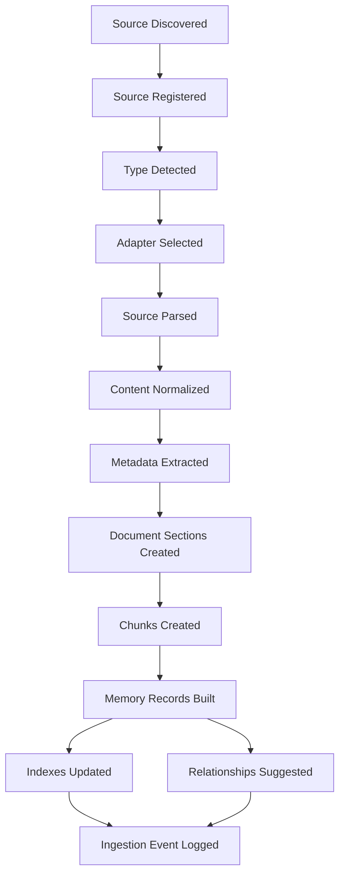
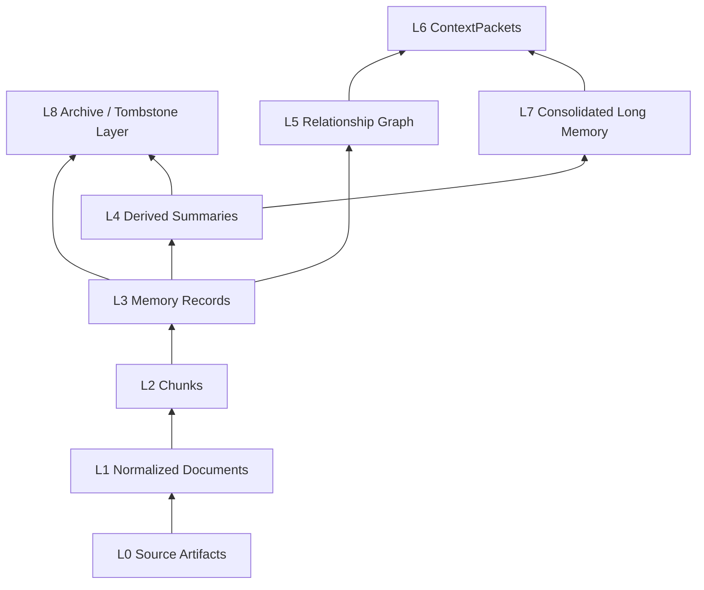
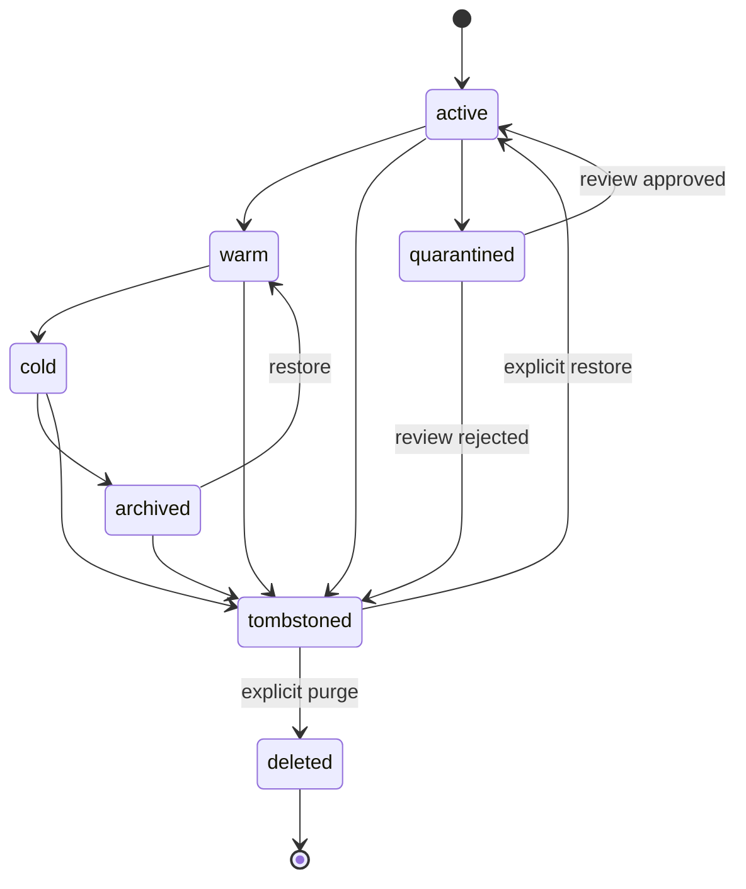
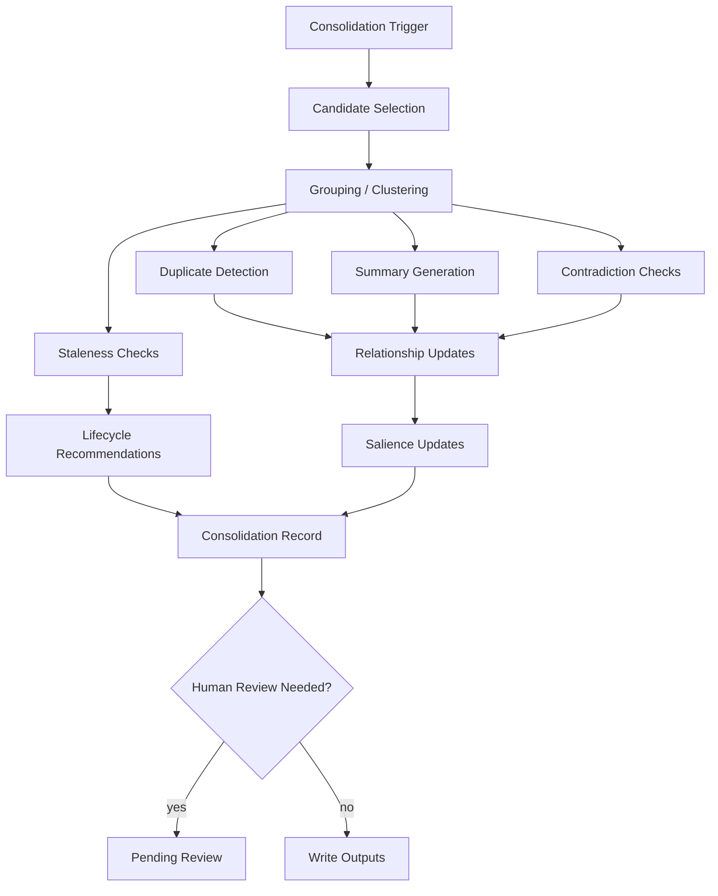
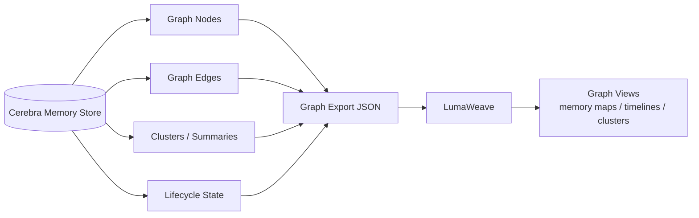
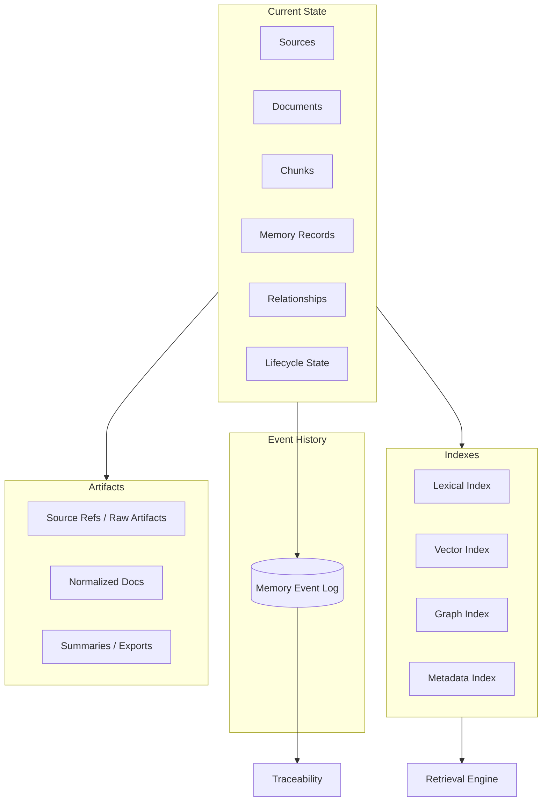

# Cerebra — Mermaid Diagrams

## 1. Cerebra System Architecture

```mermaid
flowchart LR
  sources[Source Bank<br/>files / docs / code / exports] --> registry[Source Registry]
  registry --> router[Ingestion Router]
  router --> adapters[Parser Adapters]
  adapters --> normalize[Normalization Layer]
  normalize --> chunker[Chunker]
  chunker --> records[Memory Record Builder]

  records --> store[(Memory Store<br/>SQLite + artifacts)]
  records --> lexical[(Lexical Index)]
  records --> vector[(Vector Index)]
  records --> graph[(Graph Store)]

  lexical --> retrieval[Retrieval Engine]
  vector --> retrieval
  graph --> retrieval
  store --> retrieval

  retrieval --> context[ContextPacket Builder]
  retrieval --> trace[(Retrieval Trace)]

  store --> consolidation[Consolidation Engine]
  consolidation --> lifecycle[Lifecycle Manager]
  consolidation --> graph
  lifecycle --> store

  graph --> export[Graph Exporter]
  export --> luma[LumaWeave]

  context --> agents[Agents / Tools]
```

---

## 2. Source Ingestion Pipeline



---

## 3. Memory Layer Stack



---

## 4. Hybrid Retrieval Flow

```mermaid
flowchart LR
  query[Query / Task] --> planner[Query Planner]
  planner --> lexical[Lexical Retrieval]
  planner --> vector[Vector Retrieval]
  planner --> metadata[Metadata Filters]

  lexical --> fusion[Hybrid Fusion]
  vector --> fusion
  metadata --> fusion

  fusion --> graph[Graph Expansion]
  graph --> summaries[Summary / Community Retrieval]
  summaries --> salience[Salience Scoring]
  salience --> rerank[Reranking]
  rerank --> budget[Context Budget Allocation]
  budget --> packet[ContextPacket]
  budget --> trace[(Retrieval Trace)]
```

---

## 5. ContextPacket Assembly Flow

```mermaid
flowchart TD
  task[Task / Agent Need] --> plan[Retrieval Plan]
  plan --> candidates[Candidate Memories]
  candidates --> score[Score + Rerank]
  score --> budget[Token Budget Allocation]
  budget --> selected[Selected Memory]
  budget --> summaries[Source Summaries]
  budget --> graph[Graph Context]
  budget --> uncertain[Uncertainties]
  budget --> excluded[Excluded Candidates]

  selected --> packet[ContextPacket]
  summaries --> packet
  graph --> packet
  uncertain --> packet
  excluded --> packet
  packet --> render[Plain Text + JSON Rendering]
  packet --> store[(Stored Packet + Trace)]
```

---

## 6. Memory Lifecycle State Machine



---

## 7. Consolidation Engine Flow



---

## 8. Graph Export / LumaWeave Bridge



---

## 9. State Governance Map



---

## 10. Salience Scoring Components

```mermaid
flowchart LR
  semantic[Semantic Similarity] --> salience[Salience Score]
  lexical[Lexical Match] --> salience
  project[Project Relevance] --> salience
  authority[Source Authority] --> salience
  recency[Recency] --> salience
  access[Access Frequency] --> salience
  pin[User Pin] --> salience
  graph[Relationship Centrality] --> salience
  confidence[Confidence] --> salience
  lifecycle[Lifecycle State] --> salience
  task[Task Relevance] --> salience
  penalties[Contradiction / Staleness / Sensitivity Penalties] --> salience

  salience --> ranking[Retrieval Ranking]
  salience --> context[ContextPacket Selection]
```
